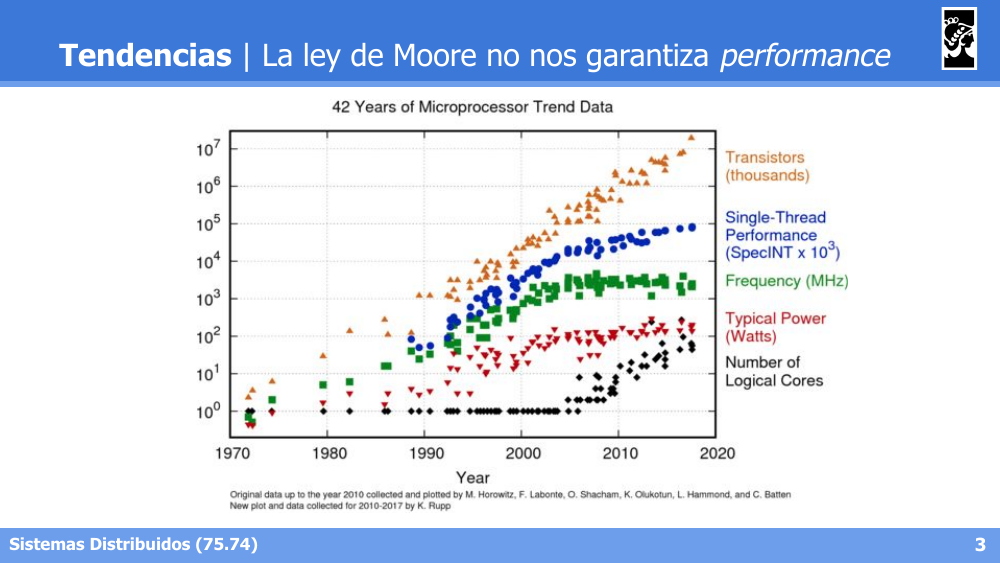
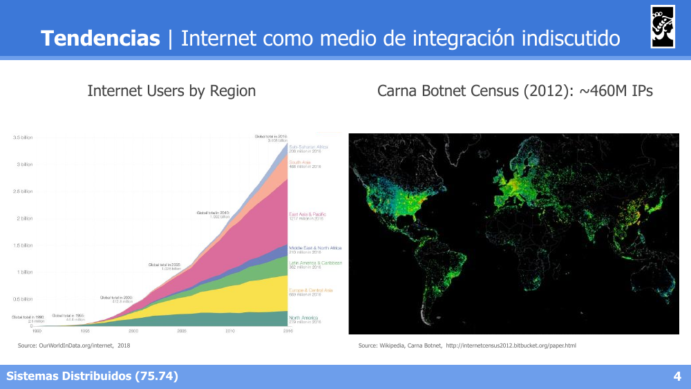
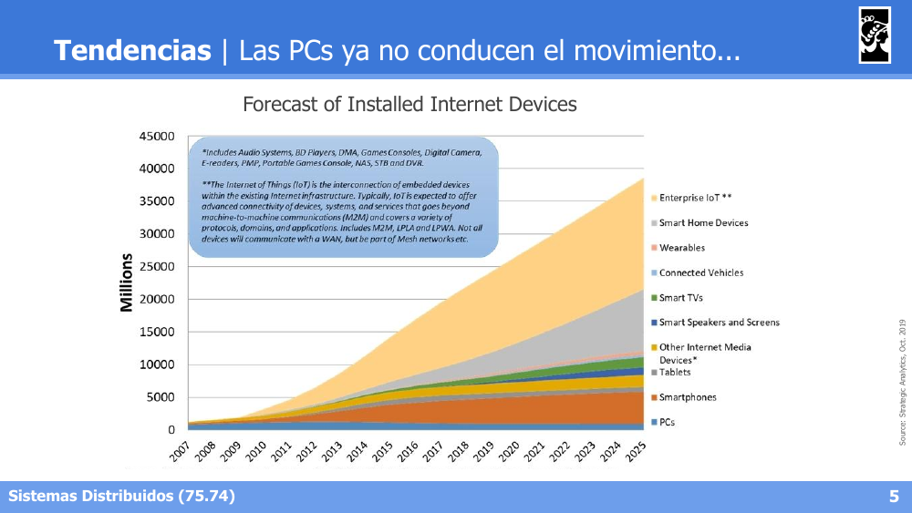
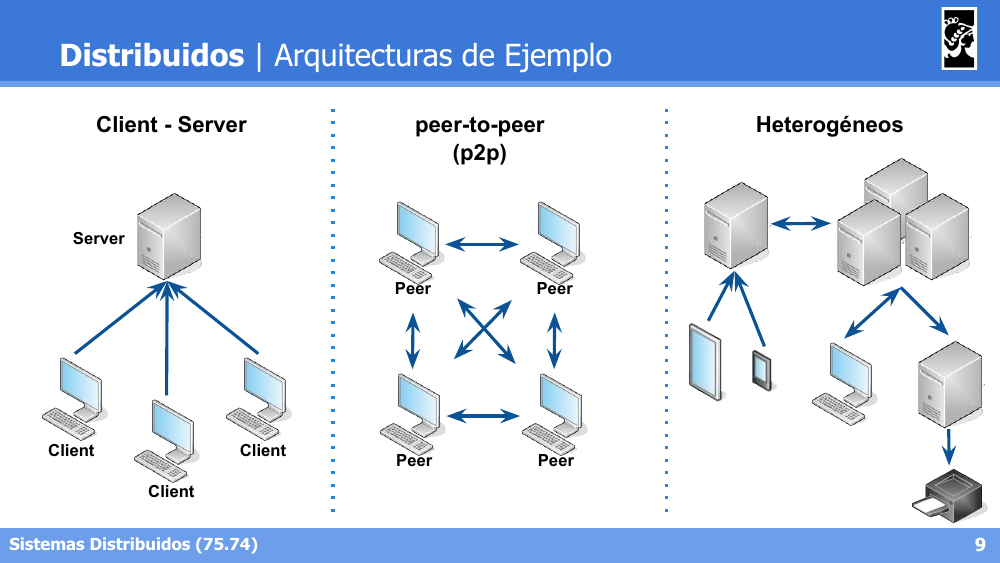
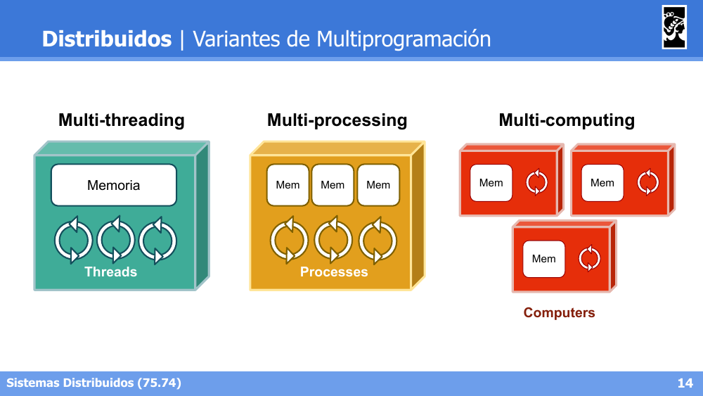
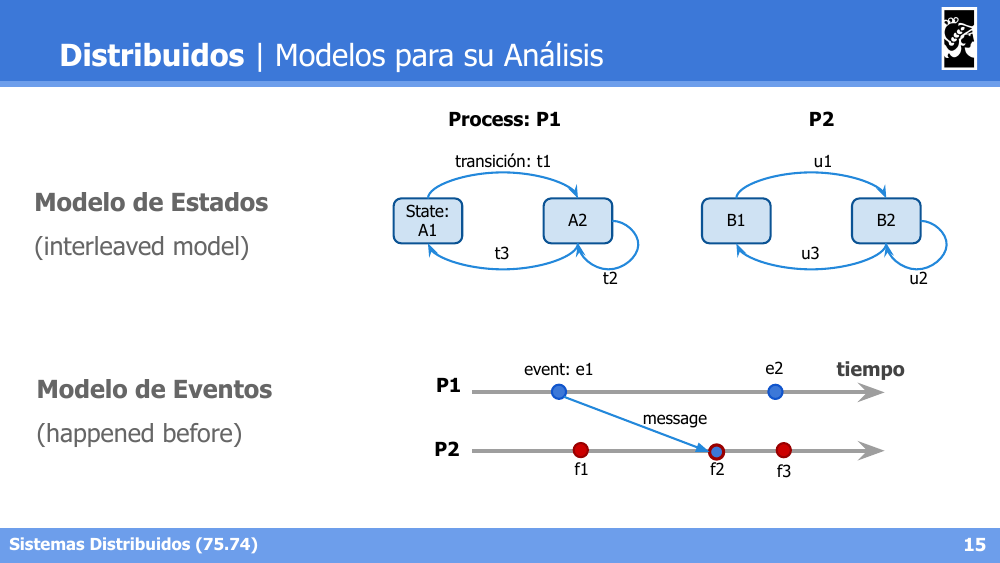
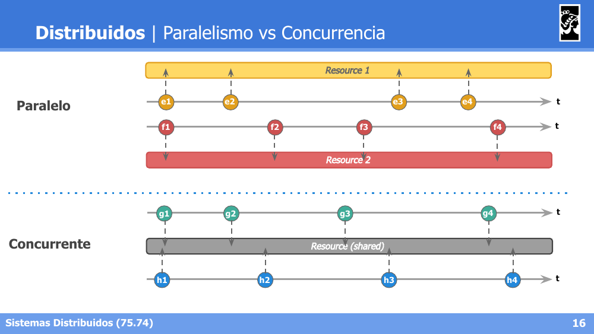
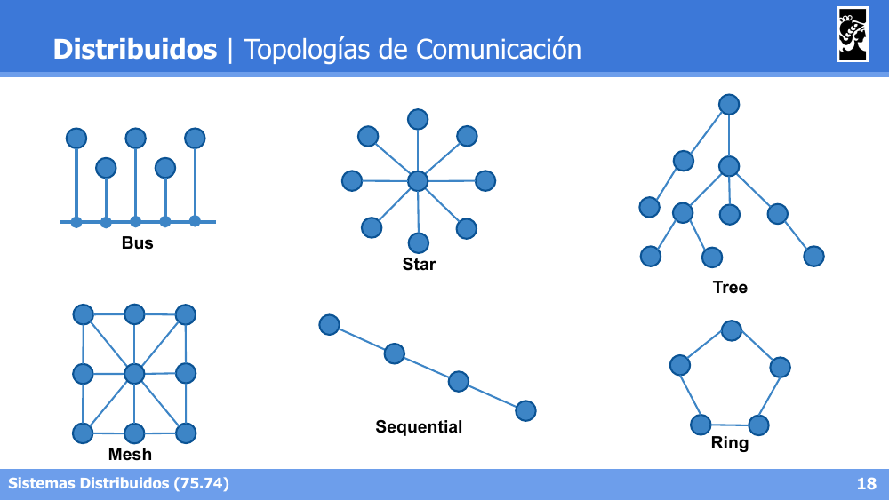
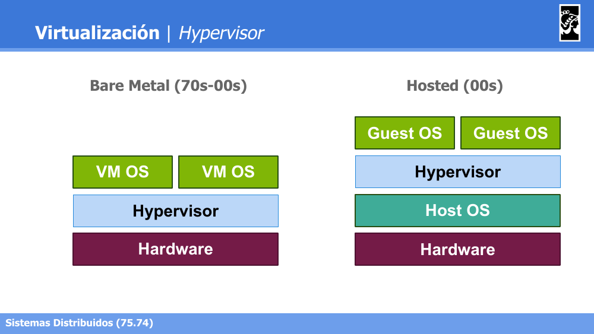

# Sistemas Distribuidos I (75.74) — Clase 01: Introducción a Sistemas Distribuidos

## 1. Tendencias de Hardware y Software

- **La Ley de Moore ya no garantiza performance**: el número de transistores sigue creciendo, pero la frecuencia y el rendimiento por hilo se estancaron desde mediados de los 2000. Por eso se recurre a más núcleos (paralelismo) en vez de procesadores más rápidos.

  

- **Internet como medio de integración indiscutido**: crecimiento exponencial de usuarios de Internet por región y de dispositivos conectados (ej. censo de la botnet Carna, 2012, ~460M de IPs).

  

- **Las PCs ya no conducen el movimiento**: el crecimiento de dispositivos conectados está dominado por smartphones, IoT, wearables, smart home, etc., no por las PCs tradicionales.

  

### Respuesta a las nuevas necesidades

Los sistemas distribuidos cobran relevancia por el crecimiento de la integración e interdependencia entre sistemas, los volúmenes de datos, las capacidades de cómputo, el paralelismo y la virtualización. Áreas donde están presentes:

- Big Data
- Data Analytics
- Scalable Architectures
- Elastic Architectures
- Machine Learning
- Internet of Things (IoT)
- Wearables
- High Performance Computing

### Arquitecturas de ejemplo

- **Client-Server**: un servidor central atiende a múltiples clientes.
- **Peer-to-peer (p2p)**: todos los nodos (peers) tienen el mismo rol y se comunican entre sí.
- **Heterogéneos**: combinación de distintos tipos de nodos y roles (servidores, clientes, dispositivos móviles, impresoras, etc.).

---

## 2. Definición de Sistemas Distribuidos

Tres definiciones clásicas:

> "Colección de computadoras independientes que el usuario ve como un solo sistema coherente" — **Tanenbaum**

> "Es un sistema de computadoras interconectadas por una red que se comunican y coordinan sus acciones intercambiando mensajes" — **Coulouris**

> "Aquel en el que el fallo de un computador que ni siquiera sabés que existe, puede dejar tu propio computador inutilizable" — **Lamport**

### Parámetros de diseño

- **Transparencia**
- **Acceso a recursos compartidos**
- **Sistemas distribuidos abiertos**: interfaces, interoperabilidad, portabilidad (*Interfaces, Interoperability, Portability*)
- **Escalabilidad**
- **Tolerancia a fallos**: disponibilidad, confiabilidad, seguridad, mantenibilidad (*Availability, Reliability, Safety, Maintainability*)

### Variantes de multiprogramación

- **Multi-threading**: múltiples hilos comparten una misma memoria.
- **Multi-processing**: múltiples procesos, cada uno con su propia memoria, dentro de la misma máquina.
- **Multi-computing**: múltiples computadoras, cada una con su propia memoria, interconectadas (esto es lo propio de los sistemas distribuidos).

### Modelos para el análisis

- **Modelo de Estados** (*interleaved model*): cada proceso transita entre estados mediante transiciones (ej. P1 pasa de A1 a A2 mediante t1).
- **Modelo de Eventos** (*happened before*): se analiza la relación causal entre eventos de distintos procesos en el tiempo (ej. un evento e1 en P1 envía un mensaje que provoca el evento f2 en P2).

### Paralelismo vs Concurrencia

- **Paralelo**: cada proceso accede a su propio recurso de forma simultánea e independiente (Resource 1 para P1, Resource 2 para P2).
- **Concurrente**: varios procesos compiten/comparten el acceso al **mismo** recurso a lo largo del tiempo (Resource shared).

---

## 3. Características de Sistemas Distribuidos

### Topologías de comunicación

- **Bus**: todos los nodos comparten un único canal lineal.
- **Star**: un nodo central conecta a todos los demás.
- **Tree**: estructura jerárquica.
- **Mesh**: cada nodo conectado con varios (o todos) los demás.
- **Sequential**: nodos conectados en cadena.
- **Ring**: nodos conectados en anillo cerrado.

### Centralizados vs Distribuidos

| Sist. Centralizados | Sist. Distribuidos |
|---|---|
| Sin conexiones, o con conexiones pero sin trabajo colaborativo ni objetivo común (tiempo compartido, "terminales de conexión") | Componentes conectados realizando trabajo colaborativo en busca de un objetivo común |
| Muy difíciles de escalar (CPUs, Memoria, HD) | Escalan distribuyendo trabajo y recursos (nodos, regiones, canales) |

**Ventajas de centralizar:**
- **Control**: lógica simple, efectiva y eficiente.
- **Homogeneidad**: fuerza estándares de software y hardware.
- **Consistencia**: permite políticas fuertes de consistencia y monitoreo del estado global.
- **Seguridad**: menor "superficie de ataque".

**Ventajas de distribuir:**
- **Disponibilidad**: el sistema general sigue funcionando ante fallos aislados.
- **Escalabilidad**: mejor adaptación a nuevas escalas.
- **Reducción de latencia**: favorece la localidad de los recursos.
- **Colaboración**: interacciones orgánicas y naturales entre sistemas.
- **Movilidad**: no atados al alcance de un único computador.
- **Costo**: componentes más simples, subsistemas delegados a terceros.

### Pensamiento Distribuido

- **Centralizar**: concentrar la autoridad en el nivel más alto de la jerarquía.
- **Descentralizar**: transferir la toma de decisiones a eslabones inferiores de la organización.
- **Distribuir**: usar un modelo descentralizado de control de computadoras para coordinar actividades con cierta coherencia.

**Ley de Conway:**

> "Cualquier organización que diseñe un sistema, inevitablemente producirá un diseño cuya estructura será una copia de la estructura de comunicación de la organización." — Conway M., *How do committees invent*, 1968.

- Demostrado empíricamente en relevamientos de arquitecturas de software corporativo.
- Corolario: diseñamos de acuerdo a lo que conocemos y a cómo trabajamos en el día a día.
- No es necesariamente negativo: las personas tienden a encontrar soluciones distribuidas y paralelas eficientes (minimizan costo, energía, tiempo).

---

## 4. Virtualización

- **Necesidad de independencia real de los recursos**: seguridad en el acceso, diferenciación entre instrucciones con y sin privilegios.
- **Hypervisor (Virtual Machine Monitor)**:
  - Manager de VMs.
  - Emulación de capacidades de hardware.
  - Administración de recursos del Host OS hacia los Guest OS.
  - Implementación de mecanismos de seguridad.

### VMs vs Containers

- En el modelo **Hosted**, cada aplicación necesita su propio Guest OS completo (más pesado).
- En el modelo **Containers (10s)**, las apps comparten el mismo Host OS (Linux) a través de un Container Engine, siendo mucho más livianos que las VMs.

### Docker

- Desarrollado en **Golang**, primera versión estable en 2013.
- Se apoya fuertemente en features del kernel del OS y del Hypervisor:
  - **Linux**: cgroups, namespaces, union mount.
  - **Mac**: soportado con HyperKit.
  - **Windows**: soportado con Hyper-V.
- Rápida adopción en la industria (Kubernetes, AWS, GCP, Azure soportan Docker).

**Soporte de OS:**
- **Namespaces**: aislamiento de recursos — NET (network stack), PID (procesos), MNT (mount), IPC (semáforos, shared memory), USER (user/group ids).
- **Cgroups**: seguridad y administración de recursos.
- **Union Mount**: múltiples directorios vistos como uno solo.

**Docker Engine:**
- **Docker Daemon**: maneja todos los recursos (images, containers, volumes, network, etc.), extensible con plugins.
- **Docker REST API**: flexible, fácil de crear nuevos clientes.
- **Docker CLI**: accede a la REST API a través de un Unix socket.

**Conceptos básicos:**
- **Dockerfile**: secuencia de comandos que generan una Image (instala dependencias/librerías; cada comando agrega un nuevo *layer*; agrega archivos a utilizar).
- **Image**: bloque estático construido a partir de un Dockerfile. Las distros de Linux proveen *base images* (Ubuntu, Debian, CentOS, Alpine, etc.) que se pueden reutilizar.
- **Container**: ejecución de comandos dentro de una Image. Comparte el kernel con el Host OS. Al terminar el comando, el container deja de existir. **No** provee persistencia por sí mismo.
- **Volume**: directorio compartido entre el Host OS y el container, necesario para dar persistencia a las aplicaciones.

### Docker Compose

- Incorporado al cliente de Docker, desarrollado originalmente en Python.
- Administra múltiples *containers*:
  - DNS resolution.
  - Containers en la misma red por defecto.
- Configuración a través de archivos **YAML**, intuitiva y con la mayoría de los comandos de Docker disponibles.

