# Sistemas Distribuidos I (75.74) — Clase 02: Multitasking y Comunicaciones

## 1. Conceptos

### Modelos de Multiprogramación

Repaso de la clase anterior: **Multi-threading**, **Multi-processing** y **Multi-computing**.

| Modelo | Recursos compartidos | Sincronización | Características clave |
|---|---|---|---|
| **Multi-threading** (threads dentro de un proceso, comparten memoria) | Heap, Data Segment, File Descriptors, Code Segment (read-only) | Soporte de threading del SO (pthread-mutex, etc.), soporte del *runtime* (threads Java, .Net, etc.), IPC | Sencillo compartir información; **alto acoplamiento**; escasa estabilidad (1 thread defectuoso afecta todo el sistema); escalabilidad muy limitada |
| **Multi-processing** (procesos dentro de la misma máquina) | Code Segment (read-only), File Descriptors (abiertos pre-fork) | IPCs: Signals, Shared Memory, Sockets, Pipes/Fifos, Semáforos, Queues, Locks | No es trivial compartir información; componentes separados y simples; más escalable y estable que multi-threading; sin tolerancia a fallos de HW/SO |
| **Multi-computing** (computadoras distintas) | Ninguno | Mensajes Ad-Hoc entre computadoras (hay que implementar mecanismos de sincronización) | Problemas de ancho de banda, latencia y pérdida de mensajes; comunicación entre procesos compleja y central al diseño; alta escalabilidad y tolerancia a fallos |

### Propiedades de Programas Concurrentes

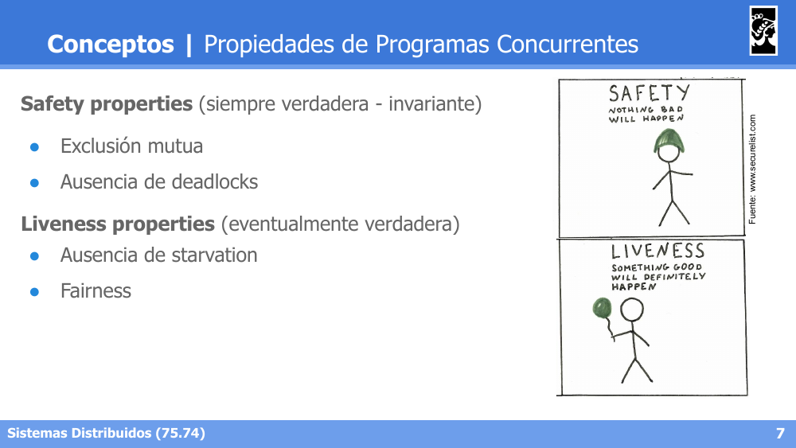

- **Safety properties** (siempre verdaderas — invariantes): **exclusión mutua**, **ausencia de deadlocks**. "Nada malo va a pasar".
- **Liveness properties** (eventualmente verdaderas): **ausencia de starvation**, **fairness**. "Algo bueno va a pasar eventualmente".
- Asegurar el estado *safety* de las propiedades de un sistema es un pilar de la teoría de concurrencia.

**Dos enfoques para lograr estas propiedades:**

| Basada en Algoritmos | Basada en Abstracciones |
|---|---|
| Sin abstracciones especiales. Condiciones lógicas simples para asegurar el cumplimiento de una *Critical Section* | Basada en abstracciones provistas por el SO. Permite construir mecanismos compuestos por combinaciones de las mismas |

**Basados en Algoritmos:**
- **Busy-Waiting**: responsable de la mayoría de los problemas de performance en sistemas concurrentes.
- **Spin-lock**: caso más simple de Busy-Wait (`while (flag);`).
- **Algoritmos de espera**: Dekker, Lamport (del panadero), Peterson, etc.

Ejemplo — **Algoritmo de Peterson** (dos procesos):
```c
bool flag[2] = {false, false};
int turn;

P0:     flag[0] = true;             P1:     flag[1] = true;
        turn = 1;                           turn = 0;
        while (flag[1] && turn == 1);        while (flag[0] && turn == 0);
        /* critical section code */          /* critical section code */
        flag[0] = false;                    flag[1] = false;
```

**Basados en Abstracciones:**
- **Operaciones atómicas**: mecanismos provistos por un lenguaje para actualizar variables/objetos sin usar mecanismos de sincronización.
  - Contadores atómicos de tipos POD (int, char, double, etc.)
  - **CAS (Compare and Swap)**: operación por excelencia para actualizar contenedores de forma segura en ambientes multithreading.

```
CAS (Pseudocódigo):
function cas(p: *int, old: int, new: int) returns bool {
    if *p ≠ old { return false }
    *p ← new
    return true
}
```

```go
// Ejemplo: CAS de objetos en Golang
package atomic
func CompareAndSwapUint32(addr *uint32, old uint32, new uint32) (swapped bool)
```

---

## 2. Mecanismos de Sincronización

### Semáforos

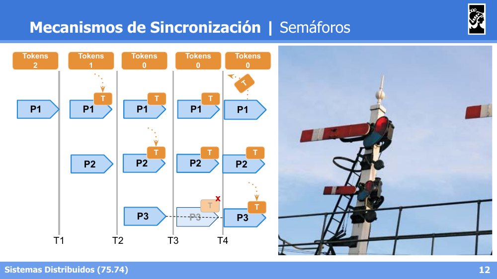

- Variable entera utilizada para acceder a **recursos compartidos** (ej. Shared Memory). Queda definida por los valores que puede tomar (ej. S = {0,1,2}).
- Operaciones válidas:
  - **signal (P)**: incrementa el valor de S.
  - **wait (V)**: decrementa el valor de S.
- **Mutex** (S = {0,1}): caso particular usado para acceder a **secciones críticas**.

### Monitores

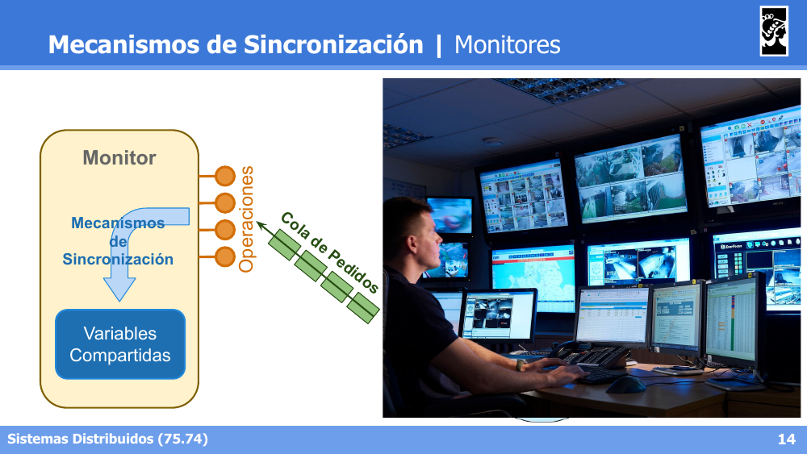

Un monitor encapsula variables compartidas y expone operaciones que pasan por mecanismos de sincronización internos, atendiendo a una cola de pedidos.

```
monitor class Account:
  private int balance = 0
  public method bool withdraw(int amount):
    if balance < amount:
      return false
    else:
      balance = balance - amount
      return true

  public method deposit(int amount):
    balance := balance + amount
```

**Condition Variables** (ejemplo práctico de un monitor): el mutex debe adquirirse antes de operar.
- **wait**: bloquea al proceso hasta que otro proceso lo despierte.
- **notify / notify_all**: despierta a *un proceso* / *todos los procesos* que esperan que se cumpla una condición.

```
Proceso N°1                          Proceso N°2
cv.acquire()                         cv.acquire()
while not an_item_is_available():    make_an_item_available()
    cv.wait()                        cv.notify() / cv.notify_all()
get_an_available_item()              cv.release()
cv.release()
```

### Barrera

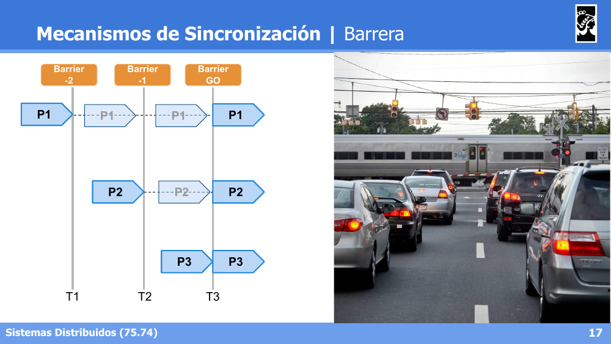

Mecanismo que detiene a cada proceso/thread hasta que todos llegan a un mismo punto de sincronización (GO), recién ahí continúan en conjunto.

**Ejercicio típico**: N threads/procesos deben ejecutar M tareas. Cada thread/proceso ejecuta su tarea y espera a que sus pares terminen de hacer lo mismo. Cuando todos terminaron una ronda, proceden a la siguiente.

### Rendezvous


Sincronización mediante **paso de mensajes** (*Message Passing*) entre dos procesos que se "encuentran" en un punto determinado, como el pase de posta en una carrera de relevos.

**Ejercicio típico**: N threads/procesos deben generar M mensajes, cada uno espera a que sus pares terminen una ronda antes de seguir con la próxima. Se puede resolver utilizando la abstracción **BlockingQueue**.

---

## 3. IPCs (Inter-Process Communication)

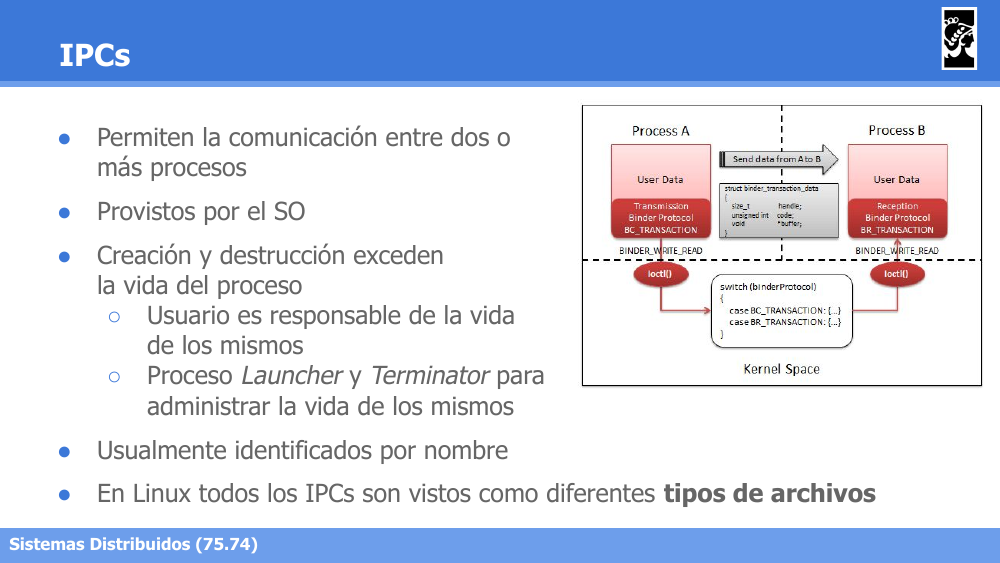

- Permiten la comunicación entre dos o más procesos.
- Provistos por el **Sistema Operativo**.
- Su creación y destrucción exceden la vida del proceso:
  - El usuario es responsable de la vida de los mismos.
  - Se suele usar un proceso *Launcher* y *Terminator* para administrarlos.
- Usualmente identificados por nombre.
- En **Linux**, todos los IPCs son vistos como diferentes **tipos de archivos**.

### Comparación: Mecanismo de sincronización vs IPC

| Mecanismo de sincronización | IPC equivalente/relacionado |
|---|---|
| Semáforo | Semáforo |
| (sin nombre directo) | Shared Memory |
| Monitor | File Lock |
| Barrera | (sin nombre directo) |
| Rendezvous | Signal, Queue, Pipes/Fifos, Sockets |

### Signals

- Existen 31 tipos distintos (`kill -l`).
- Cada proceso decide cuáles handlear (ej. libcURL y SIGALRM).
- **SIGSTOP** y **SIGKILL** son la excepción (no se pueden handlear).
- Ejemplos de signals estándar:
  - **SIGINT / SIGTERM**: *Graceful Quit*.
  - **SIGSEGV**: problemas en la memoria.
  - **SIGABRT**: code assertions.
- Propagación de signals en threads (configuración de máscaras).

### Shared Memory

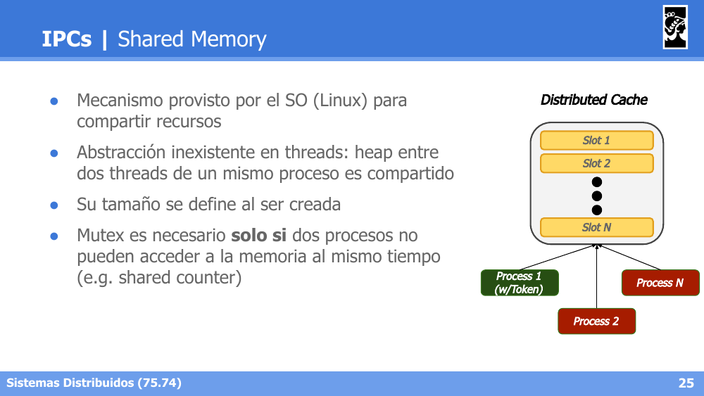

- Mecanismo provisto por el SO (Linux) para compartir recursos.
- Abstracción inexistente en threads: el heap entre dos threads de un mismo proceso ya es compartido naturalmente.
- Su tamaño se define al ser creada.
- Se necesita **mutex** solo si dos procesos no pueden acceder a la memoria al mismo tiempo (ej. shared counter).

### File Locks

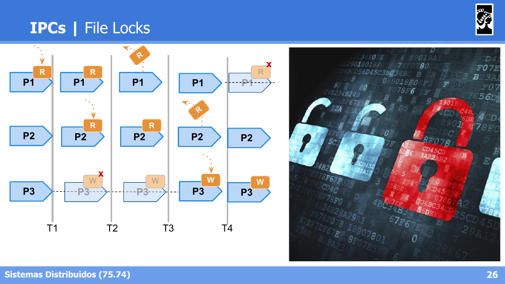

- Control de acceso a un file descriptor: `int flock(int fd, int operation);`
- Existen dos tipos:
  - **Shared lock (R)**: read-only lock. Se permiten múltiples read locks simultáneos.
  - **Exclusive lock (W)**: RW lock. Solo un exclusive lock a la vez por archivo.

### Pipes y Fifos

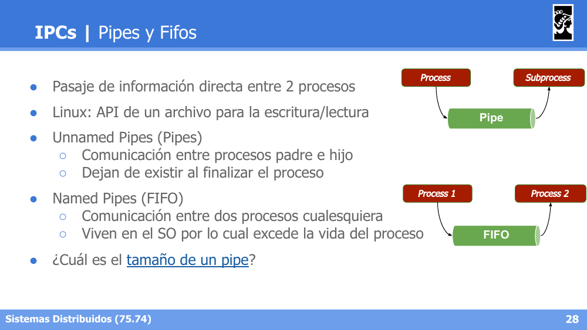

- Pasaje de información directa entre 2 procesos.
- En Linux: API de un archivo para escritura/lectura.
- **Unnamed Pipes (Pipes)**: comunicación entre procesos padre e hijo, dejan de existir al finalizar el proceso.
- **Named Pipes (FIFO)**: comunicación entre dos procesos cualesquiera, viven en el SO por lo cual exceden la vida del proceso.

### Message Queues (System V)

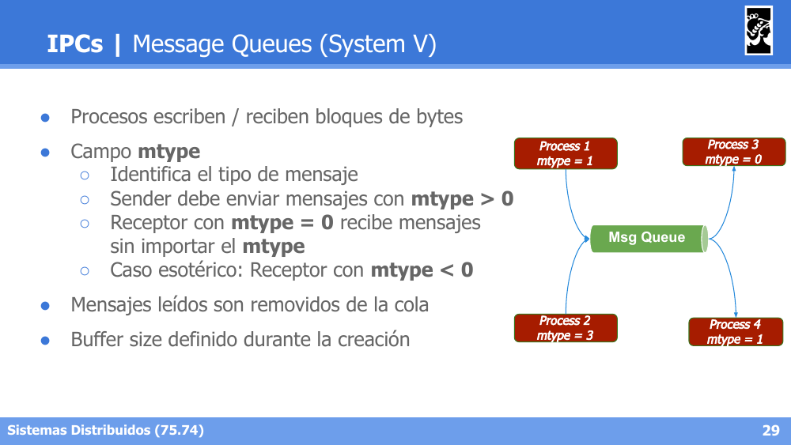

- Los procesos escriben/reciben bloques de bytes.
- Campo **mtype**:
  - Identifica el tipo de mensaje.
  - El *sender* debe enviar mensajes con `mtype > 0`.
  - Un receptor con `mtype = 0` recibe mensajes sin importar el `mtype`.
  - Caso esotérico: receptor con `mtype < 0`.
- Los mensajes leídos son removidos de la cola.
- El tamaño del buffer se define durante la creación.

### Sockets

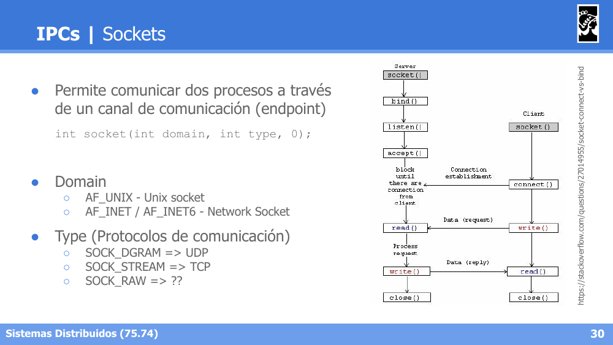

- Permiten comunicar dos procesos a través de un canal de comunicación (*endpoint*): `int socket(int domain, int type, 0);`
- **Domain**:
  - `AF_UNIX`: Unix socket.
  - `AF_INET` / `AF_INET6`: Network socket.
- **Type** (protocolos de comunicación):
  - `SOCK_DGRAM` → UDP
  - `SOCK_STREAM` → TCP
  - `SOCK_RAW` → acceso de bajo nivel

**Ejercicio Rendezvous con IPCs**: N threads/procesos deben generar M mensajes, sincronizándose por ronda, resuelto utilizando **Shared Memory / Semaphores** o **Message Queues**.

---

## 4. Problemas Clásicos de Concurrencia

### Productor-Consumidor

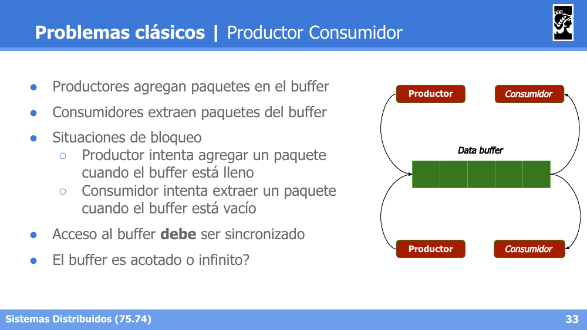

- Los **productores** agregan paquetes en el buffer; los **consumidores** extraen paquetes del buffer.
- Situaciones de bloqueo:
  - El productor intenta agregar un paquete cuando el buffer está **lleno**.
  - El consumidor intenta extraer un paquete cuando el buffer está **vacío**.
- El acceso al buffer **debe** ser sincronizado.
- Pregunta de diseño clave: ¿el buffer es acotado o infinito?

### Lectores-Escritores

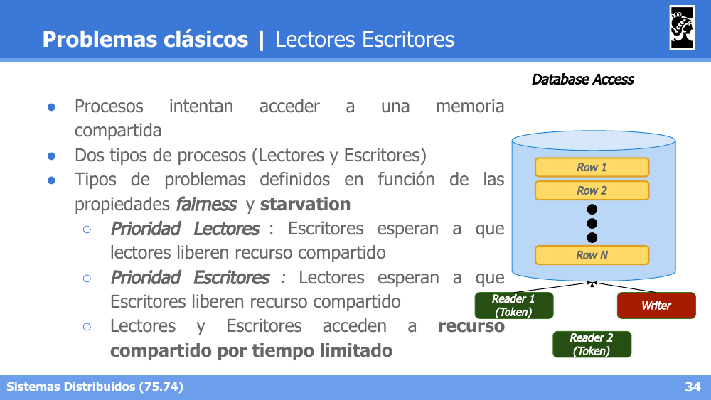

- Procesos intentan acceder a una memoria compartida (ej. acceso a una base de datos).
- Dos tipos de procesos: **Lectores** y **Escritores**.
- Tipos de problema según *fairness* y *starvation*:
  - **Prioridad Lectores**: los escritores esperan a que los lectores liberen el recurso compartido.
  - **Prioridad Escritores**: los lectores esperan a que los escritores liberen el recurso compartido.
  - Lectores y escritores acceden al **recurso compartido por tiempo limitado**.

### Otros problemas clásicos mencionados

- **Barbero dormilón**
- **Filósofos comensales**
- **Fumadores de cigarrillos**

---

## 5. Comunicaciones

### Modelo TCP/IP

| Capa | Función |
|---|---|
| Application | Aplicaciones de usuario, representación de datos |
| Transport | Comunicación punto a punto |
| Internet | Lógica de transmisión de datos sobre la red |
| Network Access | Transferencia física confiable, libre de errores |

### Modelo OSI

| Capa | Función |
|---|---|
| Application | Aplicaciones de usuario |
| Presentation | Representación de datos |
| Session | Manejo de conexiones y sesión |
| Transport | Transferencia confiable, libre de errores |
| Network | Establecer, mantener y terminar conexiones. Transmisión |
| Data Link | Sincronización, control de errores y envío de frames |
| Physical | Manejo del medio físico para transmitir bits |

**Relación entre ambos modelos**: la capa *Application* de TCP/IP engloba las capas Application + Presentation + Session de OSI; el resto de las capas son prácticamente equivalentes (Transport-Transport, Internet-Network, Network Access-Data Link+Physical).

### Estructura de Paquetes — IP

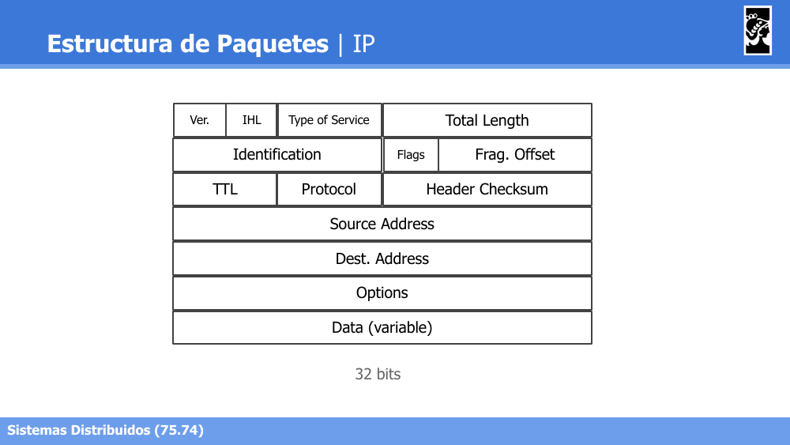

Campos principales: Version, IHL, Type of Service, Total Length, Identification, Flags, Fragment Offset, TTL, Protocol, Header Checksum, Source/Dest Address, Options, Data.

### Estructura de Paquetes — TCP y UDP

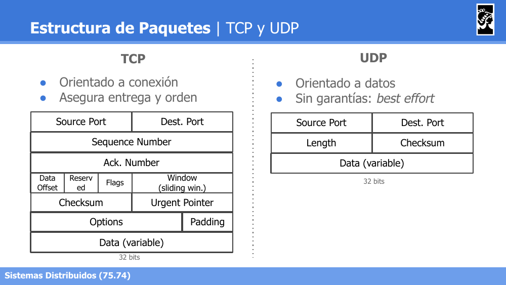

| TCP | UDP |
|---|---|
| Orientado a conexión | Orientado a datos |
| Asegura entrega y orden | Sin garantías (*best effort*) |
| Header complejo: Sequence Number, Ack Number, Flags, Window (sliding window), Checksum, Urgent Pointer, Options | Header simple: Length, Checksum |

### Sockets — Primitivas

```
socket(domain: int, type: int, protocol: int): int
bind(fd: int, addr: struct sockaddr*, addrlen: int): int
listen(fd: int, backlog: int): int
accept(fd: int, addr: struct sockaddr*, addrlen: int): int
connect(fd: int, addr: struct sockaddr*, addrlen: int): int
send(fd: int, buf: void*, buflen: int, flags: int): int
receive(fd: int, buf: void*, buflen: int, flags: int): int
close(fd: int): int
```

### Sockets — Flujo de uso TCP

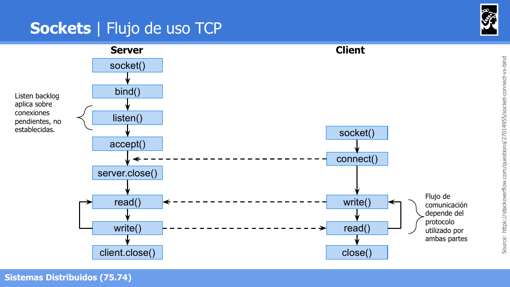

Server: `socket() → bind() → listen() → accept() → read()/write() → close()`
Client: `socket() → connect() → write()/read() → close()`

*El "listen backlog" aplica sobre conexiones pendientes, no establecidas. El flujo de comunicación (quién escribe/lee primero) depende del protocolo utilizado por ambas partes.*

### Sockets — Flujo de uso UDP

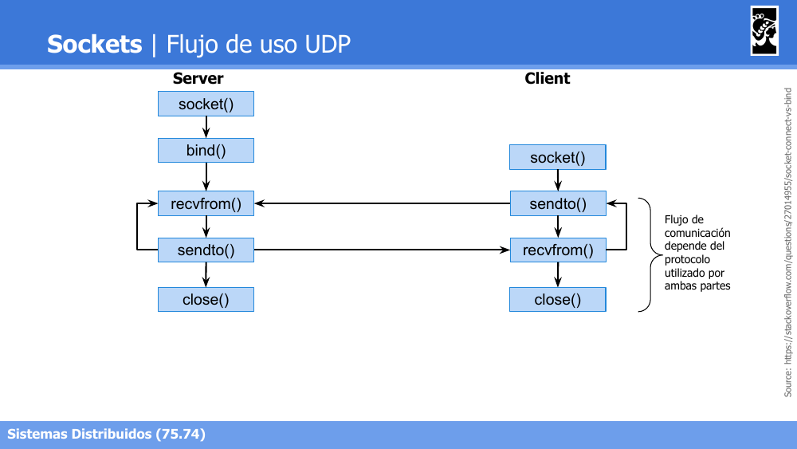

Server: `socket() → bind() → recvfrom()/sendto() → close()`
Client: `socket() → sendto()/recvfrom() → close()`

### Mensajes Sincrónicos vs Asincrónicos

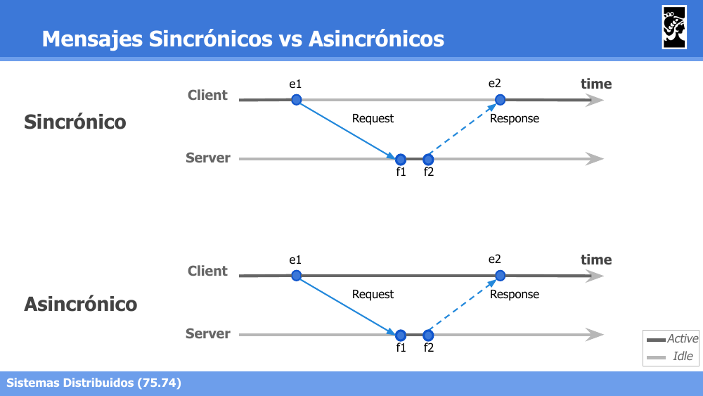

- **Sincrónico**: el cliente queda **bloqueado** (Active) esperando la respuesta del servidor entre el *Request* y la *Response*.
- **Asincrónico**: el cliente queda **libre** (Idle) tras enviar el *Request*, y retoma actividad cuando llega la *Response*.

### Congestión de Red

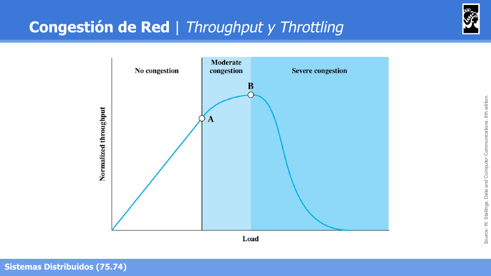

- A medida que aumenta la carga (*load*), el throughput normalizado crece hasta un punto de **congestión moderada**; más allá de cierto punto (B) entra en **congestión severa** y el throughput cae drásticamente.

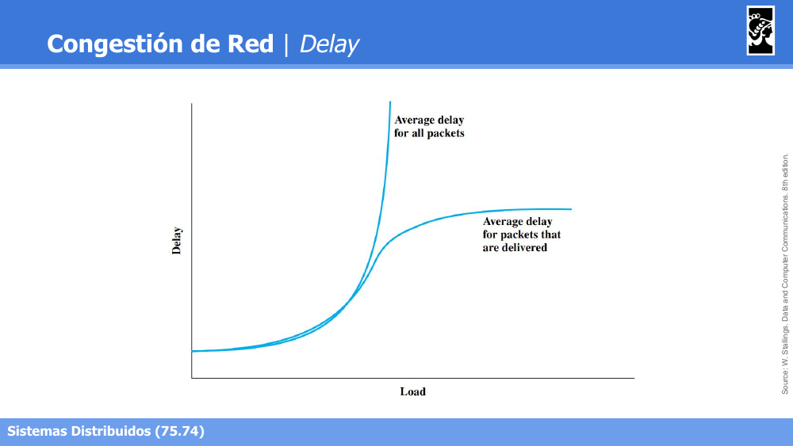

- El *delay* promedio de **todos los paquetes** crece de forma muy pronunciada con la carga.
- El *delay* promedio de los **paquetes que efectivamente se entregan** crece de forma más moderada y se estabiliza.

