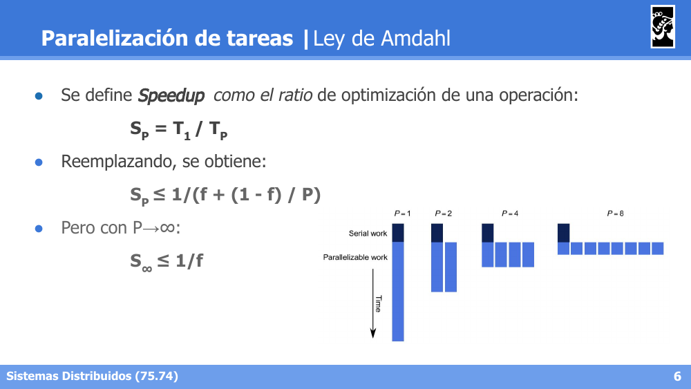
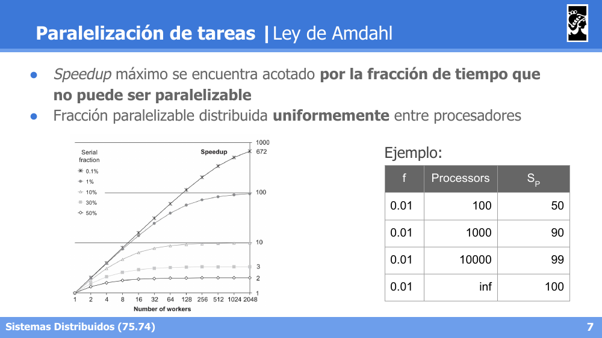
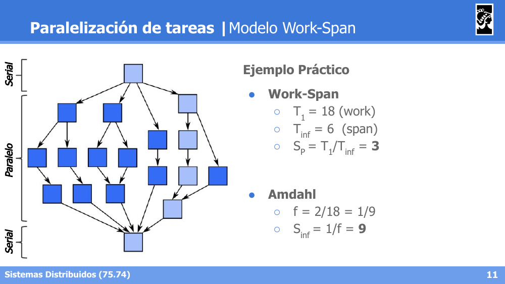
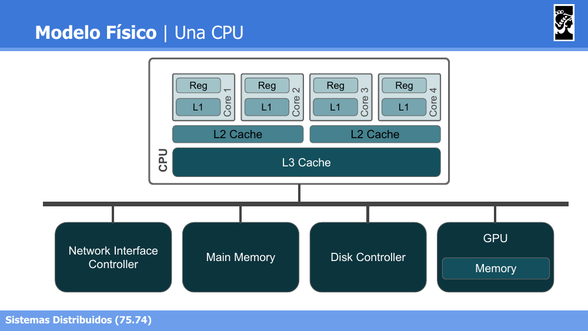
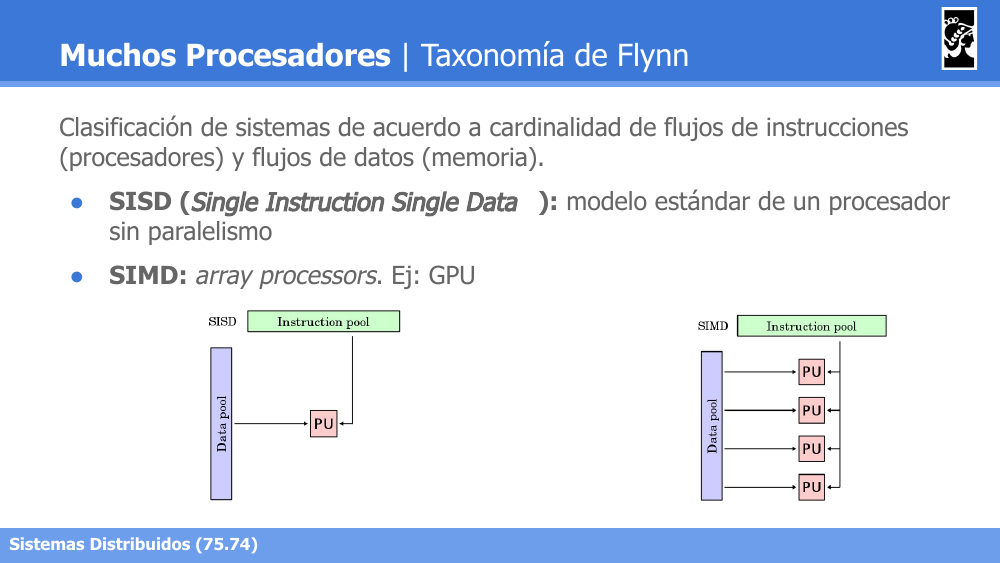
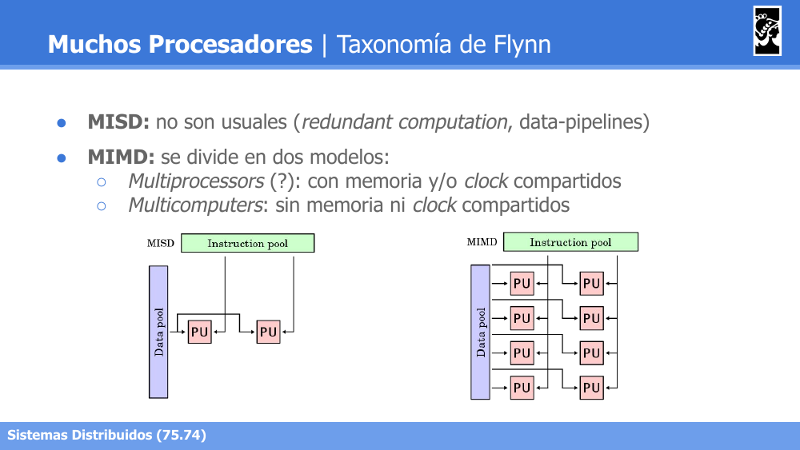

# Sistemas Distribuidos I (75.74) — Clase 03: Paralelización, Multiprocessors y Nombres

## 1. Paralelización de Tareas

### Introducción

- **Objetivos de paralelizar:**
  - Reducir el tiempo de cómputo de una tarea (**latencia**).
  - Incrementar la cantidad de tareas que se pueden realizar en paralelo (**throughput**).
  - Reducir la energía consumida al realizar todas las tareas.
- **Camino crítico**: máxima longitud de tareas secuenciales a computar. Define el mejor rendimiento que se puede obtener al realizar un conjunto de tareas.

### Ley de Amdahl

> "El esfuerzo dedicado a lograr altas tasas de procesamiento paralelo se desperdicia a menos que vaya acompañado de logros en las tasas de procesamiento secuencial de magnitud muy similar..."

- Corolario: todo trabajo de cómputo se divide en una fracción **Secuencial** (W_ser = f) y una **Paralela** (W_par = 1 - f), donde **T = W_ser + W_par**.
- Usando P unidades de cómputo, el tiempo total se reduce: **T_P = W_ser + W_par / P**.
- Se define el **Speedup** como el ratio de optimización: **S_P = T_1 / T_P**.
  - Reemplazando: **S_P ≤ 1 / (f + (1 - f) / P)**.
  - Con P → ∞: **S_∞ ≤ 1 / f**.



- El **Speedup máximo** está acotado **por la fracción de tiempo que no puede ser paralelizable**, asumiendo que la fracción paralelizable se distribuye **uniformemente** entre los procesadores.



Ejemplo numérico (f = 0.01):

| f | Processors | S_P |
|---|---|---|
| 0.01 | 100 | 50 |
| 0.01 | 1000 | 90 |
| 0.01 | 10000 | 99 |
| 0.01 | inf | 100 |

### Ley de Gustafson

> "El Speedup debe medirse **escalando el problema** a la cantidad de procesadores, no fijando el tamaño del problema."

- Corolario: aumentar el paralelismo puede permitir modificar el problema original para ejecutar más trabajo.
- Si el problema crece, caben dos alternativas:
  - La parte serial disminuye ⇒ el Speedup aumenta.
  - El paralelismo aumenta ⇒ el Speedup aumenta.

### Modelo Work-Span

- **Características**: modelo más cercano a la realidad para estimar optimizaciones que el de Amdahl. Provee una **cota inferior** y una **cota superior** para el Speedup.
- **Hipótesis**:
  - *Paralelismo Imperfecto*: no todo el trabajo paralelizable se puede ejecutar al mismo tiempo.
  - *Greedy scheduling*: proceso disponible ⇒ tarea ejecutada.
  - Tiempo de acceso a memoria despreciable.
  - Tiempo de comunicación entre procesos despreciable.
  - Posibilidad de analizar la operación/algoritmo en caja blanca.

**Definiciones:**
- **T₁ (work)**: tiempo en ejecutar la operación/algoritmo con 1 solo proceso.
- **T_inf (span)**: tiempo en ejecutar el **camino crítico** de la operación/algoritmo.

| Cota | Speedup | Consideraciones |
|---|---|---|
| Superior | min(P, T₁/T_inf) | Se obtiene P en escenarios de Speedup lineal |
| Inferior | (T₁ - T_inf)/P + T_inf | El trabajo se puede dividir en perfecta e imperfectamente paralelizable |

**Ejemplo práctico** (grafo de dependencias de tareas):



- **Work-Span**: T₁ = 18 (work), T_inf = 6 (span) → S_P = T₁/T_inf = **3**
- **Amdahl**: f = 2/18 = 1/9 → S_inf = 1/f = **9**


El modelo de Amdahl sobreestima el Speedup posible; el modelo Work-Span da una estimación más realista acotada entre `T₁/(T₁/P + T_inf)` (cota inferior) y `min(P, T₁/T_inf)` (cota superior).

### Estrategias de Particionamiento

- **Descomposición Funcional**: dividir el problema en funciones independientes.
  ```
  foo(data) = f(data) + g(data) + h(data)          // 1 proceso máximo
  foo(data) = go f(data) + go g(data) + go h(data)  // 3 procesos máx.
  ```
- **Particionamiento de Datos**: dividir los datos de entrada entre procesos.
  ```
  foo(data) = f(data)                                            // 1 proceso máx.
  foo(data) = go f(data[0:N/P-1]) & ... & go f(data[(P-1)*N/P:N-1])  // P procesos máx.
                                                                  // (sólo si f(x) es particionable)
  ```

### Patrones de Procesamiento

- Basados en algoritmos: no tan abstractos como *patrones de diseño*, no incluyen detalles de implementación, agnósticos a lenguajes de programación.
- Los patrones deben poder incluir otros patrones (*nesting*).
- Son herramientas básicas de trabajo también en *multi-computing*.

Notación: **Task** (cuadrado azul), **Data** (redondeado verde), **Fork** (punto negro), **Join** (círculo amarillo), **Dependency** (flecha).


- **Fork-Join**: un proceso se divide (*fork*) en múltiples tareas paralelas que luego se sincronizan (*join*).
- **Pack / Split**: reorganización de datos filtrando o separando elementos según una condición.
- **Pipeline**: tareas encadenadas donde la salida de una etapa alimenta a la siguiente, permitiendo solapamiento.
- **Map**: aplica la misma operación a cada elemento de un conjunto de datos en paralelo.
- **Reduction**: combina (reduce) múltiples elementos en un único resultado de forma jerárquica/paralela.

---

## 2. Multi-Processors

### Modelo Físico



- Una CPU puede tener varios **cores**, cada uno con sus propios registros y caché L1, compartiendo caché L2 (entre pares de cores) y L3 (a nivel de CPU).
- La CPU se conecta a través de un bus a: Network Interface Controller, Main Memory, Disk Controller y GPU (con su propia memoria).
- Un sistema puede tener **varias CPUs** conectadas al mismo bus compartiendo Memoria Principal, NIC, Disco y GPU.

### Taxonomía de Flynn

Clasificación de sistemas de acuerdo a la cardinalidad de flujos de instrucciones (procesadores) y flujos de datos (memoria).



- **SISD** (*Single Instruction Single Data*): modelo estándar de un procesador sin paralelismo.
- **SIMD**: *array processors*. Ejemplo: GPU.



- **MISD**: no son usuales (*redundant computation*, data-pipelines).
- **MIMD**: se divide en dos modelos:
  - **Multiprocessors**: con memoria y/o *clock* compartidos.
  - **Multicomputers**: sin memoria ni *clock* compartidos.

### MIMD | Multiprocessors (Memoria Compartida)


- **Symmetric Multiprocessing**: todos los procesadores acceden por igual al bus compartido con la memoria y otros dispositivos de I/O.
- **Asymmetric Multiprocessing**: existe una jerarquía/bridge entre procesadores, no todos tienen el mismo nivel de acceso directo a la memoria principal.

**UMA (Uniform Memory Access, == non-NUMA):**
- Tiempo de acceso a la memoria es idéntico para todos los procesadores.
- Ancho de banda compartido por todos.
- *Performance* balanceada para aplicaciones de uso general.

**NUMA (Non Uniform Memory Access):**


- Cada CPU controla un bloque de memoria local como su *home agent*.
- Mayor ancho de banda si se respeta el acceso a memoria local.
- Ideado en SGI, presente en Linux kernel y MS Servers.
- Luego de años en desuso, nuevamente se ofrece en Cloud.

### MIMD | Multicomputers (sin memoria compartida)

- Cada computadora tiene su propia memoria local.
- Cada computadora puede fallar de forma independiente.
- No poseen un reloj central de ejecución de instrucciones.
- Requieren comunicación entre computadoras: Networking (LAN, MAN, WAN).

---

## 3. Nombres y Direccionamiento

### Introducción

**Nombres:**
- Permiten identificar **unívocamente a una entidad** dentro de un sistema.
- Deben describir a la entidad.
- Abstraen al recurso de las propiedades que lo atan al sistema (lugar geográfico, direcciones de red).

**Direccionamiento (Addressing):**
- Es el mapeo entre un nombre y una dirección.
- La dirección de una entidad puede cambiar, **el nombre no** (en general).
- Una dirección puede ser reutilizada.

### Ejemplos de mapeo nombre → dirección

- **Domain Name (name) → IP Address (address)**: mapeo de un servicio/nodo/otra entidad a una dirección IP. Traducción a través del protocolo **DNS**.
- **IP Address (name) → Ethernet Address (address)**: la IP identifica a un nodo en una red (local o no); la dirección Ethernet identifica a la NIC de un nodo en una red local. Resolución mediante **ARP** (IPv4) o **ND** / Neighbor Discovery (IPv6).
- **Service (name) → Instances (address)**: mapeo del nombre de un servicio a alguna instancia. Resolución a través de **Service Discovery**. Implementaciones: Zookeeper, Istio, Linkerd.

### Ejemplo: DNS


- Ejemplo: `fi.uba.ar.` — comando `dig fi.uba.ar. @8.8.8.8 +trace`.
- Jerarquía de **zonas**: desde el nivel raíz (Top Level `"."`) hacia dominios (`.com`, `.net`, `.edu`, `.org`, `.info`) y subdominios (ej. `.duke`, `.unc`, `.ncsu` dentro de `.edu`).

### Ejemplo: Service Discovery


- Las **Service Instances** se **registran** (*Register*) en el **Service Registry**.
- El **Client** consulta (*Discover*) al Service Registry para obtener una instancia disponible del servicio que necesita.
