# Sistemas Distribuidos I (75.74) — Clase 04: Interfaces y Protocolos

## 1. Modelos de Capas: Layers y Tiers

### Arquitecturas de Capas

- Permiten dividir el problema en sub-problemas.
- Fomentan el uso de interfaces.
- Permiten intercambiar componentes reutilizando conectores y protocolos ya definidos.
- Existen dos tipos de separación por capas:
  - **Layers**: capas lógicas.
  - **Tiers**: capas físicas.

### Layers

**Definición**: agrupación lógica de componentes y funcionalidades de un sistema.

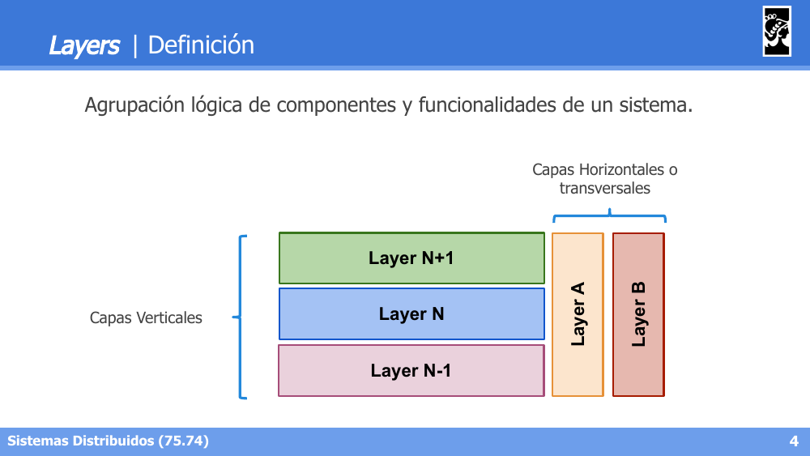

- **Capas Verticales**: capas que se apilan secuencialmente (Layer N-1, N, N+1).
- **Capas Horizontales o transversales**: capas que atraviesan a todas las demás (ej. Layer A, Layer B).

**Comunicación entre Layers:**

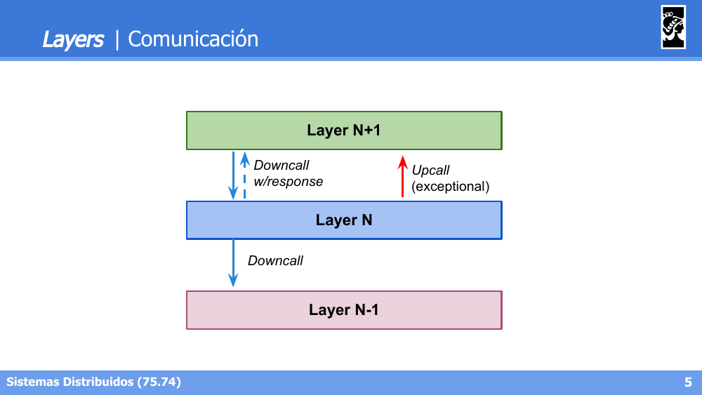

- **Downcall**: invocación de una capa superior hacia una inferior (con o sin respuesta).
- **Upcall** (excepcional): invocación de una capa inferior hacia una superior.

**Responsabilidades**: cada Layer es un módulo con responsabilidades limitadas, coherencia y cohesión. Provee servicios a la capa N+1 y consume servicios de la capa N-1.

**Ejemplo de Layers** (capas verticales Presentation/API → Services → Core Business → Persistence, atravesadas por capas horizontales Security y Audit):

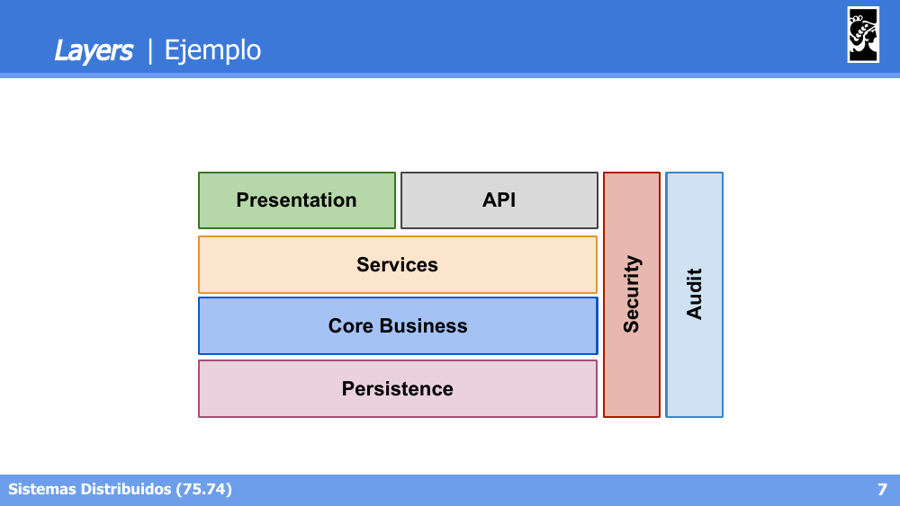

**Ejemplo: Onion Architecture / Clean Architecture** — capas concéntricas: Entities (núcleo) → Use Cases → Interface Adapters (Controllers, Presenters, Gateways) → Frameworks & Drivers (Web, DB, Devices, External Interfaces, UI):

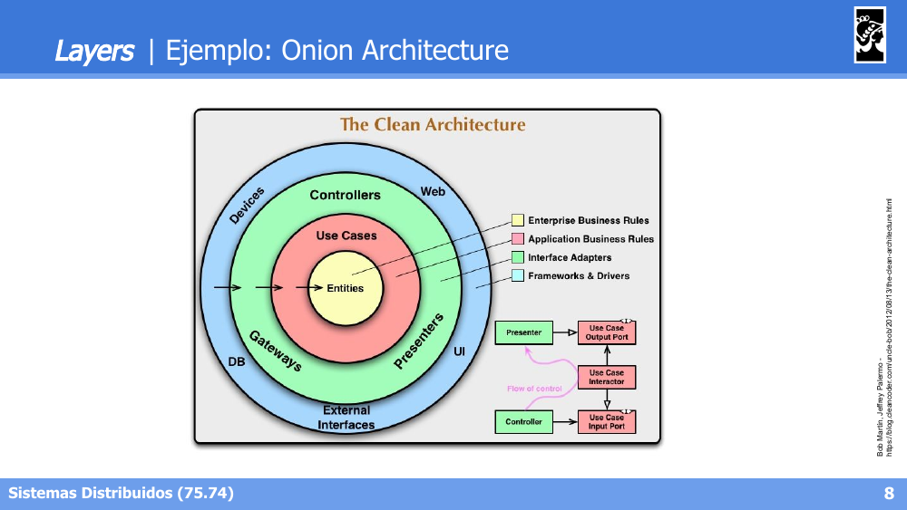

### Tiers

**Definición**: describen la distribución **física** de componentes y funcionalidad de un sistema.

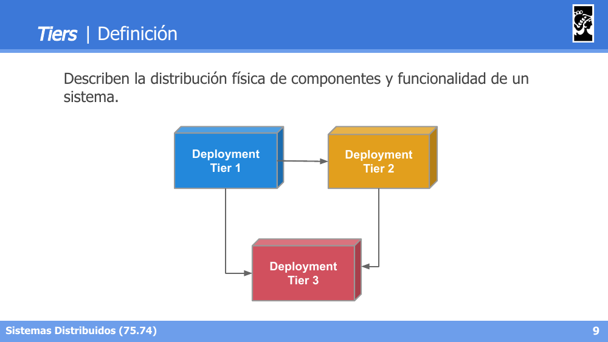

**Ejemplos de despliegue:**

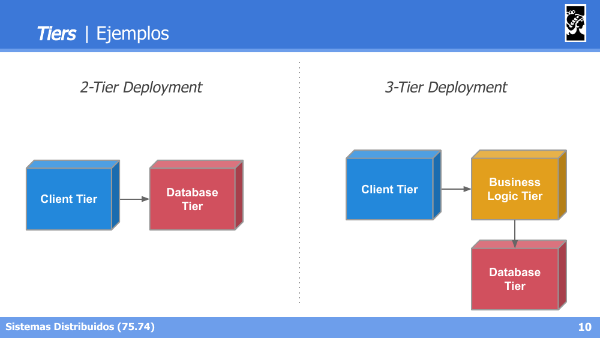

- **2-Tier**: Client Tier → Database Tier.
- **3-Tier**: Client Tier → Business Logic Tier → Database Tier.

**Despliegue de Layers sobre Tiers**: las layers lógicas (Presentation, API, Services, Core Business, Persistence, Audit, Security) se distribuyen físicamente entre Client Tier, Application Tier, Business Logic Tier y Database Tier:

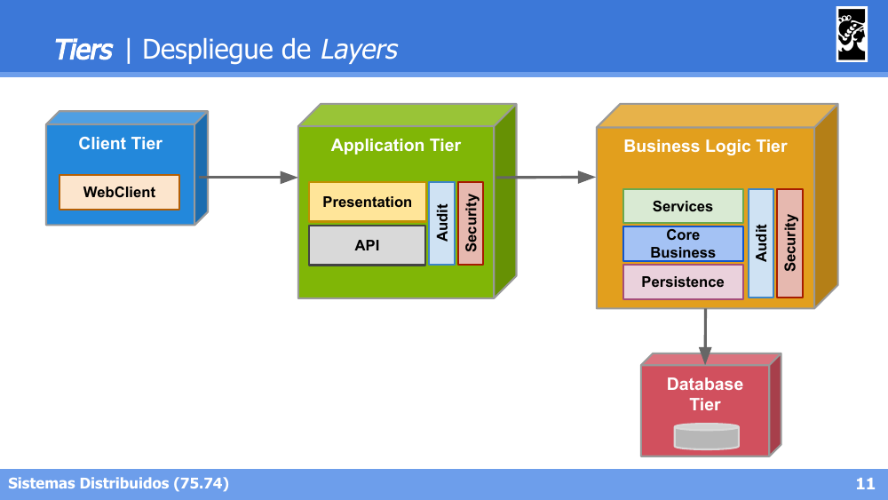

---

## 2. Interfaces

### Introducción

- Permiten la comunicación entre dos o más componentes/servicios/sistemas.
- Diferentes contratos permiten diferentes clientes.
- Solo se expone **una parte** del sistema.
- Esconden la implementación:
  - La implementación puede ser modificada sin cambiar el contrato.
  - Un cambio de contrato implica una nueva versión.

**Inter-Aplicaciones vs Intra-Aplicaciones:**

| Inter-Aplicaciones | Intra-Aplicaciones |
|---|---|
| Application Programming Interfaces (APIs). Ej: cliente por consola consultando Web Server, JS de navegador consultando servidor, servicio consultando servicio | Facades - Mediators - Interfaces. Ej: Layer 2 consultando Layer 1, mensaje enviado a un objeto local, mensaje enviado a un objeto remoto |

### Problemas a resolver

- **Software es difícil de cambiar**: ¿qué pasa si un sistema está altamente acoplado a una API y ésta cambia? ¿Cómo cambiamos una API ya definida?
- **Software es difícil de integrar**: no todos los componentes exponen interfaces útiles; la complejidad aumenta exponencialmente con la cantidad de componentes a integrar.

### Orientación del Contrato

| Orientados a entidades | Orientados a procesos |
|---|---|
| Desacoplamiento entre sistemas | Componentes altamente acoplados |
| Flexibilidad como objetivo | Alta performance como objetivo |
| Funcionalidad estándar | Funcionalidad diversa |

Ejemplo (Wikipedia/Wikimedia REST API):
- Orientado a entidades: `GET /page/title/{title}`, `POST /page/html/{title}`, `GET /page/media/{title}`, `GET /feed/featured/{yyyy}/{mm}/{dd}`
- Orientado a procesos: `POST /transform/html/to/wikitext/{title}`, `POST /media/math/check/tex`, `GET api.php?action=query&titles=...`

### Clasificación de Interfaces

- **Web APIs**: Web Services based APIs (SOAP), REST based APIs.
- **Remote APIs**: Custom TCP/UDP services, orientado a objetos (CORBA, JavaRMI), orientado a procedimientos (RPC, gRPC).
- **Library-based / Frameworks**: Java API (ej. OpenJDK vs Oracle JDK), Android API.
- **OS related**: POSIX (ej. Linux vs OpenBSD), WinAPI.

---

## 3. Protocolos

### Modelo HTTP

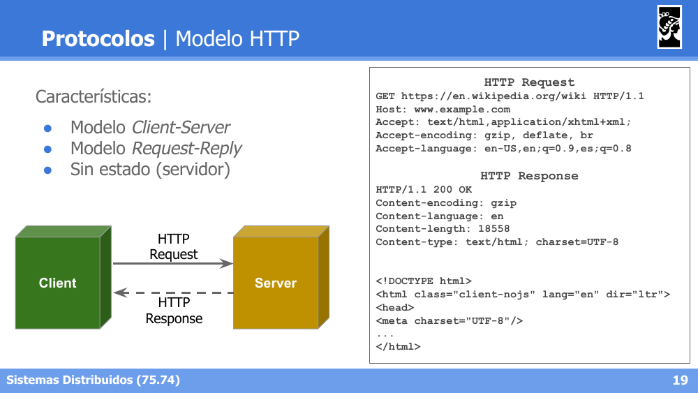

Características:
- Modelo **Client-Server**.
- Modelo **Request-Reply**.
- **Sin estado** (servidor).

### Responsabilidades por capa

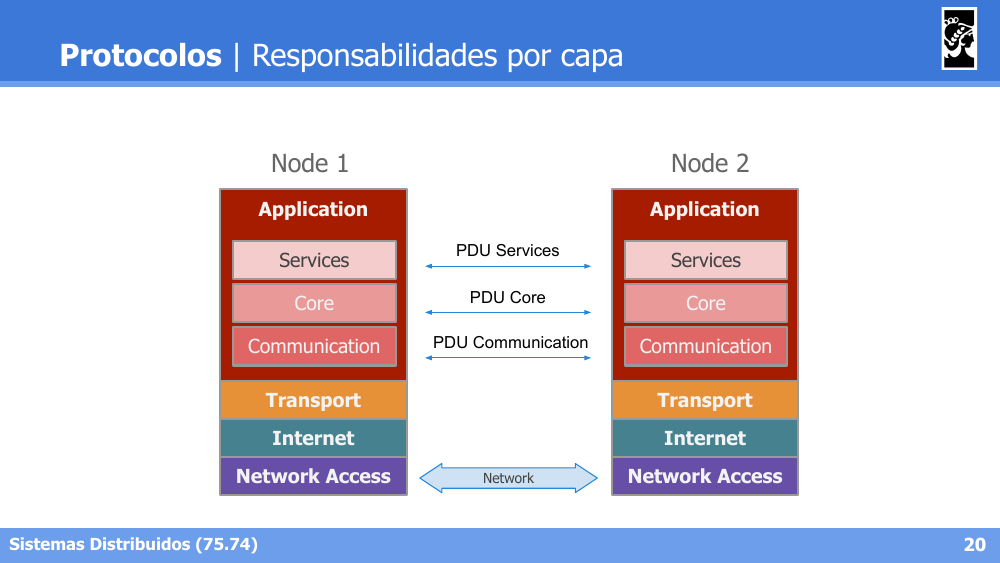

Cada capa de un nodo se comunica lógicamente con su par equivalente en el otro nodo, intercambiando su propia **PDU** (Protocol Data Unit), aunque físicamente los datos bajan y suben por la pila de capas locales (Application → Services → Core → Communication → Transport → Internet → Network Access).

### Protocol Data Unit (PDUs)

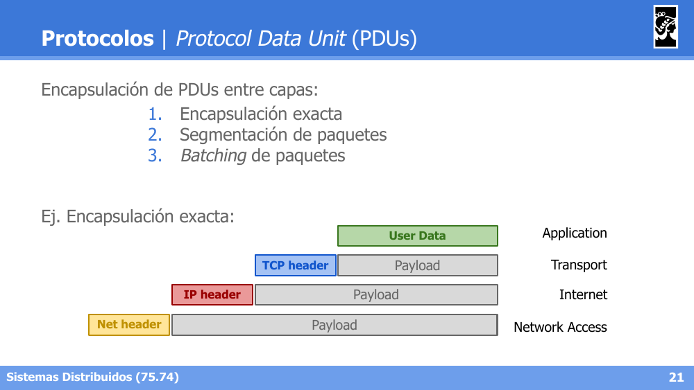

Encapsulación de PDUs entre capas, con tres estrategias posibles:
1. **Encapsulación exacta**: cada capa agrega su propio header al payload de la capa superior.
2. **Segmentación de paquetes**.
3. **Batching** de paquetes.

### Ejemplos de Protocolos por capa

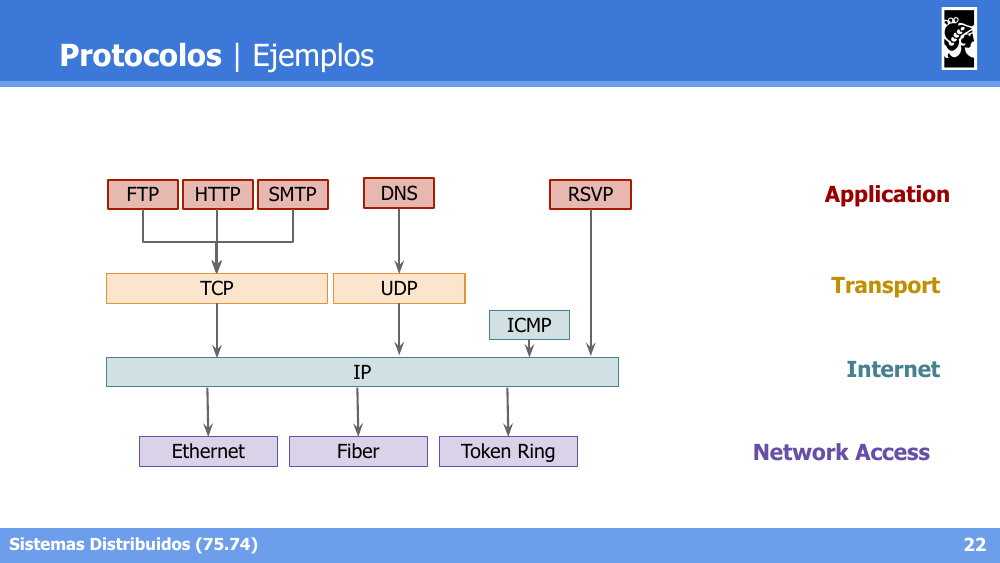

- **Application**: FTP, HTTP, SMTP, DNS, RSVP.
- **Transport**: TCP, UDP (también ICMP a nivel Internet).
- **Internet**: IP.
- **Network Access**: Ethernet, Fiber, Token Ring.

### Ejemplo: Múltiples Canales

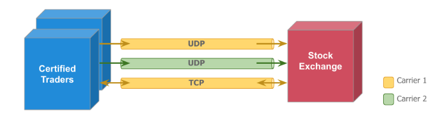

Caso de uso: una bolsa de comercio recibe información de muchos operadores distribuidos, con tráfico de paquetes con picos de transferencia.
- Canales **UDP** para garantizar throughput (aún con repetidos).
- Canal **TCP** para pedir retransmisión.

---

## 4. Mensajes

### Formato de Paquetes: Binario vs Texto Plano

**Binario:**
- **Alta performance**: tamaño de mensajes eficiente, la compresión puede no ser necesaria.
- **Serialización**: autogeneración de código (ej. Google Protobuf, Thrift, ASN.1); no siempre hay soporte en todos los lenguajes.
- **Interacción**: cliente específico para cada aplicación, se necesita un decoder para interpretar los mensajes.

Ejemplo (Protobuf): se define un `person.proto` con campos tipados, se genera código con `protoc`, y se serializa/deserializa el objeto `Person` en distintos lenguajes (Java, C++).

**Texto plano:**
- **Baja performance**: throughput bajo, la compresión agrega overhead.
- **Serialización**: formatos *human-readable* (JSON, XML), serialización básica (ej. HTTP, SMTP).
- **Interacción**: cliente único si se conoce el protocolo (ej. cURL + REST API), fácil de debuggear.

Ejemplo (cURL + HTTP): un comando `curl -X POST -d '{"username":"lalala","password":"supersecurepass"}'` genera una request HTTP en texto plano con headers y body JSON.

### Longitud de Paquete

- **Bloques fijos**: cada dato a enviar posee una longitud fija. Fácil de serializar, pero subóptimo con tipos de longitud variable (ej. strings).
- **Bloques dinámicos**: usan un separador para delimitar comienzo/fin de un campo, o la longitud del tipo para delimitarlo. Agregan un pequeño overhead de bytes extra.
- **Esquema mixto**: parámetros fijos (ej. integers) no llevan delimitadores/longitud; parámetros variables sí los llevan.

**Ejemplo: TLV (Type-Length-Value)**

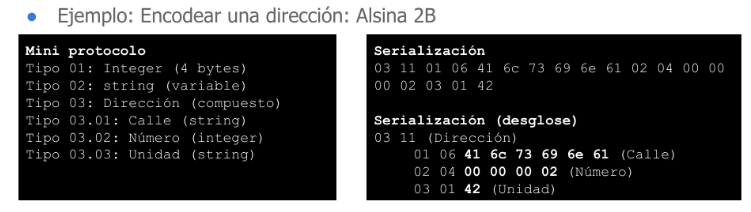

Todos los parámetros siguen el formato **Type - Length - Value**:
- **Type**: indica el tipo de dato/entidad. Tamaño fijo.
- **Length**: longitud del value sin contar el tipo y el length. Tamaño fijo.
- **Value**: dato a enviar. Tamaño variable. **Admite subtipos** (estructuras compuestas, como una Dirección compuesta por Calle, Número y Unidad).

**Ejemplo: TFTP**

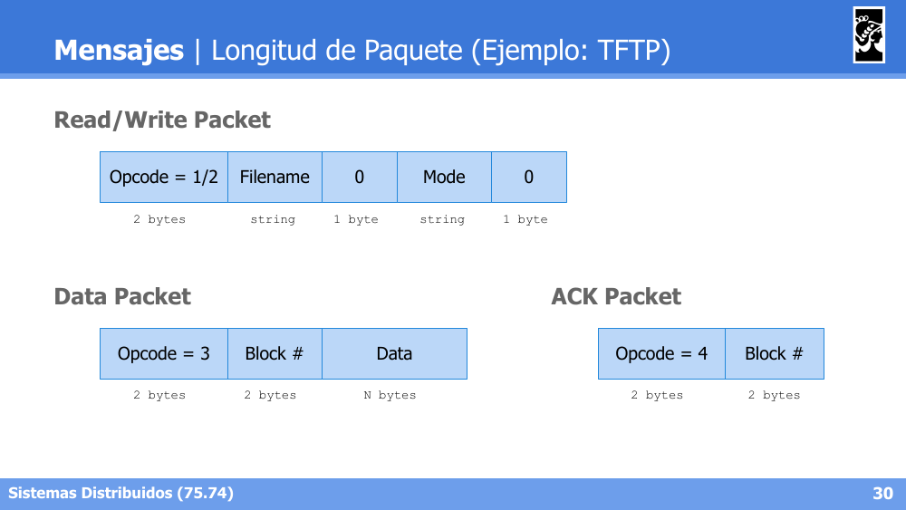

- **Read/Write Packet**: Opcode (1/2) + Filename + 0 + Mode + 0.
- **Data Packet**: Opcode (3) + Block# + Data.
- **ACK Packet**: Opcode (4) + Block#.

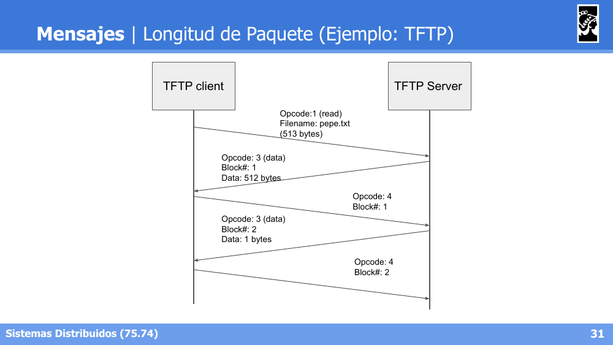

El cliente solicita un archivo (`Opcode 1, read`), el servidor responde con bloques de datos (`Opcode 3`) que el cliente confirma con ACKs (`Opcode 4`). El último bloque de datos (con menos de 512 bytes, o incluso 0 bytes) indica el fin de la transferencia.

### Sincronización de señales

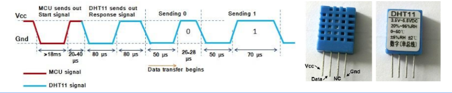

En ciertos protocolos es necesario saber dónde empieza una señal para entender la secuencia de paquetes. 

Ejemplo de bajo nivel: el sensor **DHT11** (humedad y temperatura) envía datos por un pin de comunicación, comenzando con una señal de sincronismo, seguida de 40 bits de data (Integer/Decimal Byte de RH + Integer/Decimal Byte de Temp. + Checksum Byte).

### Mensajes Sincrónicos vs Asincrónicos

- **Sincrónico**: el cliente queda bloqueado (Active) esperando la respuesta del servidor.
- **Asincrónico**: el cliente queda libre (Idle) tras enviar el request, y retoma actividad al recibir la respuesta.

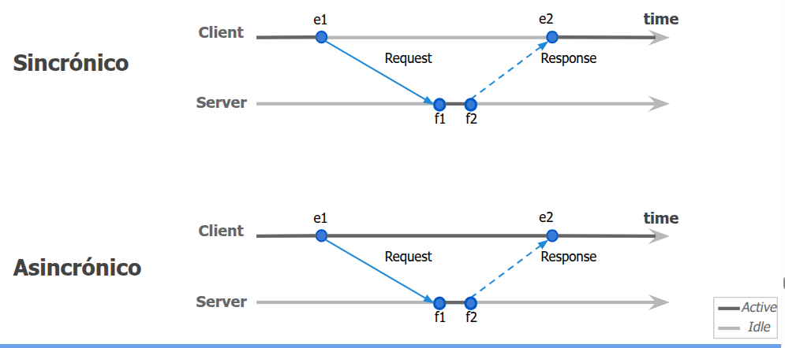

---

## 5. RESTful

### Representational State Transfer (REST/RESTful)

- Basado en entidades (**Web Resources**).
- Cada Web Resource es representado por una **URI**.
- **HTTP/HTTPS** utilizado como protocolo de comunicación.
- **JSON/XML** utilizado como protocolo de serialización.
- Cambio de estados a través de operaciones **CRUD**:

| Operación | Verbo HTTP | Equivalente SQL |
|---|---|---|
| Create | POST | INSERT |
| Read | GET | SELECT |
| Update | PUT | UPDATE |
| Delete | DELETE | DELETE |

### Principios de Arquitectura RESTful

**Objetivos**: alta performance, escalabilidad, confiabilidad, etc.

- Arquitectura cliente/servidor.
- *Cacheability*.
- **Interface Uniforme**: Hypermedia As The Engine Of Application State (**HATEOAS**).
- *Statelessness* (sin estado).
- *Layered system*.

### Ejemplos prácticos (GitLab API)

Casos de uso típicos con `curl` sobre la API REST de GitLab:
- **Obtener Proyectos**: `GET /api/v4/projects` → devuelve un array JSON de proyectos.
- **Obtener Referencias Anidadas**: `GET /api/v4/projects/{id}/users` y `GET /api/v4/users/{id}` para navegar entidades relacionadas.
- **Crear Tags**: `POST /projects/{id}/repository/tags` con body JSON (`tag_name`, `ref`).
- **Borrar un branch**: `DELETE /api/v4/projects/{id}/repository/branches/{name}` → responde `204 No Content`.

### Status Codes relevantes

| Código | Significado |
|---|---|
| 200 OK | GET/PUT/DELETE exitoso, retorna el recurso como JSON |
| 204 No Content | Éxito sin contenido adicional en el body |
| 201 Created | POST exitoso, retorna el recurso creado |
| 304 Not Modified | El recurso no fue modificado desde el último request |
| 400 Bad Request | Falta un atributo requerido en el request |
| 401 Unauthorized | Usuario no autenticado, se necesita un token válido |
| 403 Forbidden | El request no está permitido |
| 404 Not Found | El recurso no pudo ser accedido/encontrado |
| 405 Not Allowed | El request no está soportado |
| 409 Conflict | Ya existe un recurso en conflicto |
| 412 | Request denegado (ej. header If-Unmodified-Since en conflicto) |
| 422 Unprocessable | La entidad no pudo ser procesada |
| 500 Server Error | Error del lado del servidor |

### Identidad

Identificar unívocamente una entidad entre diferentes sistemas es una prioridad.
- El identificador debería tener información sobre la entidad que referencia.
- **Identidad != Nombre**: el nombre puede cambiar, la identidad no.
- La **URL** define la identidad de la entidad, no un identificador interno.

```json
// Pet entity. Bad ID
{ "id": "12345", "type": "/dog", "name": "Lassie" }

// Pet entity. Better ID
{ "id": "/pet/12345", "type": "/dog", "name": "Lassie" }
```

### Relaciones

Identificar correctamente una entidad ayuda a la integración de sistemas. Para la integración con otros sistemas:
- Siempre usar **URIs** para identificar entidades.
- Las URIs pueden ser relativas si la entidad es del mismo sistema.

```json
// Bad relationship
{ "id": "12345", "type": "/dog", "name": "Lassie", "owner": "98765" }

// Better relationship
{ "id": "/pet/12345", "type": "/dog", "name": "Lassie", "owner": "/users/98765" }
```

### Versionado de APIs

**Semantic Versioning (semver)**: estándar más utilizado para definir versiones de APIs y librerías, con foco en brindar información de retrocompatibilidad.

```
1.7.1
Major . Minor . Patch
```

- **Major**: al introducir cambios incompatibles con la versión anterior.
- **Minor**: al agregar funcionalidad pero manteniendo retrocompatibilidad.
- **Patch** (aka build): al introducir correcciones que no afectan la interfaz.


**Tipos de versionado de API:**


- **Versionado explícito en URL**: fácil de usar y testear, RESTful compliant (interface uniforme).
- **Versionado vía HTTP Custom header**: semánticamente incorrecto.
- **Versionado vía HTTP Accept header**: semánticamente correcto (indica cómo se quiere obtener el recurso), pero difícil de testear.

### Versionado de Objetos

**Versionado de objetos != Versionado de API.** Tipos:
- **Format Versioning**: la API puede brindar distintas representaciones de **la misma entidad**, cambiando su formato (ej. invocaciones desde distintas versiones de una misma API, o al filtrar datos del objeto resultante).
- **Historical Versioning**: la misma entidad tiene distintas versiones almacenadas a lo largo de su ciclo de vida (ej. API de páginas en una Wiki):

```
GET /api/pages/{id}/{rev}
GET /api/pages/{id}
GET /api/pages/{id}/latest
GET /api/pages/{id}?version={rev}
```

### Resumen RESTful

- Es el standard de facto de la industria.
- Basado en entidades y cambios de estado: ideal para manejo de recursos, complejo para ejecución remota de lógica de negocio.
- La teoría es importante. También lo es ser pragmático: hay que encontrar un equilibrio.
- **Don't mess it up with the basics**:
  - Utilizar HTTP/JSON directamente.
  - Identificar unívocamente entidades con URLs (no con nombres).
  - Manejar correctamente el versionado y los queries.
