# Sistemas Distribuidos I (75.74) — Clase 05: Grupos, Middlewares, MOMs y RabbitMQ

## 1. Grupos de Comunicación

### Introducción

- Permiten ver a una colección de procesos como una **abstracción**.
- Los mensajes se envían a todas o algunas de las entidades que componen el grupo.
- **Grupos dinámicos**: deben poder crearse y destruirse; los procesos se deben poder suscribir y desuscribir (necesidad de primitivas disponibles).

### Difusión de Mensajes

**Uno a uno:**
- **Unicast**: comunicación punto a punto.
- **Anycast**: solo uno en el grupo recibe el mensaje (ej. envío al nodo más cercano, ECMP — ¿qué implica "cercanía"?).

**Uno a Muchos:**
- **Multicast**: solo aquellos que se encuentran en cierto conjunto reciben el mensaje.
- **Broadcast**: todos reciben el mensaje.

### Topología

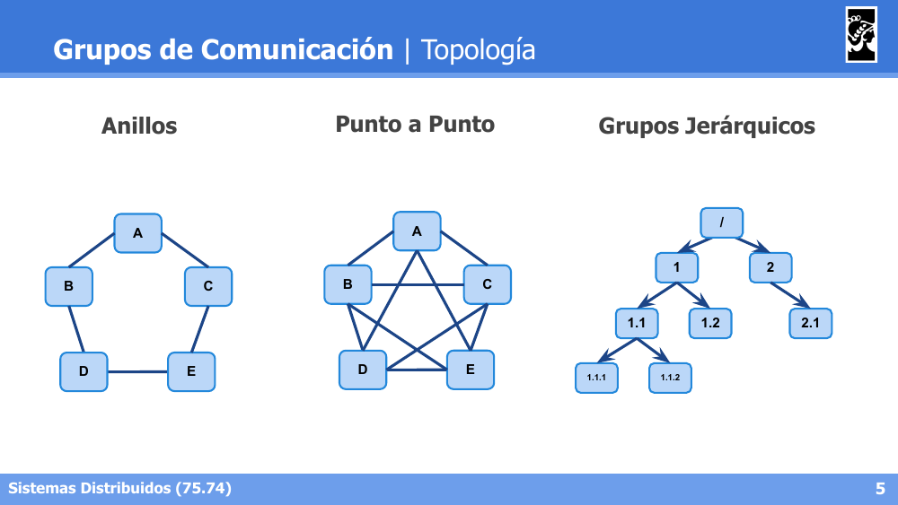

- **Anillos**: cada nodo conectado a sus dos vecinos formando un ciclo.
- **Punto a Punto**: todos los nodos conectados entre sí (malla completa).
- **Grupos Jerárquicos**: estructura en árbol con niveles (ej. `/` → `1`, `2` → `1.1`, `1.2`, `2.1` → ...).

**Difusión Descentralizada vs Centralizada** sobre una topología jerárquica:

- **Descentralizada**: cada nodo retransmite el mensaje únicamente a sus hijos directos, propagándose nivel por nivel.
- **Centralizada**: el nodo raíz envía el mensaje directamente a todos los nodos del árbol.

### Atomicidad de mensajes

- Los mensajes deben entregarse a **todos o a ninguno** de los destinatarios.
- Necesidad de realizar **ACK** de mensajes.
- Necesidad de demorar el *delivery* de los paquetes recibidos.
- Reintentos frente a: caída de receptores, caída del coordinador, no recepción de mensajes, no recepción de ACKs.

---

## 2. Middlewares

### Definiciones

- "Software de conectividad que ofrece un conjunto de servicios que hacen posible el funcionamiento de aplicaciones distribuidas sobre plataformas heterogéneas."
- "Módulo intermedio que actúa como conductor entre sistemas, permitiendo a cualquier usuario de sistemas de información comunicarse con varias fuentes de información conectadas por una red."
- "Capa de software que se encuentra o sitúa entre el sistema operativo y las aplicaciones del sistema."
- "Software que permite conectar componentes, softwares o aplicaciones, mediante un conjunto de servicios que permiten que múltiples procesos corriendo en una o varias máquinas interactúen de un lado a otro de la red."

### Vista lógica

Capa de software entre el sistema operativo y la capa de aplicación/usuario, para proveer una **vista única** del sistema (independientemente de la computadora física donde corra cada aplicación).

### Objetivos

**Transparencia:**
- Se oculta la distribución y el sistema responde como si fuera una única computadora.
- Respecto de: Acceso, Ubicación, Migración, Replicación, Concurrencia, Fallos, Persistencia.

**Tolerancia a Fallos:**
- Sistemas confiables, que se ejecuten y comporten de manera predecible incluso frente a la aparición de fallos.
- Abarcando: *Availability, Reliability, Durability, Safety, Maintainability*.

**Acceso a recursos compartidos:** eficiente, transparente y controlado.

**Sistemas distribuidos abiertos (Interfaces):** estándares claros sobre sintaxis y semántica de los servicios ofrecidos; interoperabilidad y portabilidad.

**Comunicación de grupos:** permite *broadcasting* y *multicasting*; facilita la localización de elementos y la coordinación de tareas.

### Vista Física

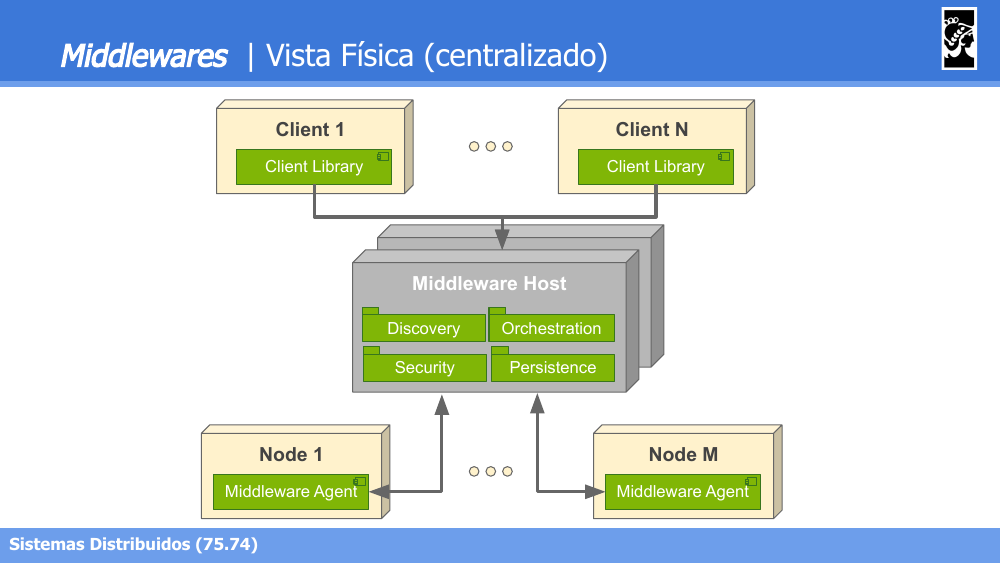

- **Centralizado**: existe un **Middleware Host** único (con módulos de Discovery, Orchestration, Security, Persistence) al que se conectan tanto clientes como nodos.

- **Distribuido**: existen múltiples **Servers**, cada uno con su propio Middleware Agent, comunicados entre sí y accesibles por distintos clientes.

### Clasificación de Middlewares

- **Transactional Procedure**: permiten garantizar transaccionalidad de operaciones respecto de datos; conectan muchas fuentes de datos y permiten un acceso transparente al grupo; poseen políticas de reintentos y retención de datos frente a caídas internas.

- **Object Oriented**: mensajes hacia objetos distribuidos; los objetos viven dentro del middleware; esquema de '*marshalling*' para transmitir la información.

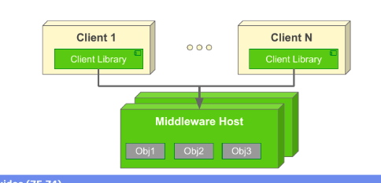

- **Procedure Oriented**: el middleware trabaja como un servidor de funciones que se pueden invocar; los servicios se pueden explorar y ejecutar, pero no presentan estado para futuras invocaciones.

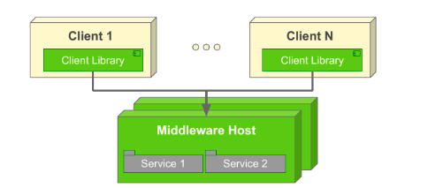

- **Message Oriented**: funciona como un sistema de mensajería entre las aplicaciones que utilizan el middleware; pueden enviarse mensajes bajo cierto 'tópico' para que los interesados lo reciban (modo *Information Bus*), o con un destinatario definido (modo *Queue*).

- **Reflective Middlewares**: de configuración dinámica.

---

## 3. MOMs (Message Oriented Middleware)

### Introducción

- Implementan la comunicación de grupo de forma transparente a las aplicaciones que la requieren.
- Basan su funcionamiento en el simple concepto de comunicar mensajes entre aplicaciones.
- Resuelve problemas de transparencia respecto de ubicación, fallos, performance y escalabilidad.

### Centralizado vs Distribuido

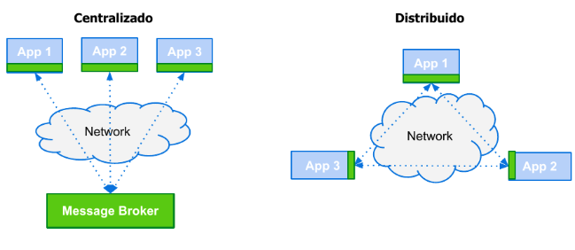

- **Centralizado**: todas las aplicaciones se comunican a través de un **Message Broker** único.
- **Distribuido**: las aplicaciones se comunican directamente entre sí a través de la red, sin un punto central.

### Bus de Información vs Colas de Mensajes

- **Bus**: todos los participantes (Contabilidad, Ventas, Control Stock) comparten un **Message Bus** único, suscribiéndose (S) o publicando (V) sobre ciertos tópicos.
- **Colas**: cada participante tiene su propia cola dedicada (q1, q2, q3) dentro del sistema de mensajería.

### Modelo Sincrónico del MOM

**Pros:**
- Se modela como una conexión punto a punto.
- Permite obtener respuestas instantáneas a pedidos concretos.

**Contras:**
- No permite implementar transparencia frente a errores.

### Modelo Asincrónico del MOM

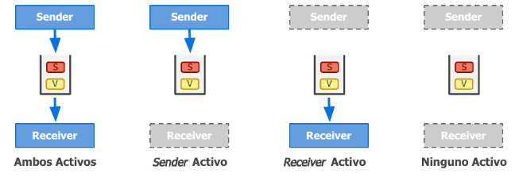

**Pros:**
- Se modela naturalmente con colas.
- La arquitectura soporta períodos de discontinuidad del transporte (Sender y Receiver no necesitan estar activos simultáneamente: ambos activos, solo sender activo, solo receiver activo, o ninguno activo).

**Contras:**
- Es complejo recibir respuesta a pedidos realizados (mínimamente es necesario contar con colas para el retorno de información, una en cada sentido).

### Operaciones Comunes

- **put**: publicación de un cierto mensaje.
- **get**: esperar hasta que un mensaje sea detectado; luego, eliminarlo de la cola y retornarlo.
- **poll**: revisar mensajes pendientes, sin bloquear.
- **notify**: asociar un *callback* utilizado por el MOM para ser ejecutado frente a la publicación de ciertos mensajes.

### Colas de Mensajes

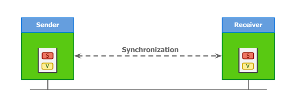

- Pueden existir varias colas definidas dentro del MOM.
- Tienen nombre y longitud definidas.
- Los clientes suelen contar con colas privadas intermedias.
- Garantía al Emisor de que el mensaje será insertado.

### Brokers

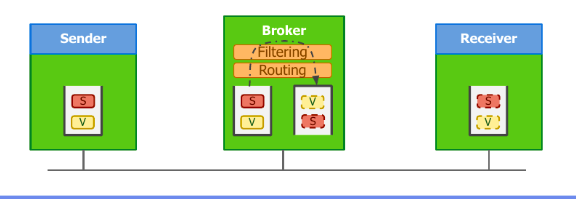

- Proveen transparencia de localización tanto al Emisor como al Receptor.
- Soportan lógica en el middleware para **filtrar y modificar** mensajes (*Filtering*, *Routing*).
- Brindan un punto de control y monitoreo.

---

## 4. RabbitMQ (MOM Centralizado — Ejemplos Prácticos)

### Conceptos

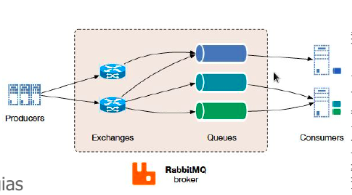

- **Queues**:
  - Nombradas vs TaskQueues vs Anónimas.
  - **Acknowledge**: automática por defecto.
  - **Durabilidad**: debe ser definida tanto en la cola como en cada mensaje.
- **Exchanges**:
  - Implementan diferentes estrategias para transmitir mensajes.
  - Tipos: **fanout**, **direct**, **topic**, **headers**.

El flujo general es: *Producers* → *Exchanges* → *Queues* → *Consumers*, todo orquestado por el **RabbitMQ broker**.

### Patrón: Publisher-Subscriber (Exchange Fanout)

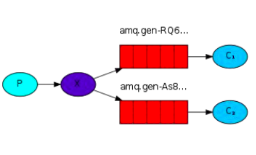

- El "Productor" (en realidad un **Publisher**) envía mensajes a un exchange de tipo **fanout**.
- Los "Consumidores" (en realidad **Subscribers**) crean colas anónimas para recibir mensajes del productor; estas colas son *bindeadas* al exchange del productor para comenzar a recibir mensajes.
- **Exchange Fanout**: realiza un *broadcast* de todos los mensajes recibidos a todas las colas conocidas.

### Patrón: Routing (Exchange Direct)

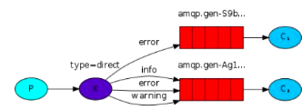

- El **Productor** envía mensajes a un exchange de tipo **direct**, adosando al mensaje un identificador de routeo (`routing_key`).
- El **Consumidor** realiza *binding* al exchange direct con los `routing_keys` que desea recibir.
- **Exchange Direct**: redirige mensajes con una `routing_key` específica a aquellas colas que se encuentran *bindeadas* a la misma.

### Patrón: Topic (Exchange Topic)

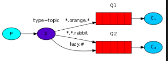

- El **Productor** envía mensajes a un exchange de tipo **topic**, adosando un `routing_key`.
- El **Consumidor** realiza *binding* al exchange topic con los patrones que desea recibir.
- **Exchange Topic**: soporta patrones de búsqueda basados en palabras. El `routing_key` es un conjunto de palabras separadas por punto:
  - `*`: permite sustituir **una** palabra.
  - `#`: permite sustituir **una o más** palabras.
