# Sistemas Distribuidos I (75.74) — Clase 07: Patrones de Comunicación y MOM Distribuido (ZeroMQ)

## 1. Request-Reply

### Introducción

- Protocolo utilizado en el modelo **Cliente-Servidor**.
- **Es sincrónico (bloqueante) por defecto**:
  - El cliente envía un *Request Message*.
  - El servidor recibe el Request, procesa el mensaje y envía un *Reply*.
  - El cliente queda bloqueado hasta recibir el *Reply Message*.
- Los ACKs son triviales (el propio Reply message funciona como ACK).

### Operación Sincrónica

El cliente envía el Request y queda en espera (*wait*) hasta recibir el Reply, mientras el servidor recibe el request, procesa la operación y envía la respuesta.

### ¿Cómo implementar una operación asincrónica?

Se necesitan **2 Request-Reply sincrónicos**:

**1° Parte — Enviar la acción:**

El cliente envía la acción a realizar; el servidor la encola y responde inmediatamente con un ACK (sin esperar a que la acción termine de procesarse).

**2° Parte — Consultar el estado:**

El cliente pregunta el estado de la operación en otro momento; el servidor obtiene el estado actual y lo envía como respuesta.

### Estructura de mensajes

Campos que suelen ser obligatorios:
- **messageID**: `0` = Request; `1` = Reply.
- **requestID**: identifica unívocamente al mensaje. Alternativas: auto-incremental o UUID.
- **operationID**: identifica la acción/operación a realizar.
- **args**: atributos asociados a la acción/operación.

### Tolerancia a Fallos

- **¿Cuánto se debe esperar por un Reply?** Timeouts con reintentos (*retries*), usando algoritmos de **Backoff + Jitter** (ej. estrategia de la API de Amazon).
- **¿Qué pasa si un Request o un Reply se pierde?**

| Estrategia | Tipo de Control | Retry - Request | Filtro Duplicados | ¿Mensaje recibido? |
|---|---|---|---|---|
| #1 | Sin control | No | No implementable | *Maybe* |
| #2 | Re-ejecución | Sí | No | *At Least Once* |
| #3 | Retransmisión | Sí | Sí | *Exactly Once* |

---

## 2. Producer-Consumer y Publisher-Subscriber

### Producer-Consumer

Modelo basado en comunicación **por tareas** entre productores y consumidores.
- **Producers**: son los emisores. Componentes que generan cierta información que se considera la materia prima para un procesamiento posterior.
- **Consumers**: son los receptores. Esperan la aparición de cierta información para efectuar un procesamiento particular.

### Publisher-Subscriber

Modelo basado en comunicación **por eventos** entre productores y consumidores.
- **Publishers**: son los emisores. Componentes que tienen la posibilidad de generar algún elemento de interés.
- **Subscribers**: son los receptores. Esperan la aparición de algún evento de su propio interés sobre el cual efectuarán alguna acción.

### Arquitectura de Publisher-Subscriber

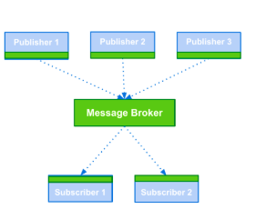

Dos posibles arquitecturas:
- **Basada en tópicos**: publicación y suscripción indicando el tipo de evento, tópico o tag.
- **Basada en Canales**: publicaciones y suscripciones orientadas a canales específicos.

### Implementación con MOMs

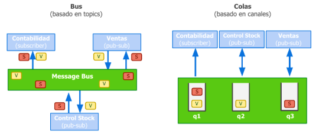

- **Bus** (basado en *topics*): todos los participantes comparten un Message Bus único, publicando (V) o suscribiéndose (S) a ciertos tópicos.
- **Colas** (basado en canales): cada participante tiene su propia cola dedicada (q1, q2, q3) dentro del sistema de mensajería.

---

## 3. Pipelines y DAGs

### Pipelines | Introducción

- En arquitecturas de software se lo conoce como **'Pipelines and Filters'**.
- Los datos de entrada forman un flujo donde distintos *filters* (o *processors*) se conectan entre sí para procesarlos de manera secuencial.
- Inspirado en patrones de procesamiento de señales; muy utilizado en entornos Unix: `cat in | grep pattern | sort | uniq > out`.

### Modelo de Procesamiento

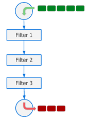

Admite dos modelos de procesamiento:
- **Worker por Filter**: se asigna una unidad de procesamiento a cada etapa del pipeline. Los items son recibidos por el worker, procesados y enviados a la próxima etapa.
- **Worker por Item**: se asigna una unidad de procesamiento a cada item. Un worker toma el item ingresado y lo acompaña hasta el final del pipeline, aplicándole los filters paso a paso.

### Etapas secuenciales y paralelas

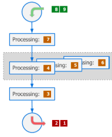

Cada uno de los *processors* funciona como una etapa, pudiendo ser del tipo:
- **Paralela**: cada item a procesar es independiente de los anteriores y posteriores, por lo que admite paralelismo.
- **Secuencial**: no puede procesar más de un item a la vez. Una vez procesados, los puede retornar **ordenados** o **desordenados**.

### Ventajas de los Pipelines

- **Algoritmos Online**: permiten iniciar el procesamiento antes de que estén disponibles todos los datos.
- **Información Infinita**: permite trabajar con flujos ilimitados de información con cantidades constantes de memoria, ya que el procesamiento está encadenado, con un buffer mínimo para la configuración del pipeline.

### Direct Acyclic Graphs (DAGs)

- Se modelan las instrucciones mediante un grafo de flujo de datos.
- Los nodos indican tareas y las aristas el flujo de información.
- **Acíclicos**: para todo nodo, no hay un camino que inicie y termine en él.
- Permite calcular el trabajo total para cierta secuencia de tareas, y el camino crítico.

**Ventajas:**

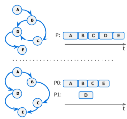

- Representación natural para *dataflows*.
- La carga de procesamiento se puede paralelizar (ej. procesar A, B, C, E en un proceso P0 mientras D se procesa en paralelo en P1).
- Admite **Lazy Loading** de las operaciones: solo procesa los nodos requeridos por dependencias.

**Dependencias y non-DAGs:**

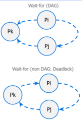

- También se pueden utilizar DAGs para modelar dependencias entre procesos.
- Las dependencias implican posibilidad de bloqueo frente al pedido de un recurso de un proceso a otro.
- Si el grafo de espera (*wait-for*) es **cíclico**, existe posibilidad de **deadlock**.
- Sirve para detectar y recuperar sistemas frente a deadlocks.

**Ejemplo: Tensorflow**

Tensorflow modela las operaciones matemáticas (`tf.negative`, `tf.abs`, multiplicación, etc.) como un DAG de nodos, donde cada nodo depende del resultado de sus nodos predecesores, ejecutándose recién al llamar a `sess.run(e)`.

---

## 4. ZeroMQ (MOM Distribuido)

### Definición según sus autores

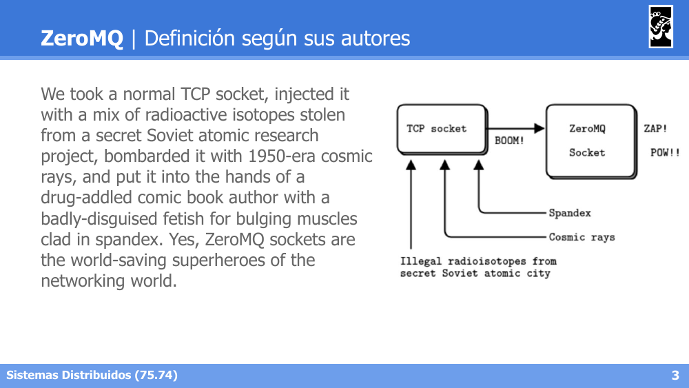

ZeroMQ describe sus sockets como una evolución "sobrecargada" de un socket TCP convencional, agregándole funcionalidades de alto nivel para mensajería distribuida.

### Introducción

- "Sockets on steroids".
- **Altamente performante**, aunque existen alternativas más modernas (Nanomsg, NSQ).
- Herramienta útil para crear **brokerless middlewares** (sin un broker central).
- La **serialización queda a cargo del usuario**.
- Soporte para diferentes patrones de mensajería: Request-Reply, Publisher-Subscriber, Parallel Pipeline, y patrones avanzados.

### Tipos de conexiones

- **TCP**: Multicomputing, Unicast (Point to Point).
- **IPC**: Multiprocessing, comunicación a través de Unix sockets.
- **Inproc**: Multithreading, queue entre threads.
- **Otras**: Multicast a través del protocolo PGM.

### Patrón: Request-Reply

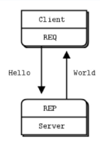

- Modelo Cliente-Servidor convencional (aunque no del todo).
- **No posee primitiva `accept`**: la primitiva `bind` funciona como `bind + accept`.
- La primitiva `send` es **no bloqueante**.
- El cliente no necesita esperar a que el servidor esté corriendo para enviar mensajes.
- *Under the hood*: usa **I/O threads** (1 thread por GB/s de entrada o salida) y *buffering*.

### Patrón: Producer-Consumer (Push-Pull)

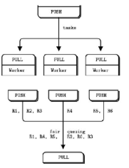

- Comunicación de tareas de un productor a un consumidor.
- Admite múltiples consumidores y/o múltiples productores.
- Garantiza **fairness** en la entrega de mensajes: *round robin*.
- Utiliza los sockets **PUSH/PULL** para marcar el rol de cada extremo.

### Patrón: Publisher-Subscriber

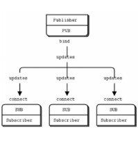

- Un socket **ZMQ PUB** publica mensajes con el *message pattern*: `id field1 field2 ...fieldN`.
- N sockets **ZMQ SUB** se registran a los eventos que desean recibir, suscribiéndose al ID del evento.
- La suscripción puede cancelarse en cualquier momento.
- El mensaje es enviado a todos los sockets suscriptos a un evento determinado.
- Para múltiples publishers, se utiliza el patrón **XPUB-XSUB**.

### Patrón: Pipeline (Push-Pull)

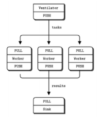

- Patrón Productor-Consumidor encadenado (*chaining*): el *chaining* de productores-consumidores da como resultado un pipeline.
- Los mensajes son consumidos de forma equitativa (**fairness**).
- Combinaciones posibles: **1 PUSH → N PULL**, o **N PUSH → 1 PULL**.

### Patrón: Router-Dealer (Broker)

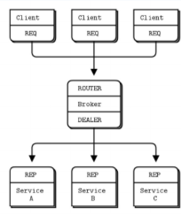

- **ROUTER socket**: agrega al mensaje recibido un ID de destinatario.
- **DEALER socket**: rutea los mensajes de forma justa (**fair**), propagando el ID de origen del mensaje.
- Ambos sockets permiten recibir mensajes de múltiples sockets a la vez.
- Ambos sockets son **asincrónicos**: se necesita **Poll** para recibir mensajes.
- Este patrón permite construir un **broker** intermedio entre múltiples clientes (REQ) y múltiples servicios (REP).

### Tabla comparativa de patrones ZeroMQ

| Patrón | Sockets involucrados | Configuración de sockets | Comunicación | Uso típico |
|---|---|---|---|---|
| **Request-Reply** | `REQ` ↔ `REP` | Cliente: `zmq.REQ` + `connect()`. Servidor: `zmq.REP` + `bind()`. Ciclo estricto: send→recv→send→recv (lockstep) | Síncrona, 1 a 1 | RPC simple, petición/respuesta bloqueante |
| **Router-Dealer** | `ROUTER` ↔ `DEALER` | Servidor: `zmq.ROUTER` + `bind()`, identidad implícita por frame. Cliente: `zmq.DEALER` + `connect()`, opcionalmente `setsockopt(zmq.IDENTITY, ...)` | Asíncrona, N a N | Broker intermedio, manejo concurrente de múltiples clientes |
| **Publish-Subscribe** | `PUB` ↔ `SUB` | Publicador: `zmq.PUB` + `bind()`. Suscriptor: `zmq.SUB` + `connect()` + `setsockopt(zmq.SUBSCRIBE, b"topic")` (vacío `b""` = todo) | Asíncrona, 1 a N (broadcast) | Difusión de eventos, notificaciones, feeds de datos |
| **XPub-XSub** | `XPUB` ↔ `XSUB` | Proxy/broker intermedio: `zmq.XPUB` + `bind()` (recibe suscripciones como mensajes) y `zmq.XSUB` + `connect()`. Se usa con `zmq.proxy()` | Asíncrona, N a N | Brokers PUB/SUB escalables con múltiples publishers |
| **Pipeline (Push-Pull)** | `PUSH` → `PULL` | Ventilador: `zmq.PUSH` + `bind()`. Workers: `zmq.PULL` + `connect()`. Salida: `PUSH` (workers) → `PULL` (sink) + `bind()` | Unidireccional, round-robin (fairness), 1 a N (o N a 1) | Distribución de tareas paralelas, pipelines de procesamiento |
| **Exclusive Pair** | `PAIR` ↔ `PAIR` | Ambos extremos: `zmq.PAIR`, uno hace `bind()` y el otro `connect()` | Bidireccional, 1 a 1 exclusiva | Comunicación entre hilos de un mismo proceso (inproc) |
| **Router-Router** | `ROUTER` ↔ `ROUTER` | Ambos: `zmq.ROUTER`, uno `bind()` y otro `connect()`, requiere `setsockopt(zmq.IDENTITY, ...)` en ambos lados | Asíncrona, N a N con direccionamiento explícito | Comunicación peer-to-peer entre nodos con identidad conocida |

**Notas generales sobre configuración de sockets:**
- **Transporte:** `tcp://`, `ipc://`, `inproc://`, `pgm://` — se define en la URL de `bind`/`connect`.
- **`bind()` vs `connect()`:** por convención, el componente más estable (broker/servidor) hace `bind()`; los componentes efímeros (clientes/workers) hacen `connect()`.
- **`inproc://`** requiere que el `bind()` se ejecute antes que el `connect()` (mismo contexto).
- **HWM (`zmq.SNDHWM` / `zmq.RCVHWM`):** controla el buffer máximo antes de bloquear o descartar mensajes — clave en PUB/SUB y PUSH/PULL para evitar pérdida o memoria descontrolada.
- **`zmq.LINGER`:** tiempo que espera un socket al cerrarse para enviar mensajes pendientes.

---

## 5. RabbitMQ vs ZeroMQ

| Aspecto | **RabbitMQ** | **ZeroMQ** |
|---|---|---|
| **Arquitectura** | Con **broker** (proceso intermediario central) | **Sin broker** (brokerless) — es una librería que se linkea directo en la app |
| **Qué es** | Un servidor de mensajería completo (middleware) | Una librería de sockets "esteroidados" (no un servidor) |
| **Instalación** | Requiere levantar un servicio/proceso aparte (Erlang) | No requiere proceso externo, solo la librería en el código |
| **Primitivas** | `publish`, `consume`, `ack/nack`, `exchange.declare`, `queue.declare`, `bind` | `zmq_send`, `zmq_recv`, `connect`, `bind` (mucho más bajo nivel) |
| **Enrutamiento de mensajes** | Lo hace el **broker** vía Exchanges (direct, topic, fanout, headers) + bindings | Lo hace la **aplicación**, usando patrones de sockets (PUB/SUB, REQ/REP, PUSH/PULL, ROUTER/DEALER) |
| **Persistencia de mensajes** | Sí — colas pueden ser **durables**, mensajes persistidos en disco | No — no hay noción de cola persistente propia; hay que implementarlo a mano si se necesita |
| **Confiabilidad / Garantías** | Alta: ack/nack, publisher confirms, dead-letter queues, at-least-once nativo | Baja/manual: el protocolo no da garantías de entrega por sí solo (hay que implementarlas, ej. patrón Lazy Pirate) |
| **Semántica de entrega** | At-least-once (con ack) o at-most-once (sin ack) fácilmente configurable | Depende 100% de lo que implemente el programador |
| **Desacople productor-consumidor** | Total: el broker guarda mensajes aunque el consumidor esté offline | Limitado: si no hay un peer conectado, el mensaje se puede perder (según el patrón usado) |
| **Transportes soportados** | TCP (AMQP), con plugins para otros | `tcp://`, `inproc://`, `ipc://`, `pgm://`/`epgm://` (multicast) |
| **Rendimiento / Latencia** | Menor throughput, mayor latencia (por el salto extra al broker) | Muy alto throughput, latencia mínima (comunicación directa entre peers) |
| **Escalabilidad** | Escala centralizando en el broker (clustering, federation, mirrored queues) | Escala de forma descentralizada, la app arma su propia topología |
| **Complejidad para el desarrollador** | Menor: el broker resuelve ruteo, colas, persistencia, reintentos | Mayor: el programador debe construir esas garantías si las necesita |
| **Punto único de falla (SPOF)** | El broker puede serlo (mitigable con clustering) | No hay broker → no hay ese SPOF, pero la responsabilidad se traslada a la app |
| **Casos de uso típicos** | Colas de tareas, integración de microservicios, sistemas donde se necesita persistencia/garantías fuertes | Sistemas de baja latencia, HPC, trading, comunicación entre componentes de un mismo sistema/proceso |

**En una frase:** RabbitMQ = mensajería confiable y con garantías, a costo de tener un broker central y más overhead. ZeroMQ = comunicación ultra rápida y flexible tipo "sockets mejorados", pero sin garantías de entrega — esas las tenés que construir vos.
