# Sistemas Distribuidos I (75.74) — Clase 07: Patrones de Comunicación y MOM Distribuido (ZeroMQ)

## 1. Request-Reply

### Introducción

- Protocolo utilizado en el modelo **Cliente-Servidor**.
- **Es sincrónico (bloqueante) por defecto**:
  - El cliente envía un *Request Message*.
  - El servidor recibe el Request, procesa el mensaje y envía un *Reply*.
  - El cliente queda bloqueado hasta recibir el *Reply Message*.
- Los ACKs son triviales (el propio Reply message funciona como ACK).

### Operación Sincrónica

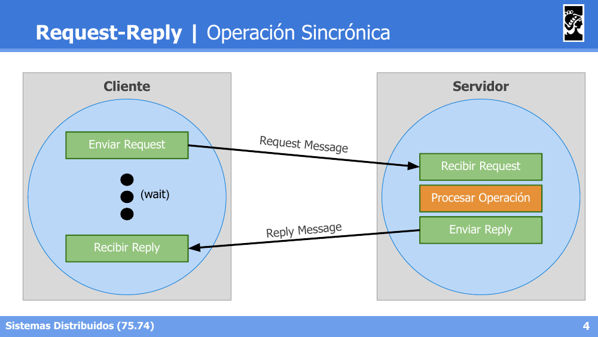

El cliente envía el Request y queda en espera (*wait*) hasta recibir el Reply, mientras el servidor recibe el request, procesa la operación y envía la respuesta.

### ¿Cómo implementar una operación asincrónica?

Se necesitan **2 Request-Reply sincrónicos**:

**1° Parte — Enviar la acción:**

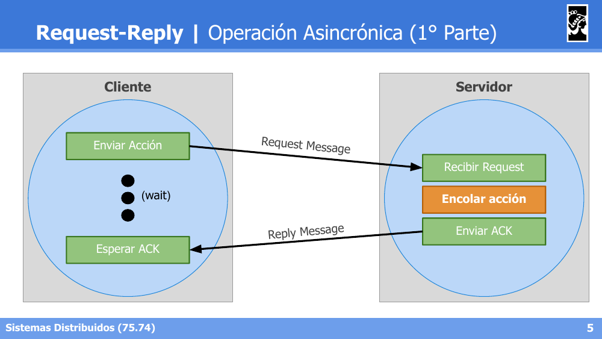

El cliente envía la acción a realizar; el servidor la encola y responde inmediatamente con un ACK (sin esperar a que la acción termine de procesarse).

**2° Parte — Consultar el estado:**

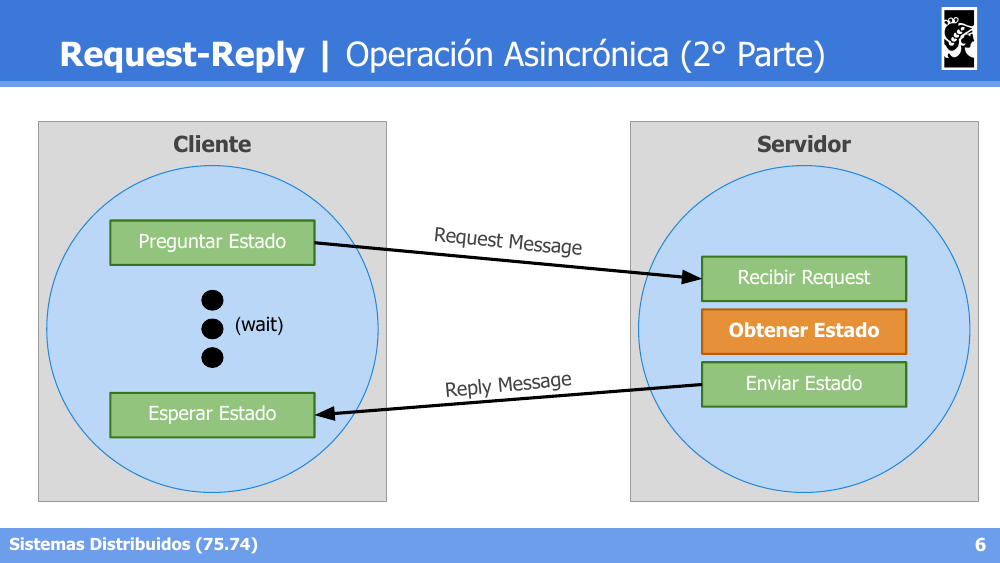

El cliente pregunta el estado de la operación en otro momento; el servidor obtiene el estado actual y lo envía como respuesta.

### Estructura de mensajes

Campos que suelen ser obligatorios:
- **messageID**: `0` = Request; `1` = Reply.
- **requestID**: identifica unívocamente al mensaje. Alternativas: auto-incremental o UUID.
- **operationID**: identifica la acción/operación a realizar.
- **args**: atributos asociados a la acción/operación.

### Tolerancia a Fallos

- **¿Cuánto se debe esperar por un Reply?** Timeouts con reintentos (*retries*), usando algoritmos de **Backoff + Jitter** (ej. estrategia de la API de Amazon).
- **¿Qué pasa si un Request o un Reply se pierde?**

| Estrategia | Tipo de Control | Retry - Request | Filtro Duplicados | ¿Mensaje recibido? |
|---|---|---|---|---|
| #1 | Sin control | No | No implementable | *Maybe* |
| #2 | Re-ejecución | Sí | No | *At Least Once* |
| #3 | Retransmisión | Sí | Sí | *Exactly Once* |

---

## 2. Producer-Consumer y Publisher-Subscriber

### Producer-Consumer

Modelo basado en comunicación **por tareas** entre productores y consumidores.
- **Producers**: son los emisores. Componentes que generan cierta información que se considera la materia prima para un procesamiento posterior.
- **Consumers**: son los receptores. Esperan la aparición de cierta información para efectuar un procesamiento particular.

### Publisher-Subscriber

Modelo basado en comunicación **por eventos** entre productores y consumidores.
- **Publishers**: son los emisores. Componentes que tienen la posibilidad de generar algún elemento de interés.
- **Subscribers**: son los receptores. Esperan la aparición de algún evento de su propio interés sobre el cual efectuarán alguna acción.

### Arquitectura de Publisher-Subscriber

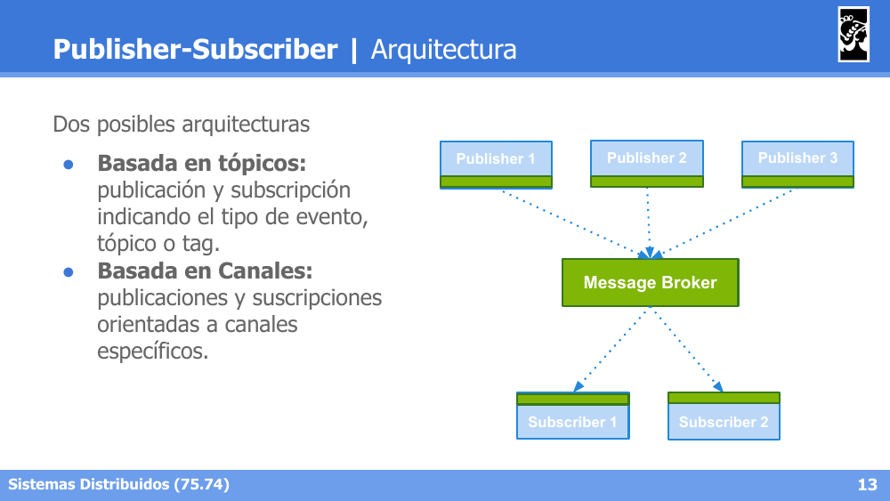

Dos posibles arquitecturas:
- **Basada en tópicos**: publicación y suscripción indicando el tipo de evento, tópico o tag.
- **Basada en Canales**: publicaciones y suscripciones orientadas a canales específicos.

### Implementación con MOMs

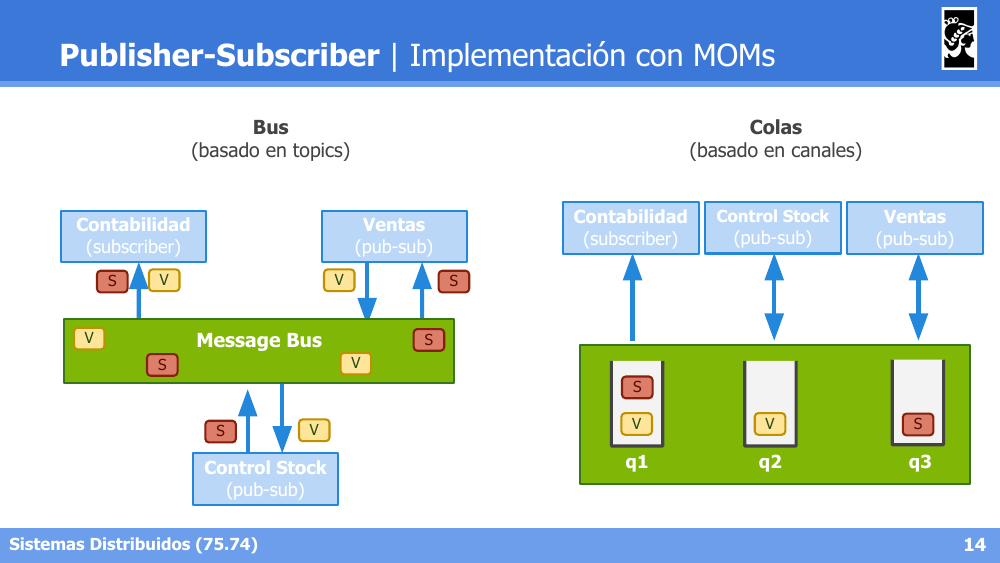

- **Bus** (basado en *topics*): todos los participantes comparten un Message Bus único, publicando (V) o suscribiéndose (S) a ciertos tópicos.
- **Colas** (basado en canales): cada participante tiene su propia cola dedicada (q1, q2, q3) dentro del sistema de mensajería.

---

## 3. Pipelines y DAGs

### Pipelines | Introducción

- En arquitecturas de software se lo conoce como **'Pipelines and Filters'**.
- Los datos de entrada forman un flujo donde distintos *filters* (o *processors*) se conectan entre sí para procesarlos de manera secuencial.
- Inspirado en patrones de procesamiento de señales; muy utilizado en entornos Unix: `cat in | grep pattern | sort | uniq > out`.

### Modelo de Procesamiento

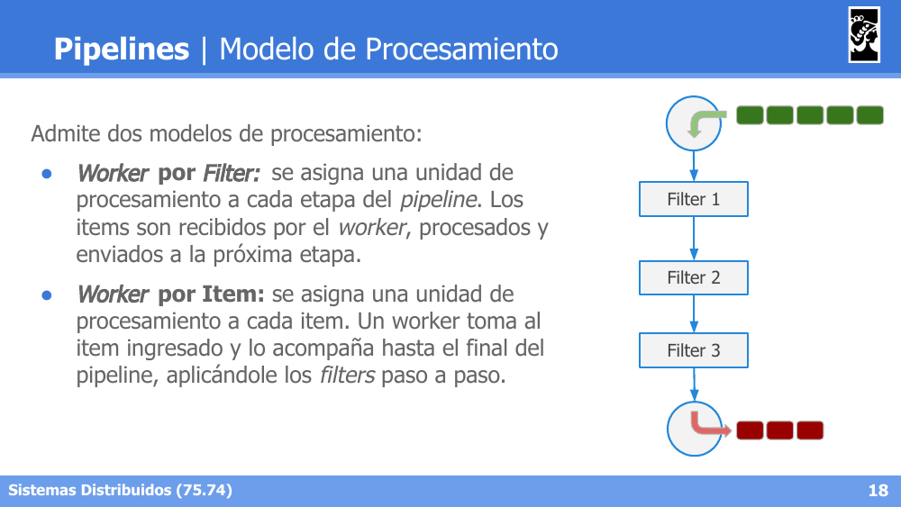

Admite dos modelos de procesamiento:
- **Worker por Filter**: se asigna una unidad de procesamiento a cada etapa del pipeline. Los items son recibidos por el worker, procesados y enviados a la próxima etapa.
- **Worker por Item**: se asigna una unidad de procesamiento a cada item. Un worker toma el item ingresado y lo acompaña hasta el final del pipeline, aplicándole los filters paso a paso.

### Etapas secuenciales y paralelas

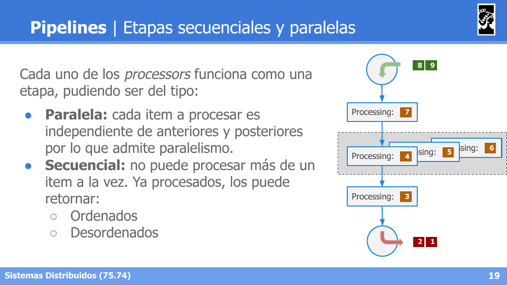

Cada uno de los *processors* funciona como una etapa, pudiendo ser del tipo:
- **Paralela**: cada item a procesar es independiente de los anteriores y posteriores, por lo que admite paralelismo.
- **Secuencial**: no puede procesar más de un item a la vez. Una vez procesados, los puede retornar **ordenados** o **desordenados**.

### Ventajas de los Pipelines

- **Algoritmos Online**: permiten iniciar el procesamiento antes de que estén disponibles todos los datos.
- **Información Infinita**: permite trabajar con flujos ilimitados de información con cantidades constantes de memoria, ya que el procesamiento está encadenado, con un buffer mínimo para la configuración del pipeline.

### Direct Acyclic Graphs (DAGs)

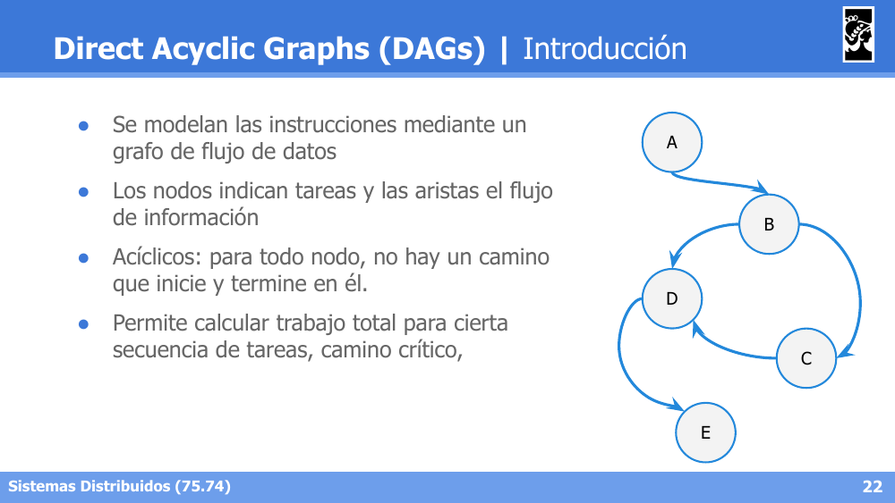

- Se modelan las instrucciones mediante un grafo de flujo de datos.
- Los nodos indican tareas y las aristas el flujo de información.
- **Acíclicos**: para todo nodo, no hay un camino que inicie y termine en él.
- Permite calcular el trabajo total para cierta secuencia de tareas, y el camino crítico.

**Ventajas:**

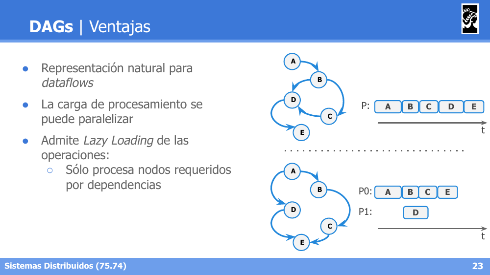

- Representación natural para *dataflows*.
- La carga de procesamiento se puede paralelizar (ej. procesar A, B, C, E en un proceso P0 mientras D se procesa en paralelo en P1).
- Admite **Lazy Loading** de las operaciones: solo procesa los nodos requeridos por dependencias.

**Dependencias y non-DAGs:**

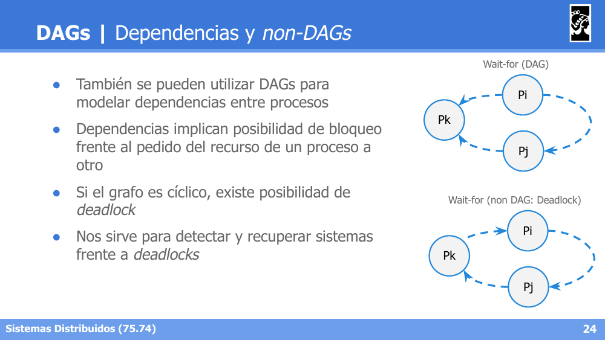

- También se pueden utilizar DAGs para modelar dependencias entre procesos.
- Las dependencias implican posibilidad de bloqueo frente al pedido de un recurso de un proceso a otro.
- Si el grafo de espera (*wait-for*) es **cíclico**, existe posibilidad de **deadlock**.
- Sirve para detectar y recuperar sistemas frente a deadlocks.

**Ejemplo: Tensorflow**

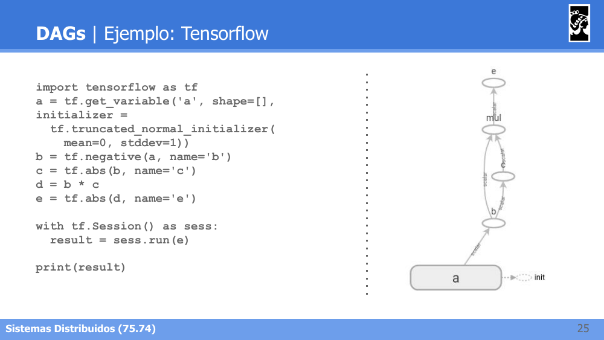

Tensorflow modela las operaciones matemáticas (`tf.negative`, `tf.abs`, multiplicación, etc.) como un DAG de nodos, donde cada nodo depende del resultado de sus nodos predecesores, ejecutándose recién al llamar a `sess.run(e)`.

---

## 4. ZeroMQ (MOM Distribuido)

### Definición según sus autores

ZeroMQ describe sus sockets como una evolución "sobrecargada" de un socket TCP convencional, agregándole funcionalidades de alto nivel para mensajería distribuida.

### Introducción

- "Sockets on steroids".
- **Altamente performante**, aunque existen alternativas más modernas (Nanomsg, NSQ).
- Herramienta útil para crear **brokerless middlewares** (sin un broker central).
- La **serialización queda a cargo del usuario**.
- Soporte para diferentes patrones de mensajería: Request-Reply, Publisher-Subscriber, Parallel Pipeline, y patrones avanzados.

### Tipos de conexiones

- **TCP**: Multicomputing, Unicast (Point to Point).
- **IPC**: Multiprocessing, comunicación a través de Unix sockets.
- **Inproc**: Multithreading, queue entre threads.
- **Otras**: Multicast a través del protocolo PGM.

### Patrón: Request-Reply

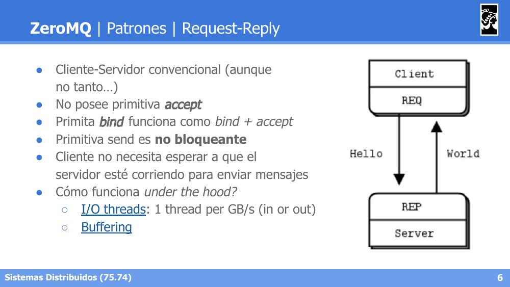

- Modelo Cliente-Servidor convencional (aunque no del todo).
- **No posee primitiva `accept`**: la primitiva `bind` funciona como `bind + accept`.
- La primitiva `send` es **no bloqueante**.
- El cliente no necesita esperar a que el servidor esté corriendo para enviar mensajes.
- *Under the hood*: usa **I/O threads** (1 thread por GB/s de entrada o salida) y *buffering*.

### Patrón: Producer-Consumer (Push-Pull)

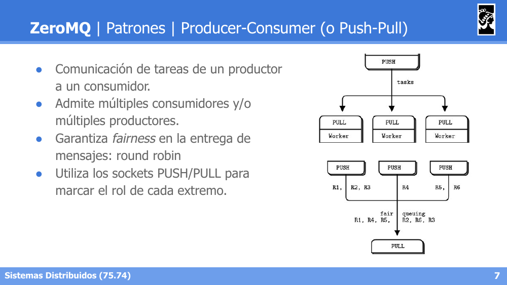

- Comunicación de tareas de un productor a un consumidor.
- Admite múltiples consumidores y/o múltiples productores.
- Garantiza **fairness** en la entrega de mensajes: *round robin*.
- Utiliza los sockets **PUSH/PULL** para marcar el rol de cada extremo.

### Patrón: Publisher-Subscriber

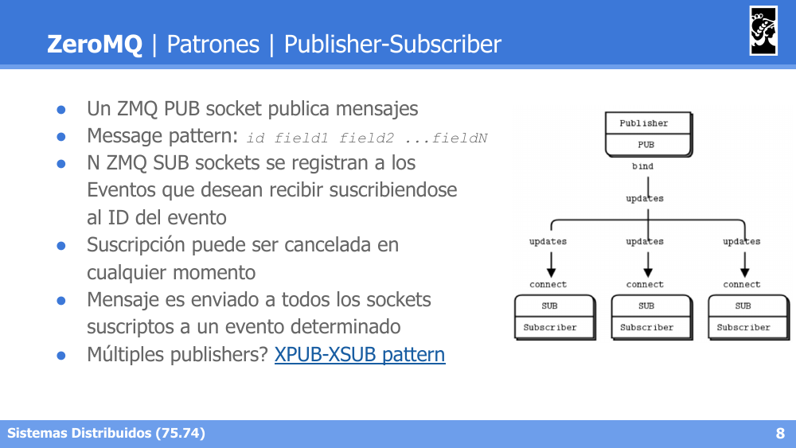

- Un socket **ZMQ PUB** publica mensajes con el *message pattern*: `id field1 field2 ...fieldN`.
- N sockets **ZMQ SUB** se registran a los eventos que desean recibir, suscribiéndose al ID del evento.
- La suscripción puede cancelarse en cualquier momento.
- El mensaje es enviado a todos los sockets suscriptos a un evento determinado.
- Para múltiples publishers, se utiliza el patrón **XPUB-XSUB**.

### Patrón: Pipeline (Push-Pull)

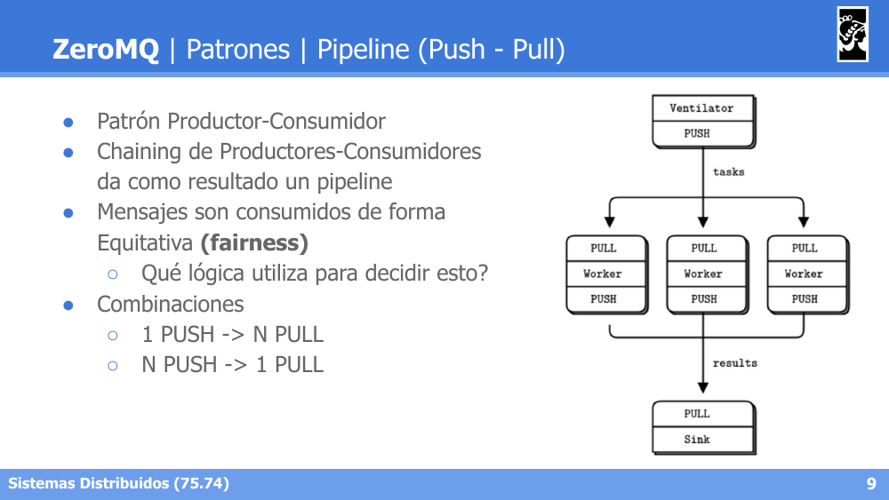

- Patrón Productor-Consumidor encadenado (*chaining*): el *chaining* de productores-consumidores da como resultado un pipeline.
- Los mensajes son consumidos de forma equitativa (**fairness**).
- Combinaciones posibles: **1 PUSH → N PULL**, o **N PUSH → 1 PULL**.

### Patrón: Router-Dealer (Broker)

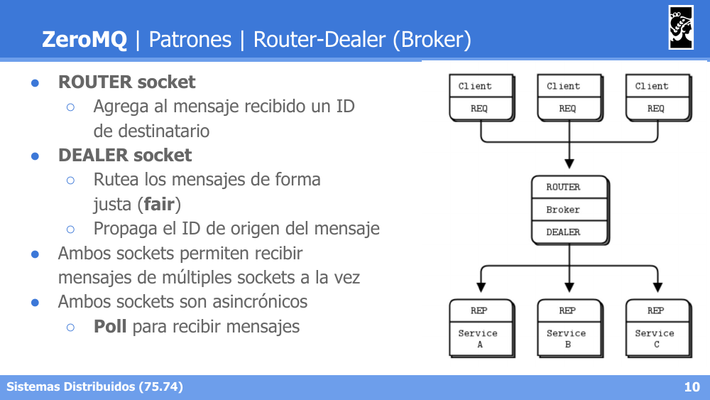

- **ROUTER socket**: agrega al mensaje recibido un ID de destinatario.
- **DEALER socket**: rutea los mensajes de forma justa (**fair**), propagando el ID de origen del mensaje.
- Ambos sockets permiten recibir mensajes de múltiples sockets a la vez.
- Ambos sockets son **asincrónicos**: se necesita **Poll** para recibir mensajes.
- Este patrón permite construir un **broker** intermedio entre múltiples clientes (REQ) y múltiples servicios (REP).
