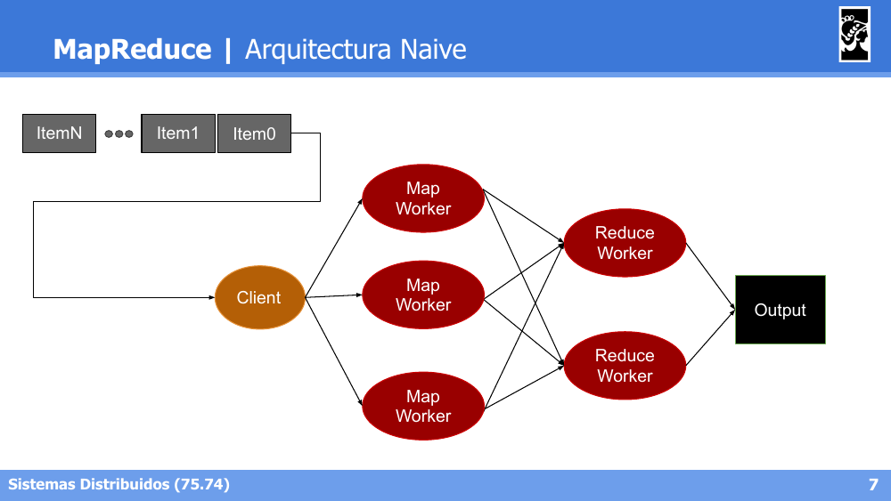
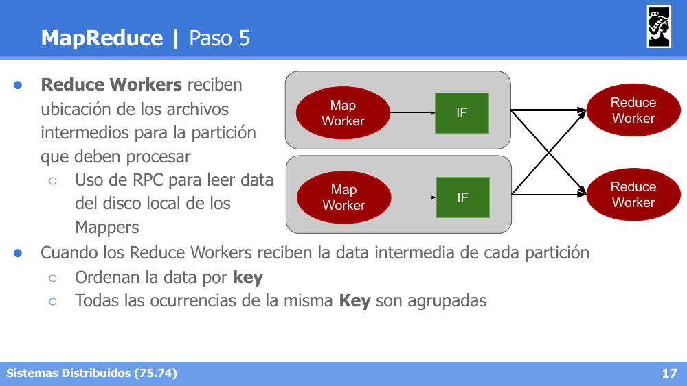
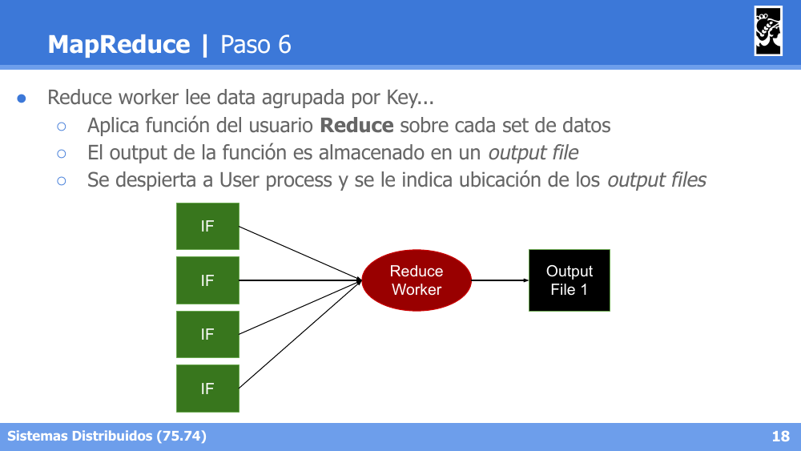
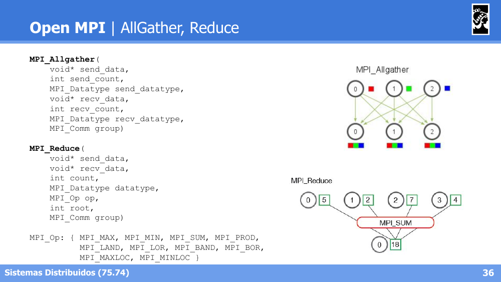
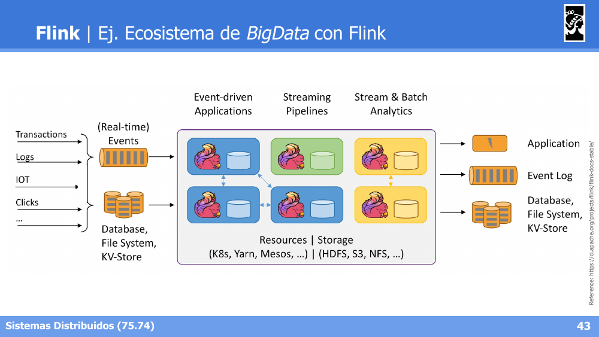

# Sistemas Distribuidos I (75.74) — Clase 10: Distribución y Coordinación de Procesos

## 1. Coordinación de Actividades


- **Coordinación**: una tarea T se **divide, despacha y difunde** en subtareas (T1, T2, T3) que se ejecutan en paralelo produciendo resultados parciales (R1, R2, R3), que luego se **consolidan** en un resultado final R.
- **Replicación**: una misma tarea T se **difunde** idéntica a múltiples ejecutores, que la ejecutan de forma redundante, y los resultados (todos iguales, R) se consolidan en uno solo.
- **Acceso a Recursos Compartidos**: múltiples procesos (P1, P2, P3) acceden a un recurso compartido; se requiere una etapa de **serialización** de los pedidos antes de la ejecución, para evitar condiciones de carrera.

---

## 2. MapReduce

### Motivaciones

- La programación tradicional se ejecuta en ambientes serializados.
- **Parallel Computing**: partir el procesamiento en partes que puedan ejecutarse concurrentemente en múltiples cores.
- **Desafío**: no todos los problemas pueden ser paralelizados (concepto de **camino crítico**); la concurrencia sobre recursos implica sincronización y retención de procesos.
- **Idea central**: identificar **Tareas** que puedan ejecutarse en paralelo, e identificar **Grupos de datos** que puedan procesarse en paralelo.

### Introducción

- Paradigma de *parallel computing*, desarrollado en 2004 por **Google**.
- Ligeramente basado en la idea de las funciones **map** y **reduce** de LISP:
  - `map f[a,b,c] => [f(a),f(b),f(c)]` (ej. `map sqrt[a,b,c] => [sqrt(a),sqrt(b),sqrt(c)]`)
  - `reduce f[a,b,c] => f(a,b,c)` (ej. `reduce sum[1,2,3] => sum(1,sum(2,sum(3,NULL)))`)
- Implementaciones: Apache Hadoop, Amazon EMR, Google MapReduce (for AppEngine).

### Arquitectura Naive



### Parallel Computing — Caso ideal (Master-Worker)

- No existe dependencia entre los datos; estos pueden ser partidos en *chunks* del mismo tamaño; cada proceso trabaja con un *chunk/shard*.
- **Master**: parte la data en `#chunks`, envía la ubicación de los chunks a los Workers, y recibe la ubicación de los resultados de todos los Workers.
- **Workers**: reciben la ubicación de los chunks del Master, procesan el chunk, y envían la ubicación del resultado de procesamiento al Master.

### Función Map

`Map: (input shard) → intermediate(key/value pairs)`
- La data es particionada automáticamente en **K chunks** y procesada por M workers ejecutando la función `map`.
- La función `Map`, provista por el usuario, se ejecuta en todos los chunks de data.
- El usuario decide cómo filtrar la data provista en los chunks.
- La librería MapReduce agrupa todos los valores asociados con una misma key y envía la ubicación de los datos al **Master Process**.

### Función Reduce

`Reduce: intermediate(key/value pairs) → result files`
- La función `Reduce` realiza una agregación de los datos para obtener un resultado final (result file).
- Es llamada **por cada Unique Key**, realizando un *merge* de los datos recibidos para formar un set de datos menor.
- Es distribuida particionando las keys en **R Reduce workers**, cantidad especificada por el usuario.

### Arquitectura completa


### Pasos del proceso MapReduce

1. **Paso 1 — Partir los datos de entrada en N chunks** (por lo general de 64MB, configurable).
2. **Paso 2 — Fork de Procesos en Cluster**: 1 master (actúa de Scheduler y Coordinador) y muchos Workers (Mappers y Reducers). Tantos Mappers como chunks; R reducers configurados por el usuario.
3. **Paso 3 — Map de Shards en Mappers**: el worker lee el Input data, filtra los datos recibidos en formato key/value, y ejecuta la función provista por el usuario sobre cada par que pasó el filtro, produciendo un *valor intermedio* por cada par.
4. **Paso 4a — Creación de Archivos Intermedios (IF)**:

   

   Cada key/value intermedio producido es *bufferizado* y escrito periódicamente en disco local. La data es particionada en R regiones usando una función de particionamiento. El Map Worker notifica al proceso master cuando termina de procesar el chunk y le envía la ubicación del archivo intermedio; el master envía la ubicación de los IF a los Reduce workers.

5. **Paso 4b — Particionamiento**: la función `Reduce` del usuario se llama una vez por cada *unique key* generada por los Map workers. Los keys/values deben agruparse por Key, decidiendo qué Reduce Worker procesará cada key. La **función de partición** por defecto es `hash(key) mod R`; los Map workers particionan la data por keys con esta función, y cada Reduce Worker lee la partición que desea de cada Map Worker.

6. **Paso 5**:

   

   Los Reduce Workers reciben la ubicación de los archivos intermedios para la partición que deben procesar (usando **RPC** para leer la data del disco local de los Mappers). Al recibir la data intermedia, ordenan la data por key y agrupan todas las ocurrencias de la misma key.

7. **Paso 6**:

   

   El Reduce worker lee la data agrupada por Key, aplica la función `Reduce` del usuario sobre cada set de datos, y el output de la función es almacenado en un *output file*. Se despierta al proceso del usuario indicándole la ubicación de los output files.

### Ejemplos de problemas resueltos con MapReduce

**Word Count** — contar la cantidad de ocurrencias de cada palabra en un texto:
```
map(string key, string value):
    # key: document name
    # value: document as a multiline string
    for word w in value:
        emitIntermediate(w, 1)

reduce(string key, list value):
    # key: word
    # value: list of "1s" associated with the words
    emit(key, len(value))
```

**Word Frequency** — contar la frecuencia de una palabra en un documento (usando `emitAll` y `reduceAll` para calcular el total de palabras como dato auxiliar global):
```
map(string key, string value):
    for word w in value:
        emitAll("", 1)
        emitIntermediate(w, 1)

reduce(string key, list value):
    totalWords = reduceAll("", sum)
    emit(key, count(value) / totalWords)
```

**Union** — dado N documentos, obtener palabras presentes en algún documento:
```
map(string key, string value):
    dict = {}
    for word w in value:
        if not word in dict:
            dict[word] = 1
            emitIntermediate(word, key)

reduce(string key, list value):
    # key: word, value: dummy, lista de documentos donde aparece
    emit(key, key)
```

**Intersect** — dado N documentos, obtener palabras que se encuentran en **todos** ellos (usando `emitAll`/`reduceAll` para conocer la cantidad total de documentos):
```
map(string key, string value):
    dict = {}
    emitAll("", key)
    for word w in value:
        if not word in dict:
            dict[word] = key
            emitIntermediate(word, key)

reduce(string key, list value):
    amountDocuments = reduceAll("", (sort, uniq, len))
    dictionary = {}
    for v in value:
        if not v in dictionary:
            dictionary[v] = true
    if len(dictionary.keys()) == amountDocuments:
        emit(key, key)
```

**Join** — dados `S1:=[shared_field, field_1]` y `S2:=[shared_field, field_2]`, obtener `S3:=[shared_field, field_1, field_2]`:
```
map(string key, string value):
    # key: nombre del set como S1|S2, value: CSV multilinea "shared_field,field_X"
    for line in value:
        fields = line.split(',')
        emitIntermediate(fields[0], (key, fields[1]))

reduce(string key, list value):
    # key: campo de join, value: tuplas
    data_fields = [key, None, None]
    for set_data in value:
        if set_data[0] == 'S1':
            data_fields[1] = set_data[1]
        else:  # set_data[0] == 'S2'
            data_fields[2] = set_data[1]
    emit(key, ','.join(data_fields))
```

---

## 3. Open MPI

### Introducción


- Basado en **transmisión y recepción de mensajes**.
- Ejecución transparente de 1 a N nodos.
- Se utiliza como una librería con abstracciones de uso general con foco en el **cómputo distribuido**.
- Implementa un middleware de comunicación de grupos: `MPI_Recv`, `MPI_Send`, `MPI_Bcast`, `MPI_gather`, etc.

### Send, Recv, Broadcast

```c
MPI_Send(void* data, int count, MPI_Datatype type, int dest, int tag, MPI_Comm group)
MPI_Recv(void* data, int count, MPI_Datatype type, int source, int tag, MPI_Comm group, MPI_Status* status)
MPI_Bcast(void* data, int count, MPI_Datatype type, int root, MPI_Comm group)
```

Ejemplo de uso (`mpirun -np 4 ./main`): el proceso con `world_rank == 0` envía (`MPI_Send`) un array de datos a cada uno de los demás procesos; los demás lo reciben con `MPI_Recv`. Luego, todos sincronizan el mismo array usando `MPI_Bcast`, y finalizan con `MPI_Finalize()`.

### Scatter, Gather


```c
MPI_Scatter(void* send_data, int send_count, MPI_Datatype send_datatype,
            void* recv_data, int recv_count, MPI_Datatype recv_datatype,
            int root, MPI_Comm group)

MPI_Gather(void* send_data, int send_count, MPI_Datatype send_datatype,
           void* recv_data, int recv_count, MPI_Datatype recv_datatype,
           int root, MPI_Comm group)
```

- **Scatter**: el proceso raíz reparte distintos fragmentos de datos a cada proceso.
- **Gather**: el proceso raíz recolecta los fragmentos de datos de todos los procesos.

### AllGather, Reduce



```c
MPI_Allgather(void* send_data, int send_count, MPI_Datatype send_datatype,
              void* recv_data, int recv_count, MPI_Datatype recv_datatype,
              MPI_Comm group)

MPI_Reduce(void* send_data, void* recv_data, int count, MPI_Datatype datatype,
           MPI_Op op, int root, MPI_Comm group)

MPI_Op: { MPI_MAX, MPI_MIN, MPI_SUM, MPI_PROD, MPI_LAND, MPI_LOR, MPI_BAND, MPI_BOR, MPI_MAXLOC, MPI_MINLOC }
```

- **AllGather**: como Gather, pero el resultado combinado se distribuye a **todos** los procesos (no solo a la raíz).
- **Reduce**: combina los datos de todos los procesos usando una operación (ej. `MPI_SUM`) y deja el resultado en el proceso raíz.

---

## 4. Apache Flink y Apache Beam

### Flink | Introducción

- Plataforma para **procesamiento distribuido de datos**.
- Incluye un motor de ejecución de *pipelines* de transformación.
- Define un *framework* Java/Scala para crear pipelines:
  - **SQL y Table API**: permiten definir tablas dinámicas (lógicas) con los flujos de datos y utilizar álgebra relacional.
  - **Dataset y DataStream API**: permiten definir secuencias de procesamiento con formato **DAG**.

### Conceptos Básicos

- **Dataflow**: DAG de operaciones sobre un flujo de datos.
  - **Streams**: un flujo de información que puede no finalizar.
  - **Batchs**: un conjunto de datos (*dataset*) de tamaño conocido.

```java
DataStream<String> lines = env.addSource(new FlinkKafkaConsumer<>(...));        // Source
DataStream<Event> events = lines.map((line) -> parse(line));                    // Transformation
DataStream<Statistics> stats = events
        .keyBy("id")
        .timeWindow(Time.seconds(10))
        .apply(new MyWindowAggregationFunction());                              // Transformation
stats.addSink(new RollingSink(path));                                           // Sink
```

### Bloques de un Pipeline


- **Source**: bloque capaz de inyectar datos al pipeline.
- **Transformation** (operador): nodo de modificación de datos o filtrado de los mismos.
- **Sink**: bloque de destino de la información, almacenamiento final del pipeline.

### Ventanas para Streaming


Flink permite agrupar eventos de un stream en **ventanas** (por tiempo o por cantidad de eventos), considerando distintas nociones de tiempo: *Event Time* (cuando ocurrió el evento), *Ingestion Time* (cuando ingresó a Flink) y *Window Processing Time* (cuando se procesa la ventana).

### Casos de Uso


- **Extract Transform Load (ETL)**: operaciones programadas de carga y modificación de datos para su posterior análisis, con origen y destino definidos en una base de datos.
- **Data Pipelines**: tareas de procesamiento recurrentes, basadas en la ocurrencia de eventos (en tiempo real).

### Ejemplo: Ecosistema de Big Data con Flink



Flink puede usarse como motor central de un ecosistema de Big Data, combinando fuentes en tiempo real (transacciones, logs, IoT, clicks) y fuentes batch (DB, filesystem, KV-Store), produciendo aplicaciones, event logs y bases de datos de salida, todo corriendo sobre infraestructura de recursos (K8s, Yarn, Mesos) y almacenamiento (HDFS, S3, NFS).

### Beam | Introducción

- Modelo de definición de **pipelines de procesamiento de datos** con **portabilidad de lenguajes y motores de ejecución (*runners*)**.
- Soporta distintos lenguajes de programación: **Java, Python, Go**.
- Soporta distintos **Runners**:
  - Ejecución directa (*Stand-alone* o *DirectRunner*).
  - Motores de *cluster*: Apache Hadoop, Apache Flink, Apache Spark.
  - Plataformas *cloud*: Google Dataflow, IBM Streams.

### Beam | Bloques de un Pipeline

Los componentes básicos son similares a los definidos en Flink:
- **Input y Output**: origen y destino respectivamente de los datos (símil *Source* y *Sink*).
- **PCollection**: colecciones paralelizables de elementos (símil *Streams*).
- **Transformations**: modificaciones aplicadas a las PCollections, elemento a elemento (símil *Operators*).
