# Sistemas Distribuidos I (75.74) — Clase 11: Sistemas Elásticos y de Alta Disponibilidad

## 1. Escalabilidad

### Objetivos

El objetivo de la escalabilidad es el **crecimiento**:
- **Respecto del tamaño**: agregando usuarios o recursos a controlar.
- **Respecto de la distribución geográfica**: permitiendo dispersión.
- **Respecto de los objetivos administrativos del sistema**: nuevas sintaxis, semánticas y servicios ofrecidos.

### Características de las Plataformas

- **Plataformas para alta concurrencia**: aplican patrones ya conocidos y probados; escalamiento automático (con ciertos límites); vinculación fuerte con una infraestructura o producto.
- **Arquitecturas Ad-Hoc y Personalizadas**: necesidad de configuración y soporte; escalamiento manual o automatizado por humanos; posibilidad de migraciones a distintas plataformas.

### Patrón de Carga de Aplicaciones Web


- **Predictable Burst**: pico de cómputo previsible que sube y baja.
- **Unpredictable Burst**: picos irregulares que van en aumento.
- **Periodic Processing**: uso promedio con períodos de inactividad y de uso.
- **Start Small, Grow Fast**: crecimiento sostenido y acelerado desde un punto bajo.

### Limitantes

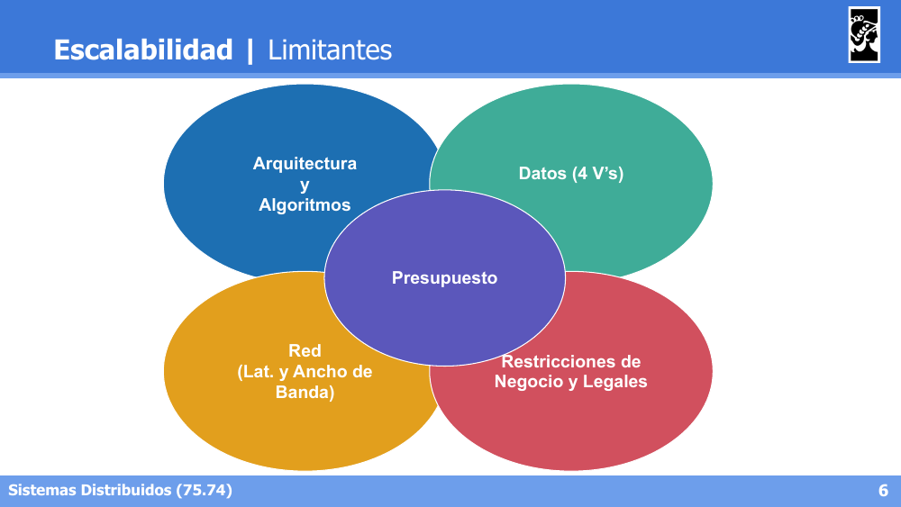

Los límites de la escalabilidad están dados por: **Arquitectura y Algoritmos**, **Datos (4 V's)**, **Red** (latencia y ancho de banda), **Restricciones de Negocio y Legales**, todo condicionado por el **Presupuesto**.

### Técnicas

- **Escalamiento vertical**: agregar recursos a un nodo.
- **Escalamiento horizontal**: redundancia, balanceadores de carga, proximidad geográfica.
- **Fragmentación de datos**: fraccionar para optimizar, manteniendo juntos los datos "cercanos".
- **Componentización**: separar servicios.
- **Optimizar algoritmos**: performance, mensajería.
- **Asincronismo**: mantener sincrónico solo lo estrictamente necesario (limitado por el negocio).

---

## 2. Elasticidad

### Introducción

- **Escalabilidad**: capacidad de un sistema para poder adaptarse a diferentes ambientes (*environments*) modificando los recursos del sistema. Término utilizado en muchos contextos.
- **Elasticidad**: capacidad de un sistema para poder **modificar dinámicamente** los recursos del sistema, adaptándose a patrones de carga. Término utilizado en Arquitecturas Cloud; requiere soporte de la infraestructura.

### Componentes

- **Application Load Balancer**: los servicios/instancias nuevas reciben tráfico; los servicios/instancias dados de baja/caídos/degradados dejan de recibir tráfico. (¿Cómo detectamos el estado de un servicio/instancia?)
- **Autoscaler**: *Scale In/Scale Out* en función de las métricas recolectadas. *Scale Out*: incrementa instancias. *Scale In*: decrementa instancias.
- **Monitoring Automático**: métricas sobre CPU, memoria, I/O, networking, etc. por cada servicio/instancia.

### Ejemplo N°1 — AWS

- **Application Load Balancer** (Amazon Elastic Load Balancer): redirecciona tráfico a instancias (EC2), incluso en diferentes zonas; interactúa con instancias para verificar estado (`/status` endpoint).
- **Autoscaler** (Amazon Autoscaling): el *Autoscaling group* permite definir `min`, `desired` y `max` instances; existen diferentes *policies* para distintos objetivos (dynamic vs manual scaling).
- **Monitoring Automático** (Amazon CloudWatch): métricas globales automatizadas; admite agregar métricas propias.

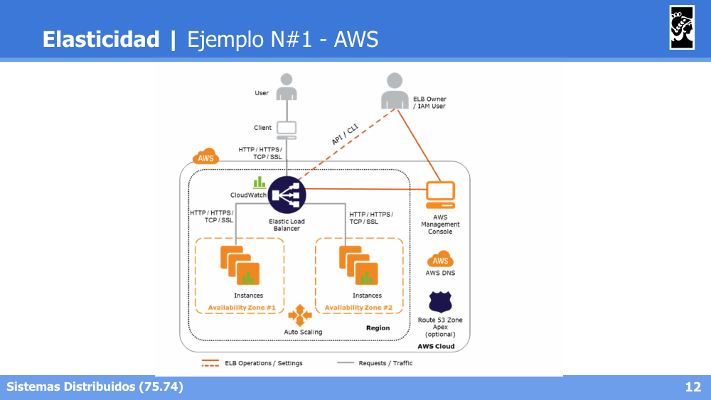

### Ejemplo N°2 — Kubernetes

- **Application Load Balancer** (Kubernetes Service): redirecciona tráfico a pods en estado **Ready**; *Liveness and Readiness probes* permiten al usuario indicar si un pod debe recibir tráfico o no.
- **Autoscaler** (Horizontal Pod Autoscale): se crea un recurso HPA asociado a un *deployment* en función de alguna métrica, ponderando las métricas de cada instancia/container: `desiredReplicas = ceil[currReplicas * (currMetricValue / desiredMetricValue)]`.
- **Monitoring Automático** (Kubernetes Metrics Server): colecta métricas de cada pod en el cluster y las expone en el API server, diseñado específicamente para autoscaling.

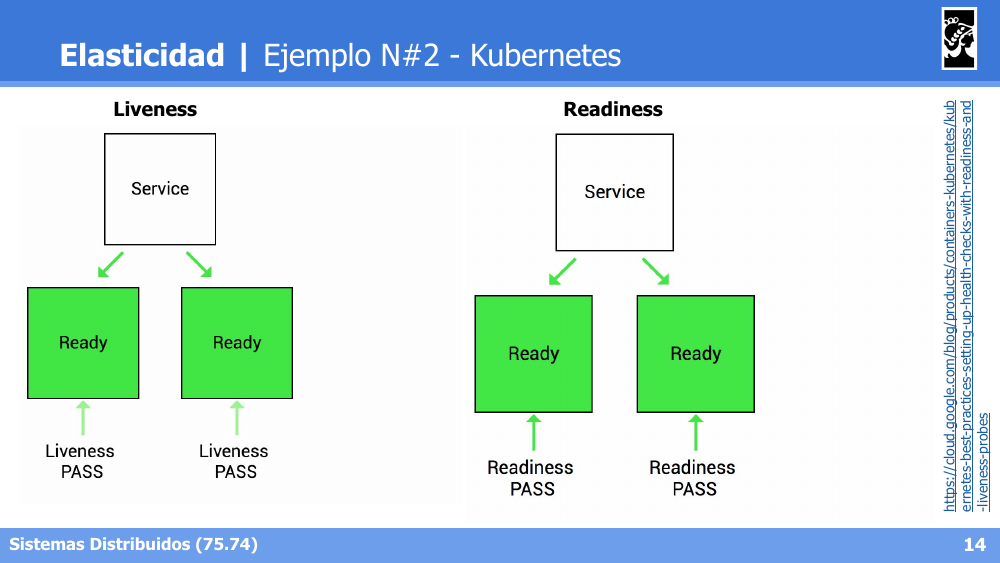

- **Liveness**: verifica si el contenedor sigue vivo (si falla, se reinicia).
- **Readiness**: verifica si el contenedor está listo para recibir tráfico (si falla, se lo saca temporalmente del balanceo sin reiniciarlo).


- **Control Plane**: API server, Cloud controller manager, Controller manager, `etcd` (persistence store), Scheduler.
- **Node**: `kubelet` y `kube-proxy` en cada nodo del cluster, gestionados por el Control Plane.

---

## 3. Alta Disponibilidad

### Introducción

Aún cuando ciertas propiedades de confiabilidad fallen para sistemas públicos, interesa que siempre estén disponibles:

```
P(system available) = 1 - P(failure)
```

Como `P(system available) < 1` siempre, lo importante es definir cuán cerca de 1 se encuentra:
- `P(system available) ~ 0,9` ⇒ **36,5 días caídos al año**.
- `P(system available) ~ 0,999` ⇒ **8,76 horas caídas al año**.

**La disponibilidad de un sistema se mide por la cantidad de 9's.**

### Cálculo de 9's

**Escenario: Sistema distribuido con un componente por nodo** (sin redundancia):

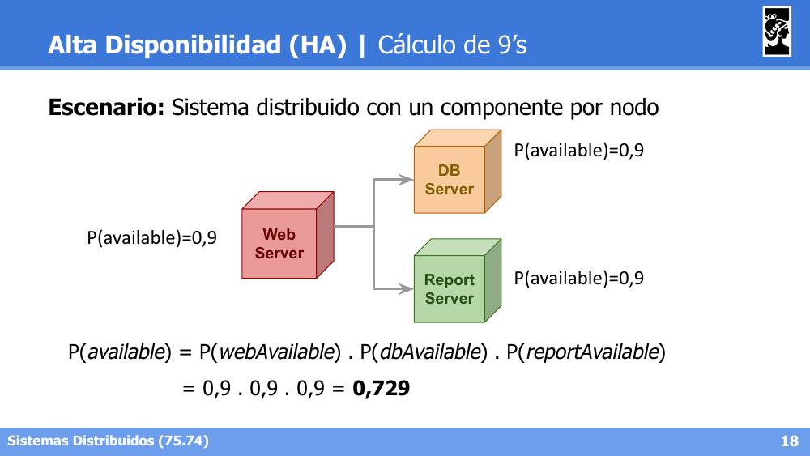

```
P(available) = P(webAvailable) . P(dbAvailable) . P(reportAvailable)
             = 0,9 . 0,9 . 0,9 = 0,729
```

Cuando los componentes están **encadenados** (dependen unos de otros sin redundancia), la disponibilidad total **se degrada** al multiplicarse las probabilidades.

**Escenario: Redundancia con todos los componentes en cada nodo:**

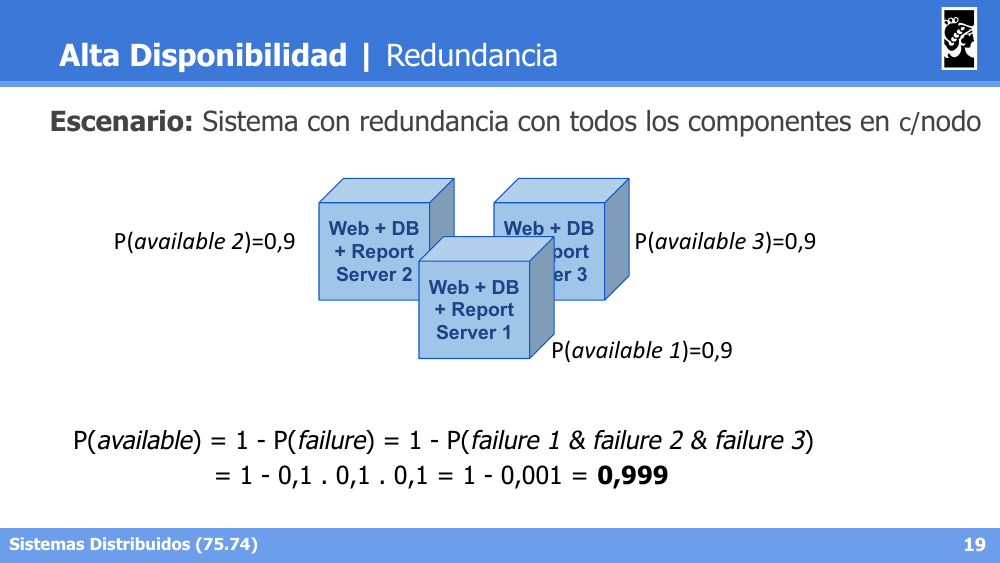

```
P(available) = 1 - P(failure) = 1 - P(failure1 & failure2 & failure3)
             = 1 - 0,1 . 0,1 . 0,1 = 1 - 0,001 = 0,999
```

Cuando los componentes están **replicados en paralelo**, la disponibilidad total **mejora** considerablemente (basta con que uno de ellos esté disponible).

**Escenario: Clusters para cada componente:**

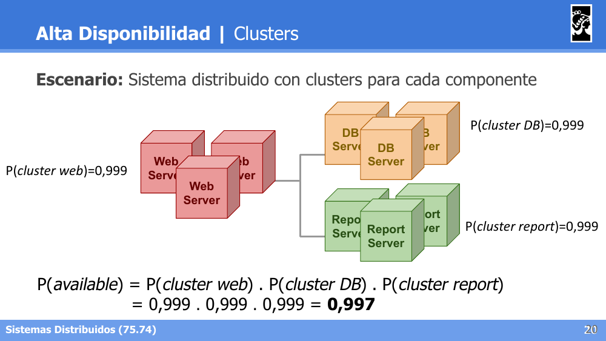

```
P(available) = P(cluster web) . P(cluster DB) . P(cluster report)
             = 0,999 . 0,999 . 0,999 = 0,997
```

Combinando clusters redundantes (alta disponibilidad interna) encadenados entre sí (dependencia entre componentes), se obtiene una disponibilidad global intermedia entre los dos escenarios anteriores.

### Terminología en la industria

- **SLA (Service Level Agreement)**: contrato/acuerdo de disponibilidad pactado con el cliente; define qué sucede si no se respeta (ej. BigQuery SLA).
- **SLO (Service Level Objectives)**: lo que se debe cumplir para no invalidar el SLA (ej. Availability > 99.95%).
- **SLI (Service Level Indicators)**: métricas a ser comparadas con los SLOs; siempre deben ser superiores al *threshold* del SLO; por lo general requiere una plataforma de *observability*; permite analizar el impacto del despliegue de los servicios.

### CAP Theorem

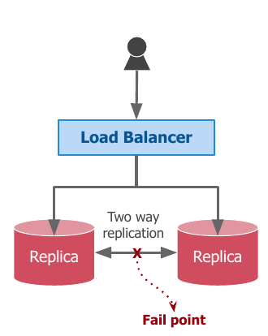

Eric Brewer ('98): en sistemas distribuidos con almacenamiento es posible garantizar solo **2 de los siguientes 3 atributos** frente a un particionamiento de red:
- **Consistency**: también conocida como repetibilidad de respuesta de todos los nodos frente a un mismo pedido.
- **Availability**: capacidad del sistema de responder a todo pedido.
- **Partition Tolerance**: capacidad de lidiar con la formación de grupos aislados de nodos.

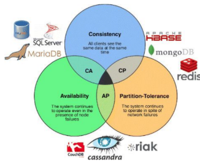

- Se puede sacrificar **Consistency** o **Availability**, pero no necesariamente es todo o nada.
- Sacrificar **Partition Tolerance** significa no proveer un sistema distribuido (ya que en un sistema realmente distribuido las particiones de red son inevitables).

---

## 4. Arquitecturas Orientadas a Servicios (SOA)

### Evolución en Arquitecturas

**Monolíticas:**

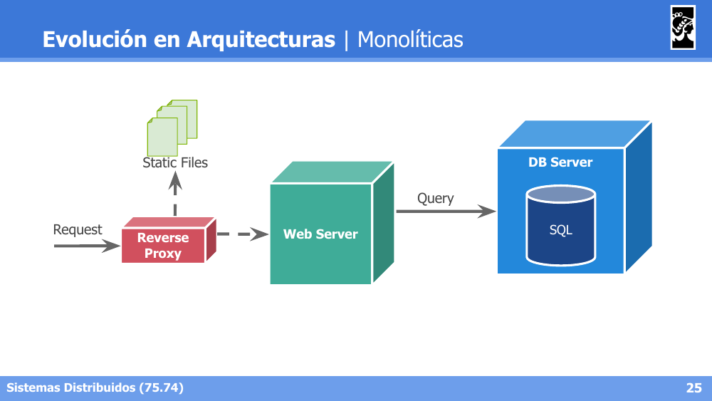

Un único Web Server atiende los requests (a través de un Reverse Proxy que también sirve Static Files) y consulta a un único DB Server.

**Monolíticas (Escalables):**

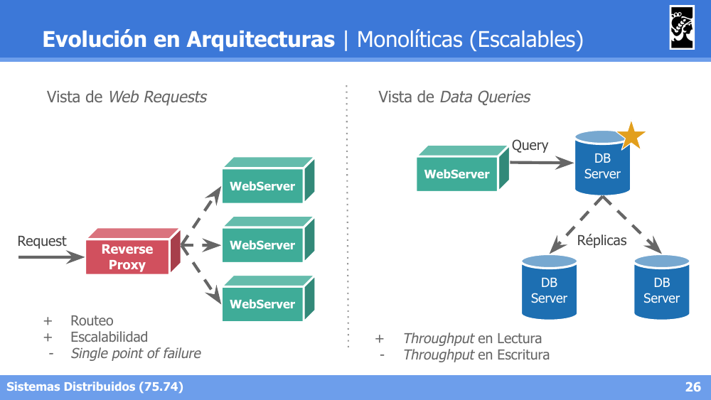

- **Vista de Web Requests**: el Reverse Proxy reparte requests entre múltiples WebServers. Ventaja: routeo y escalabilidad. Desventaja: *single point of failure* (el propio Reverse Proxy).
- **Vista de Data Queries**: el WebServer consulta a un DB Server principal, que tiene réplicas de solo lectura. Ventaja: throughput en lectura. Desventaja: throughput en escritura (sigue limitado por el nodo principal).

**Service Oriented Architecture (SOA):**


Componentes principales:
- **Service Registry**: registro de servicios disponibles.
- **Enterprise Service Bus (ESB)**: bus de comunicación entre componentes.
- **Orchestration Processes**: procesos de negocio (ej. Customer, Business-2-Business, Integration) que coordinan la invocación de Services.
- **Services**: servicios concretos (ej. Account Service, Book Service, Order Service, Shipping Service).
- **Data Services**: acceso a las bases de datos subyacentes.

#### SOA | Business Process Management (BPM)

SOA no es únicamente la definición de arquitecturas, sino un **paradigma orientado al ámbito corporativo**. Se complementa con el concepto de **Business Process Management (BPM)**:

> "... disciplina que involucra cualquier combinación de modelado, automatización, ejecución, control, medición y optimización de los flujos de actividad de negocio, en apoyo de los objetivos empresariales, abarcando sistemas, empleados, clientes y socios dentro y fuera de los límites de la empresa." (Palmer, Nathaniel. "What Is BPM". bpm.com, 2018)

#### SOA | Características de los Servicios

**Tecnologías:**
- **WebServices** = SOAP + HTTP.
- **ESB** preponderante para eventos.
- **Service Repository & Discovery** para comunicación punto a punto.

**Procesos y Servicios:**
- **Contract**.
- **Interface**.
- **Implementation**: Business Logic + Data Management.

### Microservicios

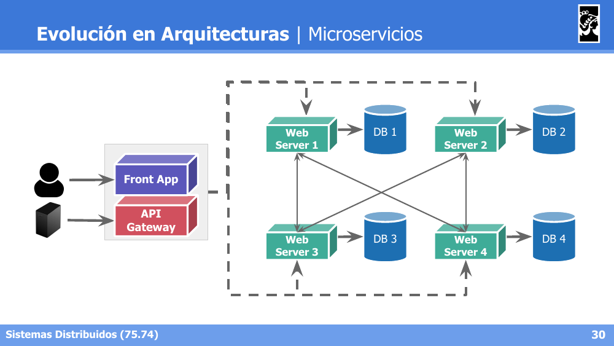

Cada Web Server (microservicio) tiene su propia base de datos dedicada (DB 1, DB 2, etc.) y se comunican entre sí según sea necesario; los clientes acceden a través de un **API Gateway** o **Front App**.

### Transición entre Arquitecturas

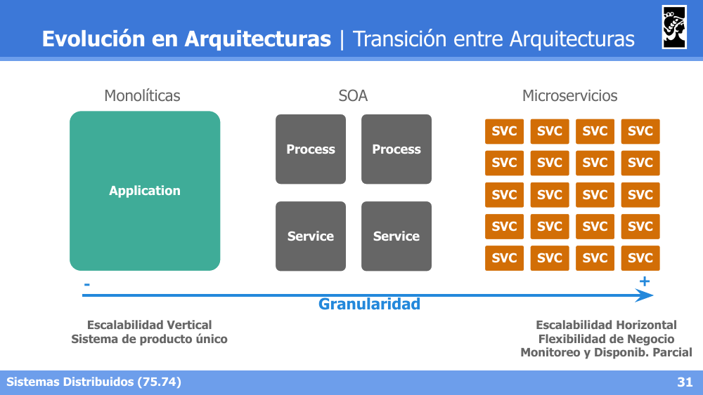

| Monolíticas | SOA | Microservicios |
|---|---|---|
| Escalabilidad Vertical, sistema de producto único | (granularidad intermedia) | Escalabilidad Horizontal, flexibilidad de negocio, monitoreo y disponibilidad parcial |

A medida que aumenta la **granularidad** (de monolítico a microservicios), se gana en escalabilidad horizontal, flexibilidad de negocio y capacidad de monitoreo/disponibilidad parcial del sistema.

### Serverless


- El código se organiza en **funciones** (Function 1, Function 2, ...) invocadas a través de un **HTTP Router** o un **Events Router**.
- Las funciones acceden a distintos *Stores* (bases de datos/almacenamiento) y a **External Services**.
- A pesar del nombre, **"serverless" no significa que no haya servidores** — significa que el desarrollador no gestiona directamente la infraestructura subyacente (el proveedor cloud se encarga de aprovisionar y escalar los servidores donde corren las funciones).
