# Sistemas Distribuidos I (75.74) — Clase 13: Data Intensive Applications

## 1. Datos en Sistemas de Gran Escala

### Flujo de Datos

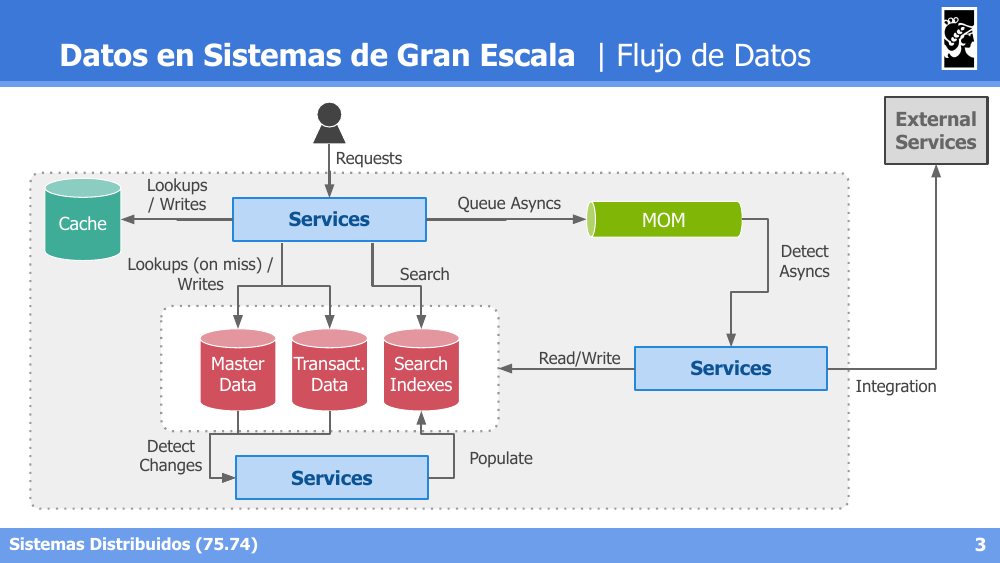

Un sistema de gran escala típico combina: **Cache** (lookups/writes rápidos), un **MOM** para encolar operaciones asíncronas, y tres tipos de almacenamiento de datos —**Master Data**, **Transactional Data** y **Search Indexes**— alimentados por servicios que detectan cambios y populan índices, además de un punto de **integración** con servicios externos.

### Transac. Data | Relacional vs NoSQL

Enfoques que nacen en los '60s y '70s: *hierarchical*, *network* & *relational model*.

- **Relacional**: predomina hasta 2010 con la estandarización de SQL. Almacenamiento en tablas y filas. Buen soporte para *joins*, relaciones *many-to-one* o *many-to-many*.
- **No Relacional | Not Only SQL (NoSQL)**: a partir del 2010, la industria impone otros almacenamientos: clave-valor, documentales, orientados a grafos, columnares. Beneficios claros para modelos afines: sin relaciones, *one-to-many* (jerárquicos), alta conectividad (grafos). Se adapta mejor a modelos con esquemas (*schemas*) cambiantes o no definidos.

### Transac. Data | Transaccional (OLTP) vs Analytics (OLAP)

- **Online Transaction Processing (OLTP)**: orientado a unidades lógicas: grupos de *reads/writes* (o transacciones). No necesariamente ACID.
- **Online Analytical Processing (OLAP)**: orientado a analizar el conjunto de los datos.

| | OLTP | OLAP |
|---|---|---|
| **Patrón de Read** | Pocos registros. Búsqueda por clave. | Agregación de muchos registros. |
| **Patrón de Write** | Acceso aleatorio. Registros pequeños. | Importaciones *batch* (ETLs) o *Streams*. |
| **Uso Principal** | Info maestra y transaccional para usuarios | Exploración de datos. Análisis estadístico. |
| **Datos** | Instantánea de los datos en el momento actual. Tamaños de MBs-GBs. | Histórico de los datos. Tamaños de TBs-PBs. |

### Almacenamiento | Relacional

- Normalmente: un archivo de almacenamiento por tabla.
- Relaciones entre tablas por *foreign-keys*.
- Lectura de toda la fila para retornar proyecciones.

Ejemplo — Tabla `Sales` (con `date_id`, `product_id`, `quantity`, `price`, `discount`) relacionada por `product_id` con la Tabla `Products` (`product_id`, `Name`, `price`).

### Almacenamiento | Columnar

- Normalmente: un archivo de almacenamiento **por columna**.
- Lectura de cada columna para retornar proyecciones.
- Grandes beneficios para **compresión**, **lectura** y **agregaciones**.

A diferencia del modelo relacional (que almacena fila por fila), el modelo columnar almacena cada columna como una secuencia contigua de valores (ej. la columna `quantity` se almacena como `2, 1, 3, 2, 10`), lo cual favorece mucho las consultas analíticas que agregan sobre pocas columnas de muchas filas.

### Almacenamiento | Cubos de Información

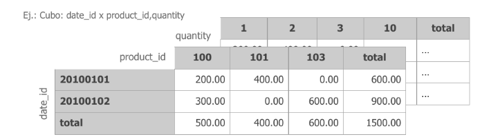
- Normalmente: mantienen **vistas materializadas** con pre-cálculos estadísticos.
- Se crean grillas agrupadas por diferentes dimensiones.
- Operaciones como **SUM, COUNT, MAX, MIN, AVG** se consultan a estos cubos (en el ejemplo, un cubo cruzando `date_id` x `product_id` x `quantity`).

---

## 2. Replicación y Particionamiento

### Replicación | Leader based

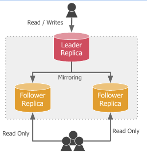

- Una réplica se designa como **master** o **leader**.
- Otras réplicas se designan **mirrors**, **slaves** o **followers**.
- Solo se aceptan **escrituras en el leader**. Tanto el leader como los followers aceptan **lecturas**.
- La replicación puede ser **síncrona** o **asíncrona**.
- Problemas de la replicación: *Read your own writes*, *Monotonic reads*.

### Replicación | Multi-leader based

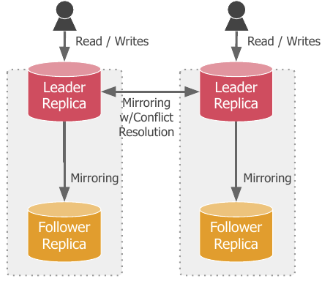

- Modelo normal en escenarios de **múltiples data-centers**.
- Frente a caídas de un data-center, se puede promover al otro como líder global.
- Problemas de la replicación: idem a *leader based*, más la posibilidad de **conflictos por concurrencia**.
- Otros inconvenientes: manejo de *triggers*, claves incrementales, integridad de relaciones.

### Replicación | Leaderless based

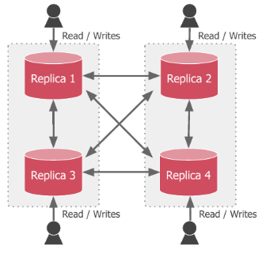

- Sistema de replicación **totalmente distribuido**.
- Las réplicas deben **sincronizarse mutuamente**.
- Se pueden definir topologías para la sincronización: **anillo, jerárquicas, todos contra todos**.
- Los **conflictos son muy frecuentes** a menos que se particione.
- Otra alternativa es conseguir un **consenso** entre las réplicas para aplicar escrituras.

### Particionamiento | Motivaciones

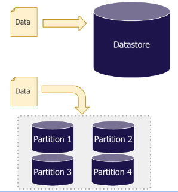

Distintos puntos de contacto con la estrategia de Replicación:
- **Performance**: velocidades de escritura, velocidades de lectura.
- **Conflictos**: evitar colisiones y/o resolución de conflictos.
- **Redundancia**: permite recuperación frente a fallos.

### Particionamiento | Horizontal

- La información se segrega **por registros** entre cada partición.
- El registro se encuentra en **UNA** partición a la vez.

Ejemplo: la tabla `Sales` se divide en dos particiones según el `date_id` — los registros del `20100101` van a una partición, y los del `20100102` a otra.

### Particionamiento | Vertical

- La información se segrega respecto de sus **atributos/dimensiones/campos** entre cada partición.
- El registro se encuentra en **TODAS** las particiones.

Ejemplo: la tabla `Sales` se divide en una partición con las columnas `date_id, product_id, qty, price` y otra con `date_id, product_id, disc` — cada fila completa requiere consultar ambas particiones.

### Particionamiento | Función de Partición

- Por *Value-of-Key*.
- Por *Range-of-Keys*.
- Por *Hash-of-Key*.
- Mixtos:
  - Generar N *shards* por cada *key*.
  - Partición por claves secundarias.

### Particionamiento | Enrutamiento

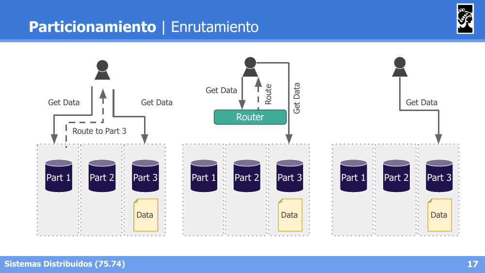

- **Cualquier partición + redirección**: el cliente contacta cualquier partición; si no tiene los datos, esta lo redirige a la partición correcta (`Route to Part 3`).
- **Router centralizado**: el cliente consulta siempre a un componente **Router**, que conoce la ubicación de cada dato y lo redirige a la partición correcta.
- **Cliente con conocimiento directo**: el cliente ya sabe en qué partición se encuentran los datos y accede directamente a ella, sin intermediarios.

---

## 3. Distributed Shared Memory (DSM)

### Objetivo, Ventajas y Desventajas

- **Objetivo**: brindar la **ilusión** de una memoria compartida centralizada.
- **Ventajas**: muy intuitivo para el desarrollo de sistemas distribuidos (los algoritmos no distribuidos pueden ser traducidos fácilmente); información compartida entre nodos sin que requieran conocerse.
- **Desventajas**: desalienta la distribución, genera latencia, cuello de botella y punto único de falla (arquitectura cliente-servidor).

### DSM | Enfoque Naive

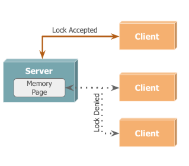

- La información es almacenada en memoria por el servidor.
- Los clientes acceden mediante *requests* a escribir o leer las páginas.
- El servidor puede garantizar la consistencia muy fácilmente **serializando los requests**.
- **Muy baja performance** para las aplicaciones cliente.

### DSM | Migración de Memory Pages

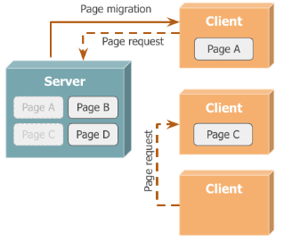

- La información es almacenada en memoria por el servidor y **delegada en los clientes**.
- Los clientes pueden optimizar la localidad de acceso pidiendo una *memory page* prestada.
- Otros clientes pueden pedir la misma página y quedar **bloqueados**, salvo que se permita una **sub-delegación**.
- Garantiza consistencia: no se accede concurrentemente a las páginas.

### DSM | Replicación de Memory Pages (solo lectura)

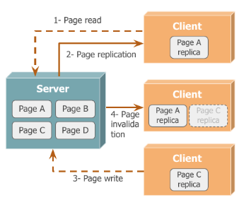

- Favorece escenarios con **muchas lecturas y pocas escrituras**.
- Las **escrituras son coordinadas por el servidor**.
- Las lecturas implican una replicación de la página en modo **read-only**.
- El servidor **invalida las réplicas** frente a cambios (Page write → Page invalidation).

### DSM | Replicación de Memory Pages (lectura-escritura)

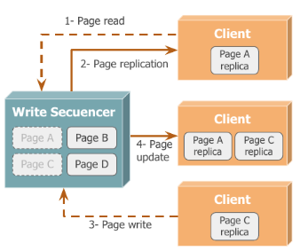

- El servidor mantiene las páginas de memoria hasta que los clientes las requieren.
- Los **clientes toman control total de las réplicas**.
- El servidor se transforma en un **Write Sequencer** (secuenciador de las operaciones), propagando las actualizaciones (*Page update*) a las demás réplicas.
- El servidor también aplica los cambios ante caídas de los clientes.

---

## 4. Distributed File Systems (DFS)

### Motivaciones

- Compartir archivos en redes locales e intranets.
- Poseer un esquema centralizado de información persistente: control de **Backups**; control de **acceso y monitoreo**.
- Optimización de recursos por la concentración: discos de mayor capacidad permitían economizar; el costo de administración se reduce.

### Factores de Diseño

- **Transparencia a los clientes**:
  - **Acceso**: obtención de los recursos con credenciales usuales.
  - **Localización**: operación de los archivos como si fueran locales.
  - **Movilidad**: el movimiento interno de archivos no debe ser percibido.
  - **Performance y Escala**: las optimizaciones no deben afectar al cliente.
- **Concurrencia**: el acceso concurrente no debe requerir operaciones particulares al cliente.
- **Heterogeneidad de Hardware**: adaptación automática a diferentes HWs.
- **Tolerancia a Fallos**: capacidad de ocultar o minimizar los fallos (permitir operaciones como *at-least-once* o *at-most-once*).

### Caso de Estudio: Network File System (NFS)

- Diseñado para ser independiente de plataformas (pero desarrollado sobre UNIX).
- Primera versión en **1984 por Sun Microsystems**.
- Requiere una nueva abstracción en el kernel: **Virtual File System (VFS)**.
- Arquitectura de **cliente-servidor** utilizando **RPC sobre TCP o UDP**.
- Las aplicaciones utilizan el VFS para acceder a los archivos, lo que requiere una invocación remota.
- Los servidores proveen operaciones idénticas a las requeridas por **Posix**, soportando ser montado como una unidad virtual.


**Instalación Servidor-Cliente:**
```bash
# Server
apt-get install nfs-kernel-server
vim /etc/idmapd.conf
  # [Translation]
  # Method = nsswitch
vim /etc/exports
  # /export 192.168.1.0/24 (...)

# Client
apt-get install nfs-common
mount -t nfs -o proto=tcp,port=2049 <nfs-server-IP>:/ /mnt
```

### Caso de Estudio: Hadoop DFS (HDFS)

- Sistema de archivos distribuido diseñado para utilizar **hardware de bajo costo**.
- Implementación de Apache basada en el diseño de **Google File System (GFS)**.
- **No soporta POSIX**, por lo que se lo considera un *Data Storage* en lugar de un FS.
- Base del ecosistema de tecnologías Hadoop para procesamiento distribuido.

**Factores de Diseño:**
- **Tolerancia a Fallos**: los fallos de HW son normales; es más económico adaptarse que defenderse.
- **Volumen y Latencia**: favorece las operaciones de *streaming* y los archivos volumétricos frente a operaciones de usuarios finales de baja latencia.
- **Portabilidad**: preparado para ser utilizado en hardware de bajo costo. Utiliza TCP entre servidores y RPC con clientes.
- **Performance**: favorece operaciones de lectura. Política de *write-once-read-many*.

> "Moving Computation is Cheaper than Moving Data"

**Arquitectura:**


- Arquitectura **maestro-esclavo**.
- **Namenode**: contiene la información de *metadata* de archivo. Coordina a los Datanodes.
- **Datanodes**: almacenan los datos de archivo.
- Los clientes consultan al Namenode por el 'File system' y la ubicación de los datos; luego se comunican con los Datanodes para obtener la información.

**Almacenamiento de Datos:**

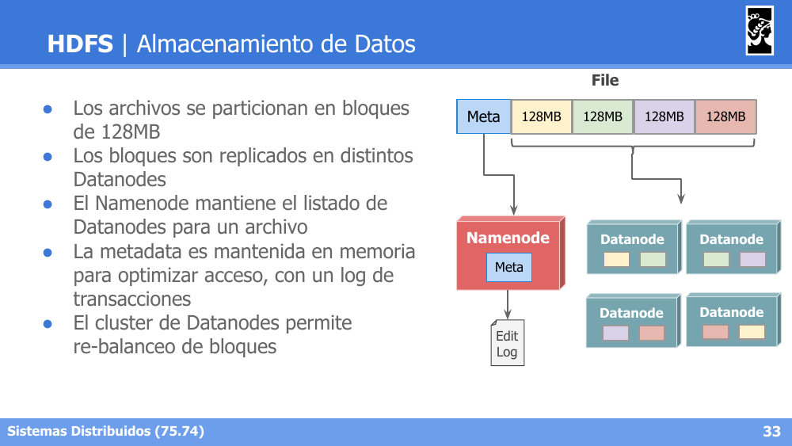

- Los archivos se particionan en **bloques de 128MB**.
- Los bloques son **replicados** en distintos Datanodes.
- El Namenode mantiene el listado de Datanodes para un archivo.
- La metadata es mantenida **en memoria** para optimizar el acceso, con un **log de transacciones** (*Edit Log*).
- El cluster de Datanodes permite **re-balanceo** de bloques.

**Acceso a Datos:**

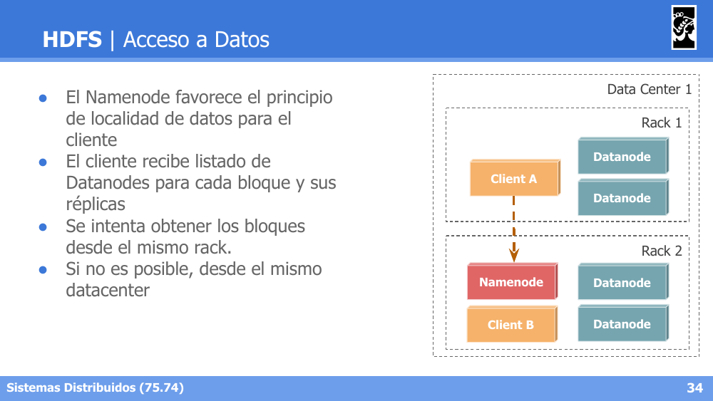

- El Namenode favorece el principio de **localidad de datos** para el cliente.
- El cliente recibe el listado de Datanodes para cada bloque y sus réplicas.
- Se intenta obtener los bloques desde el **mismo rack**.
- Si no es posible, desde el **mismo datacenter**.
