# Sistemas Distribuidos I (75.74) — Clase 16: Arquitecturas Cloud

## 1. Cloud Computing

### Definición

- Metáfora para internet y todo el contenido que ofrece.
- "Todo lo que se pueda consumir más allá del firewall…"
- Una forma de **ofrecer recursos de IT**, no necesariamente una nueva tecnología.
- **Networking + Infraestructura + Nuevas Plataformas + Servicios**.

### Niveles de Abstracción

- **IaaS** (base de la pirámide): Amazon EC2, Rackspace, VMware, Google Cloud Storage.
- **PaaS** (nivel medio): Google App Engine, Force.com, Windows Azure, Amazon Elastic Beanstalk.
- **SaaS** (tope de la pirámide): Google Apps, Salesforce.com, Netsuite, Hotmail.

### Todo como un Servicio

- **Infrastructure as a Service (IaaS)**: almacenamiento y virtualización de equipos; definir redes y técnicas de adaptación para capacidad frente a cargas.
- **Platform as a Service (PaaS)**: frameworks y plataformas para desarrollar aplicaciones *Cloud ready*; recursos expuestos como servicios para el desarrollo y manejo del ciclo de vida de las aplicaciones (logs, monitoring, etc).
- **Software as a Service (SaaS)**: software a demanda, alquiler de servicios; amplia variedad de soluciones genéricas y adaptables; protocolos abiertos y arquitecturas pensadas para integración.

### Servicios Automanejados

A medida que se avanza desde **Traditional On-Premises** hacia **IaaS → Containers as a Service (CaaS) → PaaS → Function as a Service (FaaS) → SaaS**, el proveedor cloud va asumiendo progresivamente la responsabilidad de más capas (Hardware, Virtualization, OS, Runtime, Scaling), dejando al usuario cada vez menos por gestionar (hasta llegar en SaaS a solo *Data & Configurations*).

### Principales Beneficios

- **Accesibilidad**: *Access anywhere*. Movilidad y visibilidad constante de los recursos.
- **Time-to-Market**: disponibilidad instantánea de los recursos.
- **Escalabilidad**: capacidades 'ilimitadas' de recursos para manejar volúmenes (almacenamiento, ancho de banda, cómputo, memoria, etc.).
- **Costos**: pago a demanda (*Pay as you go*); control del gasto dependiendo del uso; accesibilidad + escalabilidad + confiabilidad realmente barata.

### Cloud Pública vs Privada

| Cloud Pública | Cloud Privada |
|---|---|
| Servicios públicos | Servicios privados |
| Servidores compartidos con otros usuarios | Datacenter propio de la empresa |
| Disponibilidad de recursos garantizados con SLAs | Recursos dedicados |
| Costos variables. 'Pay as you go' | Costos fijos de mantenimiento y expansión |
| Se accede mediante internet | Se accede mediante intranet |

### Adopción y Resistencia al Cambio

- **Factores Políticos**: licenciamiento, jurisdicción y pérdida de gobernabilidad sobre los datos; incapacidad de influir sobre la toma de decisiones que afecta al hardware.
- **Factores Técnicos**: costos monetarios y de tiempo para migraciones de datos y software; alta exposición de datos sensibles; adaptación de los sistemas a los nuevos modelos de arquitectura cloud.

---

## 2. Platform as a Service (PaaS)

- **Infraestructura**: servidores y red virtualizados; entornos de despliegue; todo como IaaS.
- **Plataforma de Desarrollo**: runtime de programación; sistema operativo; librerías; middlewares.
- **Persistencia**: base de datos; archivos blob; colas de mensajes; todo como PaaS.
- **Monitoreo**: log de actividades; control de acceso; dashboard de recursos; alertas y acciones frente a caídas.
- **Escalabilidad**: balanceo de cargas; creación y destrucción de nodos automática.

### Google Ecosystem

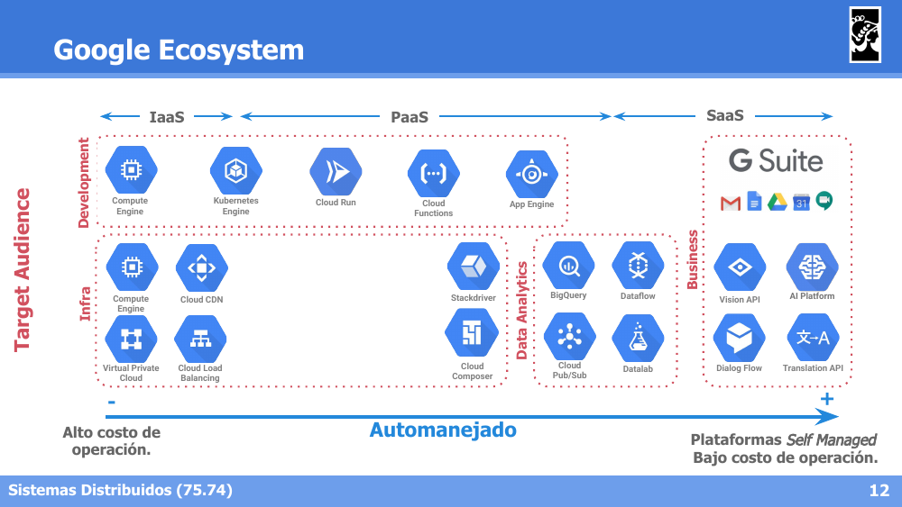

El ecosistema de Google Cloud organiza sus productos según el nivel de abstracción (**IaaS**: Compute Engine, Virtual Private Cloud; **PaaS**: Kubernetes Engine, Cloud Run, App Engine, BigQuery, Cloud Pub/Sub; **SaaS**: G Suite, Vision API, Dialog Flow) y según la audiencia destino (Development, Infra, Data Analytics, Business), yendo de **alto costo de operación** (más control, menos automanejado) a **bajo costo de operación** (plataformas *Self Managed*).

### Infraestructuras Escalables | Modelo AppEngine

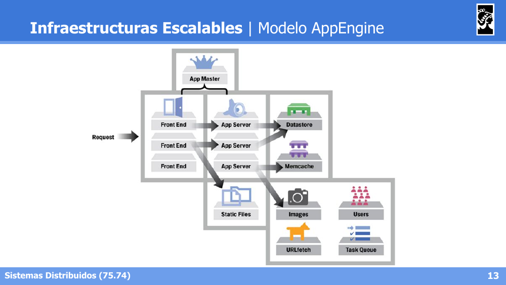

---

## 3. Caso de Estudio: Google AppEngine y Datastore

### Objetivos de Diseño

- Las **buenas prácticas son forzadas**:
  - Sistemas granulares.
  - Escalamiento horizontal.
  - Requests breves, con posibilidad de encolar requests largos.
  - Independencia del SO y Hardware.
- Servicios de aplicación ya integrados: Cache, colas de mensajes, elasticidad, versionado, herramientas de log/debugging/monitoreo, modelos no-relacionales con Datastore/BigTable.

### Arquitectura Interna

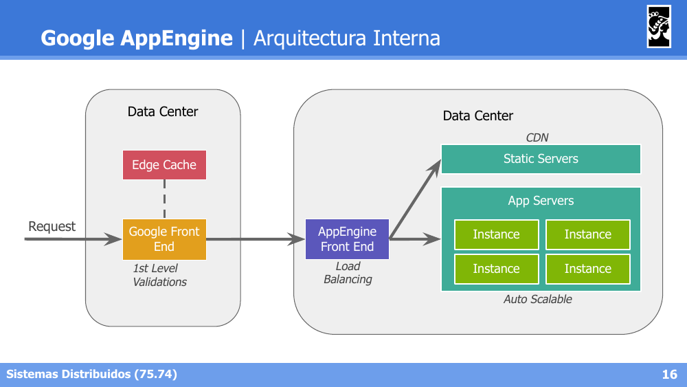

El request atraviesa: **Edge Cache** + **Google Front End** (validaciones de primer nivel) → **AppEngine Front End** (balanceo de carga) → **Static Servers** (CDN) o **App Servers** (instancias auto-escalables).

### Microservicios en AppEngine

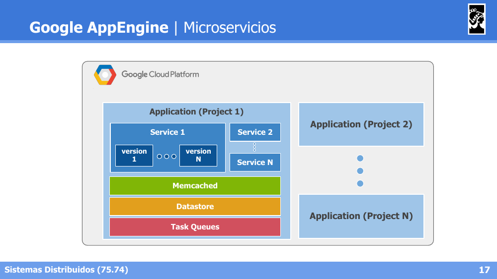

- **Servicios = Módulos**: permiten mantener unidad entre las operaciones soportadas; pueden desplegarse distintas versiones; para cada versión puede existir una o más instancias.
- **Instancias = AppServers = Backend Servers**: son la unidad de procesamiento, clasificadas en:
  - **Dinámicas**: son creadas por los requests.
  - **Residentes**: escaladas de forma manual.

### Instancias de Procesamiento

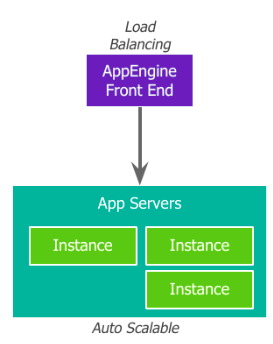

- **Instancias Dinámicas**: se crean dinámicamente; procesan requests pequeños; fuerzan respuestas rápidas y manejo sin estado (*stateless*); pueden aceptar requests externos (GET) e internos (mensajes en colas 'push').
- **Instancias Residentes**: creadas de forma manual mediante configuración; no existen límites para su empleo y se puede elegir su capacidad de cómputo; procesan requests largos, especialmente en *batchs* con o sin estado.

### Comunicación Interna

Los componentes internos de AppEngine (Front, Back, CRON) se comunican a través de **Push Queues** y **Pull Queues**, compartiendo (agrupados por *namespace*) el acceso a **Datastore** y **Memcached**.

### Tipos de Colas

- **Push Queue**: envía los requests a instancias activas. La URL define la instancia, servicio y versión para atender el mensaje. El *payload* está dado por los argumentos en la URL y headers.
- **Pull Queue**: permite encolar tareas a ser consumidas de forma controlada. Es el enfoque más usual de colas de tareas y se puede reemplazar por colas PubSub.

### Colas Pull y Leasing de Mensajes

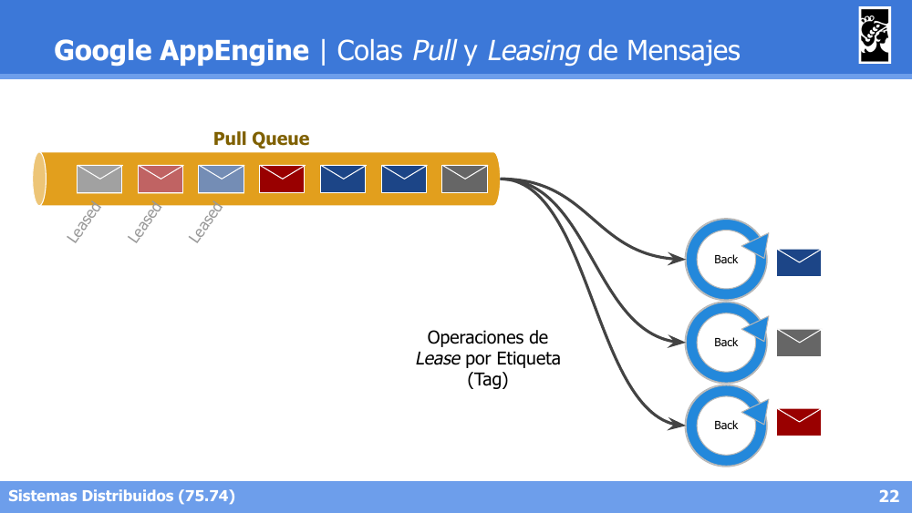

Los mensajes de una **Pull Queue** pueden estar en estado *Leased* (ya tomados por algún consumidor) o disponibles; los consumidores (*Back*) realizan operaciones de **Lease por Etiqueta (Tag)** para tomar mensajes específicos de la cola de forma controlada.

### Almacenamiento | Datastore

- Base **no-SQL administrada por Google**, accesible en modalidad PaaS.
  - Modelo de objetos con atributos: **Entities**.
  - Tipos sin esquema con atributos indexables: **Kinds**.
- **Altamente escalable** (volumen de datos):
  - Basada en **BigTable** (que es soportada por un Google FS: **Colossus**).
  - Soporta entidades de hasta **1MB**.
  - Soporta consultas por **Key** o por **atributos indexados**.
  - **Millones de escrituras por segundo**. No es bueno para consultas.
  - Operaciones **ACID** incluso entre entidades.

### Particionamiento del Almacenamiento

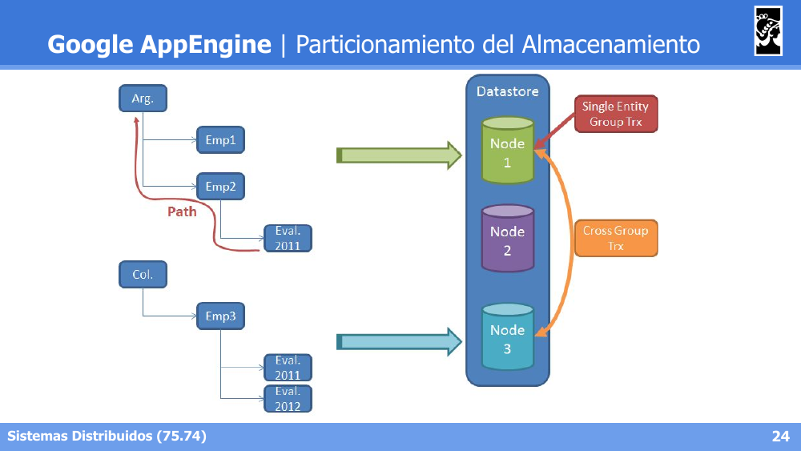

Las entidades del Datastore se organizan en **jerarquías** (*Path*, ej. `Arg → Emp2 → Eval.2011`) que se reparten entre distintos nodos del cluster. Las transacciones dentro de un mismo **Entity Group** (rama jerárquica) son simples (*Single Entity Group Trx*); las transacciones que abarcan múltiples grupos requieren coordinación adicional (*Cross Group Trx*).

---

## 4. BigTable

### Columnas

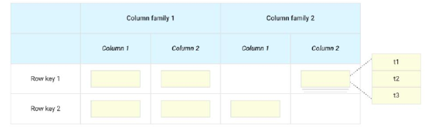

**Claves, datos y columnas:**
- Solo almacena pares **clave-datos**.
- Los datos son en realidad un conjunto de valores (o columnas).
- Al tratarse de conjuntos dispersos (*sparse*), los valores no se almacenan en un orden definido, sino que conocen su **'column family'**. Cada celda puede tener múltiples versiones a lo largo del tiempo (t1, t2, t3).

### Tablets

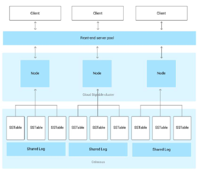

- **Tablets**: conjunto de filas **consecutivas** de acuerdo a la clave.
- Es la **unidad de balanceo** de BigTable. Permite escalar el sistema.

### Jerarquía

La jerarquía de BigTable tiene **solo 3 niveles** (Root Metadata → 2nd level tablets → User Level Table), similar a **Árboles B+**.

### Diseño del Modelo

**Ventajas:**
- Operaciones **atómicas por clave**.
- Lecturas por **rangos de claves** → Principio de Localidad de datos.
- **Versionado de celdas**.

**Restricciones:**
- **Imposibilidad de crear índices**: hay que organizar el indexado en base a la clave, o simular índices con duplicación de datos en nuevas tablas.
- **Imposibilidad de crear contextos de transacción *cross-keys***.

### Arquitectura

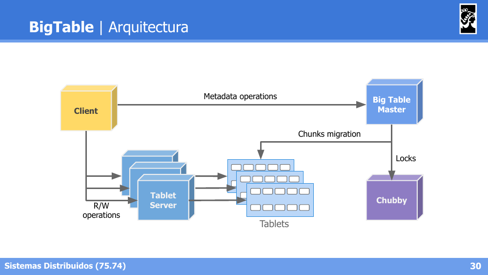

- El **Client** realiza operaciones de metadata con el **BigTable Master**, y operaciones de **R/W** directamente con los **Tablet Servers**.
- El **BigTable Master** coordina la **migración de chunks** entre Tablet Servers y gestiona **locks** a través de **Chubby** (servicio de coordinación/locking distribuido de Google).

### Balanceo de Datos

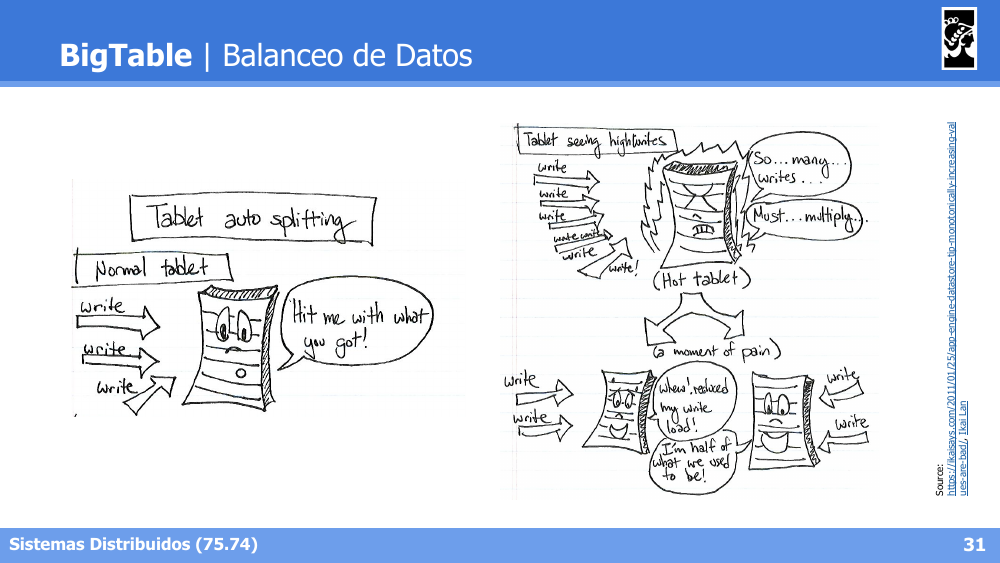

- **Tablet auto-splitting**: un *tablet* normal recibe escrituras sin problema, pero si se convierte en un **"hot tablet"** (recibe muchísimas escrituras concentradas), BigTable lo divide automáticamente en dos tablets más chicos para distribuir la carga.

**División de Tablets — Caso No Exitoso:**

- Si las claves son **monótonamente crecientes** (ej. timestamps, IDs autoincrementales), todas las escrituras nuevas siempre caen en el **mismo tablet** (el de las claves más altas), por lo que dividir el tablet **no soluciona** el problema de concentración de escrituras: el nuevo tablet "caliente" sigue recibiendo toda la carga.
- La solución (caso exitoso, no mostrado en detalle aquí) es usar claves **distribuidas aleatoriamente** (ej. hash del ID), de forma que las escrituras se reparten naturalmente entre distintos tablets a medida que se dividen.

> **Lección de diseño clave**: al definir el *row key* en BigTable (y sistemas similares basados en rangos), evitar claves monótonamente crecientes si se esperan altas tasas de escritura, ya que generan un punto caliente (*hot tablet*) que no se resuelve con el particionamiento automático.
