# Sistemas Distribuidos I (75.74) — Clase 17: Tolerancia a Fallos

## 1. Introducción a Tolerancia a Fallos

### Cadena Fault → Error → Failure

Un **fallo (fault)** es la causa raíz, que puede generar un **error** (estado incorrecto interno del sistema), que a su vez puede manifestarse como una **falla (failure)**, es decir, una desviación observable del comportamiento esperado del sistema. No todo fault deriva necesariamente en error, ni todo error deriva necesariamente en failure (puede ser enmascarado).

Se presentan ejemplos de esta cadena: por ejemplo, un bug en el código (fault) puede producir un cálculo incorrecto (error) que finalmente se traduce en una respuesta errónea al usuario (failure).

### Definición de Tolerancia a Fallos

**Tolerancia a fallos**: capacidad de un sistema de continuar operando correctamente (o degradado de forma controlada) a pesar de la presencia de fallos en alguno de sus componentes.

### Clasificación de Fallos

Los fallos se clasifican según su **duración**:
- **Transitorios**: ocurren una vez y desaparecen.
- **Intermitentes**: ocurren, desaparecen y vuelven a ocurrir de forma errática (los más difíciles de diagnosticar).
- **Permanentes**: persisten hasta que el componente es reparado o reemplazado.

Y según el **tipo de comportamiento incorrecto** que producen:
- **Crash**: el componente se detiene y no vuelve a responder.
- **Timing**: la respuesta llega fuera del intervalo de tiempo esperado.
- **Omission**: el componente no responde a una solicitud.
- **Response (valor o estado)**: el componente responde, pero con un valor incorrecto o transicionando a un estado incorrecto.
- **Byzantine (arbitrario)**: el componente puede producir cualquier tipo de error, incluso de forma maliciosa o inconsistente para distintos observadores; es la categoría más difícil de tolerar.

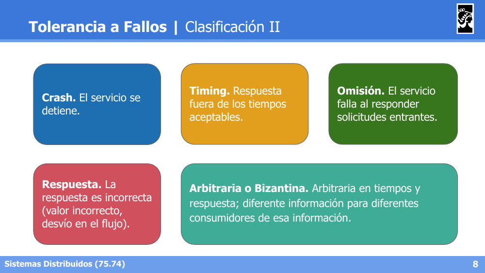

También se distingue entre **condiciones ambientales** (hardware, red, energía, condiciones físicas) y **condiciones operacionales** (errores de software, errores humanos, configuración) como origen de los fallos.

### Estrategias de Manejo de Fallos

- **Fault removal**: eliminar el fallo antes de que ocurra (testing, code review, verificación formal).
- **Fault prevention**: diseñar el sistema para evitar que el fallo se introduzca.
- **Fault forecasting**: estimar la presencia y consecuencias futuras de fallos (análisis de riesgo, modelos predictivos).
- **Fault tolerance**: aceptar que los fallos van a ocurrir y diseñar el sistema para seguir funcionando a pesar de ellos (foco principal de la materia).

---

## 2. Resiliencia (o Confiabilidad)

La **resiliencia** (*dependability*) de un sistema se describe mediante varias propiedades:

- **Availability (disponibilidad)**: el sistema está listo para ser usado en todo momento.
- **Reliability (confiabilidad)**: el sistema opera de forma continua sin fallar.
- **Durability**: los datos persisten y no se pierden ante fallos.
- **Safety**: ausencia de consecuencias catastróficas, aun ante fallos.
- **Maintainability**: facilidad para reparar el sistema tras un fallo.

### Recuperación (Recovery)

Técnicas para volver a un estado correcto luego de detectar un error:

- **Checkpointing**: guardar periódicamente el estado del sistema para poder retomar desde el último punto válido en caso de fallo (*rollback*).
- **Message logging**: registrar los mensajes intercambiados entre procesos, de forma de poder reconstruir el estado retransmitiendo mensajes en lugar de (o además de) hacer checkpoints completos.
- **Consenso**: utilizar algoritmos de consenso para que los nodos sobrevivientes acuerden el estado correcto del sistema tras un fallo.

### Redundancia y Replicación

La redundancia es la estrategia central de tolerancia a fallos: duplicar componentes (hardware, procesos, datos) para que la falla de uno no implique la falla del sistema completo. Tipos de replicación:

- **Pasiva**: un nodo primario procesa todas las solicitudes y replica su estado periódicamente a los nodos *backup*, que no procesan solicitudes hasta que el primario falla.
- **Activa**: todos los nodos replicados procesan las mismas solicitudes en paralelo y de forma determinística, manteniéndose sincronizados todo el tiempo.
- **Semi-activa (leader-follower)**: un nodo líder coordina y los demás (*followers*) ejecutan las mismas operaciones pero bajo la coordinación del líder, combinando características de ambos esquemas.

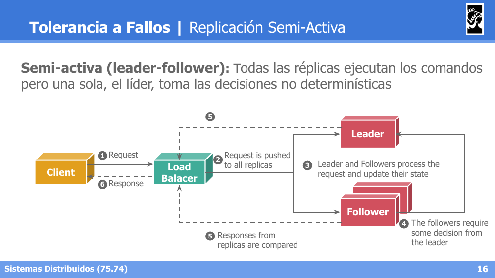

### Disponibilidad (Availability)

La disponibilidad suele expresarse en términos de "9's" (por ejemplo, 99.9%, 99.99%, etc.), donde cada nueve adicional reduce drásticamente el tiempo de inactividad tolerado por año. Se ilustra el uso de **clusters de servidores redundantes** distribuidos para sostener altos niveles de disponibilidad.

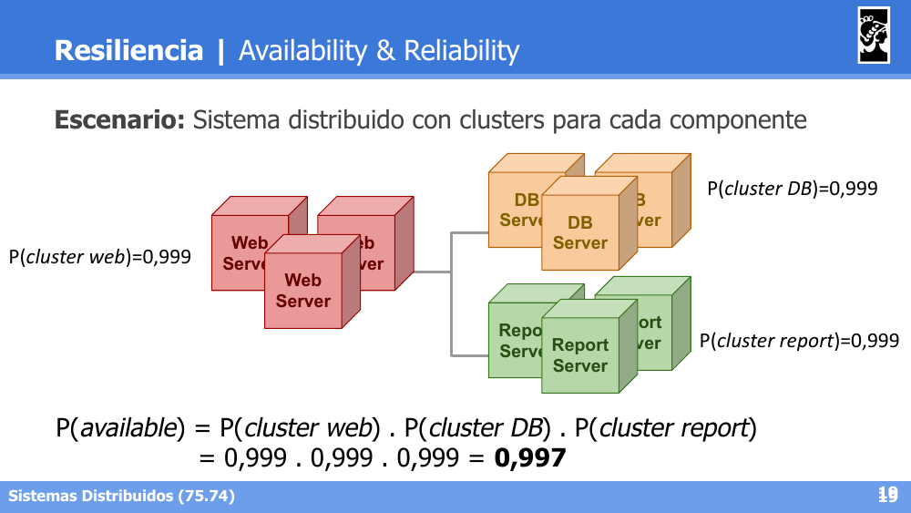

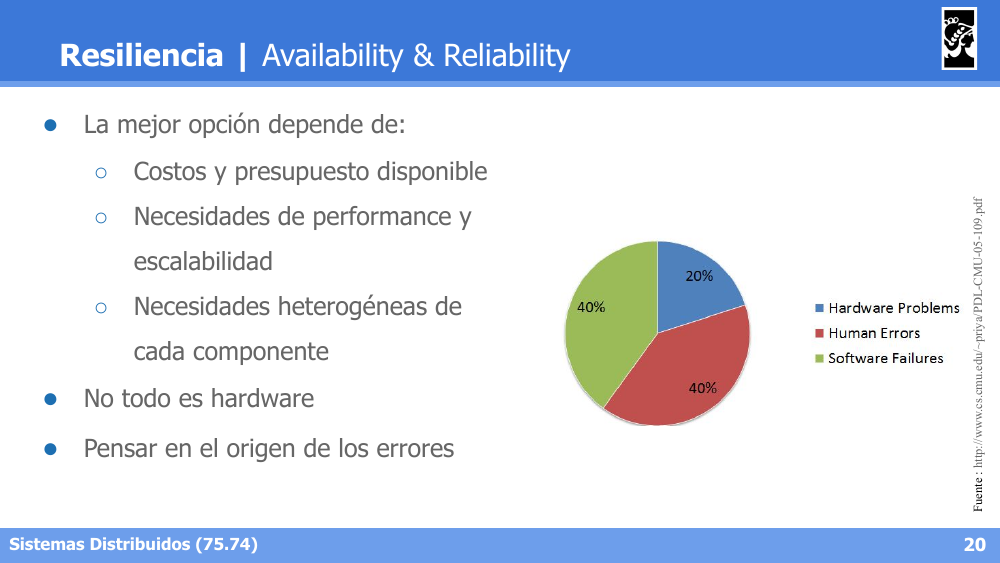

### Maintainability: Infraestructura Mutable vs. Inmutable

- **Infraestructura mutable**: los servidores se actualizan/parchean "in-place"; con el tiempo acumulan configuraciones manuales difíciles de reproducir (*configuration drift*).
- **Infraestructura inmutable**: ante un cambio, en lugar de modificar el servidor existente se crea una nueva instancia desde cero (imagen) y se reemplaza la anterior, garantizando reproducibilidad y facilitando el rollback.

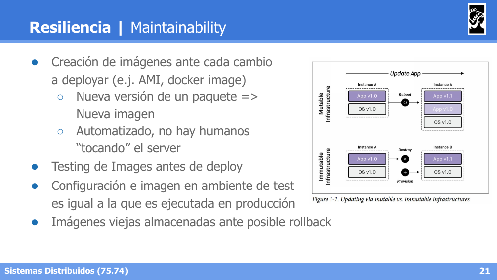

Este enfoque se apoya en pipelines de **CI/CD** (integración y despliegue continuo), que automatizan build, testing y despliegue de nuevas versiones inmutables del sistema.

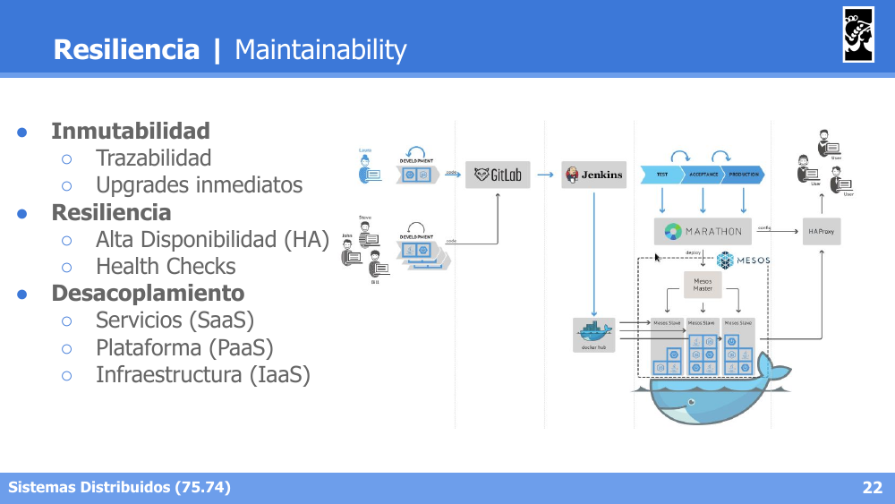

### Safety y Disaster Recovery

La propiedad de **safety** exige que, incluso ante un fallo, el sistema no produzca consecuencias catastróficas. Esto se vincula con estrategias de **Disaster Recovery (DR)**: planes y mecanismos (backups, sitios alternativos, replicación geográfica) para restaurar la operación del sistema ante un desastre mayor.

---

## 3. Coordinación y Acuerdo

### Consenso

El **consenso** es el problema de lograr que un conjunto de procesos distribuidos se pongan de acuerdo sobre un mismo valor, a pesar de fallos y de la falta de un reloj global compartido. Es la base para resolver muchos problemas de coordinación en sistemas distribuidos (elección de líder, replicación, comaitting de transacciones, etc.).

Un algoritmo de consenso debe garantizar (entre otras) las propiedades de:
- **Acuerdo**: todos los procesos correctos deciden el mismo valor.
- **Validez**: el valor decidido fue propuesto por algún proceso.
- **Terminación**: todos los procesos correctos eventualmente deciden.

### Algoritmo Simple de Consenso

Se presenta un algoritmo de consenso por rondas en el que cada proceso propone un valor, se difunde a todos los demás procesos, y luego cada proceso decide en función de los valores recibidos (por ejemplo, tomando el máximo o aplicando una función de mayoría). Se ilustra una ejecución de ejemplo con tres procesos P1, P2 y P3 proponiendo valores y llegando a un valor consensuado común tras intercambiar mensajes.

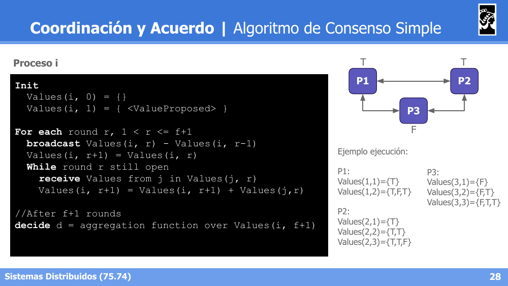

### Exclusión Mutua Distribuida

El problema de **exclusión mutua distribuida** consiste en garantizar que, de un conjunto de procesos distribuidos, solo uno a la vez pueda acceder a una **sección crítica** (recurso compartido), sin contar con memoria compartida ni un reloj global. Un algoritmo de exclusión mutua distribuida debe cumplir:

- **Safety**: a lo sumo un proceso en la sección crítica a la vez.
- **Liveness (no bloqueo)**: toda solicitud de acceso eventualmente es concedida (no hay deadlock ni starvation).
- **Fairness (orden)**: las solicitudes se conceden en el orden en que fueron realizadas (típicamente usando orden de timestamps lógicos).

#### Algoritmo de Servidor Central

Un proceso coordinador centraliza el otorgamiento del permiso de acceso a la sección crítica: los procesos le piden el "token" al servidor central, y lo liberan cuando terminan.

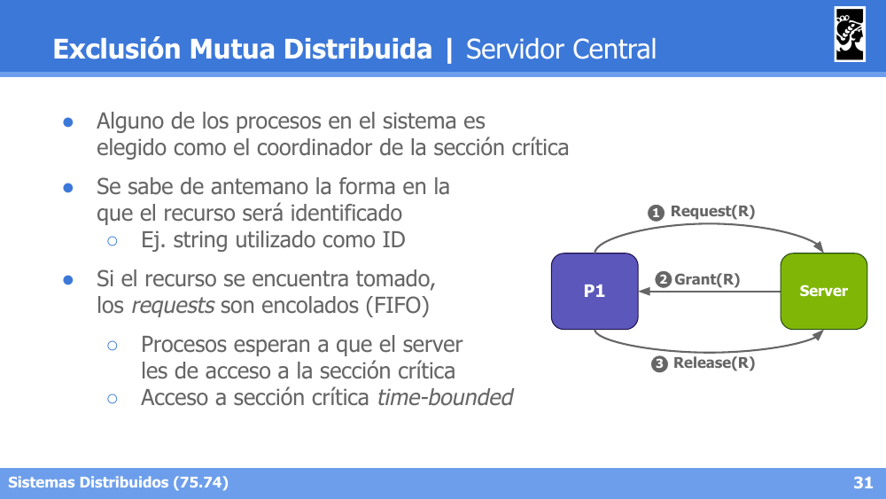

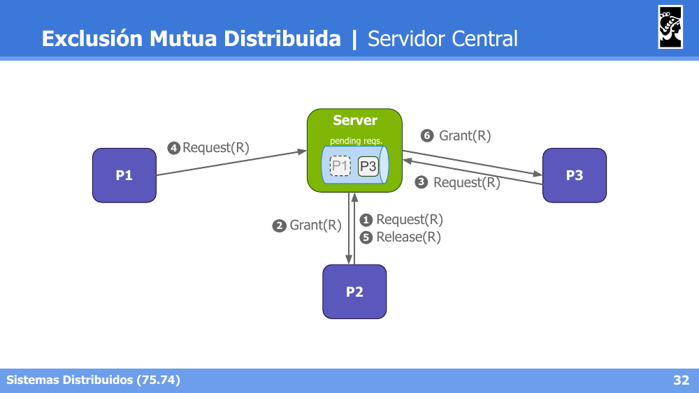

- **Ventajas**: simple de implementar, garantiza fairness en el orden de llegada de solicitudes al servidor.
- **Desventajas**: el servidor central es un **punto único de fallo (SPOF)** y un cuello de botella de escalabilidad.

#### Algoritmo de Token Ring

Los procesos se organizan en un anillo lógico; un **token** circula de proceso en proceso en un único sentido. Solo el proceso que posee el token puede acceder a la sección crítica; al terminar, pasa el token al siguiente proceso del anillo.

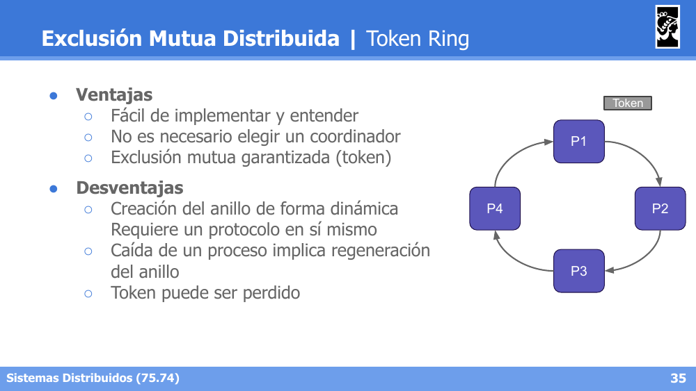

- **Ventajas**: no requiere coordinador central, garantiza ausencia de starvation (todo proceso eventualmente recibe el token).
- **Desventajas**: introduce latencia (hay que esperar a que el token circule aunque nadie quiera la sección crítica), y la pérdida del token o la caída de un proceso del anillo requiere mecanismos adicionales de recuperación.

#### Algoritmo de Ricart & Agrawala

Algoritmo de exclusión mutua distribuida basado en **timestamps lógicos** y broadcast, sin coordinador ni token. Cuando un proceso quiere entrar a la sección crítica, envía una solicitud con su timestamp a todos los demás procesos y espera a recibir el OK de todos ellos.

**Lógica al recibir una solicitud:**
- Si el proceso receptor no quiere la sección crítica, o la quiere con un timestamp mayor (más reciente) que el de la solicitud recibida, responde inmediatamente con OK.
- Si el proceso receptor está actualmente en la sección crítica, encola la solicitud y responde recién cuando termina.
- Si el proceso receptor también quiere la sección crítica pero con un timestamp menor (más antiguo, es decir, tiene prioridad), encola la solicitud y la responde luego de salir de la sección crítica.

**Ejemplo de ejecución** con tres procesos P1, P2 y P3:

- P1 solicita la sección crítica con timestamp T=10; P3 (en estado RELEASED, T=9) responde inmediatamente OK; P2 (estado WANTED, T=15) encola la solicitud de P1, ya que su propio timestamp T=15 es mayor (P1 tiene prioridad), y P1 pasa a estado HELD.

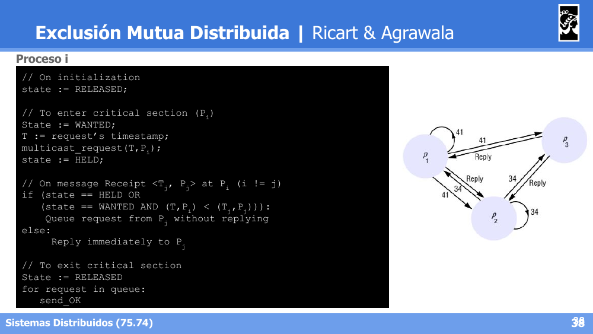

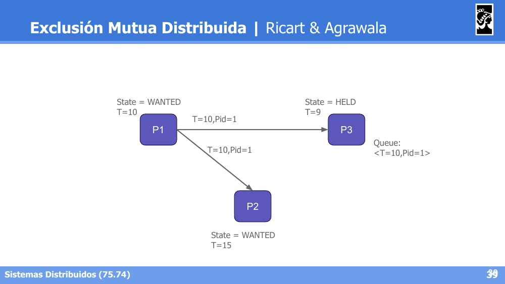

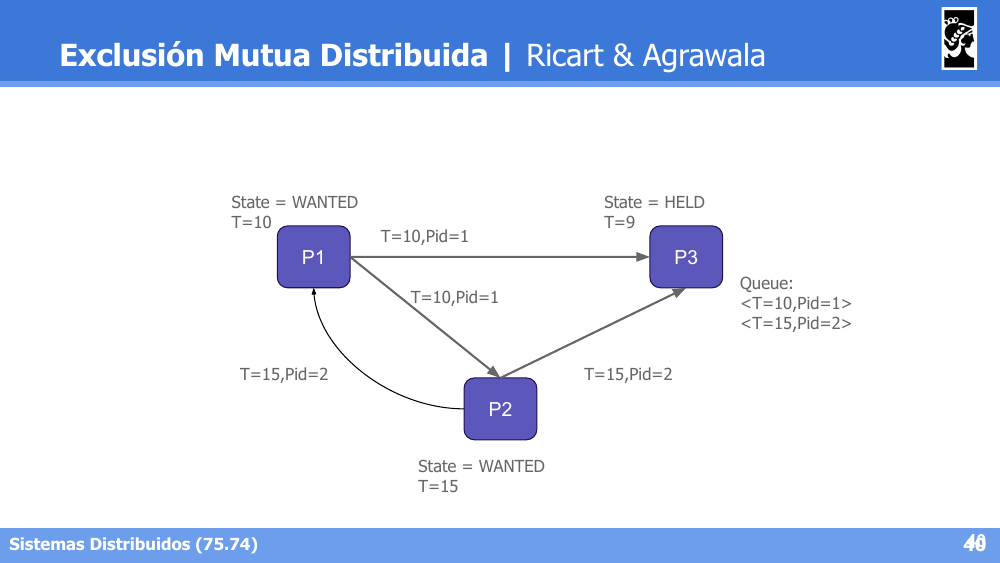

- Estado final del ejemplo: P1 queda en HELD (T=10) habiendo recibido OK de P3 y de P2; P3 está en RELEASED (T=9); P2 está en WANTED (T=15) y queda encolado `<T=15, Pid=2>` en la cola de P1 hasta que este libere la sección crítica.

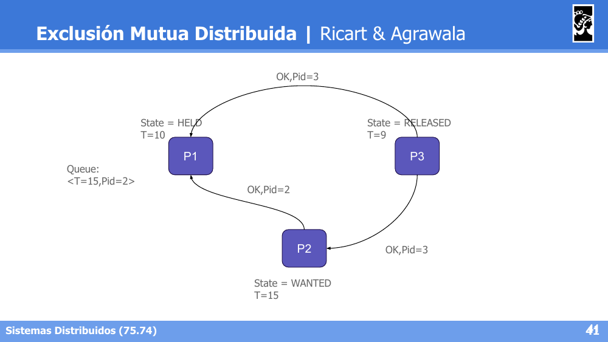

**Ventajas y desventajas:**

- **Ventajas**: no hay necesidad de un coordinador central.
- **Desventajas**: requiere una topología tipo *mesh* donde todos los procesos se conocen entre sí; la cantidad de mensajes necesarios para obtener la sección crítica es alta (2(N-1)); y es imposible distinguir entre un proceso caído y un proceso que simplemente está tardando en responder porque está en la sección crítica.

### Two-phase Commit (2PC)

**2PC** es un algoritmo por rondas que garantiza **transacciones atómicas** entre múltiples nodos distribuidos, bajo ciertas condiciones.

**Roles:**
- **Coordinador**: controla las rondas, iniciando y finalizando la transacción.
- **Nodos**: ejecutan (instrumentan) los pedidos del coordinador.

**Supuestos:**
- Las conexiones son confiables y los nodos no son maliciosos ni arbitrarios (no bizantinos).
- Una vez que un nodo responde OK al *prepare*, se asume que no puede fallar al hacer el *commit*.
- Si existe probabilidad real de fallo en esa ventana, se recurre a variantes como **3PC** (*three-phase commit*).

**Fases:**

1. **Phase 1 (Prepare)**: el coordinador envía un mensaje de `Prepare` a todos los nodos (Service 1 … Service N), quienes responden indicando si pueden o no comprometerse a realizar la operación.
2. **Phase 2 (Commit/Abort)**: si todos los nodos respondieron favorablemente, el coordinador envía `Commit` a todos; si alguno falló o respondió negativamente, envía `Abort` a todos, garantizando que la transacción se aplique de forma atómica (todo o nada) en todos los nodos.

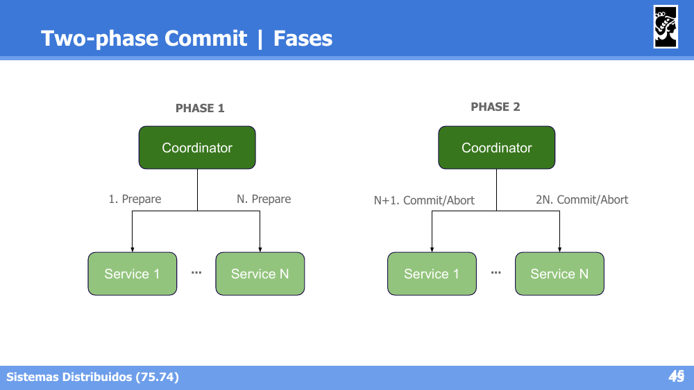
