# Sistemas Distribuidos I (75.74) — Clase 19: Algoritmos de Consenso

## 1. Elección de Líder

### Introducción

**Objetivo:**
- Elegir a un proceso en un grupo para que desempeñe un rol particular.
- Permitir reelecciones en caso de que el proceso líder decida darse de baja o se encuentre caído.

**Características:**
- Cualquier proceso puede comenzar una nueva elección de líder.
- En ningún momento puede haber más de un líder.
- El resultado de la elección de un nuevo líder debe ser **única y repetible**.

**Propiedades:**
- Cada proceso debe tener un identificador único.
- Todos los procesos poseen un array que indica el estado del algoritmo de elección de líder, con estados posibles: *Identificador (P)* o *indefinido (@)*.
- **Safety**: un proceso participante Pi posee el estado *electedi = P* o *electedi = @*.
- **Liveness**: todos los procesos participan de la elección de líder y bien terminan con un estado *electedi != @* o comienzan una nueva elección de líder.

### Algoritmo del Anillo

**Condiciones iniciales:**
- Cada proceso se comunica solamente con su vecino.
- Mensajes enviados siempre en la misma dirección (ej. sentido horario).
- Al comienzo del algoritmo, todos los procesos son marcados como *no participantes*.

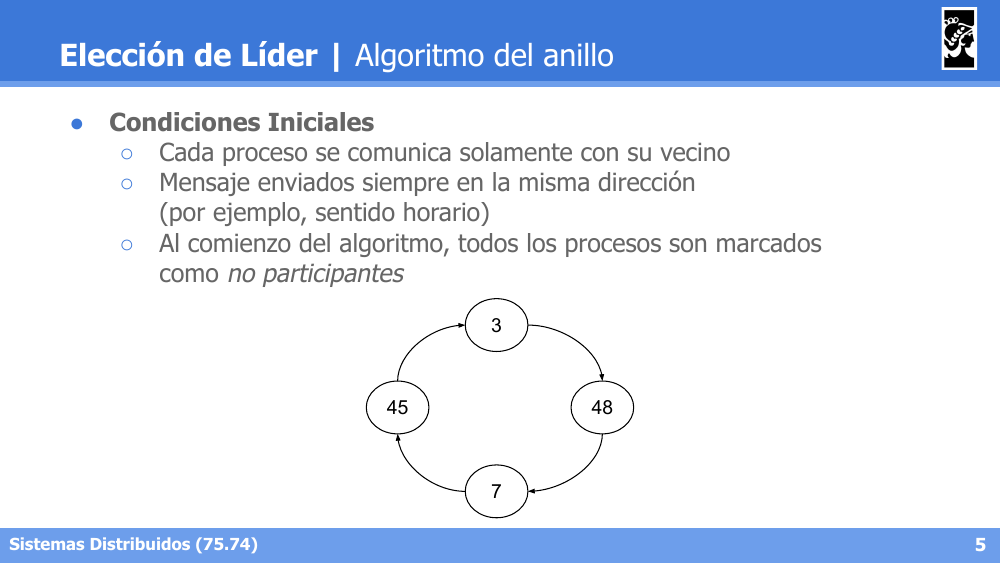

**Lógica del algoritmo:**
- Un proceso Pi inicia la elección: se marca como *participando* y envía un mensaje en sentido horario indicando que él es el líder.
- Cuando un proceso Pj recibe un mensaje de elección de líder:
  - Si está en estado *no participando*: cambia a *participando*, compara el ID recibido con el suyo, lo reemplaza si es mayor, y reenvía el mensaje al siguiente nodo.
  - Si está en estado *participando*: si el ID recibido es menor al suyo, no reenvía el mensaje; si es mayor, lo reenvía; si es igual al suyo, **es el líder**.
- Cuando el proceso reconoce que es el líder: se setea como *no participando* y envía un mensaje de **líder elegido**.
- Cuando un proceso recibe un mensaje de líder elegido: cambia su estado a *no participando*, setea la variable *elegido* con el ID recibido, y si el identificador recibido es distinto al suyo, retransmite el mensaje.

**Ejemplo de ejecución** (anillo con IDs 3, 48, 45, 7): P45 inicia la elección y envía su ID a P3; cada proceso compara el ID recibido contra el suyo y solo reenvía si el recibido es mayor (de lo contrario, si es menor, sustituye su propio ID; si es igual, se autoproclama líder al recibir su propio mensaje de vuelta).

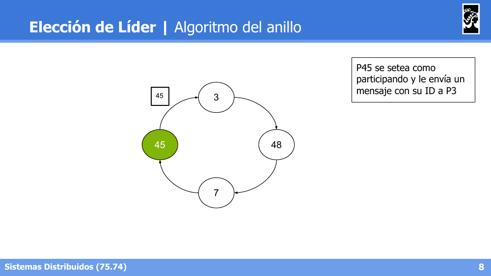

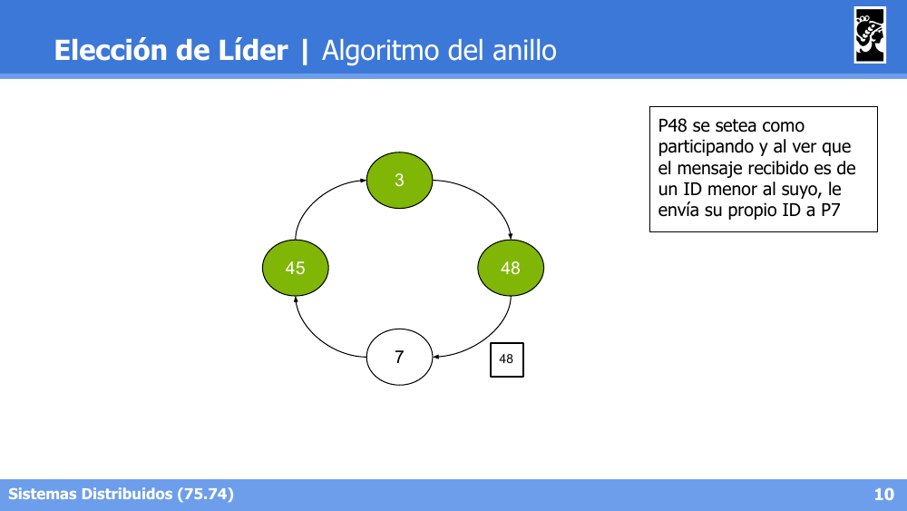

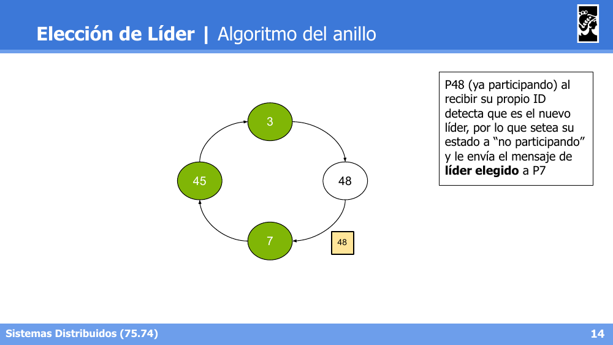

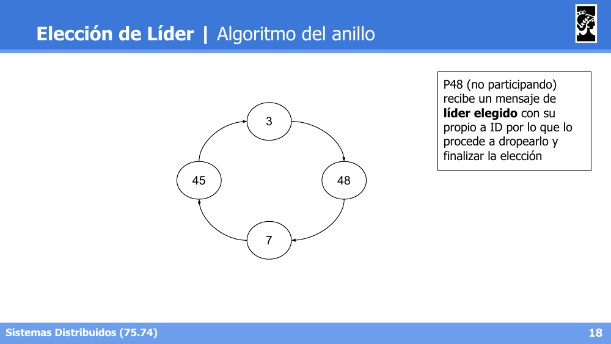

**Caso particular**: pueden iniciarse dos elecciones simultáneas (por ejemplo P45 y P48 se setean como participando al mismo tiempo), propagándose en paralelo en direcciones opuestas del anillo; cuando los mensajes de mayor ID se cruzan, el mensaje de menor ID es descartado por el proceso con mayor ID, y finalmente solo el mensaje del proceso con mayor ID completa la vuelta y la elección finaliza correctamente con un único líder.

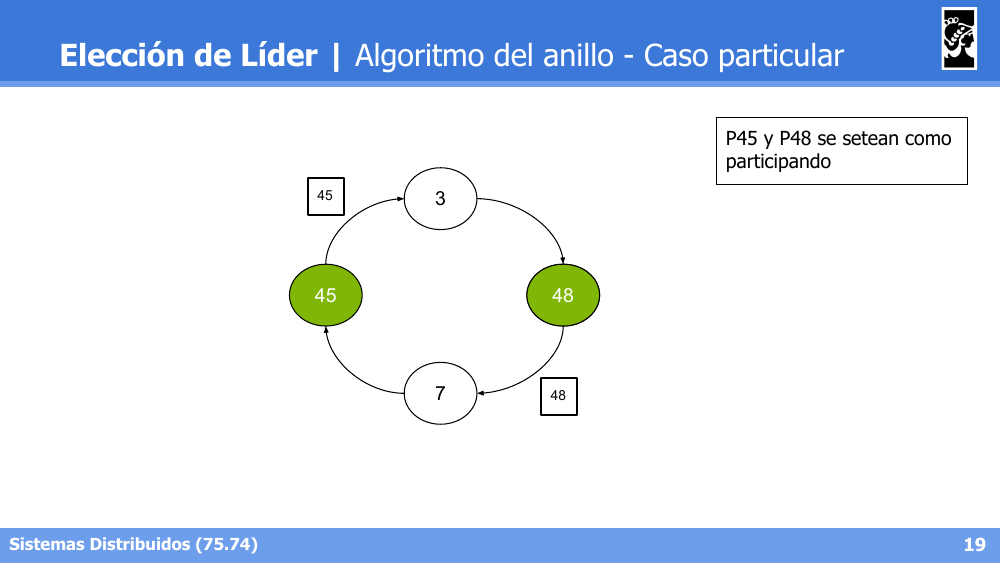

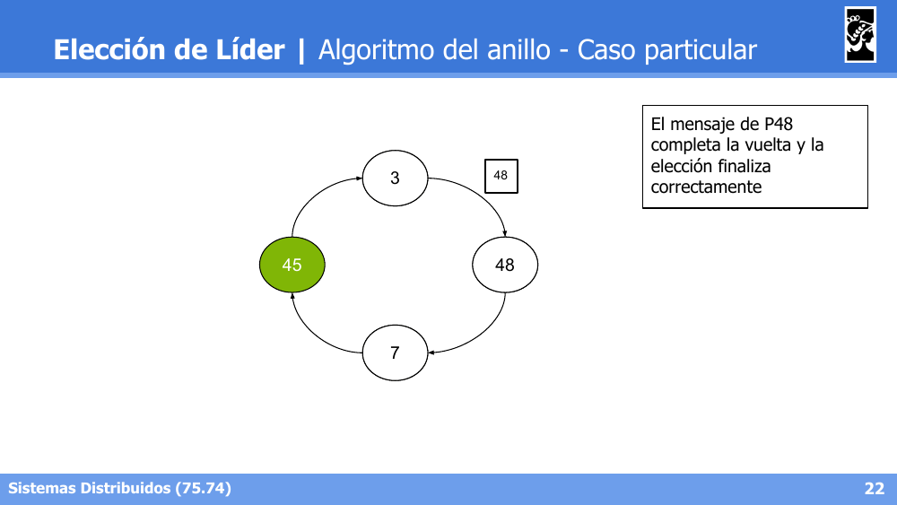

### Bully Algorithm

**Hipótesis:**
- Canales de comunicación *reliables*.
- Cualquier proceso puede morir de forma inesperada (se usan timeouts para detectarlo).
- Todos los procesos pueden comunicarse entre sí.
- Cada proceso conoce el ID de todos los procesos, y en particular **qué procesos poseen un ID superior al suyo**.

**Tipos de mensajes:**
- **Election Message**: inicia una elección de líder.
- **Answer Message**: ACK de un Election Message.
- **Coordinator Message**: informa quién fue el proceso líder elegido.

**Sincronismo:** se define un timeout `T = 2 * Tmax + Tprocess` (donde *Tmax* es el tiempo máximo de transmisión y *Tprocess* el tiempo máximo de cualquier proceso para resolver un mensaje) para detectar procesos caídos.

**Algoritmo:**
1. El proceso con mayor ID puede identificarse como líder y enviar un *Coordinator Message* a todos los procesos del sistema.
2. Si un proceso detecta que el líder está caído, envía *Election Messages* a los procesos que tengan un ID mayor al suyo.
3. Si un proceso recibe un *Election Message*, responde con un *Answer Message* y **comienza una nueva elección**.
4. Si un proceso recibe un *Coordinator Message*, elige al proceso que envió el mensaje como líder.
5. Si un proceso que comenzó una elección no recibe *Answer Messages* tras transcurrido el tiempo T, **se autoproclama líder**.
6. Si un proceso caído vuelve a la vida, comienza una nueva elección; si este proceso posee el mayor ID, será elegido como nuevo líder (de ahí el nombre **Bully**, ya que el de mayor ID siempre "avasalla" al resto).

**Ejemplo de ejecución** con procesos P1, P2, P3, P4 (P4 es el líder inicial):

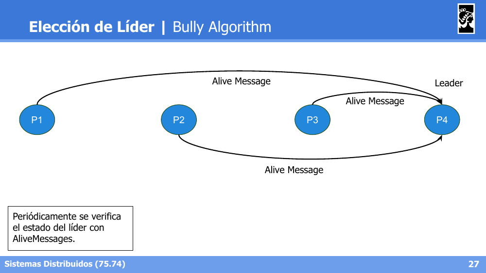

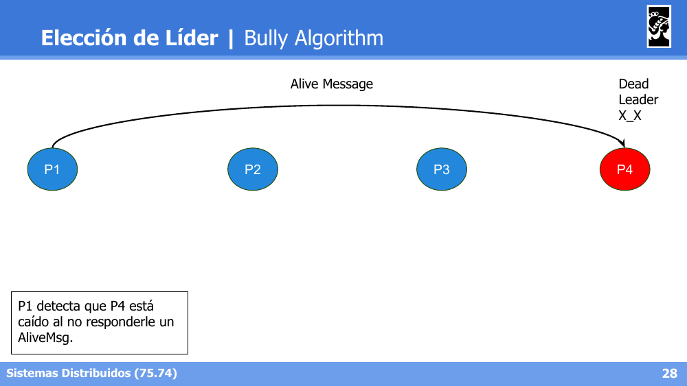

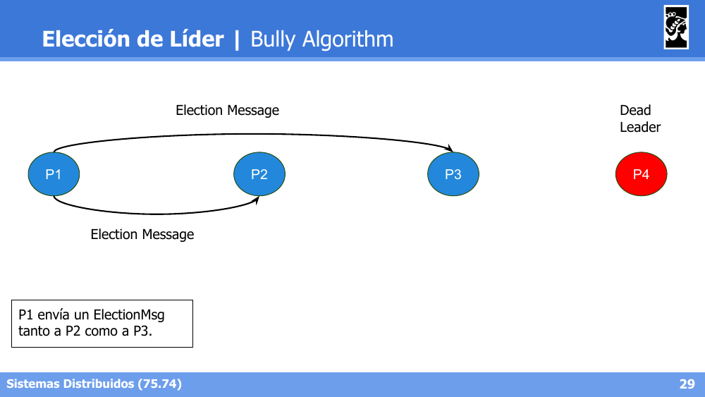

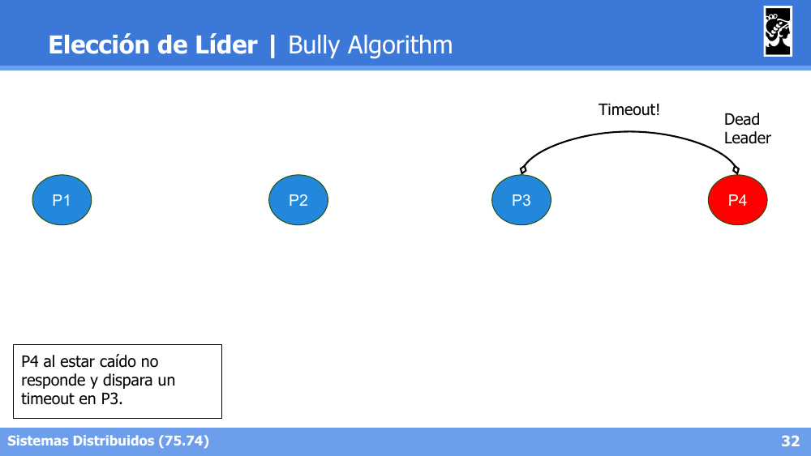

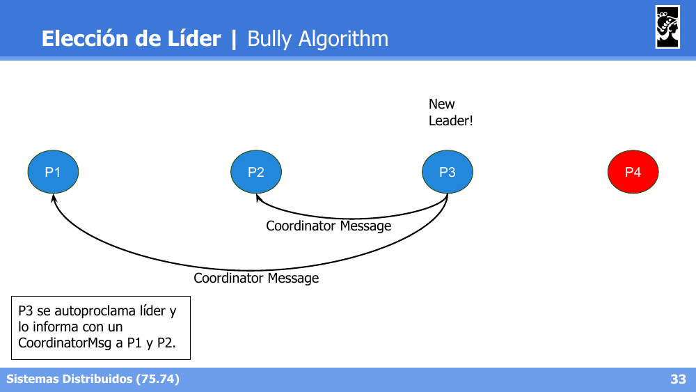

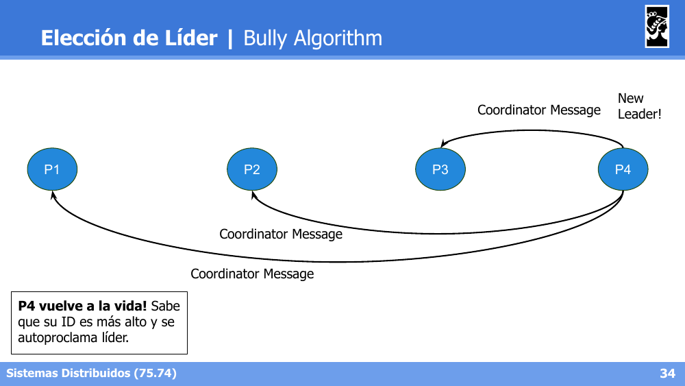

---

## 2. Consenso

### Introducción

Dado un conjunto de procesos distribuidos y un punto de decisión, todos los procesos deben acordar en el mismo valor. Es un problema complejo que requiere acotar variables:
- Los canales de comunicación son *reliables*.
- Todos los procesos pueden comunicarse entre sí.
- La única falla a considerar es la caída de un proceso.
- La caída de un proceso no puede ocasionar la caída de otro.

**Propiedades necesarias**: *Agreement*, *Integrity*, *Termination*.

### Definición y Requerimientos del Problema

- Un conjunto de Pi (i = 1...N) procesos desean llegar a un acuerdo.
- Cada proceso comienza en el estado *undecided*, posee una *decision variable* di, y propone un valor vi.
- Los procesos se comunican entre sí mediante mensajes; luego de recibir mensajes de los demás, cada proceso setea su *decision variable* di y cambia su estado a *decided*.

**Requerimientos:**
- **Agreement**: el valor de la variable es el mismo en todos los procesos correctos (si Pi y Pj son correctos, di = dj cuando ambos están *decided*).
- **Integrity**: si los procesos correctos propusieron el mismo valor vi, entonces el valor de su *decision variable* es el mismo.
- **Termination**: eventualmente todos los procesos activos setean su *decision variable*.
- **Fórmula de Quorum**: depende de la fórmula de agregación; por ejemplo, si se requiere mayoría, N >= 2f + 1.

**Ejemplos de ejecución**: un proceso (por ejemplo P3) puede proponer un valor distinto al resto (`abort` cuando los demás proponen `proceed`); si P3 no es un proceso correcto, puede cambiar de decisión y terminar siguiendo al consenso de la mayoría.

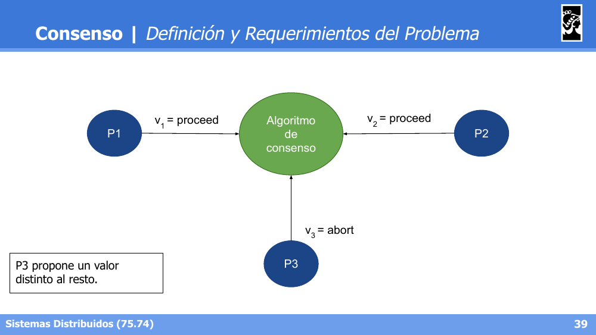

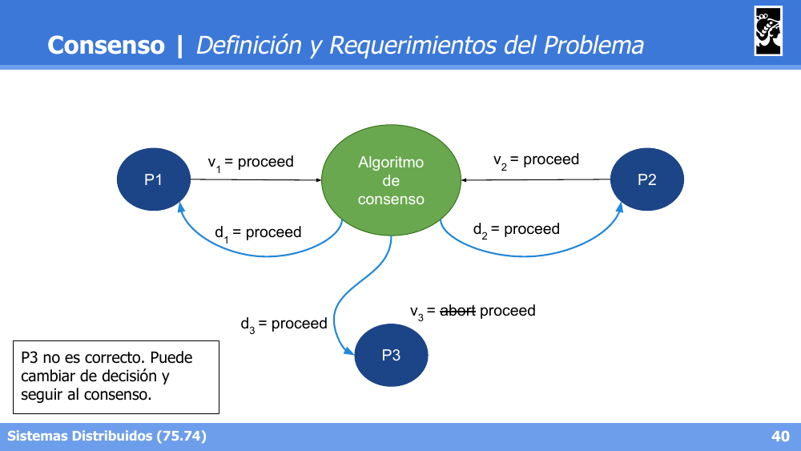

También se ilustra el caso en que un proceso falla y no logra enviar su propuesta a todos los demás (por ejemplo, P2 envía su propuesta a P3 pero falla al enviarla a P1, generando vistas parciales distintas entre los procesos).

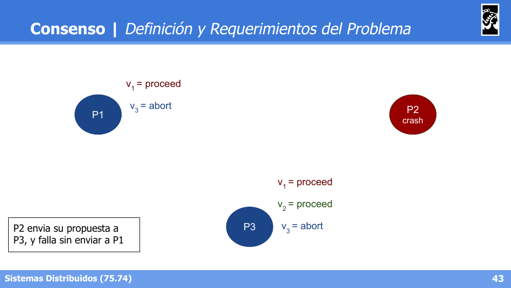

### Algoritmo de Consenso Sincrónico

Algoritmo por rondas en el que, en cada ronda, cada proceso difunde (broadcast) los nuevos valores que conoce y agrega los valores recibidos de los demás; tras *f+1* rondas (siendo *f* la cantidad máxima de fallas a tolerar), cada proceso decide aplicando una función de agregación sobre el conjunto de valores acumulado.

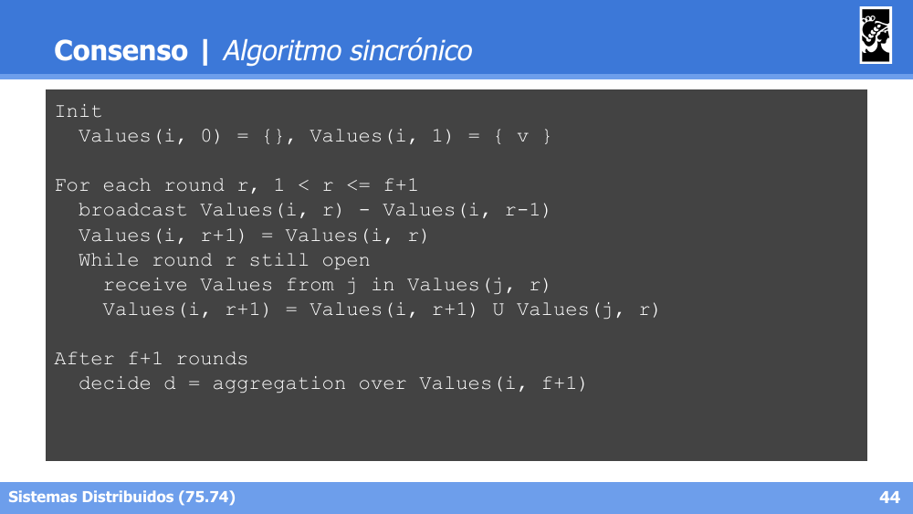

---

## 3. Generales Bizantinos

### Introducción

Un **Comandante** envía una orden (Atacar / Retirarse) a dos o más **Generales**, quienes deben coordinarse entre sí para decidir una acción común.

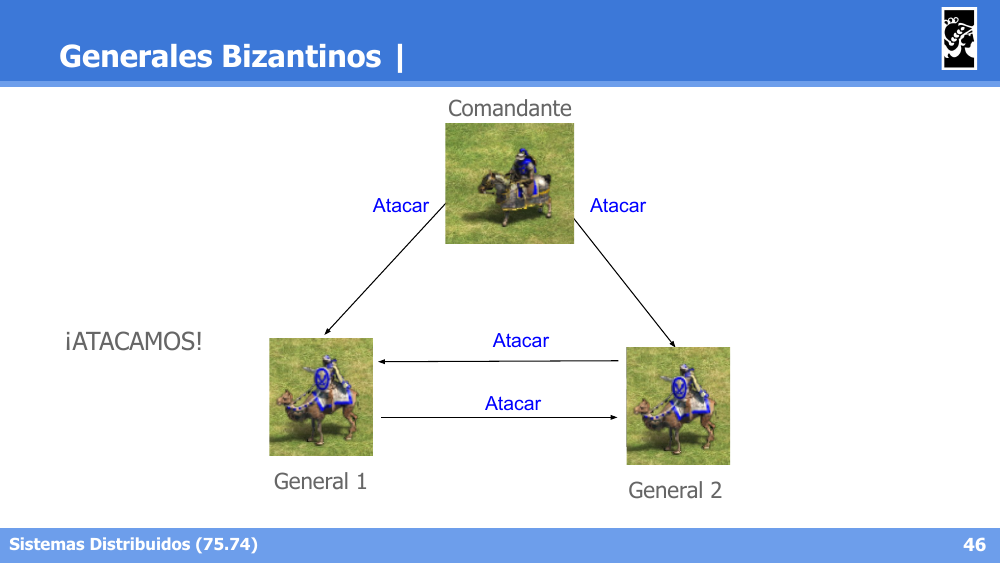

El problema surge cuando alguno de los participantes es **traidor**: un General traidor puede informar al resto una orden distinta a la que realmente recibió del comandante.

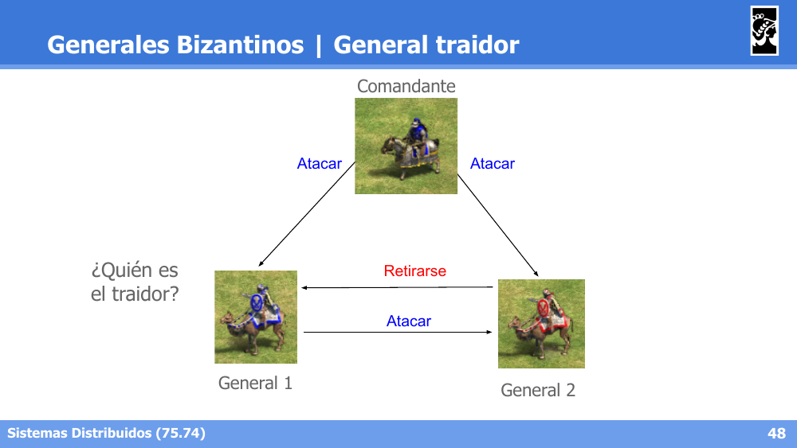

O bien el **Comandante** puede ser el traidor, enviando órdenes distintas a cada General, generando confusión sobre cuál es la decisión correcta.

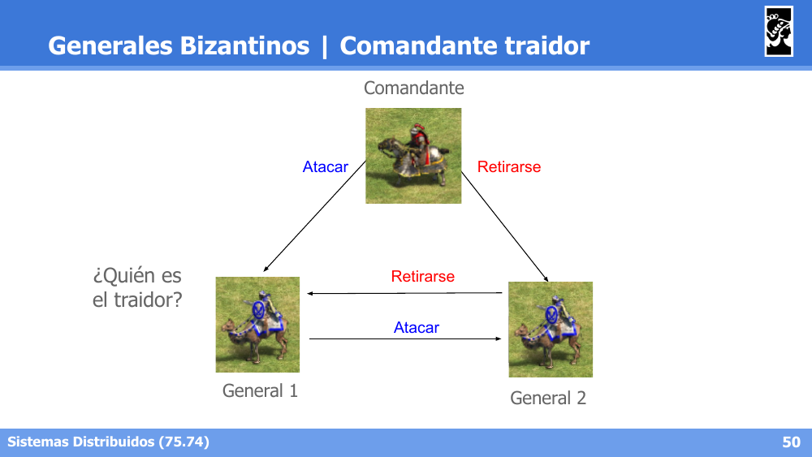

### Definición y Requerimientos

- Tres o más **generales** deben decidir si atacan o se retiran.
- Un **comandante** envía la orden de ataque/retirada.
- Tanto los **generales** como el **comandante** pueden ser **traicioneros**: un general traidor le indica a los demás generales lo opuesto a lo que el comandante le ordenó (y viceversa); un comandante traidor envía órdenes diferentes a diferentes generales. Un proceso traicionero emula a un proceso con fallas de tipo **byzantine** (arbitrarias).

**Requerimientos:**
- **Agreement**: el valor de la variable *decided* es el mismo en todos los procesos activos.
- **Integrity**: si el comandante *no es traicionero*, todos los procesos deben setear su *decision variable* al valor enviado por el comandante.
- **Termination**: eventualmente todos los procesos activos setean su *decision variable*.
- **Fórmula de Quorum**: **N >= 3f + 1** (a diferencia del consenso simple, que requería N >= 2f + 1).

### Imposibilidad con N <= 3f

Con solo 3 procesos (Comandante + 2 Generales) y 1 traidor, es imposible que los generales correctos distingan de forma confiable quién es el traidor: si el Comandante es honesto pero uno de los Generales miente sobre lo que recibió, o si el Comandante mismo es el traidor y envía valores distintos a cada General, **desde la perspectiva de un General correcto ambos escenarios son indistinguibles** (en ambos casos recibe información contradictoria).

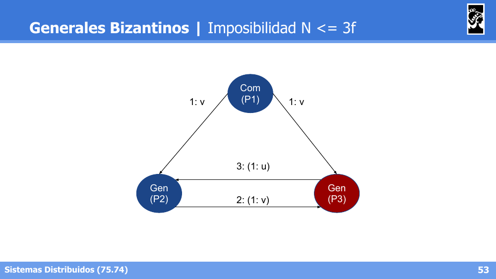

### Solución con N >= 3f + 1

Agregando un cuarto proceso (4 procesos en total, tolerando 1 traidor: N=4 >= 3·1+1), cada General recibe los valores directamente del Comandante y además los valores que los demás Generales dicen haber recibido del Comandante; con esta información redundante, cada General puede aplicar una función de **mayoría** sobre el conjunto de valores recibidos para determinar el valor correcto, incluso en presencia de un traidor.

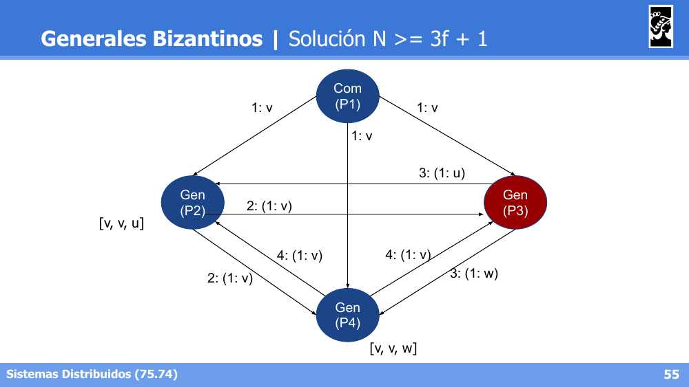

---

## 4. Paxos

### Introducción

**Objetivo:** consensuar un valor aunque múltiples procesos realicen diferentes propuestas.

**Características:**
- **Tolerante a fallos**: el algoritmo progresa siempre que haya una mayoría de procesos vivos (fórmula de Quorum: N >= 2f + 1).
- **Posible rechazo de propuestas**: el pedido de un cliente puede ser rechazado, pero el cliente puede reintentar la propuesta las veces que desee.
- Paxos asegura **orden consistente** en un clúster: los eventos realizados por los clientes son almacenados de forma incremental por ID.

### Arquitectura y Actores

- **Proposer**: recibe los requests de los clientes y comienza el protocolo. Debe elegirse un *Leader* entre los Proposers para evitar *starvation*.
- **Acceptor**: recibe los mensajes *prepare*/*propose* de los Proposers y mantiene el estado del protocolo en almacenamiento estable. Existe **Quorum** cuando la mayoría de los Acceptors se encuentran vivos.
- **Learner**: cuando el protocolo llega a un acuerdo, ejecuta el request y envía la respuesta al cliente.

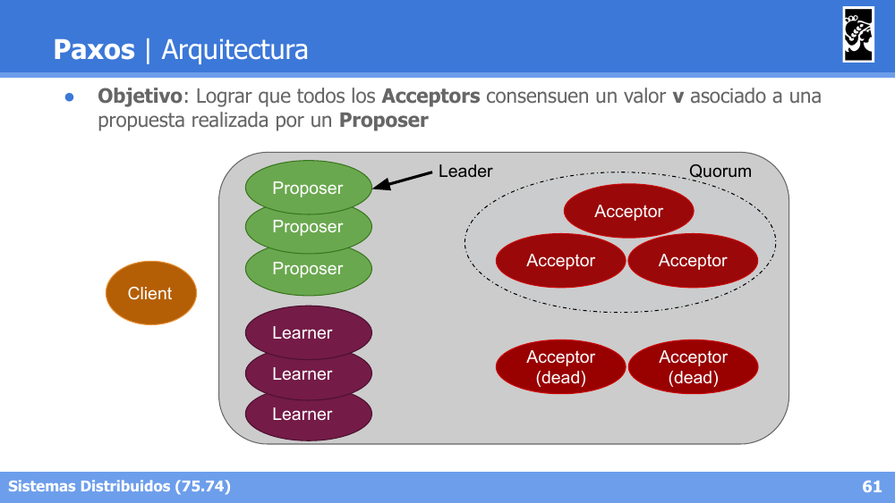

### Fases del Protocolo

**Fase 0**: el **Client** realiza un *request(v)* al Proposer.

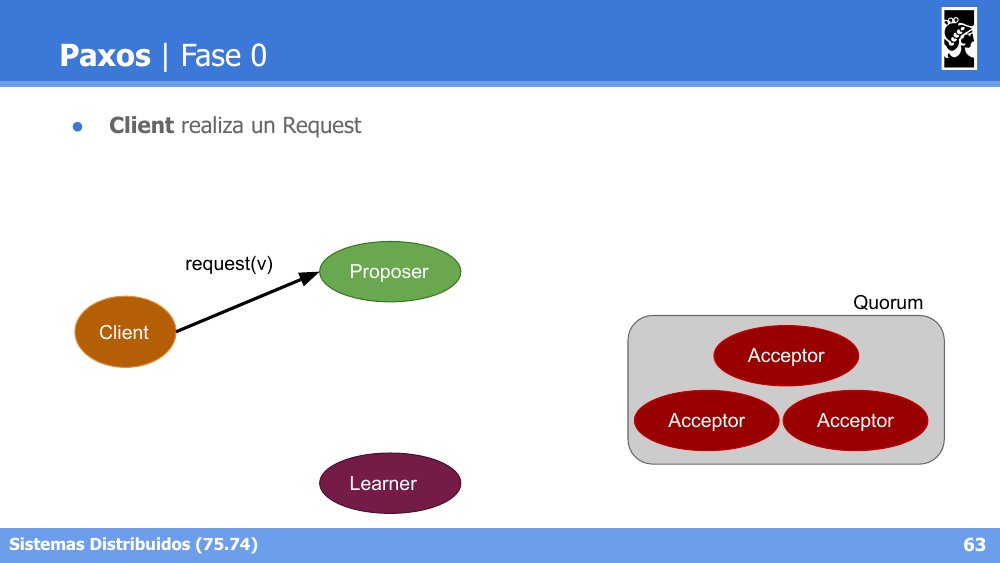

**Fase 1a — Prepare**: el Proposer crea una propuesta `#N` (donde N es mayor a cualquier propuesta previa realizada por él) y envía `prepare(N)` a los Acceptors, esperando obtener Quorum (que el mensaje llegue a la mayoría de los Acceptors).

**Fase 1b — Promise**: si el ID recibido es mayor al último recibido, los Acceptors prometen rechazar cualquier request con ID < N, y envían `promise(N', v')` de vuelta al Proposer (conteniendo el N previo y el valor asociado, si lo hubiera). El Proposer necesita recibir promesas de la mayoría de los Acceptors.

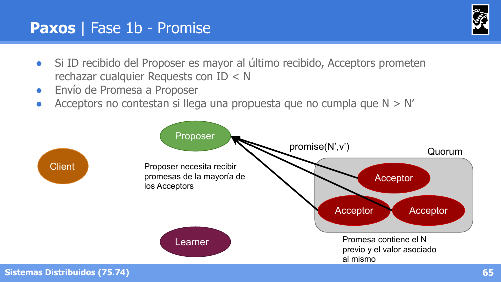

**Fase 2a — Propose**: si el Proposer recibe promesas de la mayoría, rechaza todos los requests con ID < N y envía `propose(N, v)` con el N recibido y un valor v a los Acceptors.

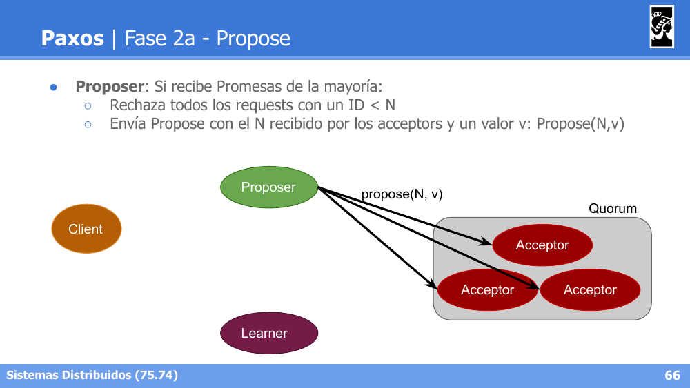

**Fase 2b — Accept**: si la promesa aún es mantenida (no se recibió un ID superior a N), cada Acceptor anuncia el nuevo valor v enviando `accept(N, v)` a todos los Learners y al Proposer que envió el request inicial.

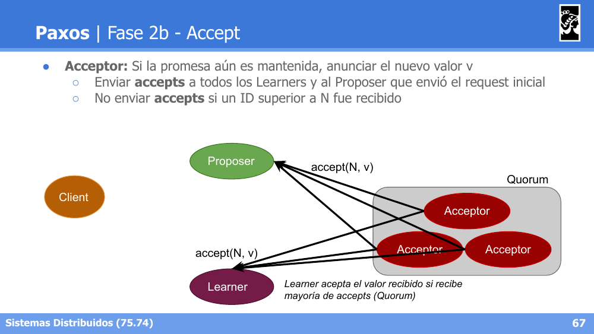

**Fase 2c — Accept**: el **Learner** acepta el valor recibido si recibe la mayoría de los *accepts* (Quorum), responde al cliente y se toman las acciones correspondientes respecto del valor acordado (por ejemplo, persistirlo en bases de datos replicadas).

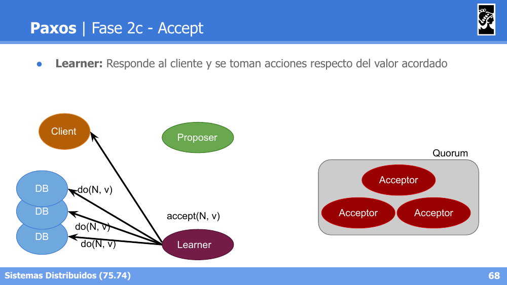
