# Sistemas Distribuidos I (75.74) — Clase 20: Tiempo, Relojes, Sincronismo, Orden y Cortes de Estado

## 1. Tiempo y Relojes — Relojes Físicos

### Introducción

El **tiempo** es la magnitud para medir duración y separación de eventos. Se lo puede definir mediante una variable monotónica creciente: en sistemas de computación es discreta y no necesariamente está vinculada con la hora de la vida real. **El tiempo siempre avanza, nunca retrocede.**

La medición del tiempo permite:
- Ordenar y sincronizar.
- Marcar la ocurrencia de un suceso: **Timestamps** (puntos absolutos en la línea de tiempo).
- Contabilizar la duración entre sucesos: **Timespans** (intervalos en la línea de tiempo).

### Locales vs. Globales

Cada computadora puede tener su **reloj local**, o bien sincronizarse contra una **referencia global** común.

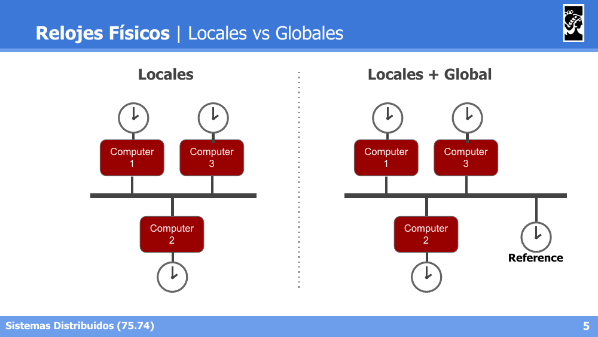

Los relojes físicos brindan la fecha y hora del día, y pueden ser de cuarzo, atómicos o basados en GPS. Los cambios de temperatura, presión y humedad los descalibran, efecto conocido como ***drift***.

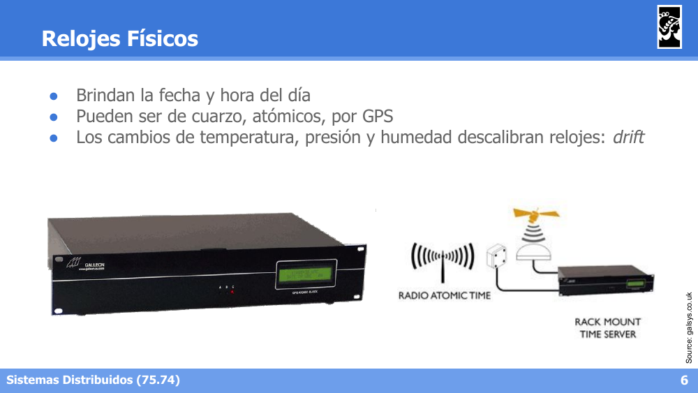

### Referencias Globales

- **GMT** (Greenwich Mean Time): basado en el tiempo de rotación terrestre (tiempo astronómico).
- **UTC** (Universal Time Coordinated): basado en la medición de relojes atómicos, con diferencia de +/-1 segundo respecto del GMT y ajustes periódicos.
- **GPS time**: basado en relojes atómicos en la Tierra; no recibe ajustes pero permite ajustar satélites.
- **TAI** (Temps Atomique International): 200 relojes atómicos en 70 países; no recibe ajustes astronómicos.

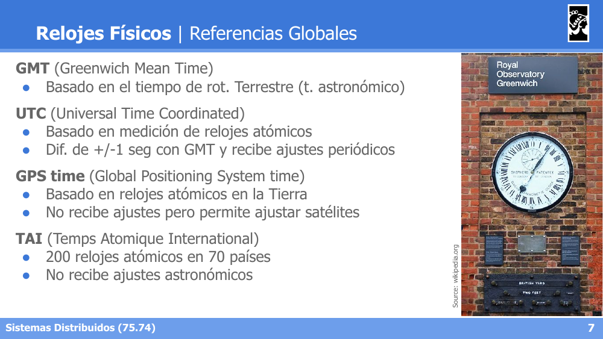

### Drift

Los relojes físicos no son confiables para su comparación entre sí debido al efecto de *drift*. Por eso hay que sincronizarlos periódicamente: medir el desvío respecto de un reloj de referencia (UTC, GPS, etc.) y aplicar una corrección o compensación lineal cambiando la frecuencia del reloj local — **nunca atrasando un reloj** de golpe. También es necesario sincronizar al despertar la computadora.

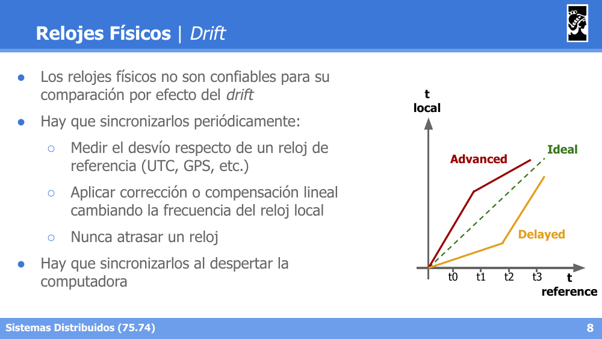

**Algoritmo de Cristian**: realiza una compensación del *delay* de red al obtener la medida de tiempo. El cliente envía un request en T0 y recibe la respuesta en T1; asumiendo delays de red constantes y sin tiempo de procesamiento, el nuevo tiempo se calcula como:

`T_new = T_server + (T1 - T0) / 2`

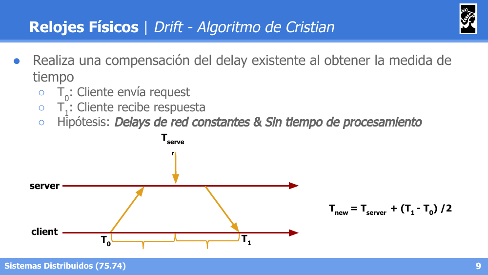

### NTP (Network Time Protocol)

**Objetivos:**
- **Sincronización**: clientes (UTC) sincronizados aunque existan delays en la red, usando análisis estadístico para filtrar datos y obtener resultados de calidad.
- **Alta disponibilidad**: sobrevivir a largas caídas de conectividad mediante rutas y servidores redundantes.
- **Escalabilidad**: gran número de clientes sincronizados de forma frecuente, teniendo en cuenta efectos de drift.

**Estructura de servidores**: basada en **stratums** (estratos):
- Estrato 0: *master clocks*.
- Estrato 1: servidores conectados directamente a master clocks.
- Estrato 2: servidores sincronizados con servidores en estrato 1.
- Estrato N: servidores sincronizados con servidores en estrato N-1.
- Los servidores del mismo estrato pueden sincronizarse entre sí mediante conexiones *peer-to-peer*. Los mensajes se envían de forma no confiable (*UDP* puerto 123).

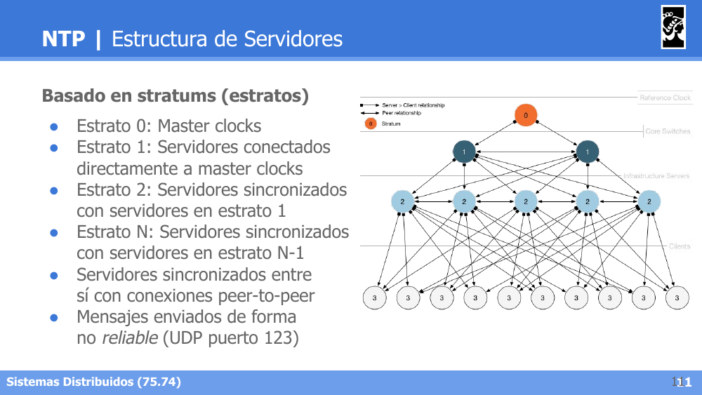

**Modos de sincronización:**
- **Multicast/broadcast**: usado en LANs de alta velocidad, eficiente pero de baja precisión.
- **Cliente-Servidor (RPC)**: grupos de aplicaciones se conectan formando un grupo; las aplicaciones entre sí no pueden sincronizarse.
- **Simétrico (Peer Mode)**: *peers* sincronizados entre sí para proveer backup mutuo, utilizado en estratos 1 y 2.

---

## 2. Tiempo y Relojes — Relojes Lógicos

### Evento, Estado y Relación "Ocurre Antes"

- **Evento**: suceso relativo a un proceso Pi que modifica su estado.
- **Estado**: valores de todas las variables del proceso Pi en un momento dado.
- **Relación 'ocurre antes' (*happened before*)**: relación de causalidad entre eventos o estados tal que:
  - a → b, si a y b pertenecen al mismo proceso Pi y a ocurre antes que b.
  - a → b, si a es un evento de Pi, b es un evento de Pj, a es el envío del mensaje 'm' a Pj y b es la recepción de 'm' desde Pi.
  - a → c, si a → b y b → c (transitividad).

### Definición de Reloj Lógico

Dado S, el conjunto de todos los estados locales posibles del sistema, y → la relación de implicancia 'ocurre antes', un **reloj lógico** es una función C monotónica creciente que mapea estados con un número Natural y garantiza: ∀ s,t ∈ S: s → t ⇒ C(s) < C(t).

### Algoritmo de Lamport

Cada proceso Pi mantiene un contador `c`:
- **send event** (s, send, t): incluye `t.c` en el mensaje enviado; `t.c := s.c + 1`.
- **receive event** (s, receive(u), t): al recibir un mensaje de u, `t.c := max(s.c, u.c) + 1`.
- **internal event** (s, internal, t): `t.c := s.c + 1`.

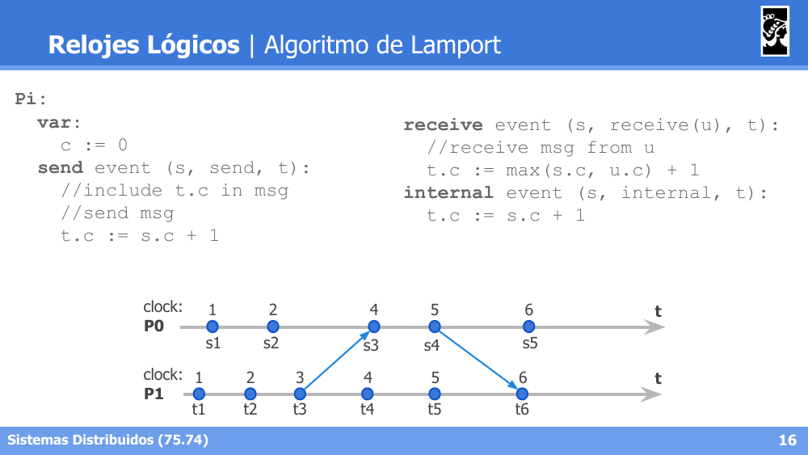

**Inconvenientes**: los relojes de Lamport garantizan `s → t ⇒ C(s) < C(t)`, **pero no a la inversa**: `C(s) < C(t)` no implica `s → t`. Es decir, conocer el reloj de Lamport no permite determinar con certeza si existe una relación causal entre dos eventos.

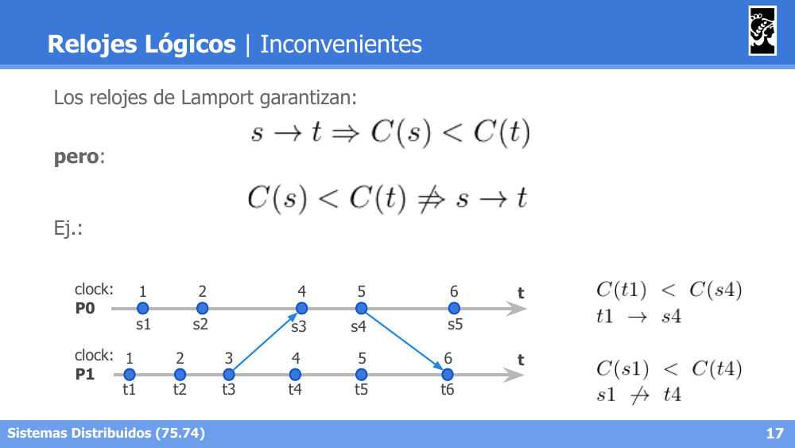

Esto ocurre porque el reloj de Lamport captura muy poca información sobre el progreso dentro de un proceso y durante los envíos de mensajes entre procesos: se pierde la información de **qué** evento ha ocurrido al almacenar un único escalar.

**Corolario**: conociendo los relojes de Lamport sí se pueden detectar eventos **paralelos** (concurrentes), cuando ni `C(s) < C(t)` ni `C(t) < C(s)` se cumplen, lo cual indica que ninguno de los dos eventos ocurre antes que el otro (`s || t`).

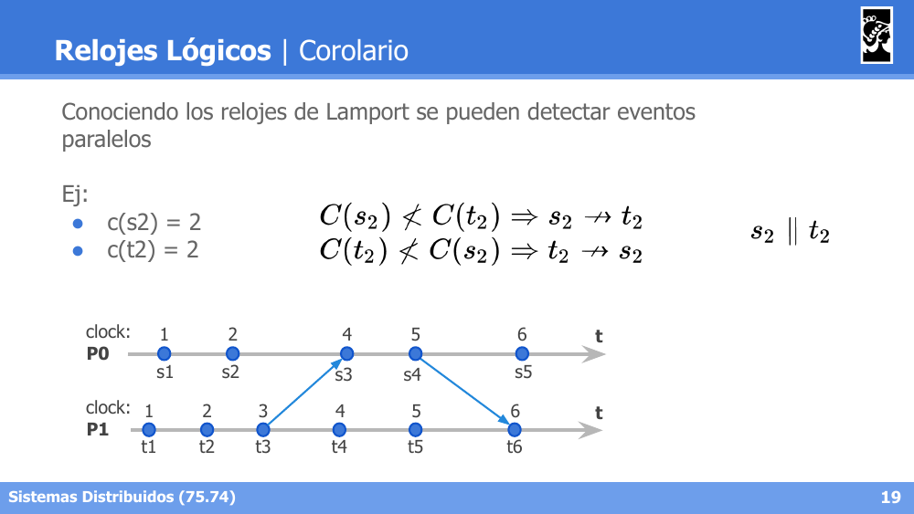

### Vector de Relojes (Vector Clocks)

Un **vector de relojes** es el mapeo de todo estado del sistema (compuesto por *k* procesos) con un vector de *k* números Naturales, y garantiza: ∀ s,t ∈ S: s → t **⇔** s.v < t.v (a diferencia de Lamport, esta es una equivalencia, no solo una implicación).

**Implementación:**
- `send`: `t.v := s.v`; `t.v[i] := t.v[i] + 1`.
- `receive` (de u): para cada componente j, `t.v[j] := max(s.v[j], u.v[j])`; luego `t.v[i] := t.v[i] + 1`.
- `internal`: `t.v := s.v`; `t.v[i] := t.v[i] + 1`.

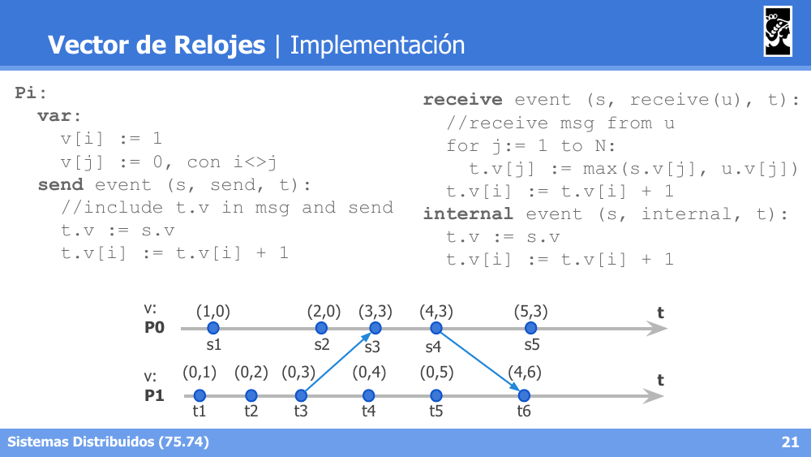

A diferencia de los relojes de Lamport, con vectores de reloj sí se puede determinar con certeza si existe relación causal entre dos eventos comparando componente a componente, y también detectar concurrencia (cuando ningún vector domina completamente al otro).

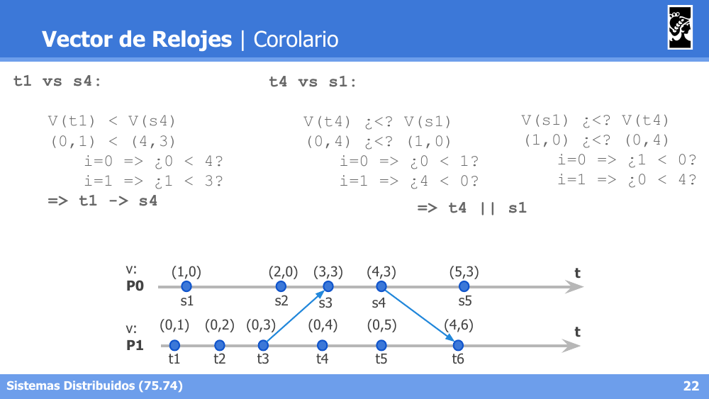

---

## 3. Sincronismo

### Definición

Los términos sincrónico/asincrónico dependen del contexto: en ejecución de eventos, sincrónico = bloqueante; en comunicación entre grupos, sincrónico = entidades que interactúan entre sí; en sistemas digitales, sincrónico = entidades coordinadas por el mismo reloj.

En **sistemas distribuidos**, un algoritmo/protocolo es:
- **Sincrónico**: la entrega de un mensaje posee un *timeout* conocido.
- **Parcialmente sincrónico**: la entrega no posee un timeout conocido, o el mismo es variable.
- **Asincrónico**: la entrega de un mensaje no posee timeout asociado.

### Propiedades

- **Tiempo de Delivery** (tpD(m)): tiempo que tarda un mensaje m en ser recibido luego de haber sido enviado hacia p.
- **Timeout de Delivery** (TDmax): todo mensaje enviado va a ser recibido antes de un tiempo TDmax conocido.
- **Steadiness (σ)**: máxima diferencia entre el mínimo y máximo tiempo de delivery de cualquier mensaje recibido por un proceso — define qué tan constante (*steady*) es la recepción de mensajes. `σ = max(T_Dmax - T_Dmin)`.
- **Tightness (τ)**: máxima diferencia entre los tiempos de delivery de un mismo mensaje *m* entre distintos procesos — define la simultaneidad con la que un mensaje es recibido por múltiples procesos.

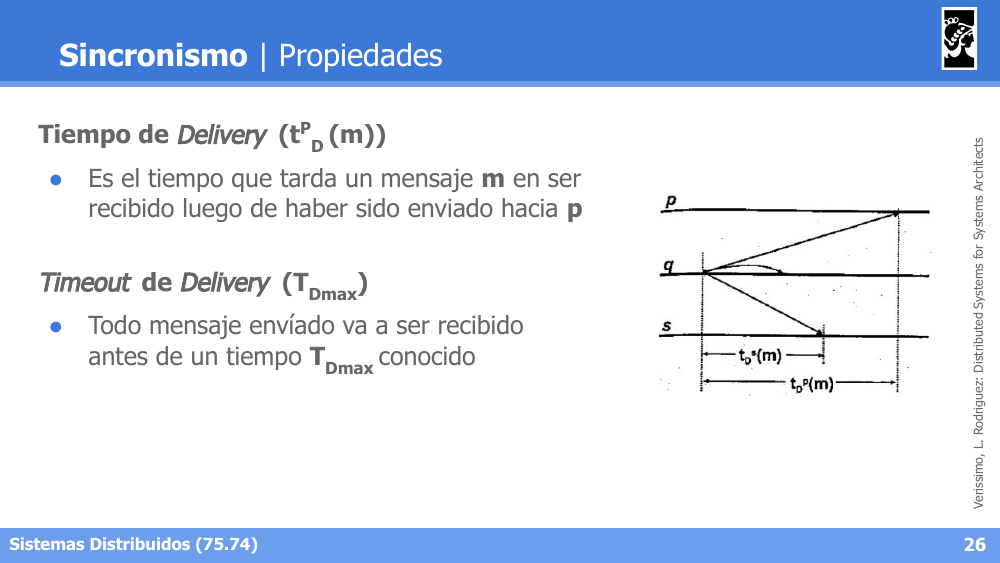

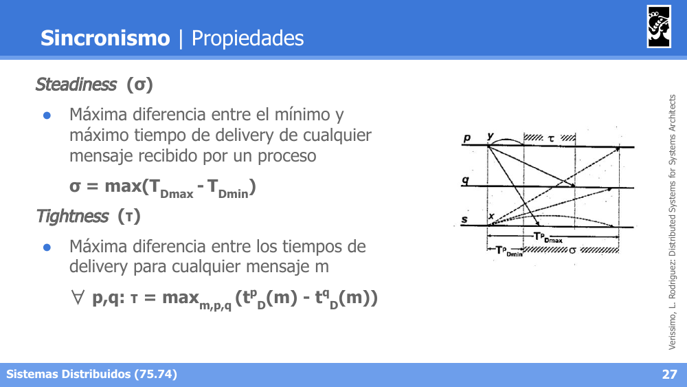

### Protocolos Clock-driven

A diferencia de los protocolos *time-driven* (basados en timeouts), los protocolos **clock-driven** utilizan relojes sincronizados entre los procesos para coordinar el envío y entrega de mensajes dentro de ventanas de tiempo predefinidas (Δ), logrando que el sistema sea *steady* (constante) y *tight* (simultáneo).

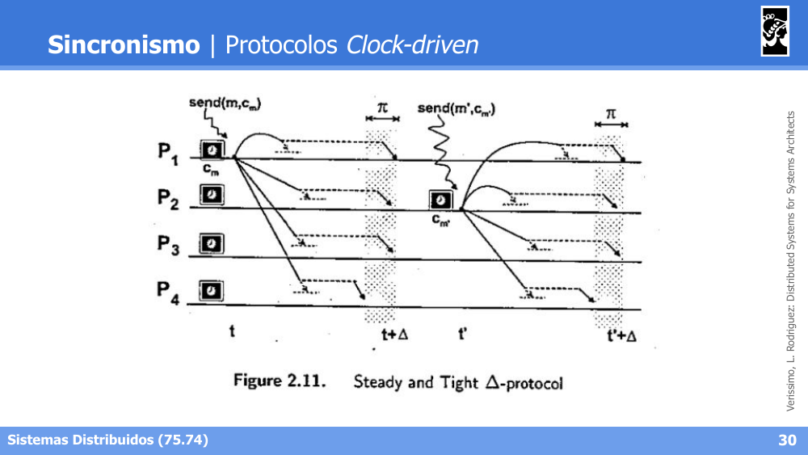

---

## 4. Orden de Mensajes

### Delivery de Mensajes — Hold-back Queue

El envío de un mensaje no es lo mismo que su **delivery**: el delivery consiste en procesar el mensaje, provocando eventualmente cambios en el estado del proceso. Los mensajes se mantienen en una cola (*hold-back queue*) que permite controlar el momento en que se libera el mensaje hacia la cola de delivery, permitiendo demorarlo o incluso reordenar mensajes.

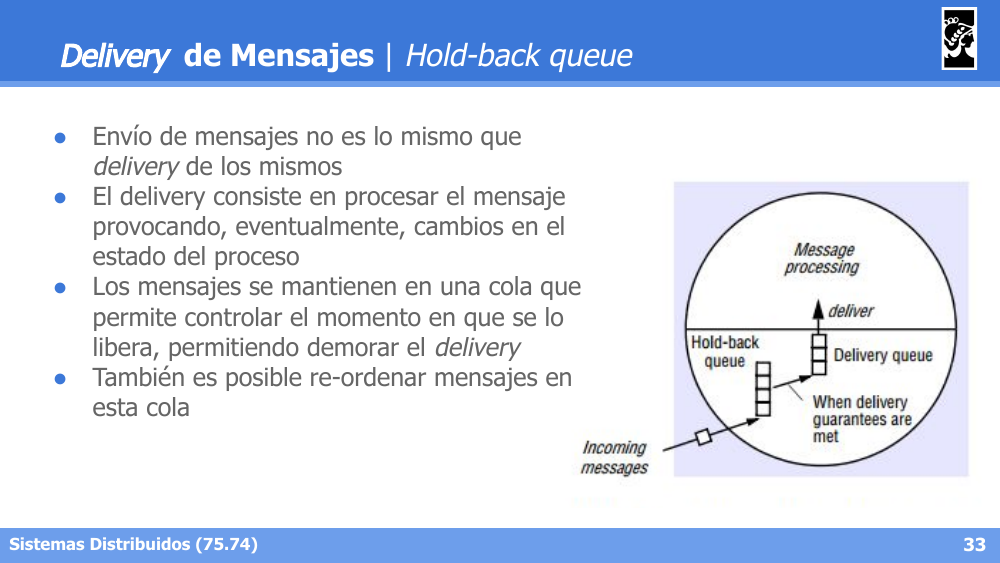

### Tipos de Orden

- **Orden Sincrónico**: todo mensaje posee el mismo timestamp tanto en el proceso emisor como en el receptor (la transmisión de mensajes insume tiempo nulo).

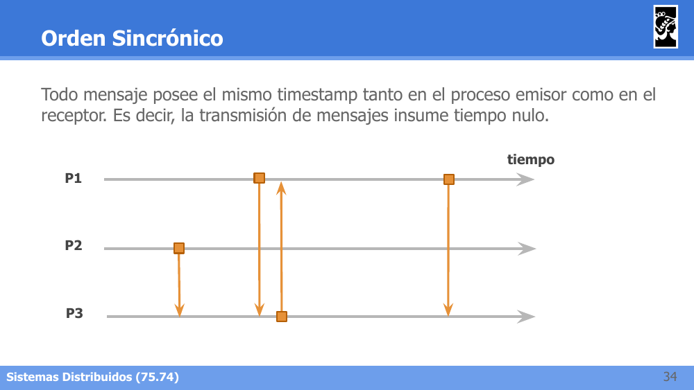

- **Orden FIFO**: todo par de mensajes desde un mismo emisor a un mismo receptor se entregan en el orden en que fueron enviados.

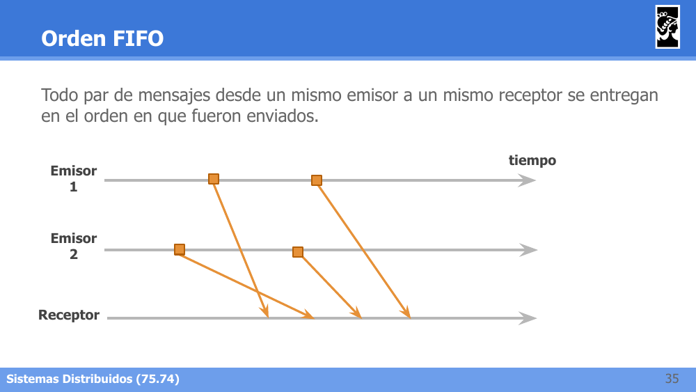

- **Orden Causal**: todo mensaje que implique la generación de un nuevo mensaje es entregado manteniendo esta secuencia de causalidad, sin importar el receptor (ej. si M1 → M2 → M3 causalmente, entonces se entregan d1 → d2 → d3 en ese orden, aunque tengan distintos receptores).

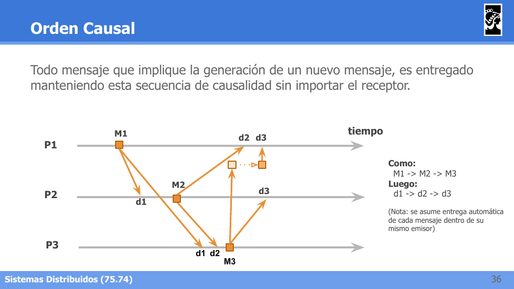

- **Orden Total**: todo par de mensajes entregado a los mismos receptores es recibido en el mismo orden por esos receptores (independientemente del orden de envío o de causalidad).

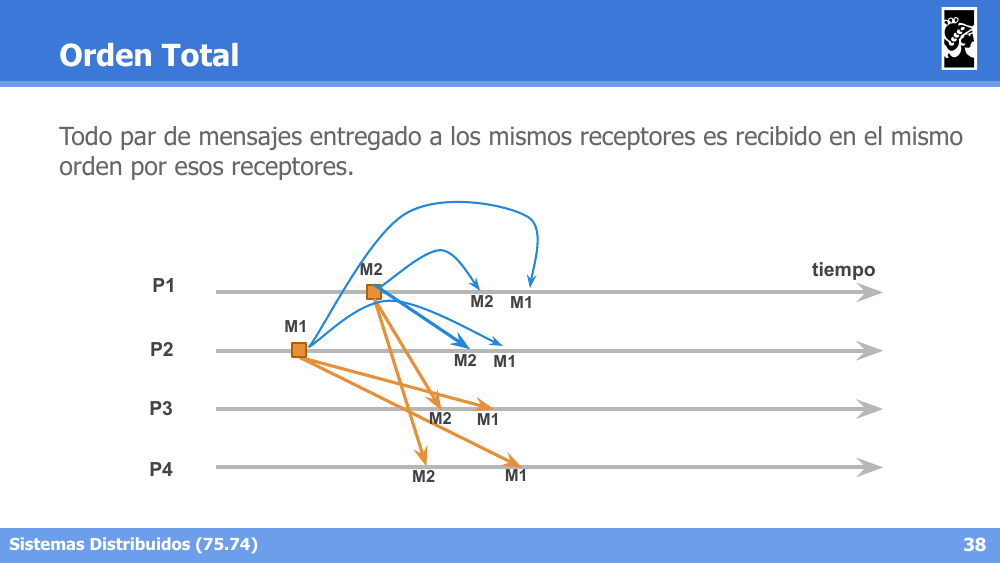

---

## 5. Estado y Consistencia

### Estado Local vs. Global

- **Estado Local**: se define sj, el estado local del proceso j en el instante t, según `s_j = (X_0(t), X_1(t), ..., X_n(t))`, con Xi = variable i del proceso j.
- **Estado Global**: se define S, el estado global del sistema en el instante t, según `S = s_0 ∪ s_1 ∪ ... ∪ s_n`.

### El Sistema como Máquina de Estados

Consiste en modelar el sistema como una serie de estados, donde un estado evoluciona al siguiente por la ocurrencia de un evento. Asumiendo instrucciones determinísticas, el procesamiento de cualquier evento bajo el estado actual se puede reproducir. Es más simple de modelar con un único proceso.

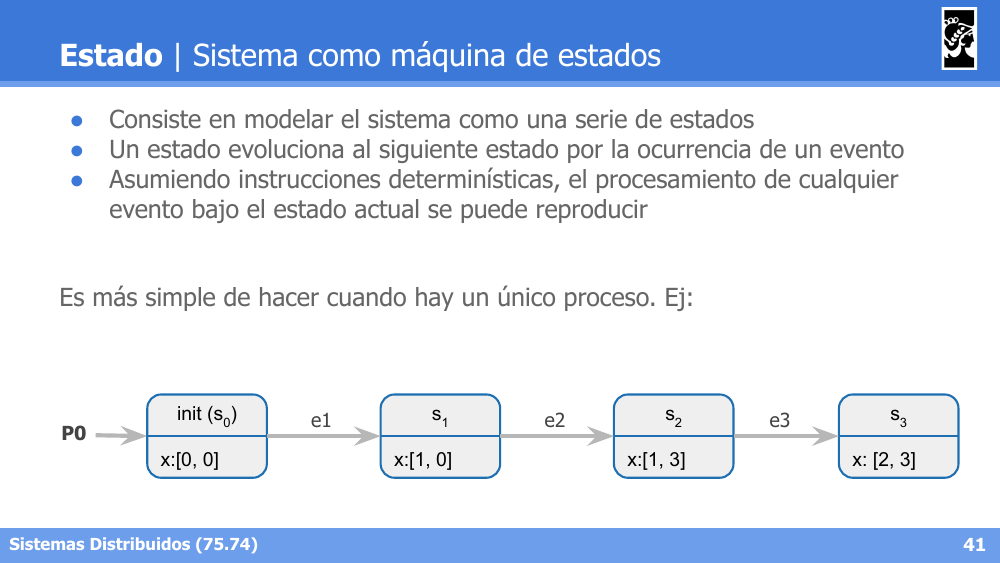

Con múltiples procesos, es más difícil determinar el estado global S, ya que existen combinaciones de estados locales que constituyen **estados globales válidos** (por ejemplo, combinar estados ya alcanzados de forma independiente por cada proceso) y otras combinaciones que constituyen **estados globales inválidos** (por ejemplo, combinar un estado posterior de un proceso con un estado anterior de otro que ya causalmente debería haber avanzado).

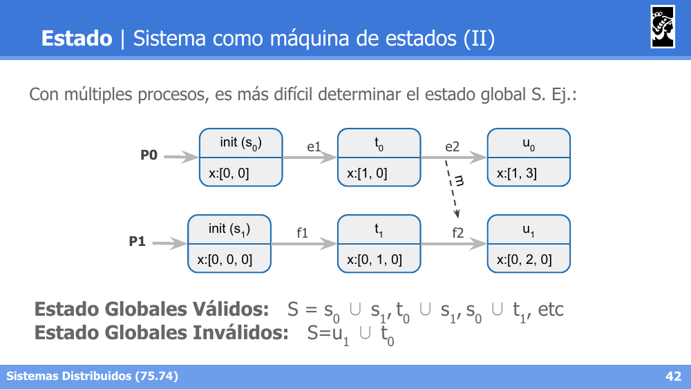

### Historia y Corte de Estados de un Sistema

- **Historia (o corrida)**: caracteriza a un proceso Pi (visto como máquina de estados) mediante la secuencia de todos los eventos procesados: `h_i = (e_0, e_1, e_2, ...)`.
- **Corte**: unión del subconjunto de historias de todos los procesos del sistema hasta cierto evento k de cada proceso: `C = h_0 ∪ ... ∪ h_n`.

### Consistencia de un Corte

Un **corte es consistente** si, por cada evento que contiene, también contiene a aquellos eventos que "ocurren antes" que dicho evento: ∀ evento e ∈ C: f→e ⇒ f ∈ C.

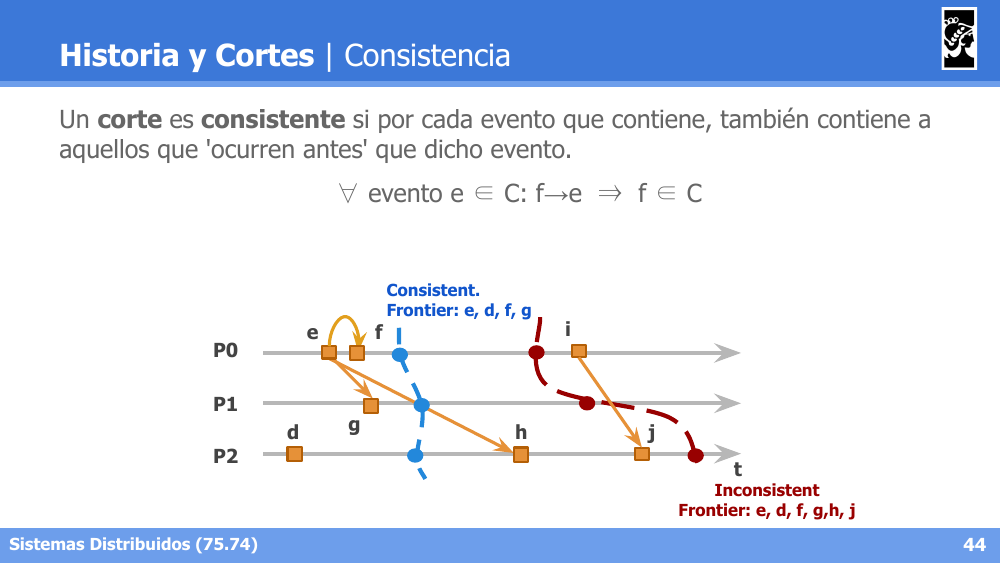

### Algoritmo de Chandy & Lamport

Algoritmo que permite obtener **snapshots** de estados globales en sistemas distribuidos. El objetivo es almacenar estados de un conjunto de procesos y estados de canales (snapshots) de forma que, aunque los estados no hayan ocurrido al mismo tiempo, **el estado global almacenado sea consistente**.

**Hipótesis:**
- Los procesos y los canales de comunicación no fallan.
- Los canales son unidireccionales y poseen orden FIFO.
- El grafo de procesos es fuertemente conexo (existen caminos de ida y vuelta definidos).
- Cada proceso puede iniciar un snapshot en cualquier momento.

**Reglas del algoritmo:**
- **Envío de Marcador**: al almacenar el estado local en `corte_i`, el proceso envía un Marcador por todos sus canales de salida.
- **Recepción de Marcador**: al recibir un Marcador, si el proceso Pi aún no grabó su estado, lo graba (`corte_i := estado de P_i`) y activa el registro de mensajes entrantes por ese canal; si ya lo había grabado, agrega los mensajes recibidos por ese canal (recibidos antes del marcador) al corte y deja de registrar ese canal.

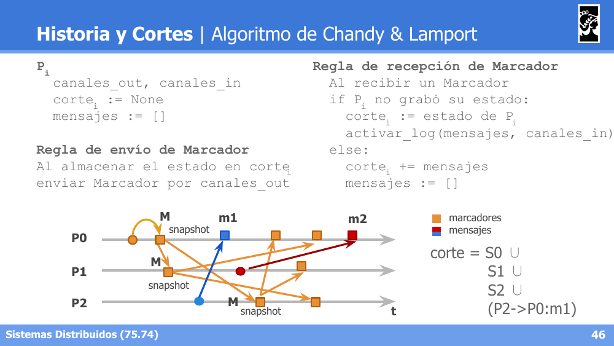

---

## 6. Comunicación Reliable — Propiedades y Orden

Una comunicación es **Reliable** (o Confiable) si se garantiza **integridad**, **validez** y **atomicidad** en el delivery de mensajes:

- **Uno a uno**: trivial de lograr si se cuenta con protocolos sobre TCP/IP y una red segura.
- **Uno a Muchos** (comunicación grupal): el grupo debe proveer las 3 propiedades; bajo TCP/IP, la atomicidad requiere atención especial, y además debe definirse el orden entre mensajes garantizado (FIFO, causal, total, etc.) según las necesidades de la aplicación.
