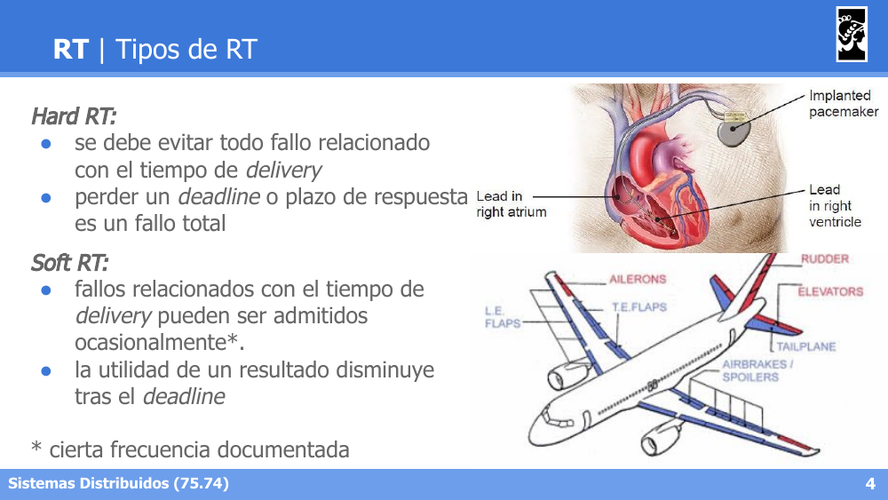
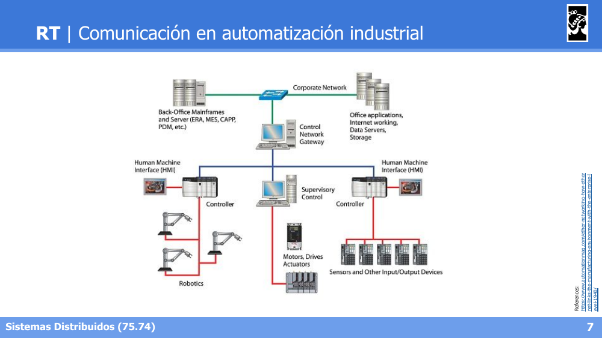
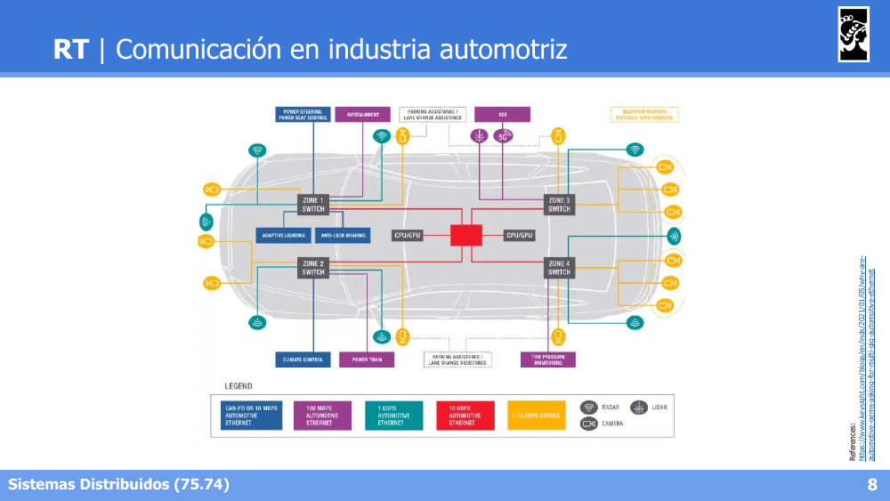
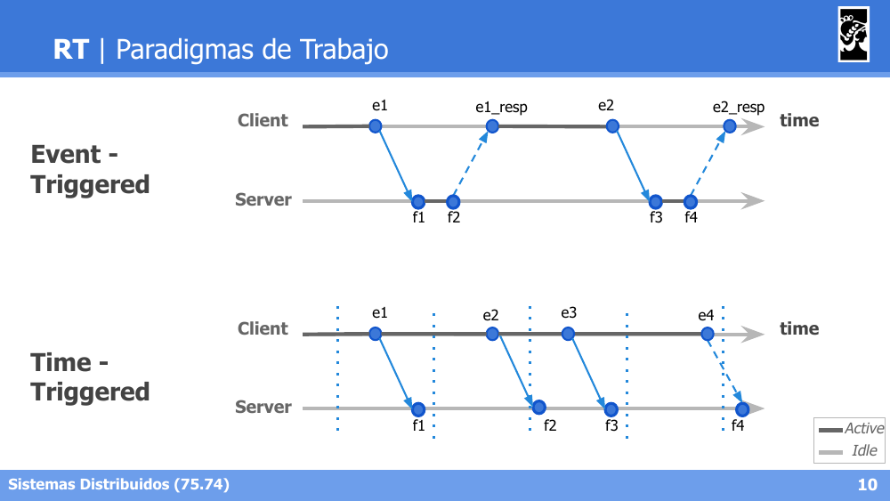
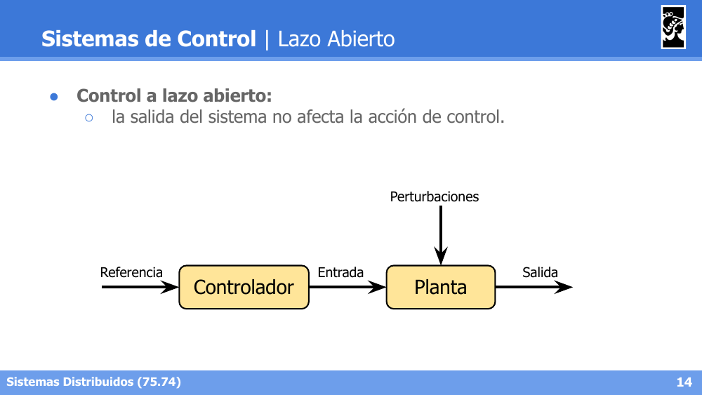
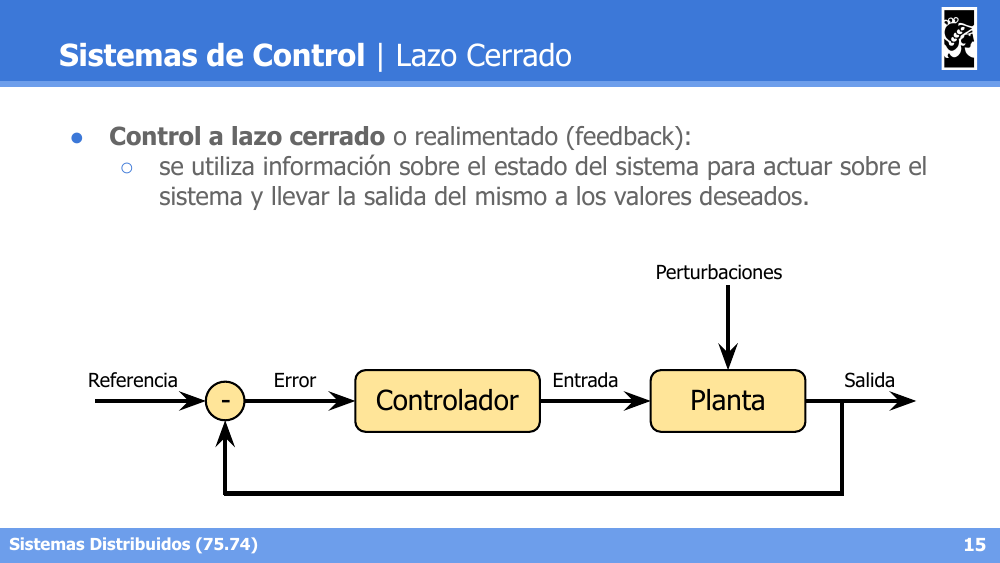
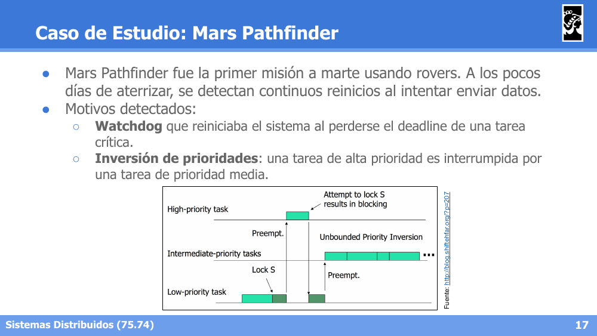
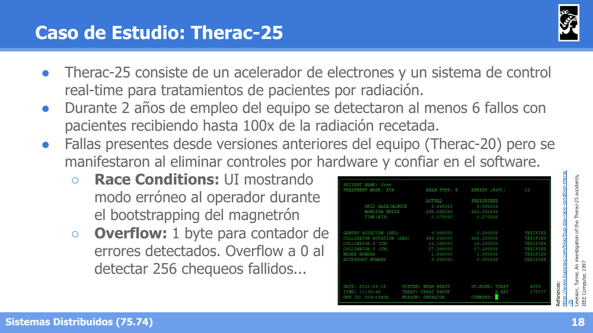
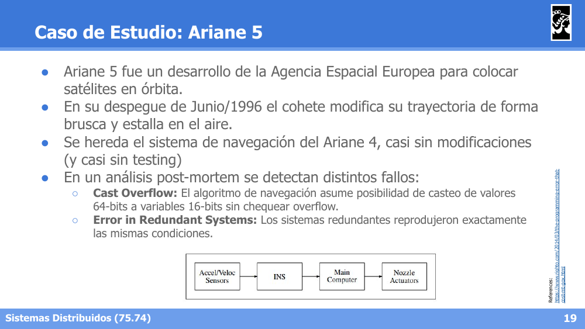
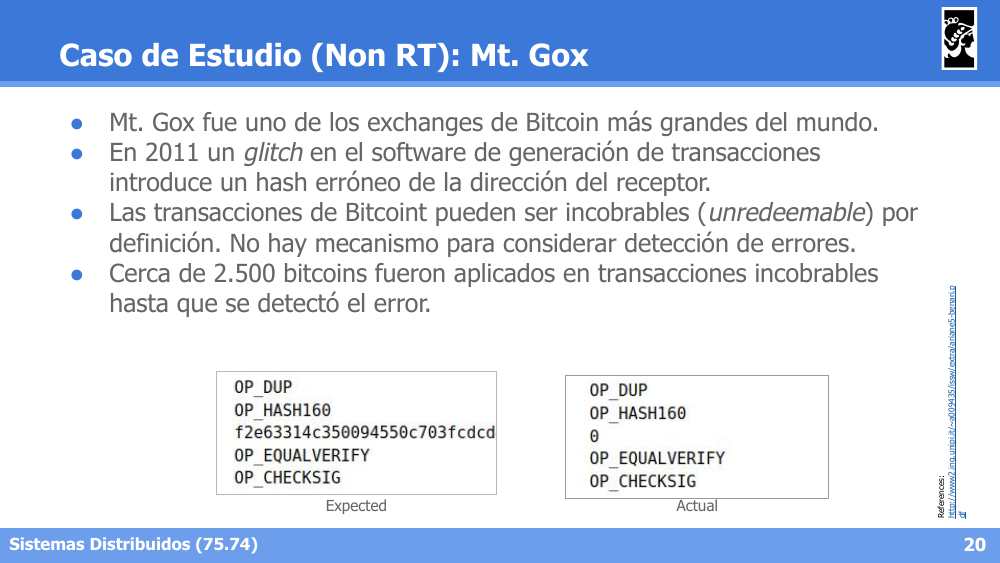

# Sistemas Distribuidos I (75.74) — Clase 21: Introducción a Sistemas de Tiempo Real

## 1. Sistemas de Tiempo Real (RT)

### Definición

- Son aquellos sistemas cuya evolución se especifica en términos de **requerimientos temporales** requeridos por el entorno.
- La correctitud del sistema depende de que entregue **respuestas correctas y en el tiempo correcto**.
- Un sistema es RT si tiene al menos un servicio RT.
- **Ejemplos**: electrodomésticos digitales, medidores de señales (presión, pulsaciones, ritmo cardíaco, etc.), mediciones por sensores, control de automóviles, control en aeronaves, marcapasos, etc.

### Tipos de RT

- **Hard RT**: se debe evitar todo fallo relacionado con el tiempo de *delivery*; perder un *deadline* o plazo de respuesta es un **fallo total** (ej. marcapasos).
- **Soft RT**: los fallos relacionados con el tiempo de *delivery* pueden ser admitidos ocasionalmente (con cierta frecuencia documentada); la utilidad de un resultado disminuye tras el *deadline* (ej. control de aeronaves en ciertos subsistemas).

### Previsibilidad

- **RT implica previsibilidad, no performance**:
  - Sistemas veloces pero sin previsibilidad **no son RT**.
  - Sistemas previsibles con tiempos característicos lentos **sí son RT**.
- Se trata de hacer un correcto ***scheduling*** para que se cumplan los *deadlines* previstos por diseño.

### Comunicación en Sistemas RT

RT requiere comunicación **fiable y sincrónica** (con *deadlines* bien definidos):
- **TCP/IP**: no permite asegurar estos atributos.
- **Comunicación Serial**: permite control sobre estos aspectos (ej. producto comercial: **Profibus**).
- **Ethernet**: puede ser utilizado en capa física, evitando no-determinismos en protocolos de capas superiores; requiere *switching* determinístico para las colisiones en transmisión (ej. producto comercial: **Profinet**).

**Ejemplos de arquitecturas de comunicación RT** en automatización industrial (redes jerárquicas conectando HMIs, controladores, sensores/actuadores y robótica) y en la industria automotriz (zonas con switches dedicados conectando sensores, cámaras, radar/lidar y sistemas de control del vehículo mediante Ethernet automotriz de distintas velocidades).

### Fault Tolerance en RT

Los sistemas RT deben ser tolerantes a **fallos de tiempo**, con distintos tipos de estrategias según el tipo de RT:

- **Soft RT** (ej. sistemas web de gran escala): el 99% de los requests deben responderse en 2 segundos; el 1% restante se debe responder en 10 segundos; se admite 1 *outlier* cada 1M de requests.
- **Hard RT** (ej. misión crítica): el 100% de los requests debe resolverse en 1 segundo; frente a errores se asume un fallo catastrófico y se recomienda un *hard reset*; es muy importante revisar el factor de **Maintainability**.

### Paradigmas de Trabajo

- **Event-Triggered**: el servidor procesa cada evento a medida que el cliente lo envía, respondiendo de forma asincrónica según llegan los requests (e1, e2, ...).
- **Time-Triggered**: el procesamiento ocurre en instantes de tiempo predefinidos, independientemente de cuándo llega cada evento, garantizando ventanas de tiempo (*slots*) fijas para cada ciclo de trabajo.

---

## 2. Sistemas de Control

### Motivación

Distintos escenarios cotidianos plantean un sistema a controlar de forma manual o automática:
- **En la Industria**: esquemas de irrigación, procesos de transferencia térmica, procesos químicos, líneas de producción.
- **En la Vida Cotidiana**: termostatos, ascensores, expendedores de líquidos, control de luminosidad, electrodomésticos en general.

### Nociones

- **Control**: capacidad de actuar para garantizar el comportamiento de un suceso.
- **Proceso**: toda sucesión de operaciones que se desea controlar.
- **Variable controlada**: cantidad o condición que se mide o controla (salida del sistema).
- **Variable manipulada**: cantidad o condición que se modifica para afectar el valor de la variable controlada.
- **Perturbación**: señal que tiende a afectar negativamente el valor de la salida del sistema.
- **Planta**: cualquier sistema físico que se desea controlar.
- **Controlador (referencia)**: sistema encargado de determinar la actuación para conseguir cierto objetivo del proceso.
- **Actuador**: elemento físico de la planta que, frente a señales del controlador, opera sobre el proceso.

### Control a Lazo Abierto

La salida del sistema **no afecta** la acción de control: el Controlador recibe una Referencia y genera una Entrada hacia la Planta, la cual produce una Salida, sin retroalimentación (aunque puede haber Perturbaciones externas que afecten la Planta).

### Control a Lazo Cerrado (Feedback)

Se utiliza información sobre el **estado del sistema** (la Salida) para actuar sobre el sistema y llevarlo a los valores deseados: la Salida se realimenta y se compara contra la Referencia, generando una señal de Error que alimenta al Controlador.

### Programación y Tiempo Real

- Arquitecturas dirigidas por eventos (*event-triggered*) o por el tiempo (*time-triggered*).
- El ***scheduling*** es importante: puede ser apropiativo o no apropiativo (*non-preemptive*), con esquemas de prioridades para poder cumplir los *deadlines*.
- Se requieren protocolos de comunicación específicos: determinismo en todas las capas, evitando algoritmos de *backoff* que introducen imprevisibilidad.

---

## 3. Casos de Estudio

### Mars Pathfinder

Fue la primera misión a Marte usando rovers. A los pocos días de aterrizar, se detectaron continuos reinicios al intentar enviar datos. Motivos detectados:
- **Watchdog** que reiniciaba el sistema al perderse el *deadline* de una tarea crítica.
- **Inversión de prioridades**: una tarea de alta prioridad era interrumpida (bloqueada) por una tarea de prioridad media, debido a que una tarea de baja prioridad retenía un recurso (*lock*) que la tarea de alta prioridad necesitaba, y era constantemente desalojada por las tareas de prioridad intermedia.

### Therac-25

Consistía en un acelerador de electrones y un sistema de control *real-time* para tratamientos de pacientes por radiación. Durante 2 años de uso se detectaron al menos 6 fallos, con pacientes recibiendo hasta 100x la radiación recetada. Las fallas estaban presentes desde versiones anteriores del equipo (Therac-20), pero se manifestaron al eliminar controles por hardware y confiar únicamente en el software. Causas:
- **Race Conditions**: la interfaz de usuario mostraba un modo erróneo al operador durante el *bootstrapping* del magnetrón.
- **Overflow**: se usaba 1 byte para el contador de errores detectados, que hacía *overflow* a 0 al detectar 256 chequeos fallidos.

### Ariane 5

Desarrollo de la Agencia Espacial Europea para colocar satélites en órbita. En su despegue de junio de 1996, el cohete modificó su trayectoria de forma brusca y estalló en el aire. Se había heredado el sistema de navegación del Ariane 4 casi sin modificaciones (y casi sin testing). En el análisis post-mortem se detectaron:
- **Cast Overflow**: el algoritmo de navegación asumía la posibilidad de castear valores de 64 bits a variables de 16 bits sin chequear overflow.
- **Error in Redundant Systems**: los sistemas redundantes reprodujeron exactamente las mismas condiciones (por lo que ambos fallaron de la misma manera, anulando el beneficio de la redundancia).

### Mt. Gox (caso No-RT)

Uno de los *exchanges* de Bitcoin más grandes del mundo. En 2011, un *glitch* en el software de generación de transacciones introdujo un hash erróneo de la dirección del receptor. Las transacciones de Bitcoin pueden ser incobrables (*unredeemable*) por definición, y no había mecanismo para considerar la detección de este tipo de errores. Cerca de 2.500 bitcoins fueron aplicados en transacciones incobrables hasta que se detectó el error.

