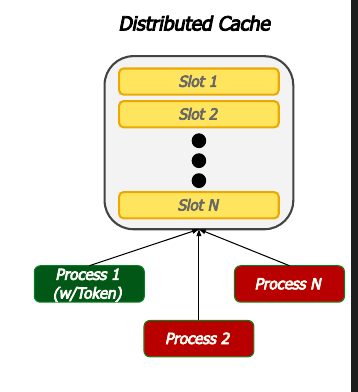

# Flashcards — Clase 02: Multitasking y Comunicaciones

> Formato: pregunta primero, respuesta debajo. Tapá las respuestas y probate.

---

**1. Compará Multi-threading, Multi-processing y Multi-computing en cuanto a recursos compartidos y sincronización.**

Respuesta

- Multi-threading: comparten Heap, Data Segment, File Descriptors y Code Segment (read-only); se sincronizan con soporte del SO (pthread-mutex) o del runtime. Alto acoplamiento, escasa estabilidad, escalabilidad muy limitada.
- Multi-processing: comparten Code Segment (read-only) y File Descriptors abiertos pre-fork; se sincronizan con IPCs (signals, shared memory, sockets, pipes, semáforos, queues, locks). Más escalable y estable, sin tolerancia a fallos de HW/SO.
- Multi-computing: no comparten ningún recurso; se sincronizan con mensajes ad-hoc entre computadoras. Problemas de ancho de banda/latencia/pérdida de mensajes, pero alta escalabilidad y tolerancia a fallos.

---

**2. ¿Qué diferencia a las Safety properties de las Liveness properties?**

Respuesta

Safety: siempre verdaderas (invariantes) — "nada malo va a pasar" (ej. exclusión mutua, ausencia de deadlocks). Liveness: eventualmente verdaderas — "algo bueno va a pasar eventualmente" (ej. ausencia de starvation, fairness).

---

**3. ¿Qué es el Busy-Waiting y cuál es su caso más simple?**

Respuesta

Es un enfoque basado en algoritmos, responsable de la mayoría de los problemas de performance en sistemas concurrentes: el proceso queda consultando repetidamente una condición sin liberar el CPU. Su caso más simple es el Spin-lock (`while (flag);`).

---

**4. Nombrá tres algoritmos clásicos de espera basados en algoritmos (sin abstracciones del SO).**

Respuesta

Algoritmo de Dekker, Algoritmo de Lamport (del panadero) y Algoritmo de Peterson.

---

**5. ¿Qué es CAS (Compare and Swap) y para qué se usa?**

Respuesta

Es la operación atómica por excelencia para actualizar contenedores de forma segura en ambientes multithreading: compara el valor actual de un puntero contra un valor esperado (`old`) y, si coincide, lo reemplaza por `new`, devolviendo si el swap fue exitoso.

---

**6. ¿Qué es un semáforo y cuál es el caso particular llamado Mutex?**

Respuesta

Un semáforo es una variable entera usada para acceder a recursos compartidos, con operaciones signal (incrementa) y wait (decrementa). El Mutex es el caso particular con S = {0,1}, usado para acceder a secciones críticas.

---

**7. ¿Qué es un Monitor y qué son las Condition Variables?**

Respuesta

Un monitor encapsula variables compartidas y expone operaciones que pasan por mecanismos de sincronización internos, atendiendo una cola de pedidos. Las Condition Variables son un ejemplo práctico de monitor: requieren adquirir el mutex antes de operar, y ofrecen wait (bloquea hasta ser despertado) y notify/notify_all (despierta a uno o todos los procesos que esperan una condición).

---

**8. ¿Qué hace una Barrera como mecanismo de sincronización?**

Respuesta

Detiene a cada proceso/thread hasta que todos llegan a un mismo punto de sincronización (GO); recién ahí todos continúan en conjunto. Típico en escenarios donde N threads ejecutan M tareas por rondas.

---

**9. ¿Qué es un Rendezvous y con qué abstracción se puede implementar?**

Respuesta

Es sincronización mediante paso de mensajes (Message Passing) entre dos procesos que se "encuentran" en un punto determinado, como el pase de posta en una carrera de relevos. Se puede resolver con la abstracción BlockingQueue.

---

**10. ¿Qué son los IPCs y cómo son vistos en Linux?**

Respuesta

Son mecanismos provistos por el Sistema Operativo para la comunicación entre dos o más procesos. Su vida excede la del proceso (el usuario es responsable de crearlos/destruirlos, usualmente con procesos Launcher/Terminator) y suelen identificarse por nombre. En Linux, todos los IPCs son vistos como distintos tipos de archivos.

---

**11. ¿Qué dos signals no se pueden handlear (excepción a la regla)?**

Respuesta

SIGSTOP y SIGKILL.

---

**12. ¿Cuándo se necesita usar un mutex sobre una Shared Memory?**

Respuesta

Solo cuando dos procesos no pueden acceder a la memoria al mismo tiempo (ej. un shared counter); el tamaño de la shared memory se define al ser creada.

---

**13. Diferenciá Shared lock y Exclusive lock en File Locks.**

Respuesta

Shared lock (R): read-only lock, se permiten múltiples read locks simultáneos. Exclusive lock (W): RW lock, solo un exclusive lock a la vez por archivo.

---

**14. ¿Cuál es la diferencia entre Unnamed Pipes y Named Pipes (FIFO)?**

Respuesta

Unnamed Pipes: comunicación entre procesos padre e hijo, dejan de existir al finalizar el proceso. Named Pipes (FIFO): comunicación entre dos procesos cualesquiera, viven en el SO por lo que exceden la vida del proceso.

---

**15. En las Message Queues de System V, ¿qué implica el campo mtype según su valor?**

Respuesta

Identifica el tipo de mensaje. El sender debe enviar mensajes con mtype > 0. Un receptor con mtype = 0 recibe mensajes sin importar el mtype. Un receptor con mtype < 0 es un caso esotérico. Los mensajes leídos se remueven de la cola.

---

**16. ¿Qué combinaciones de domain/type definen un socket UDP, un socket TCP y un Unix socket?**

Respuesta

UDP: `AF_INET`/`AF_INET6` + `SOCK_DGRAM`. TCP: `AF_INET`/`AF_INET6` + `SOCK_STREAM`. Unix socket: `AF_UNIX`. También existe `SOCK_RAW` para acceso de bajo nivel.

---

**17. En el problema Productor-Consumidor, ¿cuáles son las dos situaciones de bloqueo posibles?**

Respuesta

El productor intenta agregar un paquete cuando el buffer está lleno, y el consumidor intenta extraer un paquete cuando el buffer está vacío. El acceso al buffer debe estar sincronizado, y una pregunta de diseño clave es si el buffer es acotado o infinito.

---

**18. En Lectores-Escritores, ¿qué diferencia a la Prioridad Lectores de la Prioridad Escritores?**

Respuesta

Prioridad Lectores: los escritores esperan a que los lectores liberen el recurso compartido. Prioridad Escritores: los lectores esperan a que los escritores liberen el recurso compartido.

---

**19. ¿Cómo se relacionan las capas del modelo TCP/IP con las del modelo OSI?**

Respuesta

La capa Application de TCP/IP engloba las capas Application + Presentation + Session de OSI. El resto son prácticamente equivalentes: Transport-Transport, Internet-Network, Network Access-(Data Link + Physical).

---

**20. Comparación TCP vs UDP: orientación, garantías y complejidad del header.**

Respuesta

TCP: orientado a conexión, asegura entrega y orden, header complejo (Sequence Number, Ack Number, Flags, Window, Checksum, Urgent Pointer, Options). UDP: orientado a datos, sin garantías (best effort), header simple (Length, Checksum).

---

**21. Flujo típico de sockets TCP para Server y Client.**

Respuesta

Server: `socket() → bind() → listen() → accept() → read()/write() → close()`. Client: `socket() → connect() → write()/read() → close()`.

---

**22. ¿Qué diferencia a un mensaje Sincrónico de uno Asincrónico?**

Respuesta

Sincrónico: el cliente queda bloqueado (Active) esperando la respuesta entre el Request y la Response. Asincrónico: el cliente queda libre (Idle) tras enviar el Request, y retoma actividad cuando llega la Response.

---

**23. ¿Qué pasa con el Throughput y el Delay a medida que aumenta la carga de red?**

Respuesta

Throughput: crece hasta un punto de congestión moderada; más allá de cierto punto entra en congestión severa y cae drásticamente. Delay: el promedio de todos los paquetes crece muy pronunciadamente con la carga, mientras que el de los paquetes efectivamente entregados crece más moderadamente y se estabiliza.

