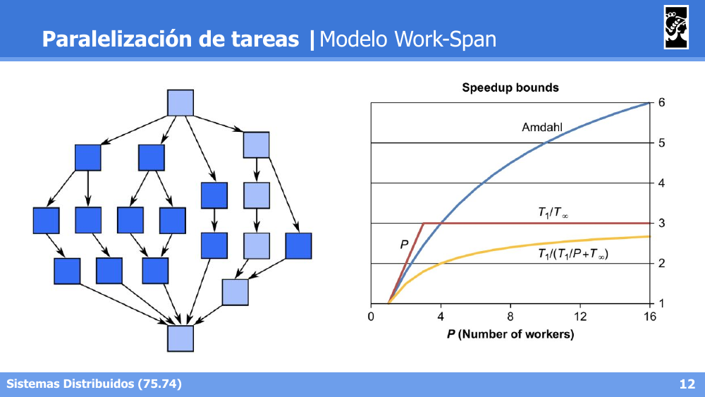
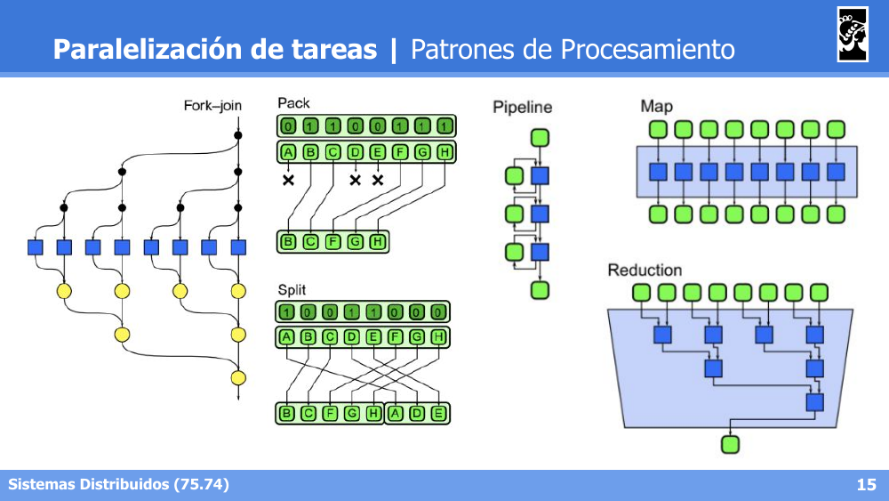
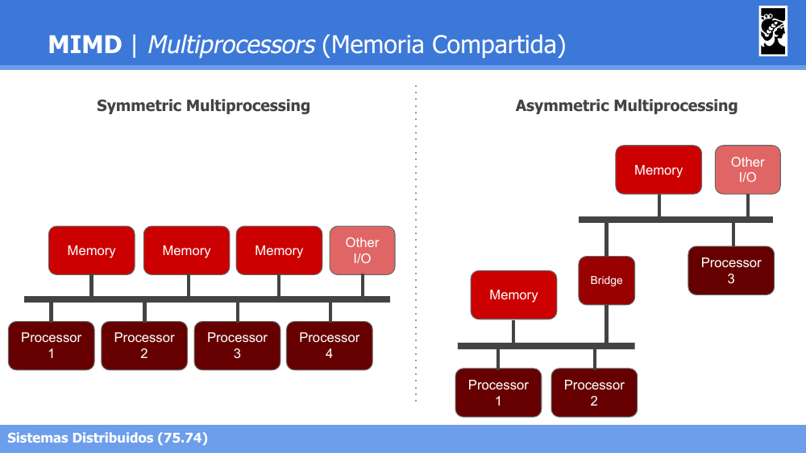
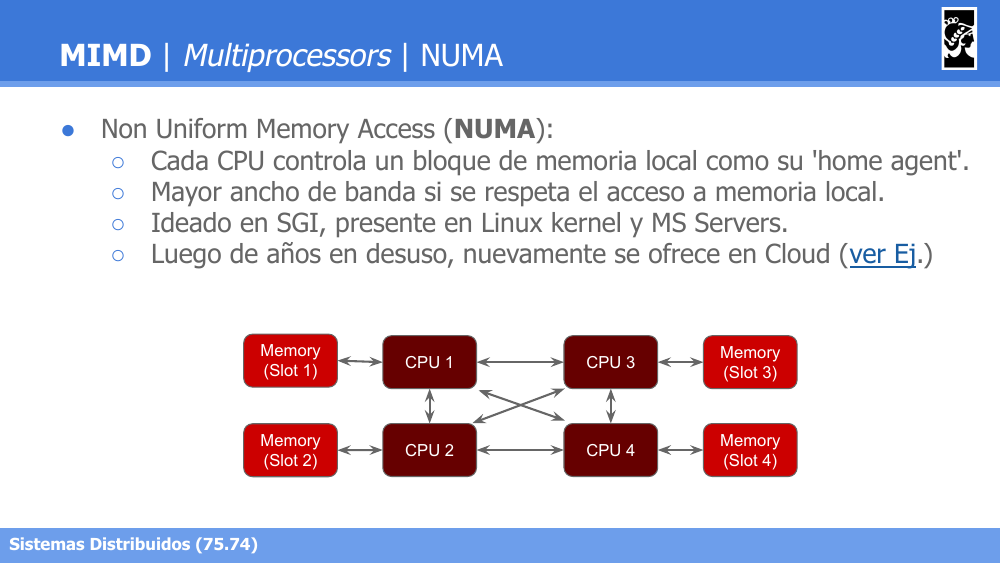
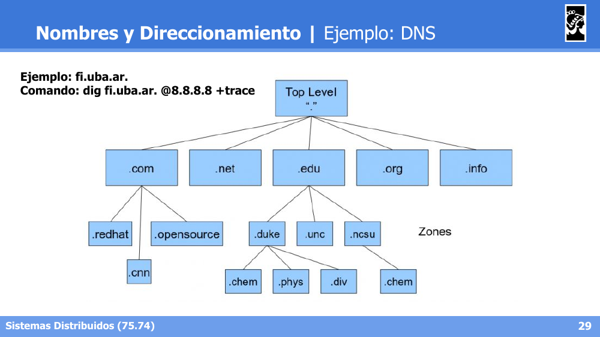
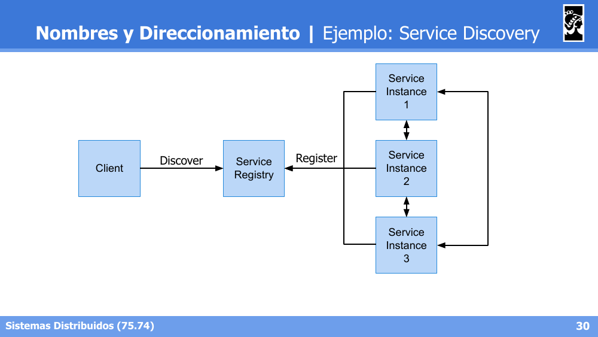

# Flashcards — Clase 03: Paralelización, Multiprocessors y Nombres

> Formato: pregunta primero, respuesta debajo. Tapá las respuestas y probate.

---

**1. ¿Cuáles son los tres objetivos principales de paralelizar tareas?**

Respuesta

Reducir el tiempo de cómputo de una tarea (latencia), incrementar la cantidad de tareas realizables en paralelo (throughput) y reducir la energía consumida al realizar todas las tareas.

---

**2. ¿Qué es el "camino crítico" en paralelización?**

Respuesta

Es la máxima longitud de tareas secuenciales a computar. Define el mejor rendimiento posible al realizar un conjunto de tareas, ya que ninguna paralelización puede ir más rápido que esa cadena de dependencias.

---

**3. ¿Qué establece la Ley de Amdahl y de qué depende el Speedup máximo?**

Respuesta

Establece que el esfuerzo en lograr altas tasas de procesamiento paralelo se desperdicia si no va acompañado de mejoras similares en la fracción secuencial. El Speedup máximo está acotado por la fracción de tiempo no paralelizable, asumiendo que la fracción paralelizable se distribuye uniformemente entre los procesadores.

---

**4. ¿En qué se diferencia la Ley de Gustafson de la Ley de Amdahl?**

Respuesta

Gustafson plantea que el Speedup debe medirse escalando el problema a la cantidad de procesadores, no fijando su tamaño. Si el problema crece, el Speedup aumenta ya sea porque la parte serial disminuye proporcionalmente o porque el paralelismo aumenta. A diferencia de Amdahl (tamaño de problema fijo), Gustafson asume que más cómputo disponible se usa para resolver problemas más grandes.

---

**5. En el Modelo Work-Span, ¿qué representan Work (T₁) y Span (T∞)?**

Respuesta

Work (T₁): tiempo total si el programa se ejecutara de forma completamente serial (un solo hilo). Span (T∞) o camino crítico: tiempo mínimo si se ejecutara con un número infinito de procesadores; representa la secuencia más larga de dependencias entre tareas.

---

**6. ¿Cuáles son las hipótesis del Modelo Work-Span?**

Respuesta

Paralelismo imperfecto (no todo el trabajo paralelizable se puede ejecutar al mismo tiempo), Greedy scheduling (proceso disponible ⇒ tarea ejecutada), tiempo de acceso a memoria despreciable y tiempo de comunicación entre procesos despreciable.

---

**7. ¿Entre qué cotas se ubica el Speedup según el modelo Work-Span, y por qué el modelo de Amdahl sobreestima el Speedup?**

Respuesta

El Speedup se acota entre T₁/(T₁/P + T∞) (cota inferior) y min(P, T₁/T∞) (cota superior). Amdahl sobreestima porque asume que la fracción paralelizable se distribuye perfectamente entre los P procesadores, sin considerar las dependencias reales del camino crítico que sí captura Work-Span.

---

**8. Diferenciá Descomposición Funcional de Particionamiento de Datos como estrategias de particionamiento.**

Respuesta

Descomposición Funcional: divide el problema en funciones independientes que se ejecutan en paralelo (ej. `f(data)`, `g(data)`, `h(data)` cada una en su propio proceso). Particionamiento de Datos: divide los datos de entrada entre procesos que ejecutan la misma función sobre distintos rangos (solo aplica si la función es particionable).

---

**9. Nombrá los patrones de procesamiento vistos y qué hace cada uno.**

Respuesta

- Fork-Join: un proceso se divide (fork) en tareas paralelas que luego se sincronizan (join).
- Pack/Split: reorganización de datos filtrando o separando elementos según una condición.
- Pipeline: tareas encadenadas donde la salida de una etapa alimenta la siguiente, permitiendo solapamiento.
- Map: aplica la misma operación a cada elemento de un conjunto de datos en paralelo.
- Reduction: combina múltiples elementos en un único resultado de forma jerárquica/paralela.

---

**10. ¿Qué clasifica la Taxonomía de Flynn y cuáles son sus cuatro categorías?**

Respuesta

Clasifica sistemas según la cardinalidad de flujos de instrucciones (procesadores) y flujos de datos (memoria): SISD (single instruction, single data — un procesador sin paralelismo), SIMD (array processors, ej. GPU), MISD (poco usual: redundant computation, data-pipelines) y MIMD (múltiples instrucciones, múltiples datos).

---

**11. Dentro de MIMD, ¿qué diferencia a Multiprocessors de Multicomputers?**

Respuesta

Multiprocessors: comparten memoria y/o clock. Multicomputers: no comparten memoria ni clock, cada computadora tiene su propia memoria local, puede fallar independientemente y requiere comunicación por red (LAN, MAN, WAN).

---

**12. Diferenciá Symmetric Multiprocessing de Asymmetric Multiprocessing.**

Respuesta

Symmetric: todos los procesadores acceden por igual al bus compartido con la memoria y dispositivos de I/O. Asymmetric: existe una jerarquía/bridge entre procesadores, no todos tienen el mismo nivel de acceso directo a la memoria principal.

---

**13. ¿Qué diferencia a UMA de NUMA?**

Respuesta

UMA (Uniform Memory Access): el tiempo de acceso a memoria es idéntico para todos los procesadores, con ancho de banda compartido y performance balanceada para uso general. NUMA (Non Uniform Memory Access): cada CPU controla un bloque de memoria local (home agent), logrando mayor ancho de banda si se respeta el acceso a memoria local; ideado en SGI, presente en Linux kernel y MS Servers.

---

**14. ¿Qué son los "Nombres" en un sistema distribuido y qué propiedad clave tienen respecto a las direcciones?**

Respuesta

Permiten identificar unívocamente a una entidad dentro de un sistema, deben describirla, y la abstraen de las propiedades que la atan al sistema (lugar geográfico, direcciones de red). A diferencia de la dirección (que puede cambiar y ser reutilizada), el nombre en general no cambia.

---

**15. ¿Qué es el Direccionamiento (Addressing)?**

Respuesta

Es el mapeo entre un nombre y una dirección. La dirección de una entidad puede cambiar aunque el nombre se mantenga, y una misma dirección puede ser reutilizada por distintas entidades a lo largo del tiempo.

---

**16. Dá tres ejemplos de mapeo nombre → dirección y su protocolo/mecanismo de resolución.**

Respuesta

- Domain Name → IP Address: resuelto mediante DNS.
- IP Address → Ethernet Address: resuelto mediante ARP (IPv4) o ND/Neighbor Discovery (IPv6).
- Service (nombre) → Instances (dirección): resuelto mediante Service Discovery (implementaciones: Zookeeper, Istio, Linkerd).

---

**17. ¿Cómo se organiza jerárquicamente el DNS?**

Respuesta

En zonas, desde el nivel raíz (Top Level `"."`) hacia dominios (`.com`, `.net`, `.edu`, `.org`, `.info`) y subdominios dentro de estos (ej. `.duke`, `.unc`, `.ncsu` dentro de `.edu`). Se puede explorar con el comando `dig fi.uba.ar. @8.8.8.8 +trace`.

---

**18. ¿Cómo funciona el Service Discovery?**

Respuesta

Las Service Instances se registran (Register) en el Service Registry. El Client consulta (Discover) al Service Registry para obtener una instancia disponible del servicio que necesita, resolviendo así el nombre del servicio a una dirección concreta.

---
