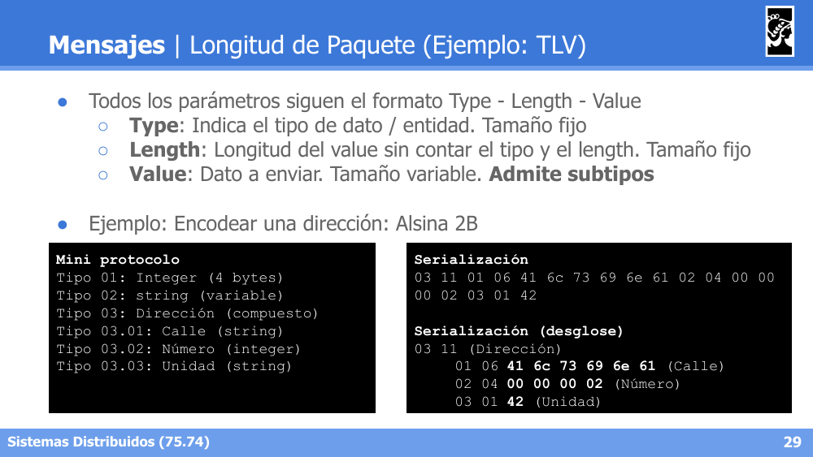
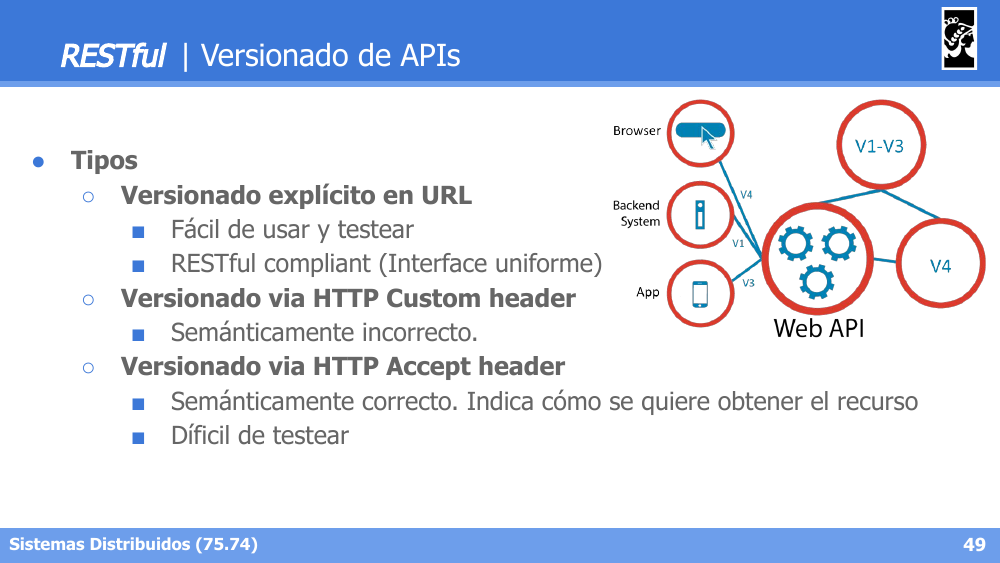

# Flashcards — Clase 04: Interfaces y Protocolos

> Formato: pregunta primero, respuesta debajo. Tapá las respuestas y probate.

---

**1. ¿Qué diferencia a Layers de Tiers?**

Respuesta

Layers son capas lógicas: agrupación de componentes y funcionalidades de un sistema. Tiers son capas físicas: describen la distribución física de componentes y funcionalidad de un sistema.

---

**2. Diferenciá Capas Verticales de Capas Horizontales (transversales).**

Respuesta

Verticales: se apilan secuencialmente (Layer N-1, N, N+1), cada una provee servicios a la de arriba y consume servicios de la de abajo. Horizontales o transversales: atraviesan a todas las demás capas (ej. Security, Audit).

---

**3. ¿Qué diferencia a un Downcall de un Upcall entre capas?**

Respuesta

Downcall: invocación de una capa superior hacia una inferior (con o sin respuesta), es el caso normal. Upcall: invocación de una capa inferior hacia una superior, es un caso excepcional.

---

**4. Nombrá las capas concéntricas de la Onion/Clean Architecture, de adentro hacia afuera.**

Respuesta

Entities (núcleo) → Use Cases → Interface Adapters (Controllers, Presenters, Gateways) → Frameworks & Drivers (Web, DB, Devices, External Interfaces, UI).

---

**5. Diferenciá el deployment 2-Tier del 3-Tier.**

Respuesta

2-Tier: Client Tier → Database Tier. 3-Tier: Client Tier → Business Logic Tier → Database Tier, agregando una capa intermedia de lógica de negocio entre el cliente y la base de datos.

---

**6. ¿Qué diferencia a las interfaces Inter-Aplicaciones de las Intra-Aplicaciones?**

Respuesta

Inter-Aplicaciones: Application Programming Interfaces (APIs), ej. cliente por consola consultando un Web Server, o un servicio consultando a otro servicio. Intra-Aplicaciones: Facades, Mediators, Interfaces dentro de la misma aplicación, ej. una Layer consultando a otra, o un mensaje enviado a un objeto local.

---

**7. Diferenciá contratos Orientados a entidades de los Orientados a procesos.**

Respuesta

Orientados a entidades: buscan desacoplamiento entre sistemas, flexibilidad como objetivo, funcionalidad estándar (ej. `GET /page/title/{title}`). Orientados a procesos: componentes altamente acoplados, alta performance como objetivo, funcionalidad diversa (ej. `POST /transform/html/to/wikitext/{title}`).

---

**8. Nombrá las cuatro categorías de Clasificación de Interfaces vistas.**

Respuesta

Web APIs (SOAP, REST), Remote APIs (custom TCP/UDP, orientado a objetos como CORBA/JavaRMI, orientado a procedimientos como RPC/gRPC), Library-based/Frameworks (Java API, Android API) y OS related (POSIX, WinAPI).

---

**9. ¿Qué es una PDU (Protocol Data Unit) y cómo se comunican las capas entre sí?**

Respuesta

Cada capa de un nodo se comunica lógicamente con su par equivalente en el otro nodo, intercambiando su propia PDU, aunque físicamente los datos bajan y suben por la pila de capas locales (Application → Services → Core → Communication → Transport → Internet → Network Access).

---

**10. ¿Cuáles son las tres estrategias posibles de encapsulación de PDUs entre capas?**

Respuesta

Encapsulación exacta (cada capa agrega su propio header al payload de la capa superior), segmentación de paquetes y batching de paquetes.

---

**11. Compará formato Binario vs Texto Plano en mensajes: performance, serialización e interacción.**

Respuesta

Binario: alta performance (tamaño eficiente, compresión no siempre necesaria), serialización con autogeneración de código (Protobuf, Thrift, ASN.1), requiere cliente/decoder específico. Texto plano: baja performance (throughput bajo, compresión agrega overhead), serialización human-readable (JSON, XML), cliente único si se conoce el protocolo (ej. cURL), fácil de debuggear.

---

**12. ¿Qué es el formato TLV (Type-Length-Value) y qué representa cada campo?**

Respuesta

Es un esquema de codificación donde todos los parámetros siguen el formato Type-Length-Value: Type indica el tipo de dato/entidad (tamaño fijo), Length indica la longitud del value sin contar tipo y length (tamaño fijo), Value es el dato a enviar (tamaño variable, admite subtipos/estructuras compuestas).

---

**13. Describí el flujo de mensajes del protocolo TFTP.**

Respuesta

El cliente solicita un archivo con un Read/Write Packet (Opcode 1/2 + Filename + 0 + Mode + 0). El servidor responde con Data Packets (Opcode 3 + Block# + Data) que el cliente confirma con ACK Packets (Opcode 4 + Block#). El último bloque de datos con menos de 512 bytes (o 0 bytes) indica el fin de la transferencia.

---

**14. En REST, ¿qué verbo HTTP corresponde a cada operación CRUD y su equivalente SQL?**

Respuesta

Create → POST → INSERT. Read → GET → SELECT. Update → PUT → UPDATE. Delete → DELETE → DELETE.

---

**15. Nombrá los principios de arquitectura RESTful.**

Respuesta

Arquitectura cliente/servidor, Cacheability, Interface Uniforme (HATEOAS — Hypermedia As The Engine Of Application State), Statelessness (sin estado) y Layered system.

---

**16. ¿Qué significan los status codes 201, 204, 304, 409 y 422?**

Respuesta

201 Created: POST exitoso, retorna el recurso creado. 204 No Content: éxito sin contenido adicional en el body. 304 Not Modified: el recurso no fue modificado desde el último request. 409 Conflict: ya existe un recurso en conflicto. 422 Unprocessable: la entidad no pudo ser procesada.

---

**17. ¿Por qué "Identidad != Nombre" en RESTful, y qué define la identidad de una entidad?**

Respuesta

El nombre puede cambiar, pero la identidad no. La URL define la identidad de la entidad, no un identificador interno arbitrario (ej. usar `"id": "/pet/12345"` en vez de `"id": "12345"`).

---

**18. En Semantic Versioning (Major.Minor.Patch), ¿qué implica incrementar cada número?**

Respuesta

Major: cambios incompatibles con la versión anterior. Minor: se agrega funcionalidad manteniendo retrocompatibilidad. Patch: correcciones que no afectan la interfaz.

---

**19. ¿Cuáles son los tres tipos de versionado de API y cuál es el más recomendado?**

Respuesta

Versionado explícito en URL (fácil de usar/testear, RESTful compliant), versionado vía HTTP Custom header (semánticamente incorrecto) y versionado vía HTTP Accept header (semánticamente correcto pero difícil de testear). El explícito en URL es el más recomendado por simplicidad y compliance con REST.

---

**20. Diferenciá Format Versioning de Historical Versioning en Versionado de Objetos.**

Respuesta

Format Versioning: la API brinda distintas representaciones de la misma entidad, cambiando su formato (ej. distintas versiones de la API, o filtrado de datos del objeto). Historical Versioning: la misma entidad tiene distintas versiones almacenadas a lo largo de su ciclo de vida (ej. `GET /api/pages/{id}/{rev}` en una Wiki).

---
