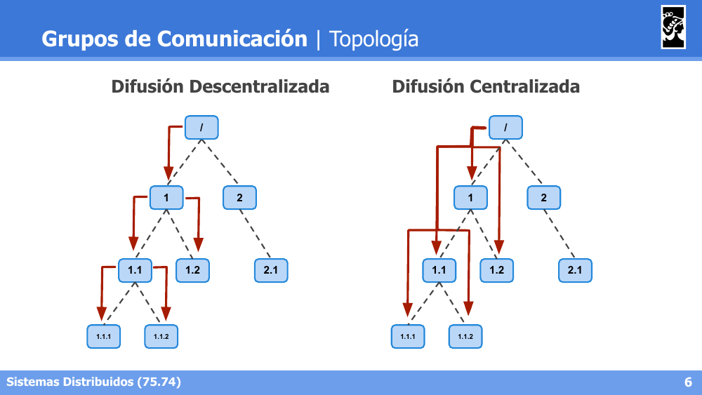
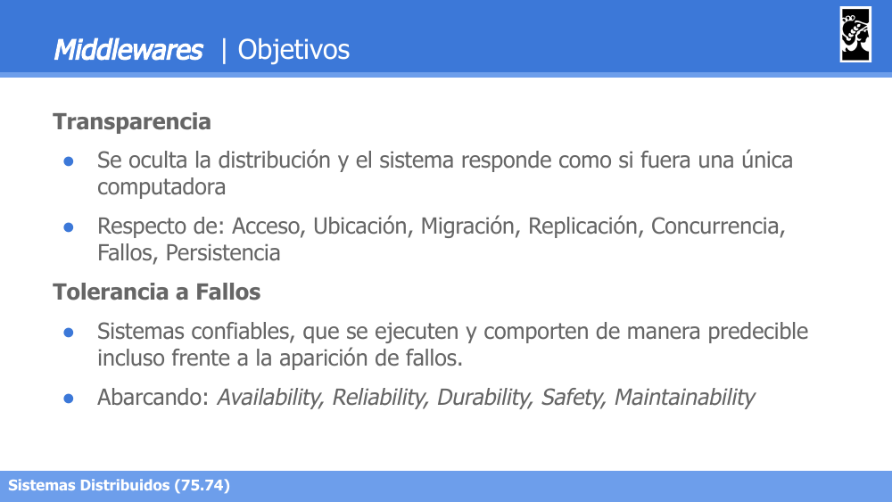
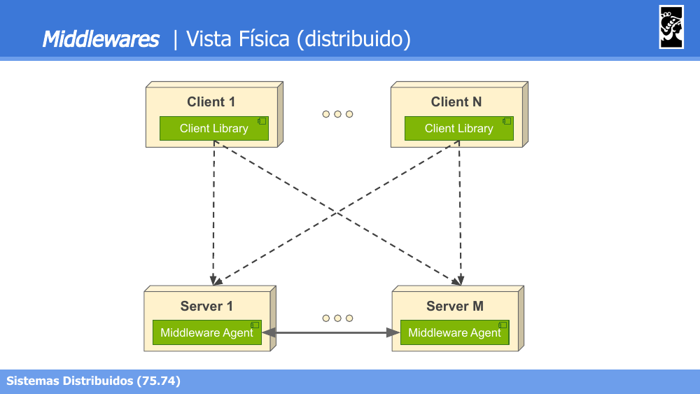
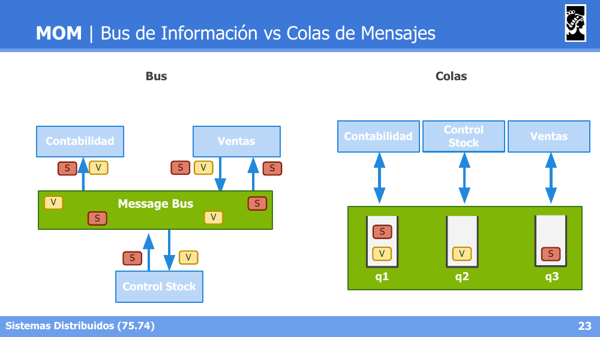
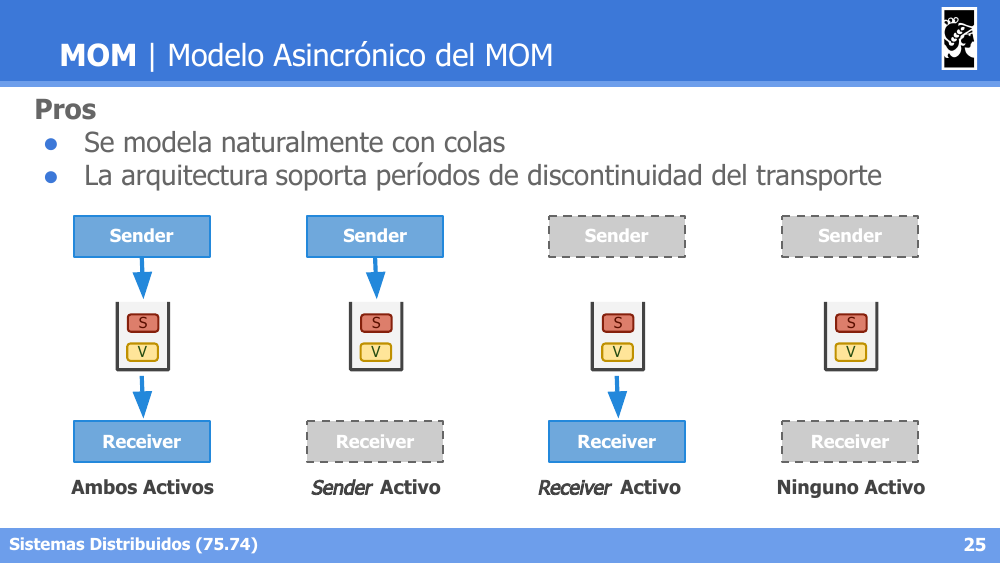
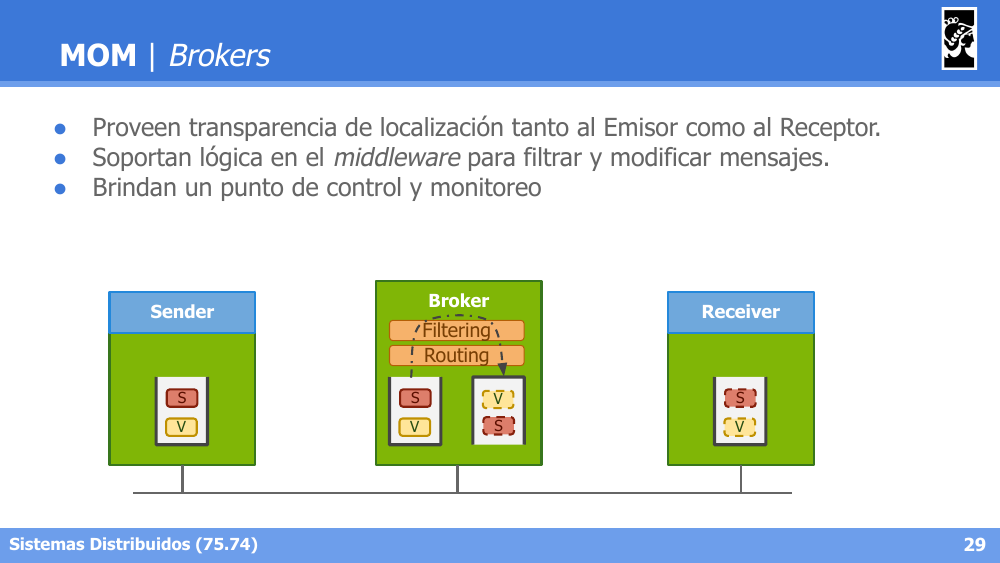
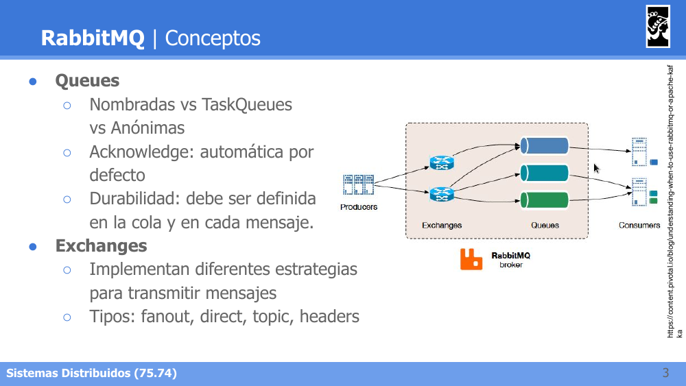
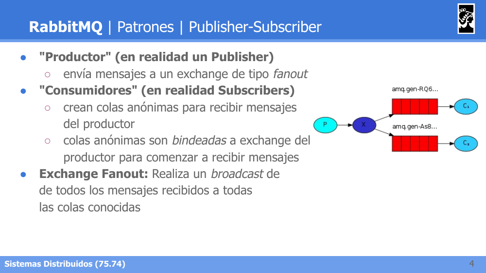
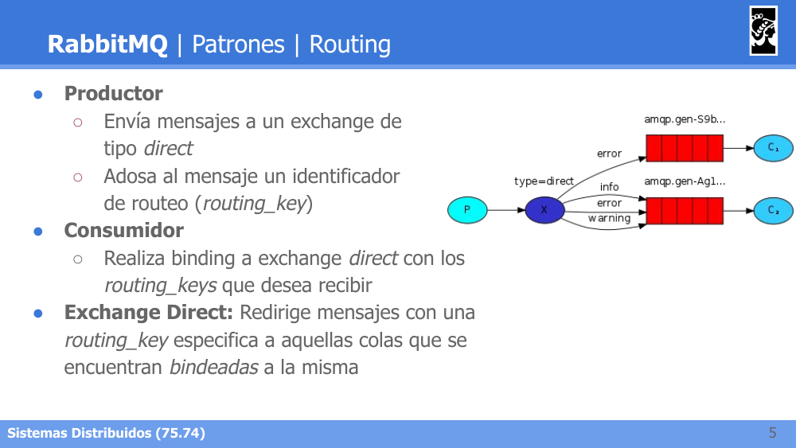
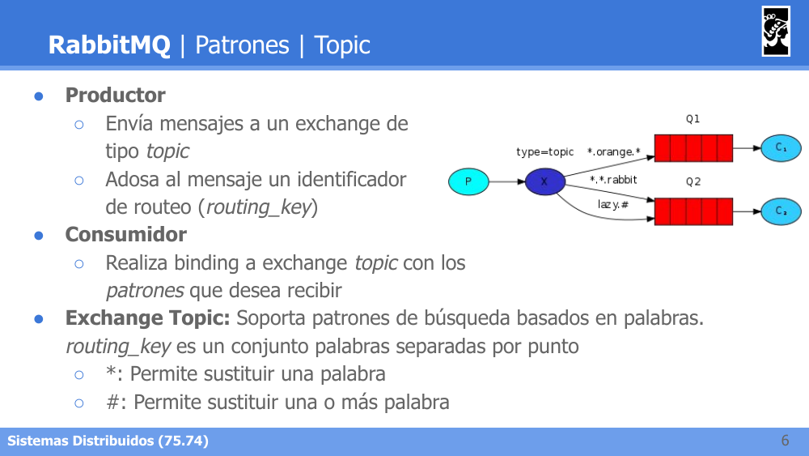

# Flashcards — Clase 05: Grupos, Middlewares, MOMs y RabbitMQ

> Formato: pregunta primero, respuesta debajo. Tapá las respuestas y probate.

---

**1. ¿Qué diferencia a Unicast, Anycast, Multicast y Broadcast?**

Respuesta

Uno a uno: Unicast (comunicación punto a punto), Anycast (solo uno en el grupo recibe el mensaje, ej. el nodo más cercano). Uno a muchos: Multicast (solo los que están en cierto conjunto reciben el mensaje), Broadcast (todos reciben el mensaje).

---

**2. Nombrá las tres topologías de grupos de comunicación vistas.**

Respuesta

Anillos (cada nodo conectado a sus dos vecinos formando un ciclo), Punto a Punto (todos los nodos conectados entre sí, malla completa) y Grupos Jerárquicos (estructura en árbol con niveles).

---

**3. Diferenciá Difusión Descentralizada de Difusión Centralizada en una topología jerárquica.**

Respuesta

Descentralizada: cada nodo retransmite el mensaje únicamente a sus hijos directos, propagándose nivel por nivel. Centralizada: el nodo raíz envía el mensaje directamente a todos los nodos del árbol.

---

**4. ¿Qué implica la Atomicidad de mensajes en grupos de comunicación?**

Respuesta

Los mensajes deben entregarse a todos o a ninguno de los destinatarios. Requiere ACKs de mensajes, demorar el delivery de los paquetes recibidos, y reintentos frente a caída de receptores, caída del coordinador, no recepción de mensajes o no recepción de ACKs.

---

**5. Dá una definición de Middleware y qué provee a nivel lógico.**

Respuesta

Es software de conectividad (capa entre el sistema operativo y las aplicaciones) que permite a múltiples procesos corriendo en una o varias máquinas interactuar entre sí a través de la red, proveyendo una vista única del sistema independientemente de la computadora física donde corra cada aplicación.

---

**6. ¿Cuáles son los objetivos principales de un Middleware?**

Respuesta

Transparencia (ocultar la distribución: Acceso, Ubicación, Migración, Replicación, Concurrencia, Fallos, Persistencia), Tolerancia a Fallos (Availability, Reliability, Durability, Safety, Maintainability), Acceso a recursos compartidos eficiente y controlado, Sistemas distribuidos abiertos (interoperabilidad, portabilidad) y Comunicación de grupos (broadcasting/multicasting).

---

**7. Diferenciá un Middleware Centralizado de uno Distribuido a nivel físico.**

Respuesta

Centralizado: existe un Middleware Host único (con módulos de Discovery, Orchestration, Security, Persistence) al que se conectan clientes y nodos. Distribuido: existen múltiples Servers, cada uno con su propio Middleware Agent, comunicados entre sí y accesibles por distintos clientes.

---

**8. Nombrá las clasificaciones de Middlewares vistas y qué caracteriza a cada una.**

Respuesta

- Transactional Procedure: garantiza transaccionalidad de operaciones sobre datos, con políticas de reintentos y retención frente a caídas.
- Object Oriented: mensajes hacia objetos distribuidos que viven dentro del middleware, con esquema de marshalling.
- Procedure Oriented: el middleware funciona como servidor de funciones invocables, sin estado entre invocaciones.
- Message Oriented: sistema de mensajería entre aplicaciones, en modo Information Bus (por tópico) o modo Queue (destinatario definido).
- Reflective Middlewares: de configuración dinámica.

---

**9. ¿Qué problemas de transparencia resuelven los MOMs (Message Oriented Middleware)?**

Respuesta

Implementan la comunicación de grupo de forma transparente basándose en comunicar mensajes entre aplicaciones, resolviendo problemas de transparencia respecto de ubicación, fallos, performance y escalabilidad.

---

**10. Diferenciá el modelo Bus de Información del modelo de Colas de Mensajes.**

Respuesta

Bus: todos los participantes comparten un Message Bus único, suscribiéndose o publicando sobre ciertos tópicos. Colas: cada participante tiene su propia cola dedicada dentro del sistema de mensajería.

---

**11. Compará el Modelo Sincrónico vs Asincrónico del MOM: pros y contras.**

Respuesta

Sincrónico — Pros: se modela como conexión punto a punto, permite respuestas instantáneas. Contras: no permite implementar transparencia frente a errores. Asincrónico — Pros: se modela naturalmente con colas, soporta períodos de discontinuidad del transporte (sender/receiver no necesitan estar activos simultáneamente). Contras: es complejo recibir respuesta a pedidos (requiere colas de retorno en ambos sentidos).

---

**12. ¿Qué diferencia a las operaciones put, get, poll y notify en un MOM?**

Respuesta

put: publicación de un mensaje. get: espera hasta que un mensaje sea detectado, lo elimina de la cola y lo retorna (bloqueante). poll: revisa mensajes pendientes sin bloquear. notify: asocia un callback ejecutado por el MOM frente a la publicación de ciertos mensajes.

---

**13. ¿Qué rol cumplen los Brokers en un MOM?**

Respuesta

Proveen transparencia de localización tanto al Emisor como al Receptor, soportan lógica en el middleware para filtrar y modificar mensajes (Filtering, Routing), y brindan un punto de control y monitoreo.

---

**14. Describí el flujo general de arquitectura de RabbitMQ.**

Respuesta

Producers → Exchanges → Queues → Consumers, todo orquestado por el RabbitMQ broker. Las queues pueden ser nombradas, task queues o anónimas, con acknowledge automático por defecto y durabilidad que debe definirse tanto en la cola como en cada mensaje.

---

**15. Nombrá los cuatro tipos de Exchange en RabbitMQ.**

Respuesta

Fanout, Direct, Topic y Headers.

---

**16. ¿Cómo funciona el patrón Publisher-Subscriber con Exchange Fanout?**

Respuesta

El Publisher envía mensajes a un exchange de tipo fanout. Los Subscribers crean colas anónimas que se bindean al exchange para recibir mensajes. El exchange fanout hace broadcast de todos los mensajes recibidos a todas las colas conocidas, sin importar routing_key.

---

**17. ¿Cómo funciona el patrón Routing con Exchange Direct?**

Respuesta

El Productor envía mensajes a un exchange direct adosando un `routing_key`. El Consumidor hace binding al exchange con los routing_keys que desea recibir. El exchange direct redirige los mensajes con una routing_key específica únicamente a las colas bindeadas a esa misma key.

---

**18. ¿Cómo funciona el patrón Topic con Exchange Topic y qué significan los wildcards `*` y `#`?**

Respuesta

El Productor envía mensajes con un `routing_key` compuesto por palabras separadas por punto. El Consumidor hace binding con patrones. El exchange topic soporta búsqueda por patrones: `*` sustituye exactamente una palabra, `#` sustituye una o más palabras.

---
