# Flashcards — Clase 09: Arquitecturas Distribuidas Simples

> Formato: pregunta primero, respuesta debajo. Tapá las respuestas y probate.

---

**1. ¿Qué roles se definen en el modelo Cliente-Servidor y qué permite este modelo?**

Respuesta

El Servidor es un elemento pasivo que provee servicios, y los Clientes son activos y envían pedidos al servidor. Permite centralización en la toma de decisiones. Suele asumirse que los servidores tienen más capacidades de hardware que los clientes.

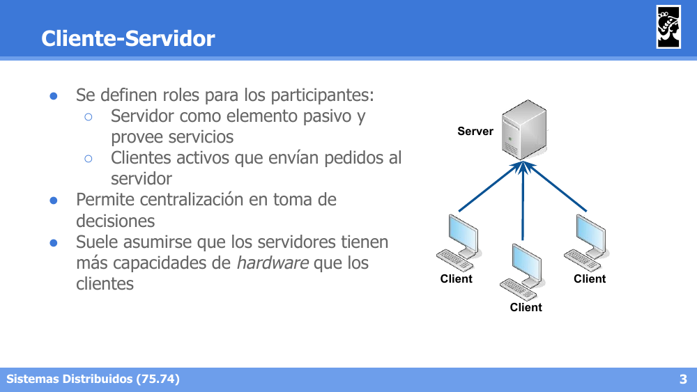

---

**2. ¿Cómo puede organizarse jerárquicamente el modelo Cliente-Servidor?**

Respuesta

Con servidores intermedios que a su vez actúan como clientes de un servidor superior, formando una jerarquía de servidores.

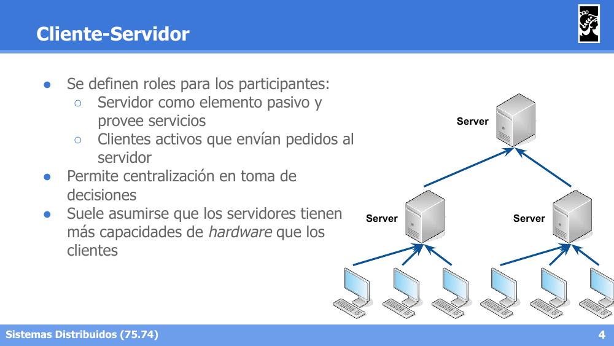

---

**3. En el modelo Cliente-Servidor, ¿cómo se comunican dos clientes entre sí y qué modelos de callback pueden usarse?**

Respuesta

Los clientes deben conocer la ubicación del servidor para poder utilizarlo y no entablan comunicaciones entre sí salvo a través del servidor (ej. un mensaje de Client 1 para Client 2 pasa por el Server). Se pueden usar modelos de callback, aunque no es su carácter natural: long polling y push notifications.

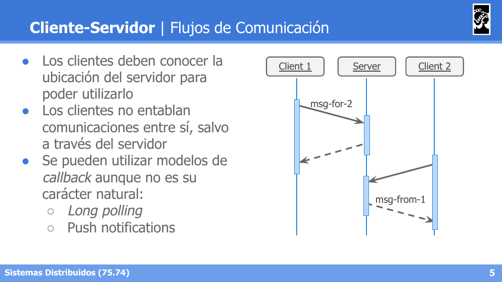

---

**4. ¿Qué caracteriza al modelo Peer-to-Peer y cuándo es útil?**

Respuesta

Se establece una red de nodos considerados pares (peers) entre sí, asumiendo capacidades de recursos similares. Es muy útil cuando existen objetivos de colaboración por parte del negocio, requiriendo un protocolo acordado entre las partes y coherencia entre los nodos. Tuvo su auge en internet con Napster, BitTorrent, etc.

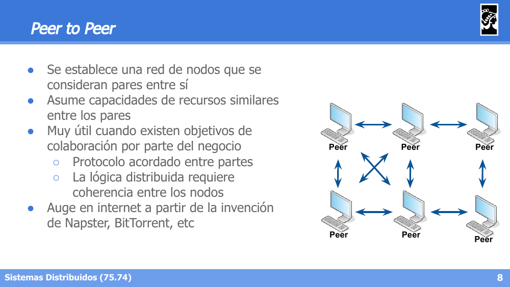

---

**5. ¿Por qué es difícil establecer comunicación directa entre pares en Peer-to-Peer y qué esquema se suele usar?**

Respuesta

Es muy difícil de establecer la comunicación entre pares directamente, por lo que se suele usar un esquema mixto tipo cliente-servidor para proveer un servicio de nombres (descubrimiento de otros peers), o un grupo de comunicación donde se comparte la dirección de los miembros. Requieren mayores permisos de networking (reglas de firewall de entrada, rangos de puertos), ya que cada peer debe ser alcanzable por los demás.

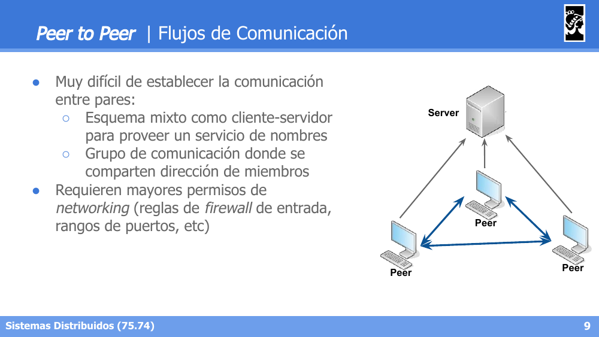

---

**6. ¿Qué es RPC (Remote Procedure Call) y qué características ofrece?**

Respuesta

Permite la ejecución remota de procedimientos siguiendo un modelo Cliente-Servidor: el cliente realiza una llamada a un procedimiento y el servidor responde con el resultado. Ofrece comunicación remota transparente para el usuario y portabilidad a través de interfaces bien definidas.

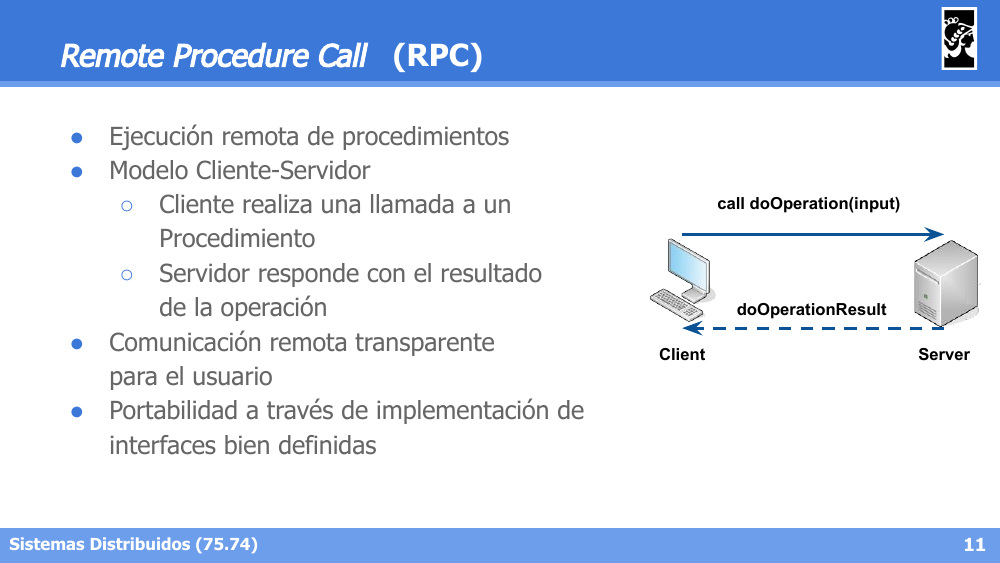

---

**7. ¿Qué es un IDL (Interface Definition Language) y qué restricciones impone sobre el pasaje de parámetros?**

Respuesta

Es un lenguaje diseñado para permitir que diferentes lenguajes puedan invocarse entre sí. La interfaz se define en función de datos de entrada (Input) y salida (Output), con acceso a métodos permitido, pasaje de variables por valor y punteros no permitidos. También define los tipos de mensajes a enviar. Ejemplo: Google Protocol Buffers.

---

**8. ¿Por qué RPC requiere tolerancia a fallos a diferencia de las Local Procedure Calls (LPCs)?**

Respuesta

Porque a diferencia de las LPCs, un procedimiento remoto puede o no ser ejecutado (puede fallar la red). Se usan estrategias como Request-Retry con Timeout, filtrado de operaciones duplicadas, y retransmisión/re-ejecución de la operación si se pierde el retry.

---

**9. En RPC, ¿qué diferencia a las estrategias de Call Semantics "Sin control", "Re-ejecución" y "Retransmisión"?**

Respuesta

Sin control: no hay retry ni filtro de duplicados, el mensaje recibido es "Maybe". Re-ejecución: hay retry pero no filtro de duplicados, garantiza "At Least Once". Retransmisión: hay retry y filtro de duplicados, garantiza "Exactly Once".

---

**10. Describí los componentes de la implementación de RPC: Cliente, Servidor, Stubs y Módulo de comunicación.**

Respuesta

Cliente: conectado a un stub, realiza llamadas de forma transparente al servidor. Servidor: conectado a un stub del cual recibe parámetros, posee la lógica del remote procedure. Stubs: administran el marshalling de la información, enviando información de llamadas al módulo de comunicación y al cliente/servidor. Módulo de comunicación: abstrae al stub de la comunicación con el servidor.

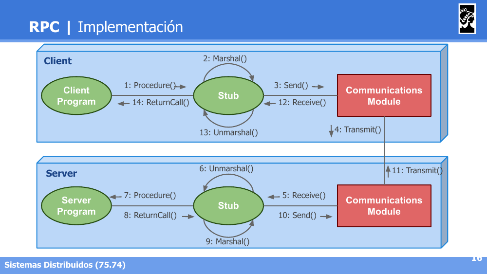

---

**11. Describí el flujo completo de una llamada RPC, desde que el cliente invoca el procedimiento hasta que recibe la respuesta.**

Respuesta

El cliente invoca el Procedure() → el stub realiza el Marshal() de los parámetros → se hace Send()/Transmit() hacia el servidor → el stub del servidor hace Receive()/Unmarshal() → se invoca el Procedure() real en el servidor → la respuesta vuelve siguiendo el camino inverso (Marshal() → Send() → Transmit() → Receive() → Unmarshal() → ReturnCall()).

---

**12. ¿En qué se basa gRPC y para qué está diseñado?**

Respuesta

Se basa en HTTP2 para transporte, Protocol Buffers para encoding, y conexión punto a punto basada en server:port. Define Servicios y Mensajes en archivos .proto, generando código en distintos lenguajes. Está diseñado para alta performance y microservicios.

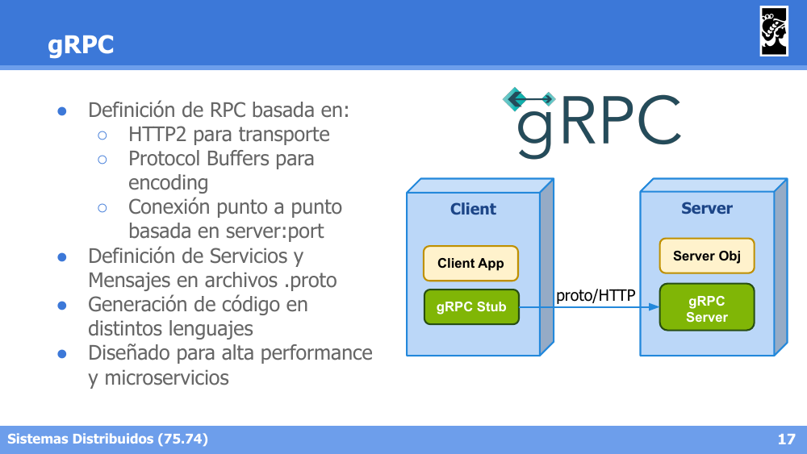

---

**13. ¿Qué son los Distributed Objects y qué complejidad oculta el middleware?**

Respuesta

Los servidores ya no proveen servicios sino objetos. Existe un middleware que oculta la complejidad de: referencias a objetos remotos, invocación de acciones, errores (excepciones) y recolección de basura (garbage collection).

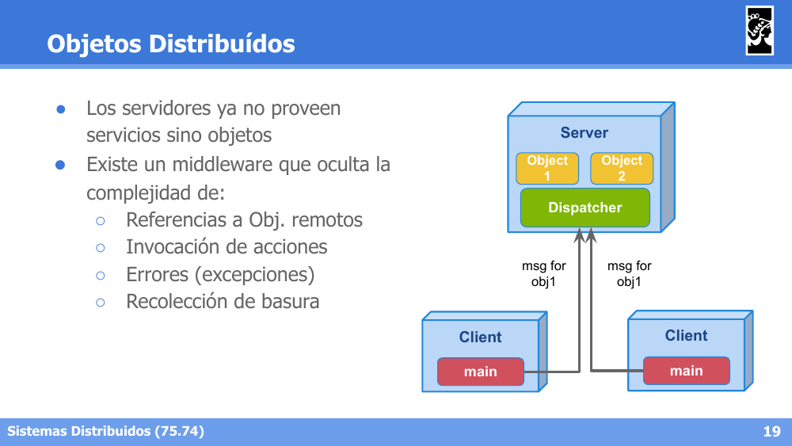

---

**14. Diferenciá RPC de Objetos Distribuidos en términos de estado (Stateless vs Stateful).**

Respuesta

RPC (Stateless): el cliente local invoca procedimientos remotos a través de un RPC Locator, sin mantener estado de objetos particulares. Objetos Distribuidos (Stateful): el cliente invoca métodos sobre objetos específicos (ej. obj1.m()) que pueden ser migrados o replicados entre distintos servidores remotos, manteniendo su estado.

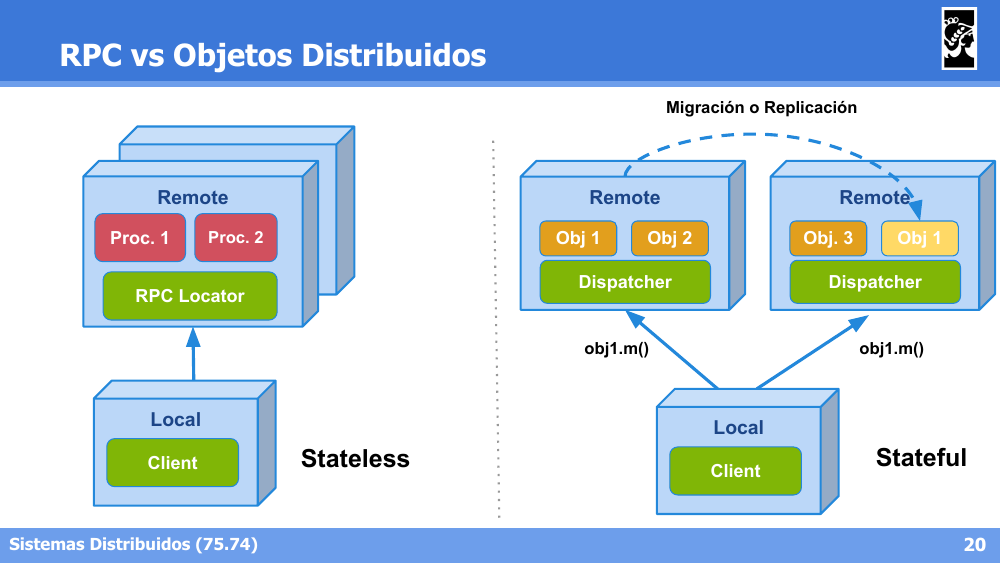

---

**15. ¿Qué es CORBA, qué provee y cómo está compuesta su arquitectura?**

Respuesta

Es un estándar definido por comité, con soporte en múltiples lenguajes, actualmente en vías de deprecación. Provee protocolo y serialización, transporte, seguridad y discovery de objetos. Arquitectura: el Cliente usa un Stub y el Servidor un Skeleton + Object Adaptor (POA), ambos comunicándose a través del Object Request Broker (ORB).

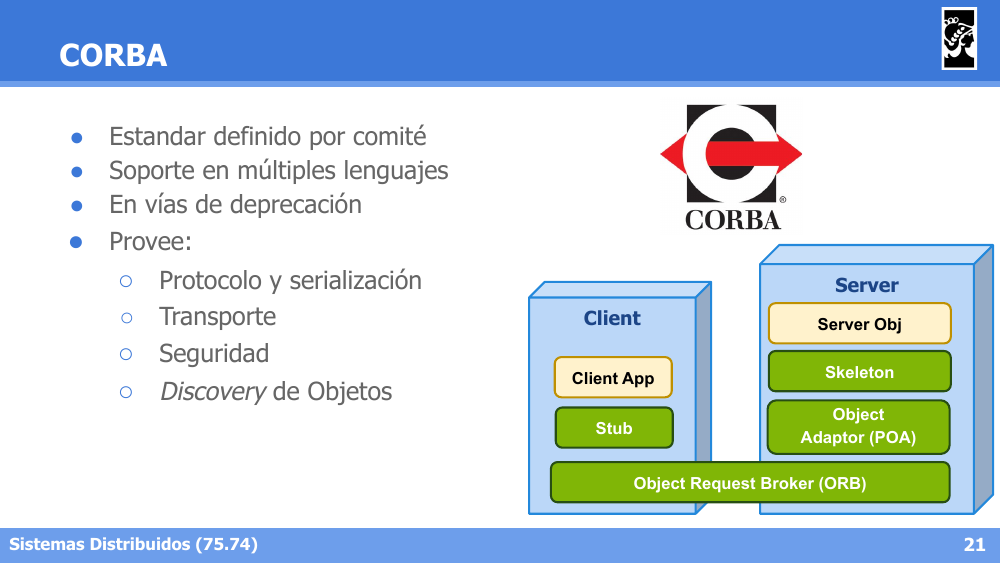

---

**16. Describí el flujo de trabajo típico con CORBA usando el ejemplo BankAccount.**

Respuesta

1) Se define la interfaz en un archivo IDL (BankAccount.idl) con módulos/interfaces y operaciones. 2) Se generan automáticamente las clases de cliente y servidor mediante el compilador IDL (idlj). 3) El cliente inicializa el ORB, resuelve el NamingService, busca la referencia remota y la invoca como si fuera un objeto local. 4) El servidor extiende la clase POA generada, implementa la lógica real, se registra en el NamingService y queda a la espera de invocaciones.

---

**17. ¿Qué es RMI (Remote Method Invocation) y qué pasos requiere su uso?**

Respuesta

Es una versión optimizada de Distributed Objects, propia de Java. Requiere: 1) Registro del servidor en un directorio de servicios (Registry). 2) Consulta del registro por parte del cliente. 3) Invocación desde el cliente al servidor. Arquitectura: Cliente con Stub y Servidor con Skeleton, ambos sobre la Remote Reference Layer (RRL).

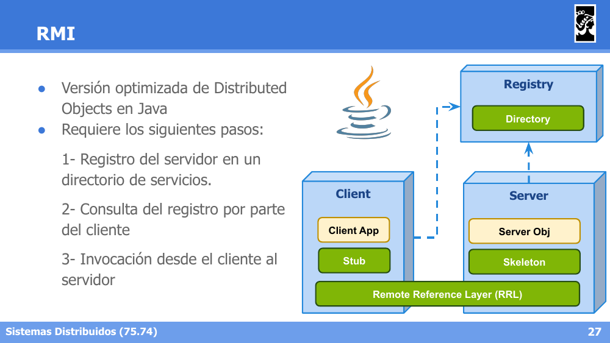

---

**18. Describí el flujo de trabajo típico con RMI usando el ejemplo BankAccount.**

Respuesta

1) Se define la interfaz remota extendiendo java.rmi.Remote, declarando que cada método puede lanzar RemoteException. 2) La implementación del servidor extiende UnicastRemoteObject e implementa la interfaz remota con la lógica real. 3) El servidor registra la instancia remota con Naming.rebind("//localhost/BankAccount", new BankAccountImpl(...)). 4) El cliente obtiene una referencia remota con Naming.lookup("//localhost/BankAccount") y la invoca como si fuera un objeto local (ej. a.getBalance(), a.add(m0)).

---
