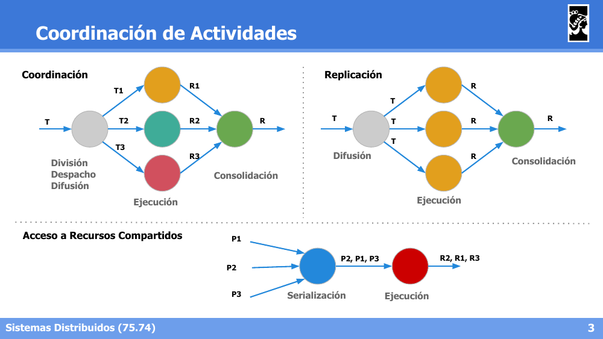
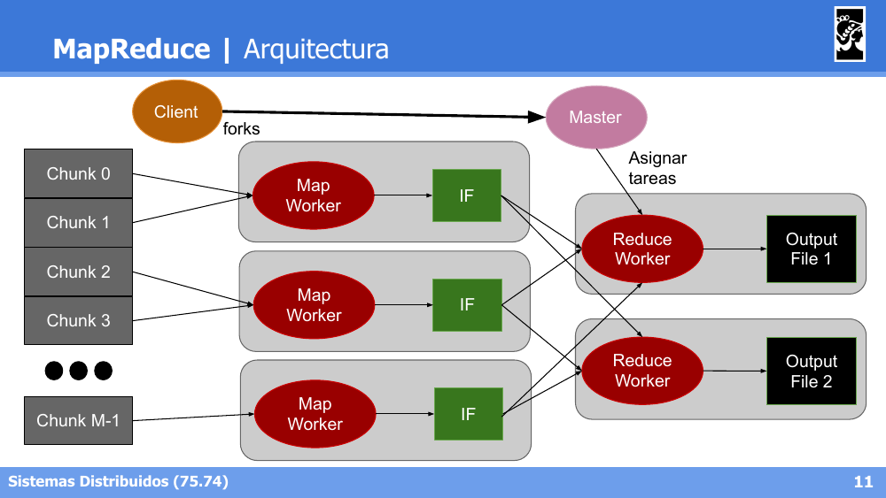
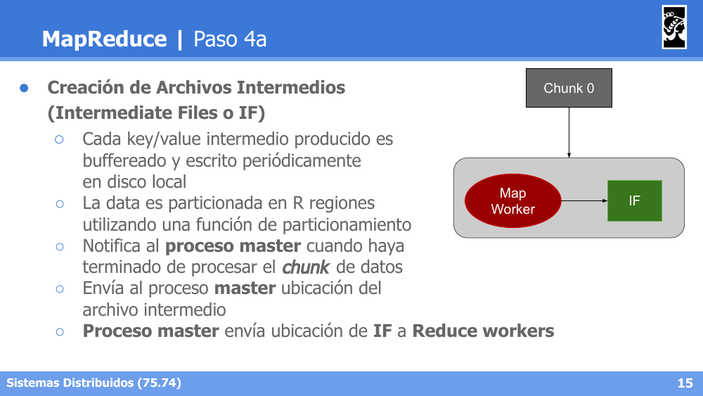
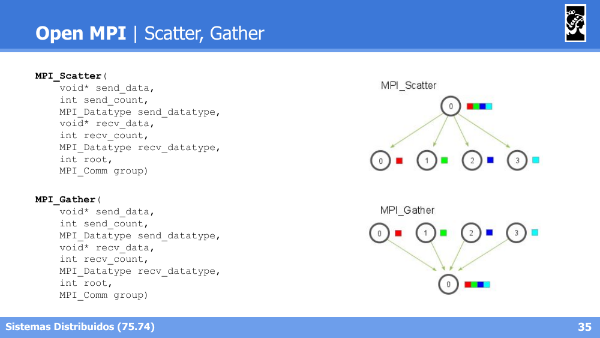
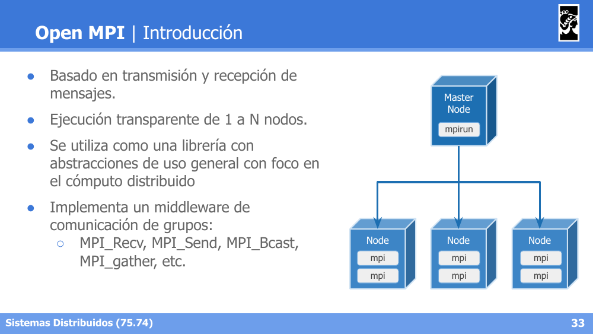
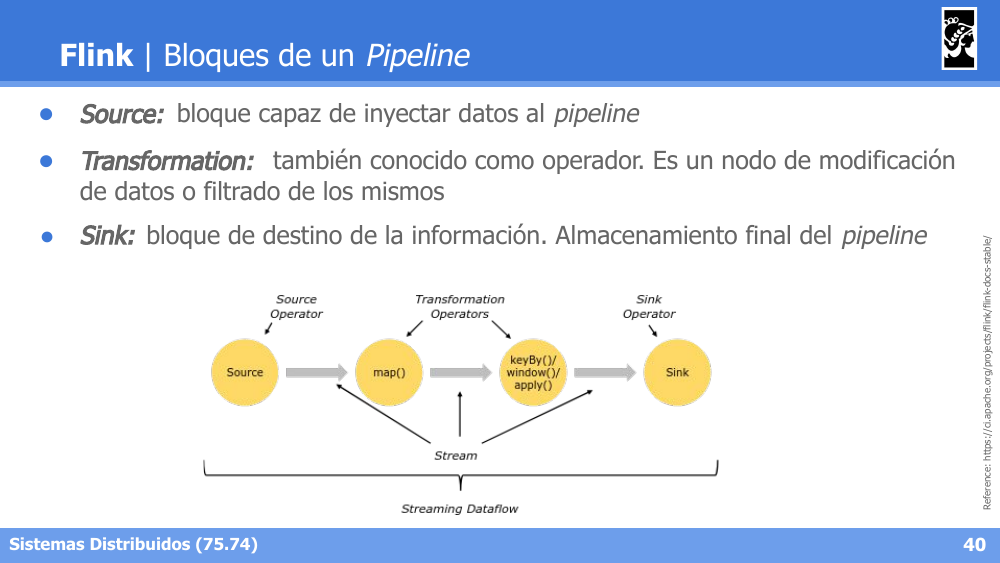
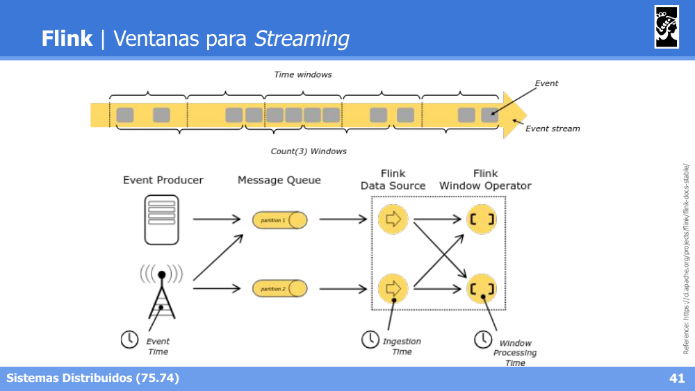
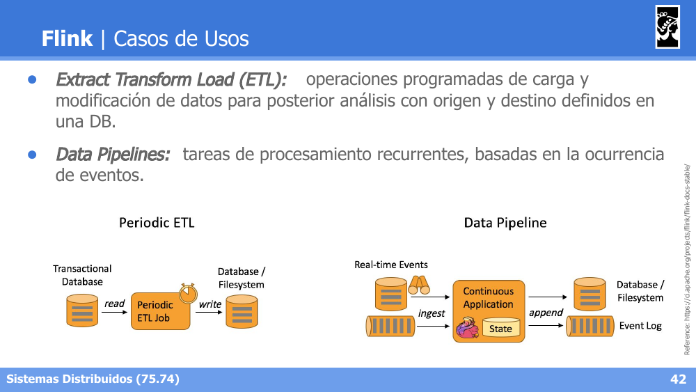

# Flashcards — Clase 10: Distribución y Coordinación de Procesos

> Formato: pregunta primero, respuesta debajo. Tapá las respuestas y probate.

---

**1. Diferenciá los tres escenarios de Coordinación de Actividades: Coordinación, Replicación y Acceso a Recursos Compartidos.**

<details>
<summary>Respuesta</summary>

Coordinación: una tarea T se divide, despacha y difunde en subtareas (T1, T2, T3) que se ejecutan en paralelo produciendo resultados parciales que luego se consolidan en un resultado final. Replicación: una misma tarea T se difunde idéntica a múltiples ejecutores, que la ejecutan de forma redundante, y los resultados (todos iguales) se consolidan en uno solo. Acceso a Recursos Compartidos: múltiples procesos acceden a un recurso compartido, requiriendo una etapa de serialización de los pedidos antes de la ejecución para evitar condiciones de carrera.


</details>

---

**2. ¿Cuál es la idea central de MapReduce y en qué funciones de LISP está ligeramente basado?**

<details>
<summary>Respuesta</summary>

Es un paradigma de parallel computing desarrollado en 2004 por Google, cuya idea central es identificar Tareas que puedan ejecutarse en paralelo e identificar Grupos de datos que puedan procesarse en paralelo. Está ligeramente basado en las funciones `map` (aplica una función a cada elemento: `map f[a,b,c] => [f(a),f(b),f(c)]`) y `reduce` (combina los elementos: `reduce f[a,b,c] => f(a,b,c)`) de LISP.
</details>

---

**3. En el caso ideal de Parallel Computing (Master-Worker), ¿qué rol cumplen el Master y los Workers?**

<details>
<summary>Respuesta</summary>

No existe dependencia entre los datos, por lo que pueden partirse en chunks/shards del mismo tamaño. El Master parte la data en #chunks, envía la ubicación de los chunks a los Workers, y recibe la ubicación de los resultados de todos los Workers. Los Workers reciben la ubicación de los chunks del Master, procesan el chunk, y envían la ubicación del resultado al Master.
</details>

---

**4. Describí la función Map de MapReduce: firma, quién la provee y qué hace la librería con su salida.**

<details>
<summary>Respuesta</summary>

`Map: (input shard) → intermediate(key/value pairs)`. La data es particionada automáticamente en K chunks y procesada por M workers ejecutando la función `map`, provista por el usuario, que se ejecuta en todos los chunks. El usuario decide cómo filtrar la data. La librería MapReduce agrupa todos los valores asociados con una misma key y envía la ubicación de los datos al Master Process.
</details>

---

**5. Describí la función Reduce de MapReduce: firma, cuándo se invoca y cómo se distribuye.**

<details>
<summary>Respuesta</summary>

`Reduce: intermediate(key/value pairs) → result files`. Realiza una agregación de los datos para obtener un resultado final. Es llamada por cada Unique Key, haciendo un merge de los datos recibidos para formar un set de datos menor. Se distribuye particionando las keys en R Reduce workers, cantidad especificada por el usuario.
</details>

---

**6. Enumerá los pasos del proceso completo de MapReduce, desde partir los datos hasta obtener el output.**

<details>
<summary>Respuesta</summary>

1) Partir los datos de entrada en N chunks (por lo general 64MB). 2) Fork de procesos en el cluster: 1 master (scheduler/coordinador) y muchos Workers (tantos Mappers como chunks, R reducers definidos por el usuario). 3) Map de shards en Mappers: se lee, filtra y aplica la función del usuario, produciendo valores intermedios. 4) Creación de Archivos Intermedios (IF), bufferizados y particionados en R regiones. 5) Particionamiento con función por defecto `hash(key) mod R`. 6) Los Reduce Workers leen vía RPC los IF de la partición que les corresponde, ordenan por key y agrupan ocurrencias. 7) Se aplica la función Reduce sobre cada set agrupado y se escribe el output file.


</details>

---

**7. ¿Qué función de partición se usa por defecto en MapReduce para decidir qué Reduce Worker procesa cada key?**

<details>
<summary>Respuesta</summary>

`hash(key) mod R`. Los Map workers particionan la data intermedia por keys usando esta función, generando R regiones, y cada Reduce Worker lee (vía RPC) la partición que le corresponde del disco local de cada Map Worker.


</details>

---

**8. Escribí el algoritmo de MapReduce para el problema de Word Count.**

<details>
<summary>Respuesta</summary>

```
map(string key, string value):
    # key: document name, value: documento como string multilínea
    for word w in value:
        emitIntermediate(w, 1)

reduce(string key, list value):
    # key: palabra, value: lista de "1s" asociados
    emit(key, len(value))
```
</details>

---

**9. ¿Para qué sirven `emitAll` y `reduceAll` en MapReduce? Dá un ejemplo de problema que los use.**

<details>
<summary>Respuesta</summary>

Permiten calcular un dato auxiliar global (agregado sobre todo el dataset) accesible durante el reduce, además de los datos intermedios normales por key. Se usan en Word Frequency (para obtener el total de palabras y calcular la frecuencia relativa de cada una) y en Intersect (para conocer la cantidad total de documentos y así determinar si una palabra aparece en todos ellos).
</details>

---

**10. En Open MPI, ¿qué diferencia a `MPI_Scatter` de `MPI_Gather`, y a `MPI_Allgather` de `MPI_Reduce`?**

<details>
<summary>Respuesta</summary>

Scatter: el proceso raíz reparte distintos fragmentos de datos a cada proceso. Gather: el proceso raíz recolecta los fragmentos de datos de todos los procesos. Allgather: como Gather, pero el resultado combinado se distribuye a todos los procesos (no solo a la raíz). Reduce: combina los datos de todos los procesos usando una operación (ej. MPI_SUM) y deja el resultado solo en el proceso raíz.


</details>

---

**11. ¿En qué se basa Open MPI y qué primitivas de comunicación de grupos implementa?**

<details>
<summary>Respuesta</summary>

Está basado en transmisión y recepción de mensajes, ejecución transparente de 1 a N nodos, y se utiliza como librería de abstracciones de uso general con foco en cómputo distribuido. Implementa un middleware de comunicación de grupos: `MPI_Send`, `MPI_Recv`, `MPI_Bcast`, `MPI_Scatter`, `MPI_Gather`, `MPI_Allgather`, `MPI_Reduce`, entre otras.


</details>

---

**12. En Apache Flink, ¿qué son Streams y Batchs dentro del concepto de Dataflow, y qué son Source, Transformation y Sink?**

<details>
<summary>Respuesta</summary>

Dataflow es un DAG de operaciones sobre un flujo de datos. Streams: un flujo de información que puede no finalizar. Batchs: un conjunto de datos (dataset) de tamaño conocido. Source: bloque capaz de inyectar datos al pipeline. Transformation (operador): nodo de modificación o filtrado de datos. Sink: bloque de destino/almacenamiento final del pipeline.


</details>

---

**13. ¿Qué nociones de tiempo maneja Flink para agrupar eventos en ventanas (windows)?**

<details>
<summary>Respuesta</summary>

Event Time (cuándo ocurrió el evento), Ingestion Time (cuándo ingresó a Flink) y Window Processing Time (cuándo se procesa la ventana). Las ventanas pueden definirse por tiempo (Time windows) o por cantidad de eventos (Count windows).


</details>

---

**14. Diferenciá los casos de uso de ETL (Extract Transform Load) y Data Pipelines en Flink.**

<details>
<summary>Respuesta</summary>

ETL: operaciones programadas de carga y modificación de datos para su posterior análisis, con origen y destino definidos en una base de datos. Data Pipelines: tareas de procesamiento recurrentes basadas en la ocurrencia de eventos en tiempo real, implementadas como una Continuous Application con estado.


</details>

---

**15. ¿Qué es Apache Beam, qué portabilidad ofrece y cuáles son los componentes básicos de su pipeline?**

<details>
<summary>Respuesta</summary>

Es un modelo de definición de pipelines de procesamiento de datos con portabilidad de lenguajes (Java, Python, Go) y de motores de ejecución (Runners: DirectRunner standalone, motores de cluster como Hadoop/Flink/Spark, o plataformas cloud como Google Dataflow/IBM Streams). Sus componentes básicos son similares a Flink: Input y Output (símil Source/Sink), PCollection (símil Streams, colecciones paralelizables), y Transformations (símil Operators, modificaciones elemento a elemento).
</details>

---
