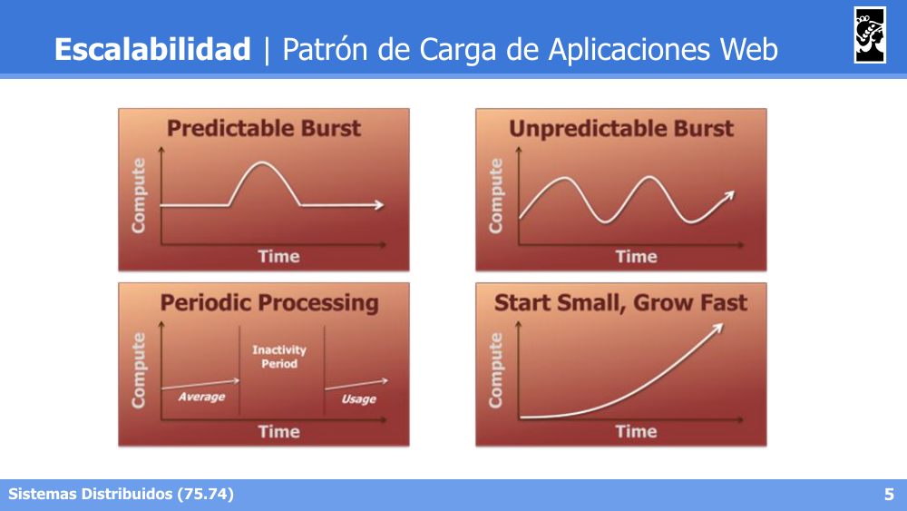
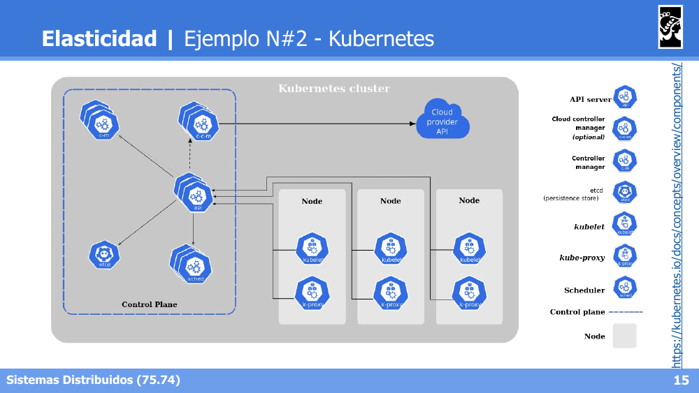
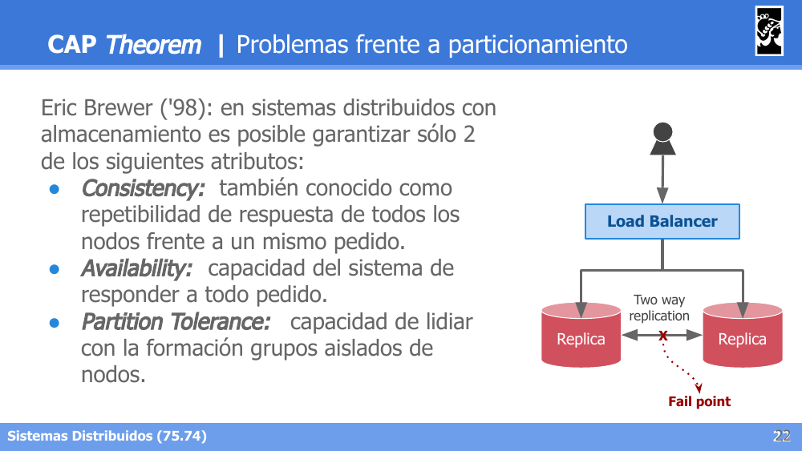
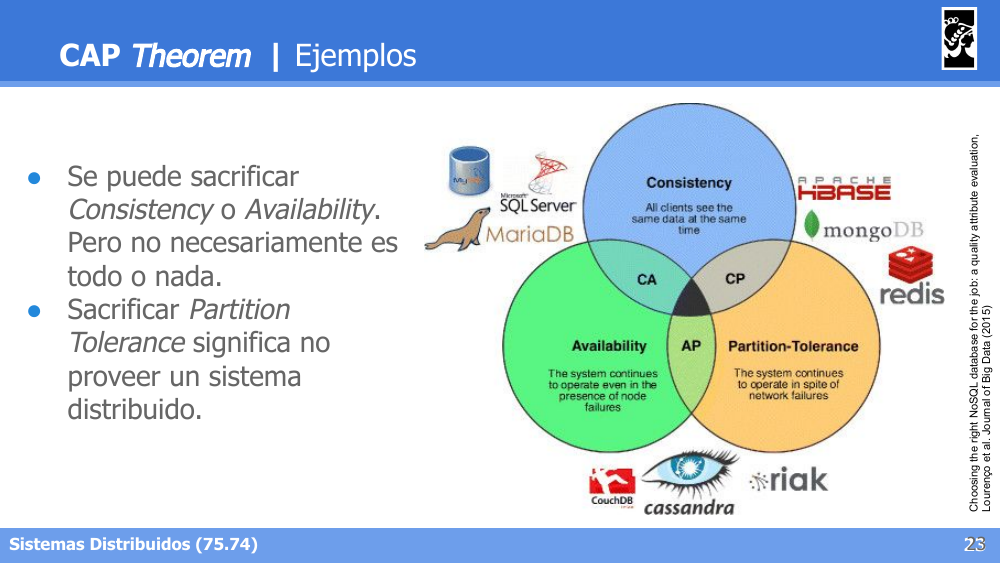
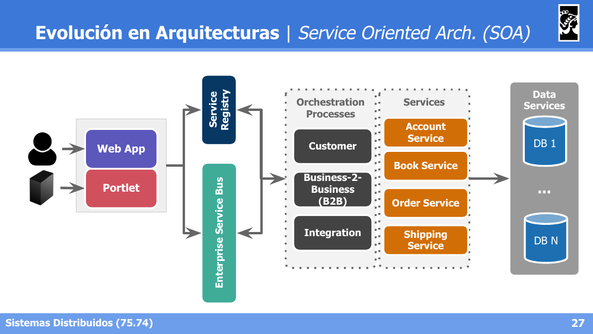
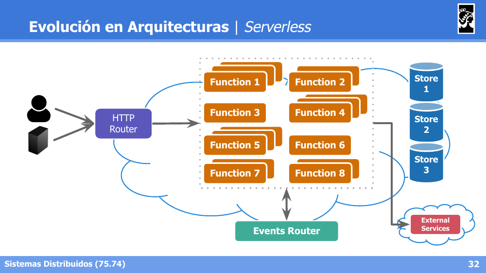

# Flashcards — Clase 11: Sistemas Elásticos y de Alta Disponibilidad

> Formato: pregunta primero, respuesta debajo. Tapá las respuestas y probate.

---

**1. ¿Respecto de qué tres aspectos busca crecer un sistema con el objetivo de la escalabilidad?**

Respuesta

Respecto del tamaño (agregando usuarios o recursos a controlar), respecto de la distribución geográfica (permitiendo dispersión) y respecto de los objetivos administrativos del sistema (nuevas sintaxis, semánticas y servicios ofrecidos).

---

**2. Diferenciá las Plataformas para alta concurrencia de las Arquitecturas Ad-Hoc y Personalizadas.**

Respuesta

Plataformas para alta concurrencia: aplican patrones ya conocidos y probados, con escalamiento automático (con ciertos límites) y vinculación fuerte con una infraestructura o producto. Arquitecturas Ad-Hoc y Personalizadas: necesitan configuración y soporte propios, con escalamiento manual o automatizado por humanos, y posibilidad de migraciones a distintas plataformas.

---

**3. Nombrá los cuatro patrones de carga de aplicaciones web.**

Respuesta

Predictable Burst (pico de cómputo previsible que sube y baja), Unpredictable Burst (picos irregulares que van en aumento), Periodic Processing (uso promedio con períodos de inactividad y de uso), y Start Small Grow Fast (crecimiento sostenido y acelerado desde un punto bajo).

---

**4. ¿Cuáles son los límites que condicionan la escalabilidad de un sistema?**

Respuesta

Arquitectura y Algoritmos, Datos (4 V's), Red (latencia y ancho de banda) y Restricciones de Negocio y Legales, todo condicionado por el Presupuesto.

---

**5. Nombrá las técnicas de escalabilidad vistas y describí brevemente cada una.**

Respuesta

Escalamiento vertical (agregar recursos a un nodo), Escalamiento horizontal (redundancia, balanceadores de carga, proximidad geográfica), Fragmentación de datos (fraccionar para optimizar, manteniendo juntos los datos "cercanos"), Componentización (separar servicios), Optimizar algoritmos (performance, mensajería) y Asincronismo (mantener sincrónico solo lo estrictamente necesario, limitado por el negocio).

---

**6. Diferenciá Escalabilidad de Elasticidad.**

Respuesta

Escalabilidad: capacidad de un sistema de adaptarse a diferentes ambientes modificando sus recursos; es un término utilizado en muchos contextos. Elasticidad: capacidad de un sistema de modificar dinámicamente sus recursos, adaptándose a patrones de carga; es un término propio de Arquitecturas Cloud y requiere soporte de la infraestructura.

---

**7. ¿Cuáles son los tres componentes de un sistema elástico y qué función cumple cada uno?**

Respuesta

Application Load Balancer: dirige tráfico a los servicios/instancias nuevas y deja de enviarlo a los caídos/degradados. Autoscaler: hace Scale Out (incrementa instancias) o Scale In (decrementa instancias) en función de las métricas recolectadas. Monitoring Automático: recolecta métricas de CPU, memoria, I/O, networking, etc. por cada servicio/instancia.

---

**8. En el ejemplo de AWS, ¿qué servicios cumplen el rol de Load Balancer, Autoscaler y Monitoring, y qué hace cada uno?**

Respuesta

Application Load Balancer → Amazon Elastic Load Balancer: redirecciona tráfico a instancias EC2, incluso en diferentes zonas, verificando su estado vía un endpoint `/status`. Autoscaler → Amazon Autoscaling: el Autoscaling group define `min`, `desired` y `max` instances, con policies para dynamic o manual scaling. Monitoring → Amazon CloudWatch: métricas globales automatizadas, admite agregar métricas propias.

---

**9. En el ejemplo de Kubernetes, ¿cómo se implementan el Load Balancer, el Autoscaler y el Monitoring?**

Respuesta

Application Load Balancer → Kubernetes Service: redirecciona tráfico a pods en estado Ready, usando Liveness and Readiness probes. Autoscaler → Horizontal Pod Autoscale (HPA): asociado a un deployment, calcula `desiredReplicas = ceil[currReplicas * (currMetricValue / desiredMetricValue)]`. Monitoring → Kubernetes Metrics Server: colecta métricas de cada pod y las expone en el API server, diseñado específicamente para autoscaling.

---

**10. Diferenciá las Liveness probes de las Readiness probes en Kubernetes.**

Respuesta

Liveness: verifica si el contenedor sigue vivo; si falla, el contenedor se reinicia. Readiness: verifica si el contenedor está listo para recibir tráfico; si falla, se lo saca temporalmente del balanceo sin reiniciarlo.

---

**11. Describí los componentes del Control Plane y del Node en la arquitectura de un cluster de Kubernetes.**

Respuesta

Control Plane: API server, Cloud controller manager, Controller manager, `etcd` (persistence store) y Scheduler. Node: `kubelet` y `kube-proxy` en cada nodo del cluster, gestionados por el Control Plane.

---

**12. ¿Cómo se mide la disponibilidad de un sistema y qué significa tener 0,9 vs 0,999 de disponibilidad en términos de downtime anual?**

Respuesta

La disponibilidad de un sistema se mide por la cantidad de 9's, dado que `P(system available) = 1 - P(failure)` es siempre menor a 1. `P(available) ~ 0,9` implica 36,5 días caídos al año; `P(available) ~ 0,999` implica 8,76 horas caídas al año.

---

**13. Explicá cómo se calcula la disponibilidad de un sistema con componentes encadenados sin redundancia, y por qué se degrada.**

Respuesta

Cuando los componentes dependen unos de otros sin redundancia, la disponibilidad total es el producto de las probabilidades individuales: `P(available) = P(web) . P(db) . P(report) = 0,9 . 0,9 . 0,9 = 0,729`. Se degrada porque para que el sistema esté disponible, todos los componentes encadenados deben estarlo simultáneamente.

---

**14. Explicá cómo mejora la disponibilidad al replicar en paralelo todos los componentes en cada nodo.**

Respuesta

Con réplicas en paralelo, basta con que una esté disponible, por lo que se calcula como el complemento de que todas fallen simultáneamente: `P(available) = 1 - P(failure1 & failure2 & failure3) = 1 - 0,1 . 0,1 . 0,1 = 0,999`. La disponibilidad mejora considerablemente respecto del escenario encadenado.

---

**15. Diferenciá SLA, SLO y SLI.**

Respuesta

SLA (Service Level Agreement): contrato/acuerdo de disponibilidad pactado con el cliente, que define qué sucede si no se respeta. SLO (Service Level Objectives): lo que se debe cumplir para no invalidar el SLA (ej. Availability > 99.95%). SLI (Service Level Indicators): métricas a comparar con los SLOs, que deben ser siempre superiores al threshold del SLO; por lo general requieren una plataforma de observability.

---

**16. Enunciá el CAP Theorem: ¿qué tres atributos entran en juego y cuántos se pueden garantizar simultáneamente?**

Respuesta

Eric Brewer ('98): en sistemas distribuidos con almacenamiento es posible garantizar solo 2 de los siguientes 3 atributos frente a un particionamiento de red: Consistency (repetibilidad de respuesta de todos los nodos frente a un mismo pedido), Availability (capacidad del sistema de responder a todo pedido) y Partition Tolerance (capacidad de lidiar con la formación de grupos aislados de nodos).

---

**17. ¿Por qué en la práctica no se suele sacrificar Partition Tolerance en el CAP Theorem?**

Respuesta

Porque sacrificar Partition Tolerance significa no proveer un sistema realmente distribuido, ya que en un sistema distribuido real las particiones de red son inevitables. Por eso en la práctica se elige sacrificar Consistency (sistemas AP, ej. CouchDB, Cassandra, Riak) o Availability (sistemas CP, ej. HBase, MongoDB, Redis), sin que sea necesariamente todo o nada.

---

**18. Describí los componentes principales de una arquitectura SOA (Service Oriented Architecture).**

Respuesta

Service Registry (registro de servicios disponibles), Enterprise Service Bus / ESB (bus de comunicación entre componentes), Orchestration Processes (procesos de negocio que coordinan la invocación de Services), Services (servicios concretos, ej. Account Service, Order Service) y Data Services (acceso a las bases de datos subyacentes).

---

**19. ¿Qué caracteriza a la arquitectura de Microservicios frente a SOA y a las arquitecturas monolíticas?**

Respuesta

Cada Web Server (microservicio) tiene su propia base de datos dedicada y se comunican entre sí según sea necesario; los clientes acceden a través de un API Gateway o Front App. A medida que aumenta la granularidad (de monolítico → SOA → microservicios), se gana en escalabilidad horizontal, flexibilidad de negocio y capacidad de monitoreo/disponibilidad parcial del sistema.

---

**20. ¿Qué es la arquitectura Serverless y por qué el nombre puede resultar engañoso?**

Respuesta

El código se organiza en funciones invocadas a través de un HTTP Router o un Events Router, que acceden a distintos Stores y a servicios externos. A pesar del nombre, "serverless" no significa que no haya servidores: significa que el desarrollador no gestiona directamente la infraestructura subyacente, ya que el proveedor cloud se encarga de aprovisionar y escalar los servidores donde corren las funciones.

---
