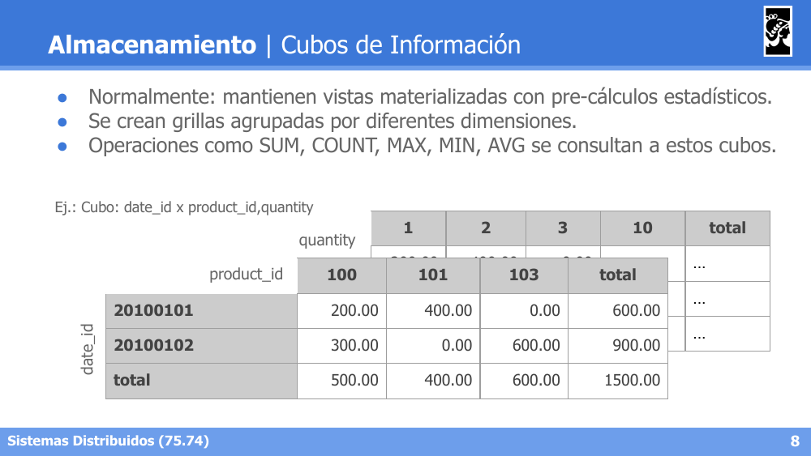
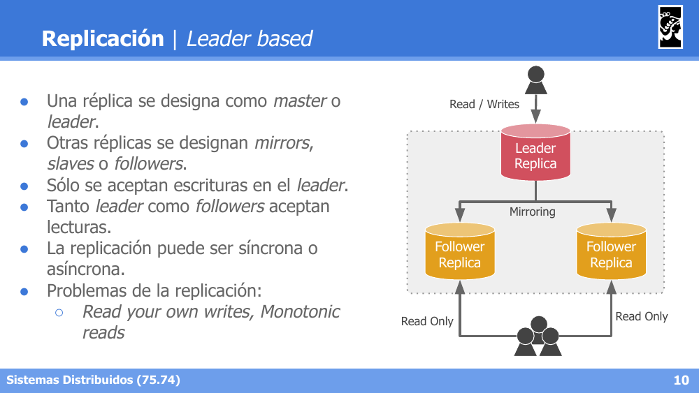
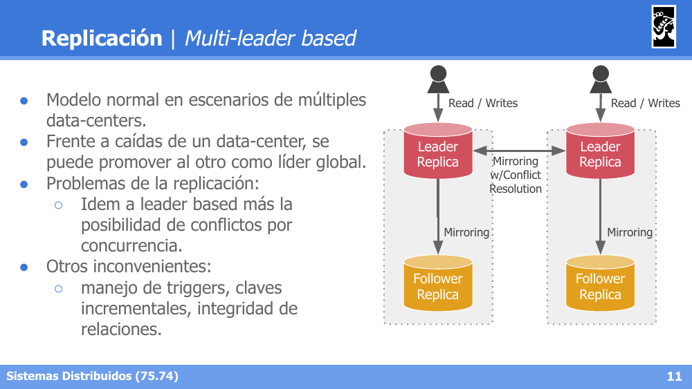
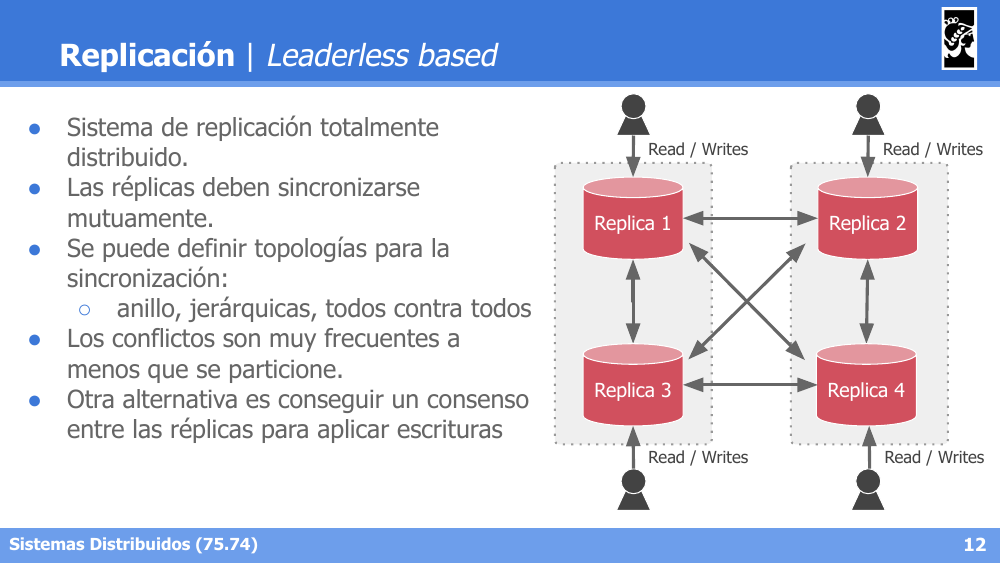
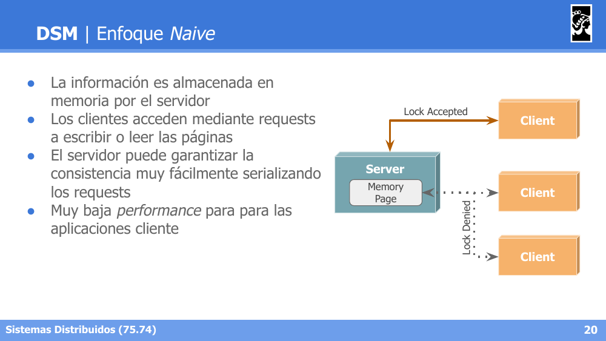
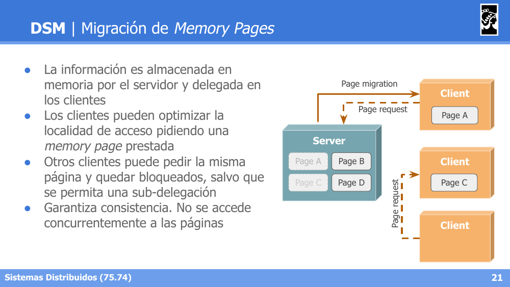
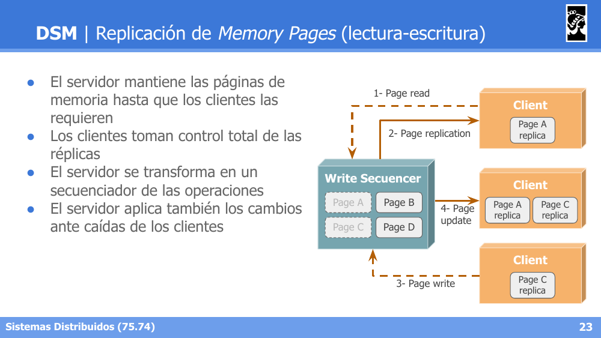
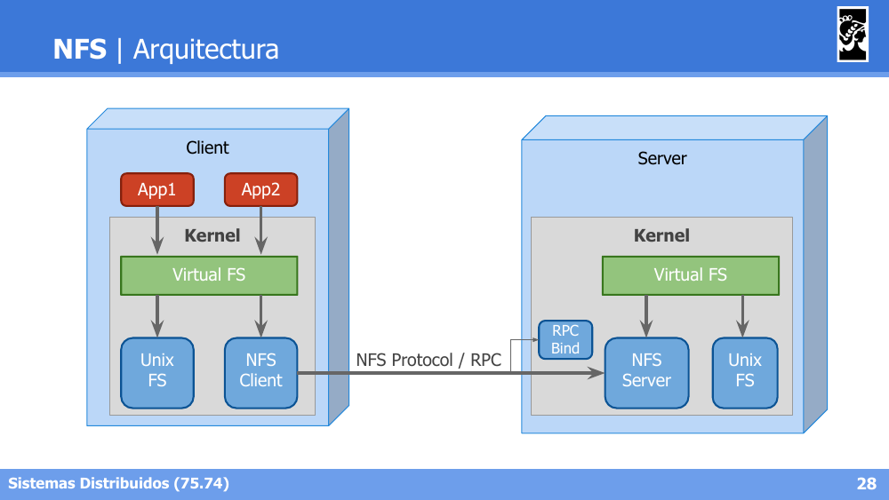
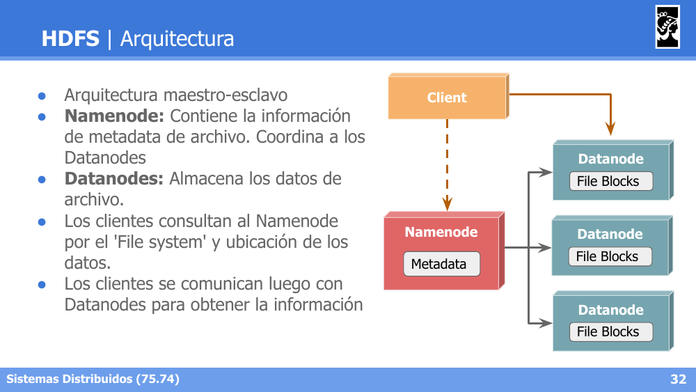

# Flashcards — Clase 13: Data Intensive Applications

> Formato: pregunta primero, respuesta debajo. Tapá las respuestas y probate.

---

**1. ¿Qué componentes suele combinar el flujo de datos de un sistema de gran escala típico?**

Respuesta

Un Cache (lookups/writes rápidos), un MOM para encolar operaciones asíncronas, tres tipos de almacenamiento de datos —Master Data, Transactional Data y Search Indexes— alimentados por servicios que detectan cambios y populan índices, y un punto de integración con servicios externos.

---

**2. Diferenciá el almacenamiento Relacional del No Relacional (NoSQL) y para qué modelos de datos favorece cada uno.**

Respuesta

Relacional: predomina hasta 2010 con la estandarización de SQL, almacena en tablas y filas, y tiene buen soporte para joins y relaciones many-to-one o many-to-many. NoSQL (Not Only SQL): a partir de 2010 se imponen otros almacenamientos (clave-valor, documentales, orientados a grafos, columnares), con beneficios claros para modelos sin relaciones, one-to-many jerárquicos, alta conectividad (grafos), y esquemas cambiantes o no definidos.

---

**3. Diferenciá OLTP de OLAP en cuanto a patrón de lectura, escritura, uso principal y tamaño de datos.**

Respuesta

OLTP (Online Transaction Processing): orientado a transacciones (grupos de reads/writes), no necesariamente ACID. Lectura de pocos registros por clave, escritura de acceso aleatorio con registros pequeños, uso principal como info maestra/transaccional para usuarios, con datos como instantánea actual (MBs-GBs). OLAP (Online Analytical Processing): orientado a analizar el conjunto de los datos. Lectura por agregación de muchos registros, escritura por importaciones batch (ETLs) o streams, uso principal para exploración/análisis estadístico, con datos históricos (TBs-PBs).

---

**4. ¿Cómo difiere el almacenamiento Columnar del Relacional, y qué beneficios trae?**

Respuesta

El modelo relacional normalmente usa un archivo de almacenamiento por tabla, leyendo la fila completa para retornar proyecciones. El modelo columnar usa un archivo por columna, almacenando cada columna como una secuencia contigua de valores, lo cual trae grandes beneficios para compresión, lectura y agregaciones, favoreciendo mucho las consultas analíticas.

---

**5. ¿Qué son los Cubos de Información y qué operaciones se consultan sobre ellos?**

Respuesta

Normalmente mantienen vistas materializadas con pre-cálculos estadísticos, creando grillas agrupadas por diferentes dimensiones (ej. un cubo cruzando date_id x product_id x quantity). Se consultan operaciones como SUM, COUNT, MAX, MIN y AVG sobre estos cubos.

---

**6. Describí la Replicación Leader-based: qué réplicas aceptan escrituras/lecturas y qué problemas presenta.**

Respuesta

Una réplica se designa como master/leader, y las demás como mirrors/slaves/followers. Solo se aceptan escrituras en el leader; tanto el leader como los followers aceptan lecturas. La replicación puede ser síncrona o asíncrona. Presenta problemas de Read your own writes y Monotonic reads.

---

**7. ¿En qué escenario se usa la Replicación Multi-leader y qué problema adicional presenta respecto de Leader-based?**

Respuesta

Es el modelo normal en escenarios de múltiples data-centers, donde frente a la caída de uno se puede promover al otro como líder global. Presenta los mismos problemas que Leader-based, más la posibilidad de conflictos por concurrencia, además de otros inconvenientes como el manejo de triggers, claves incrementales e integridad de relaciones.

---

**8. ¿Cómo funciona la Replicación Leaderless y qué topologías de sincronización puede usar?**

Respuesta

Es un sistema de replicación totalmente distribuido donde las réplicas deben sincronizarse mutuamente, pudiendo definirse topologías en anillo, jerárquicas, o todos contra todos. Los conflictos son muy frecuentes a menos que se particione; otra alternativa es conseguir un consenso entre las réplicas para aplicar escrituras.

---

**9. Diferenciá el Particionamiento Horizontal del Vertical.**

Respuesta

Horizontal: la información se segrega por registros entre cada partición, y el registro se encuentra en UNA sola partición a la vez (ej. la tabla Sales dividida por `date_id`). Vertical: la información se segrega respecto de sus atributos/dimensiones/campos, y el registro se encuentra en TODAS las particiones (ej. una partición con `date_id, product_id, qty, price` y otra con `date_id, product_id, disc`).

---

**10. Nombrá las funciones de partición vistas y qué son las estrategias mixtas.**

Respuesta

Por Value-of-Key, por Range-of-Keys, y por Hash-of-Key. Las estrategias mixtas incluyen generar N shards por cada key, o particionar por claves secundarias.

---

**11. Nombrá las tres estrategias de enrutamiento hacia particiones y en qué se diferencian.**

Respuesta

Cualquier partición + redirección: el cliente contacta cualquier partición y, si no tiene los datos, esta lo redirige a la partición correcta. Router centralizado: el cliente siempre consulta a un componente Router, que conoce la ubicación de cada dato y lo redirige. Cliente con conocimiento directo: el cliente ya sabe en qué partición están los datos y accede directamente, sin intermediarios.

---

**12. ¿Cuál es el objetivo de Distributed Shared Memory (DSM) y cuáles son sus principales ventajas y desventajas?**

Respuesta

Su objetivo es brindar la ilusión de una memoria compartida centralizada. Ventajas: es muy intuitivo para el desarrollo de sistemas distribuidos (los algoritmos no distribuidos se traducen fácilmente) y permite compartir información entre nodos sin que se conozcan entre sí. Desventajas: desalienta la distribución, genera latencia, cuello de botella y punto único de falla (arquitectura cliente-servidor).

---

**13. Describí el enfoque Naive de DSM y por qué garantiza consistencia fácilmente.**

Respuesta

La información se almacena en memoria por el servidor, y los clientes acceden mediante requests para escribir o leer las páginas. El servidor puede garantizar la consistencia muy fácilmente serializando los requests, aunque esto resulta en muy baja performance para las aplicaciones cliente.

---

**14. En DSM con Migración de Memory Pages, ¿qué sucede si dos clientes piden la misma página?**

Respuesta

La información se almacena en el servidor y se delega en los clientes, que pueden optimizar la localidad de acceso pidiendo una memory page prestada. Otros clientes que piden la misma página quedan bloqueados, salvo que se permita una sub-delegación. Esto garantiza consistencia, ya que no se accede concurrentemente a las páginas.

---

**15. Diferenciá la Replicación de Memory Pages de solo lectura de la de lectura-escritura en DSM.**

Respuesta

Solo lectura: favorece escenarios con muchas lecturas y pocas escrituras; las escrituras son coordinadas por el servidor, las lecturas implican replicar la página en modo read-only, y el servidor invalida las réplicas frente a cambios. Lectura-escritura: el servidor mantiene las páginas hasta que los clientes las requieren, los clientes toman control total de las réplicas, y el servidor se transforma en un Write Sequencer que propaga las actualizaciones (Page update) a las demás réplicas, aplicando los cambios también ante caídas de clientes.

---

**16. ¿Cuáles son los factores de diseño de transparencia que debe cumplir un Distributed File System (DFS)?**

Respuesta

Acceso (obtención de recursos con credenciales usuales), Localización (operación de archivos como si fueran locales), Movilidad (el movimiento interno de archivos no debe ser percibido) y Performance y Escala (las optimizaciones no deben afectar al cliente). Además debe soportar Concurrencia sin operaciones particulares al cliente, Heterogeneidad de Hardware y Tolerancia a Fallos.

---

**17. Describí la arquitectura de NFS: origen, abstracción de kernel requerida y protocolo de comunicación.**

Respuesta

Diseñado para ser independiente de plataformas (aunque desarrollado sobre UNIX), su primera versión es de 1984 por Sun Microsystems. Requiere una nueva abstracción en el kernel: el Virtual File System (VFS). Usa arquitectura cliente-servidor con RPC sobre TCP o UDP; las aplicaciones acceden a los archivos a través del VFS, lo que implica una invocación remota, y los servidores proveen operaciones idénticas a las de Posix.

---

**18. ¿Cuáles son los principales factores de diseño de HDFS (Hadoop DFS)?**

Respuesta

Tolerancia a Fallos (los fallos de HW son normales, es más económico adaptarse que defenderse), Volumen y Latencia (favorece streaming y archivos volumétricos frente a baja latencia de usuarios finales), Portabilidad (preparado para hardware de bajo costo, usa TCP entre servidores y RPC con clientes), y Performance (favorece lectura, política write-once-read-many). No soporta POSIX, por lo que se lo considera un Data Storage más que un FS, y sigue el principio de "Moving Computation is Cheaper than Moving Data".

---

**19. Describí la arquitectura maestro-esclavo de HDFS: rol del Namenode y de los Datanodes.**

Respuesta

Namenode: contiene la metadata de archivo y coordina a los Datanodes. Datanodes: almacenan los datos de archivo. Los clientes consultan al Namenode por el 'File system' y la ubicación de los datos, y luego se comunican directamente con los Datanodes para obtener la información.

---

**20. ¿Cómo se almacenan los datos en HDFS y cómo se mantiene la metadata?**

Respuesta

Los archivos se particionan en bloques de 128MB, que son replicados en distintos Datanodes. El Namenode mantiene el listado de Datanodes para cada archivo, con la metadata en memoria para optimizar el acceso y un log de transacciones (Edit Log). El cluster de Datanodes permite re-balanceo de bloques.

---

**21. ¿Cómo favorece HDFS la localidad de datos al acceder a los bloques desde un cliente?**

Respuesta

El Namenode favorece el principio de localidad de datos para el cliente: este recibe el listado de Datanodes para cada bloque y sus réplicas, intentando obtener los bloques desde el mismo rack; si no es posible, desde el mismo datacenter.

---
