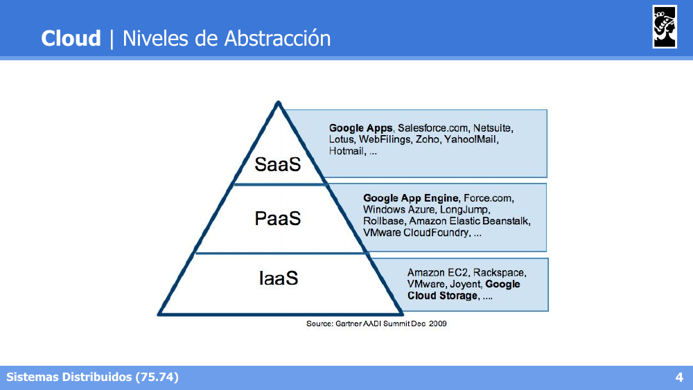
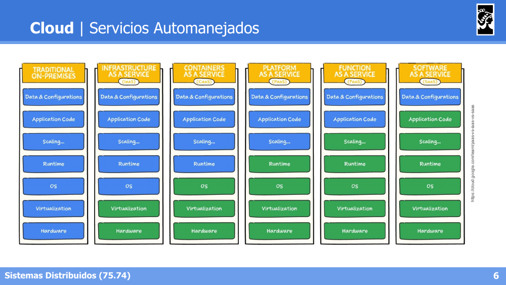
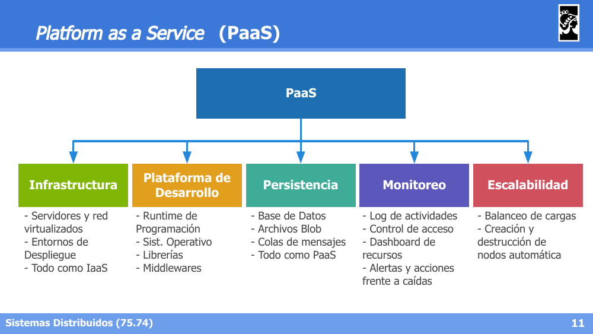
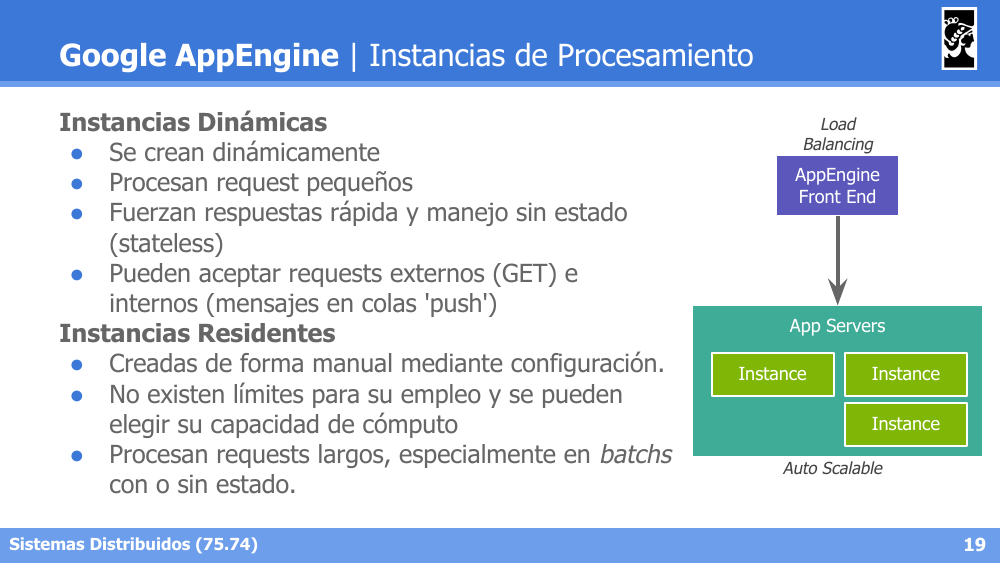
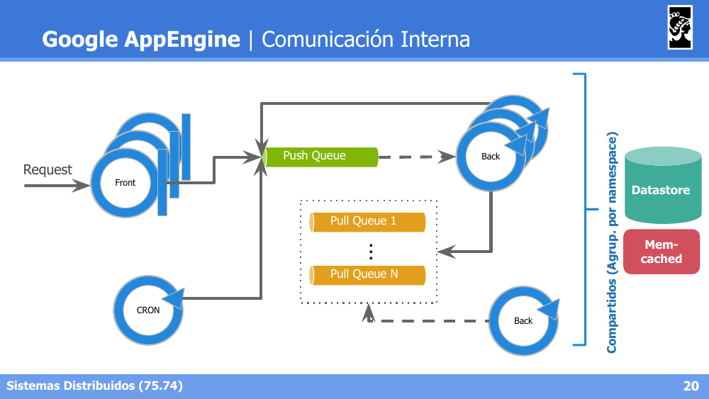
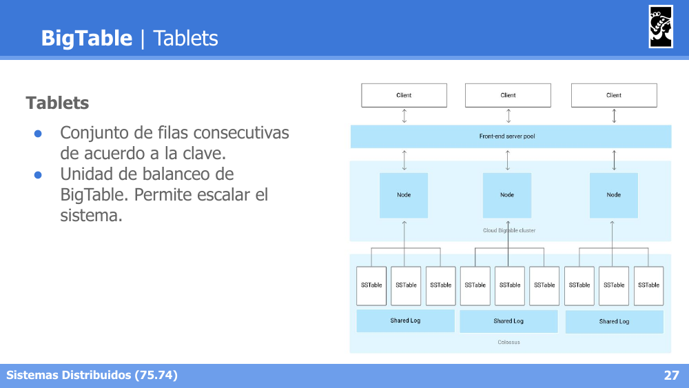
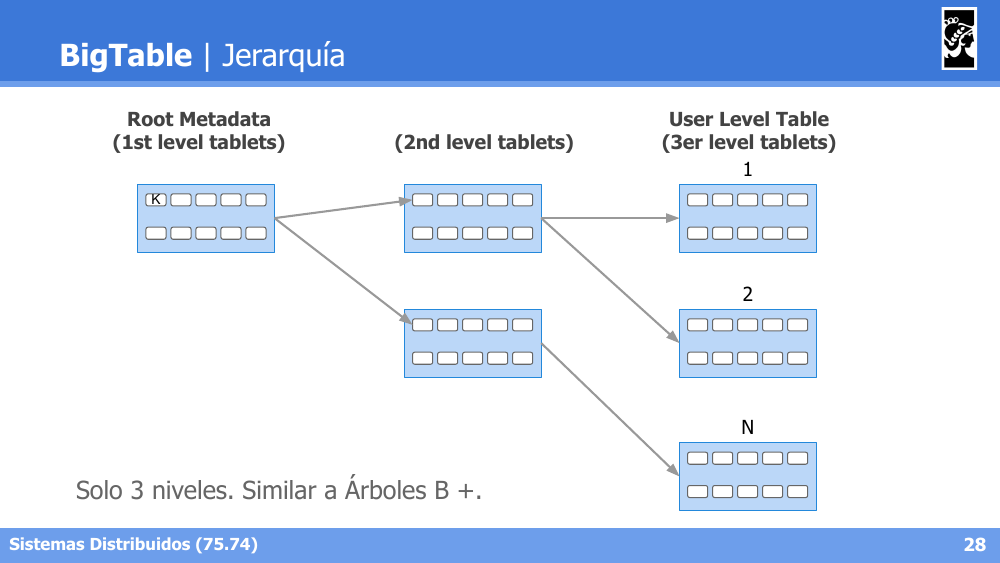
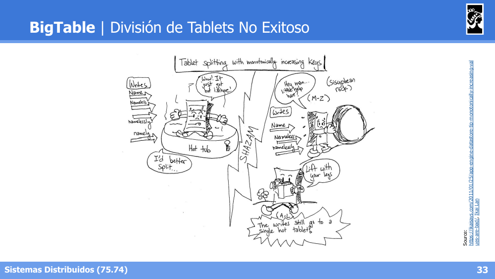

# Flashcards — Clase 16: Arquitecturas Cloud

> Formato: pregunta primero, respuesta debajo. Tapá las respuestas y probate.

---

**1. ¿Qué es Cloud Computing y qué combina como forma de ofrecer recursos de IT?**

Respuesta

Es una metáfora para internet y todo el contenido que ofrece: "todo lo que se pueda consumir más allá del firewall". No es necesariamente una nueva tecnología, sino una forma de ofrecer recursos de IT, combinando Networking + Infraestructura + Nuevas Plataformas + Servicios.

---

**2. Describí los tres niveles de abstracción de la pirámide de Cloud Computing (IaaS, PaaS, SaaS) con un ejemplo de cada uno.**

Respuesta

IaaS (base): almacenamiento y virtualización de equipos, definición de redes (ej. Amazon EC2, Rackspace). PaaS (nivel medio): frameworks y plataformas para desarrollar aplicaciones cloud-ready, exponiendo recursos como servicios (ej. Google App Engine, Azure). SaaS (tope): software a demanda, alquiler de servicios (ej. Google Apps, Salesforce).

---

**3. ¿Cómo cambia la responsabilidad del usuario vs. el proveedor cloud al avanzar de On-Premises hacia SaaS?**

Respuesta

A medida que se avanza desde Traditional On-Premises hacia IaaS → Containers as a Service (CaaS) → PaaS → Function as a Service (FaaS) → SaaS, el proveedor cloud asume progresivamente la responsabilidad de más capas (Hardware, Virtualization, OS, Runtime, Scaling), dejando al usuario cada vez menos por gestionar, hasta llegar en SaaS a solo Data & Configurations.

---

**4. Nombrá los principales beneficios de Cloud Computing.**

Respuesta

Accesibilidad (access anywhere, movilidad y visibilidad constante de recursos), Time-to-Market (disponibilidad instantánea de recursos), Escalabilidad (capacidades 'ilimitadas' de recursos) y Costos (pago a demanda, "pay as you go", con control del gasto según el uso).

---

**5. Diferenciá Cloud Pública de Cloud Privada.**

Respuesta

Cloud Pública: servicios públicos con servidores compartidos con otros usuarios, disponibilidad garantizada mediante SLAs, costos variables ("pay as you go"), y acceso mediante internet. Cloud Privada: servicios privados en un datacenter propio de la empresa, con recursos dedicados, costos fijos de mantenimiento y expansión, y acceso mediante intranet.

---

**6. ¿Cuáles son los cinco pilares de PaaS (Platform as a Service)?**

Respuesta

Infraestructura (servidores y red virtualizados, todo como IaaS), Plataforma de Desarrollo (runtime, sistema operativo, librerías, middlewares), Persistencia (base de datos, blobs, colas de mensajes, todo como PaaS), Monitoreo (logs, control de acceso, dashboards, alertas) y Escalabilidad (balanceo de cargas, creación/destrucción automática de nodos).

---

**7. En Google AppEngine, ¿qué buenas prácticas son forzadas por el diseño de la plataforma?**

Respuesta

Sistemas granulares, escalamiento horizontal, requests breves (con posibilidad de encolar requests largos), e independencia del SO y Hardware. Además, ofrece servicios de aplicación ya integrados: cache, colas de mensajes, elasticidad, versionado, herramientas de log/debugging/monitoreo y modelos no-relacionales con Datastore/BigTable.

---

**8. Diferenciá las Instancias Dinámicas de las Instancias Residentes en AppEngine.**

Respuesta

Instancias Dinámicas: se crean dinámicamente por los requests, procesan requests pequeños, fuerzan respuestas rápidas y manejo sin estado (stateless), y pueden aceptar requests externos (GET) e internos (mensajes en colas push). Instancias Residentes: creadas de forma manual mediante configuración, sin límites para su empleo, procesan requests largos, especialmente en batchs, con o sin estado.

---

**9. Diferenciá las Push Queues de las Pull Queues en AppEngine.**

Respuesta

Push Queue: envía los requests a instancias activas; la URL define la instancia, servicio y versión que atiende el mensaje, y el payload está dado por argumentos en la URL y headers. Pull Queue: permite encolar tareas para ser consumidas de forma controlada por los consumidores, siendo el enfoque más usual de colas de tareas (puede reemplazarse por colas PubSub).

---

**10. ¿Qué es Datastore y sobre qué tecnología de Google está basado?**

Respuesta

Es una base no-SQL administrada por Google, accesible en modalidad PaaS, con un modelo de objetos con atributos (Entities) y tipos sin esquema con atributos indexables (Kinds). Está basada en BigTable (soportada a su vez por Colossus, un Google FS), soporta entidades de hasta 1MB, consultas por Key o atributos indexados, millones de escrituras por segundo, y operaciones ACID incluso entre entidades.

---

**11. ¿Cómo se organizan las entidades en Datastore y qué diferencia hay entre una Single Entity Group Trx y una Cross Group Trx?**

Respuesta

Las entidades se organizan en jerarquías (Path, ej. `Arg → Emp2 → Eval.2011`) que se reparten entre distintos nodos del cluster. Las transacciones dentro de un mismo Entity Group (rama jerárquica) son simples (Single Entity Group Trx); las que abarcan múltiples grupos requieren coordinación adicional (Cross Group Trx).

---

**12. ¿Qué son los Tablets en BigTable y qué función cumplen?**

Respuesta

Son un conjunto de filas consecutivas de acuerdo a la clave, y constituyen la unidad de balanceo de BigTable, permitiendo escalar el sistema. Los datos son pares clave-datos, organizados en 'column families' dado que son conjuntos dispersos (sparse), y cada celda puede tener múltiples versiones a lo largo del tiempo.

---

**13. ¿Cómo es la jerarquía de niveles de BigTable y a qué estructura de datos se asemeja?**

Respuesta

Tiene solo 3 niveles: Root Metadata (1st level tablets) → 2nd level tablets → User Level Table (3er level tablets), de forma similar a un Árbol B+.

---

**14. Nombrá las ventajas y restricciones del modelo de diseño de BigTable.**

Respuesta

Ventajas: operaciones atómicas por clave, lecturas por rangos de claves (principio de localidad de datos), y versionado de celdas. Restricciones: imposibilidad de crear índices (hay que organizar el indexado en base a la clave o simular índices duplicando datos en nuevas tablas), e imposibilidad de crear contextos de transacción cross-keys.

---

**15. Describí la arquitectura de BigTable: qué operaciones realiza el Client con el Master y con los Tablet Servers, y qué rol cumple Chubby.**

Respuesta

El Client realiza operaciones de metadata con el BigTable Master, y operaciones de R/W directamente con los Tablet Servers. El BigTable Master coordina la migración de chunks entre Tablet Servers y gestiona locks a través de Chubby, el servicio de coordinación/locking distribuido de Google.

---

**16. ¿Qué es el "tablet auto-splitting" en BigTable y por qué falla como solución cuando las claves son monótonamente crecientes?**

Respuesta

Es un mecanismo por el cual, si un tablet se convierte en "hot tablet" (recibe muchísimas escrituras concentradas), BigTable lo divide automáticamente en dos tablets más chicos para distribuir la carga. Sin embargo, si las claves son monótonamente crecientes (ej. timestamps o IDs autoincrementales), todas las escrituras nuevas siguen cayendo en el tablet de claves más altas, por lo que dividir el tablet no soluciona el problema: el nuevo tablet "caliente" sigue recibiendo toda la carga. La solución es usar claves distribuidas aleatoriamente (ej. hash del ID).

---
