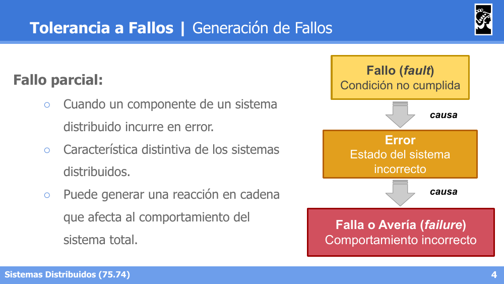
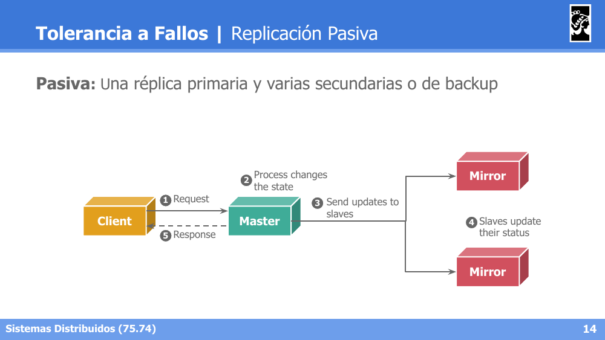
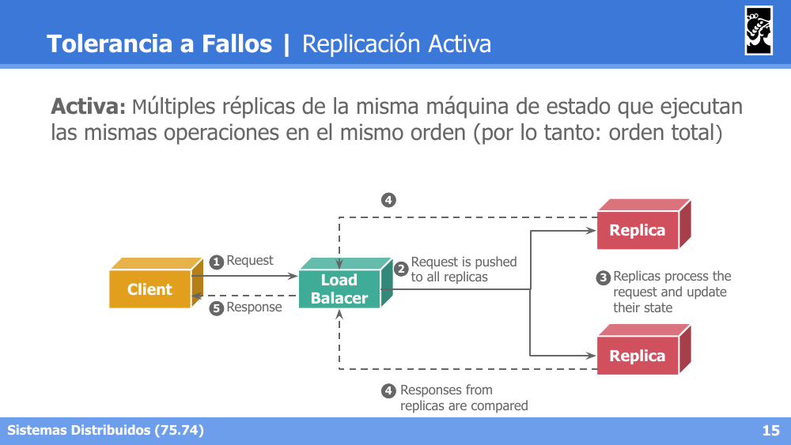
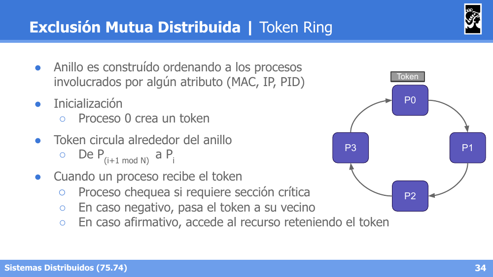
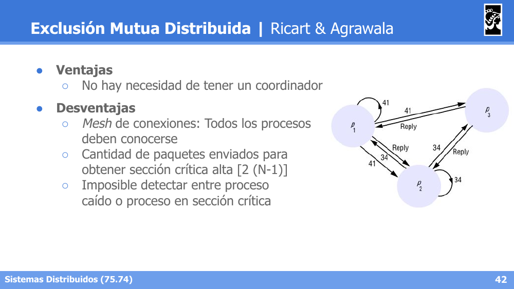

# Flashcards — Clase 17: Tolerancia a Fallos

> Formato: pregunta primero, respuesta debajo. Tapá las respuestas y probate.

---

**1. Describí la cadena Fault → Error → Failure.**

Respuesta

Un fallo (fault) es la causa raíz, que puede generar un error (estado incorrecto interno del sistema), que a su vez puede manifestarse como una falla (failure), es decir, una desviación observable del comportamiento esperado del sistema. No todo fault deriva necesariamente en error, ni todo error deriva necesariamente en failure (puede ser enmascarado). Ejemplo: un bug en el código (fault) puede producir un cálculo incorrecto (error) que finalmente se traduce en una respuesta errónea al usuario (failure).

---

**2. Clasificá los fallos según su duración.**

Respuesta

Transitorios: ocurren una vez y desaparecen. Intermitentes: ocurren, desaparecen y vuelven a ocurrir de forma errática (los más difíciles de diagnosticar). Permanentes: persisten hasta que el componente es reparado o reemplazado.

---

**3. Clasificá los fallos según el tipo de comportamiento incorrecto que producen.**

Respuesta

Crash: el componente se detiene y no vuelve a responder. Timing: la respuesta llega fuera del intervalo de tiempo esperado. Omission: el componente no responde a una solicitud. Response (valor o estado): el componente responde, pero con un valor o estado incorrecto. Byzantine (arbitrario): el componente puede producir cualquier tipo de error, incluso de forma maliciosa o inconsistente para distintos observadores; es la categoría más difícil de tolerar.

---

**4. Diferenciá las cuatro estrategias de manejo de fallos: Fault removal, Fault prevention, Fault forecasting y Fault tolerance.**

Respuesta

Fault removal: eliminar el fallo antes de que ocurra (testing, code review, verificación formal). Fault prevention: diseñar el sistema para evitar que el fallo se introduzca. Fault forecasting: estimar la presencia y consecuencias futuras de fallos (análisis de riesgo, modelos predictivos). Fault tolerance: aceptar que los fallos van a ocurrir y diseñar el sistema para seguir funcionando a pesar de ellos (foco principal de la materia).

---

**5. Nombrá las propiedades que describen la resiliencia (dependability) de un sistema.**

Respuesta

Availability (disponibilidad: el sistema está listo para ser usado en todo momento), Reliability (confiabilidad: opera de forma continua sin fallar), Durability (los datos persisten y no se pierden ante fallos), Safety (ausencia de consecuencias catastróficas aun ante fallos), y Maintainability (facilidad para reparar el sistema tras un fallo).

---

**6. Nombrá las técnicas de recuperación (recovery) tras detectar un error.**

Respuesta

Checkpointing: guardar periódicamente el estado del sistema para poder retomar desde el último punto válido en caso de fallo (rollback). Message logging: registrar los mensajes intercambiados entre procesos para reconstruir el estado retransmitiéndolos en lugar de (o además de) hacer checkpoints completos. Consenso: utilizar algoritmos de consenso para que los nodos sobrevivientes acuerden el estado correcto del sistema tras un fallo.

---

**7. Diferenciá la Replicación Pasiva, Activa y Semi-activa (leader-follower).**

Respuesta

Pasiva: un nodo primario procesa todas las solicitudes y replica su estado periódicamente a nodos backup, que no procesan solicitudes hasta que el primario falla. Activa: todos los nodos replicados procesan las mismas solicitudes en paralelo y de forma determinística, manteniéndose sincronizados todo el tiempo. Semi-activa (leader-follower): un nodo líder coordina y los demás (followers) ejecutan las mismas operaciones bajo su coordinación, combinando características de ambos esquemas.

---

**8. Diferenciá Infraestructura Mutable de Infraestructura Inmutable.**

Respuesta

Infraestructura mutable: los servidores se actualizan/parchean "in-place", acumulando con el tiempo configuraciones manuales difíciles de reproducir (configuration drift). Infraestructura inmutable: ante un cambio, en lugar de modificar el servidor existente se crea una nueva instancia desde cero (imagen) y se reemplaza la anterior, garantizando reproducibilidad y facilitando el rollback. Este enfoque se apoya en pipelines de CI/CD que automatizan build, testing y despliegue de nuevas versiones inmutables.

---

**9. ¿Qué es el problema de consenso y qué propiedades debe garantizar un algoritmo de consenso?**

Respuesta

El consenso es el problema de lograr que un conjunto de procesos distribuidos se pongan de acuerdo sobre un mismo valor, a pesar de fallos y de la falta de un reloj global compartido; es la base para resolver problemas de coordinación como elección de líder, replicación y commit de transacciones. Un algoritmo de consenso debe garantizar: Acuerdo (todos los procesos correctos deciden el mismo valor), Validez (el valor decidido fue propuesto por algún proceso) y Terminación (todos los procesos correctos eventualmente deciden).

---

**10. ¿Qué propiedades debe cumplir un algoritmo de Exclusión Mutua Distribuida?**

Respuesta

Safety: a lo sumo un proceso en la sección crítica a la vez. Liveness (no bloqueo): toda solicitud de acceso eventualmente es concedida (no hay deadlock ni starvation). Fairness (orden): las solicitudes se conceden en el orden en que fueron realizadas, típicamente usando orden de timestamps lógicos.

---

**11. Describí el Algoritmo de Servidor Central para exclusión mutua distribuida, y su principal desventaja.**

Respuesta

Un proceso coordinador centraliza el otorgamiento del permiso de acceso a la sección crítica: los procesos le piden el "token" al servidor central y lo liberan cuando terminan. Es simple de implementar y garantiza fairness en el orden de llegada de solicitudes, pero el servidor central es un punto único de fallo (SPOF) y un cuello de botella de escalabilidad.

---

**12. Describí el Algoritmo de Token Ring, sus ventajas y desventajas.**

Respuesta

Los procesos se organizan en un anillo lógico y un token circula de proceso en proceso en un único sentido; solo quien posee el token puede acceder a la sección crítica, pasándolo al siguiente proceso al terminar. Ventajas: no requiere coordinador central y garantiza ausencia de starvation. Desventajas: introduce latencia (hay que esperar a que el token circule aunque nadie quiera la sección crítica), y la pérdida del token o la caída de un proceso del anillo requiere mecanismos adicionales de recuperación.

---

**13. En el Algoritmo de Ricart & Agrawala, ¿qué hace un proceso al recibir una solicitud de sección crítica?**

Respuesta

Si el receptor no quiere la sección crítica, o la quiere con un timestamp mayor (más reciente) que el de la solicitud recibida, responde inmediatamente con OK. Si el receptor está actualmente en la sección crítica, encola la solicitud y responde recién cuando termina. Si el receptor también quiere la sección crítica pero con un timestamp menor (tiene prioridad), encola la solicitud y la responde luego de salir de la sección crítica.

---

**14. ¿Cuáles son las ventajas y desventajas del Algoritmo de Ricart & Agrawala?**

Respuesta

Ventaja: no hay necesidad de un coordinador central. Desventajas: requiere una topología tipo mesh donde todos los procesos se conocen entre sí, la cantidad de mensajes necesarios para obtener la sección crítica es alta (2(N-1)), y es imposible distinguir entre un proceso caído y un proceso que simplemente está tardando en responder porque está en la sección crítica.

---

**15. Describí las dos fases del protocolo Two-Phase Commit (2PC) y sus roles.**

Respuesta

Roles: Coordinador (controla las rondas, iniciando y finalizando la transacción) y Nodos (ejecutan los pedidos del coordinador). Phase 1 (Prepare): el coordinador envía un mensaje de Prepare a todos los nodos, quienes responden indicando si pueden o no comprometerse a realizar la operación. Phase 2 (Commit/Abort): si todos respondieron favorablemente, el coordinador envía Commit a todos; si alguno falló o respondió negativamente, envía Abort a todos, garantizando atomicidad (todo o nada).

---

**16. ¿Qué supuestos asume 2PC y cuándo se recurre a 3PC (three-phase commit)?**

Respuesta

Se asume que las conexiones son confiables y los nodos no son maliciosos ni arbitrarios (no bizantinos), y que una vez que un nodo responde OK al prepare, no puede fallar al hacer el commit. Si existe probabilidad real de fallo en esa ventana (entre el prepare y el commit), se recurre a variantes como 3PC.

---
